# **How to Mode Microservices**

The concept of defining boundaries for microservices can feel as complex as the age-old philosophical dilemma of what supports the world—one answer simply leads to another question.  

By now, you likely have a clear understanding of what microservices are and the significant advantages they can bring. Naturally, you might be ready to dive in and start building them. But where should you begin? We’ll explore key foundational principles like information hiding, coupling, and cohesion, which will help reshape how you approach drawing boundaries around your microservices.  

We’ll also examine various methods of decomposition you can use to break down systems effectively. Special attention will be given to domain-driven design, a powerful and practical framework for modeling microservices.  

The focus will be on defining boundaries that maximize the advantages of microservices while minimizing their challenges. Before diving deeper, though, we need to establish a solid foundation to build upon.  

---

## **What Makes a Good Microservice Boundary?**

Before the enthusiastic developers at StreamTech leap into action, spinning up service after service to deliver cutting-edge streaming solutions to the world, it’s worth pausing to reflect on a critical idea. The success of microservices depends on their ability to be updated, deployed, and released independently. This independence ensures that changes to one service won’t disrupt the operation or development of another. So, how can we effectively draw the boundaries around our microservices to achieve this?  

At their core, microservices represent a modular approach to system decomposition, but one that comes with the added complexity of network-based interactions. Fortunately, we can lean on decades of experience in modular software design and structured programming to inform our decisions. These principles can serve as a blueprint for identifying where to draw these boundaries.  

To establish effective microservice boundaries, we need to delve into three foundational concepts: information hiding, cohesion, and coupling. These principles, introduced earlier, are essential for building robust and maintainable microservice architectures.  

#### Fictional Scenario: StreamTech's Journey  

Imagine StreamTech, a fictional company that specializes in providing personalized video streaming services. They aim to offer features like user profile management, recommendation engines, and content delivery, each handled by a separate microservice.  

To define microservice boundaries effectively, the StreamTech team must consider:  

1. **Information Hiding**: The user profile service, for example, should only expose public-facing APIs for actions like updating user preferences or managing account details. Internal logic—such as how passwords are stored or how user activity is tracked—should remain hidden.  

2. **Cohesion**: The recommendation engine should focus solely on generating personalized suggestions based on user data. Bundling unrelated features, like subscription management, into this service would reduce its cohesion and make it harder to maintain.  

3. **Coupling**: Services should minimize dependencies on one another. For instance, the content delivery service should not require direct knowledge of how recommendations are generated. Instead, it can consume an API endpoint exposed by the recommendation engine, ensuring loose coupling.  

By adhering to these principles, StreamTech can create microservices that are both independent and resilient, allowing them to innovate and scale without creating unnecessary complexity.

### **Information Hiding**

Information hiding, a concept introduced by David Parnas, focuses on determining the most effective way to establish module boundaries. The idea emphasizes concealing as much detail as possible within a module (or microservice) boundary. Parnas identified several advantages that well-defined modules can bring, which align closely with the goals of microservice architectures:

1. **Faster Development**  
   By enabling modules to be developed independently, teams can work in parallel and mitigate the challenges associated with scaling up a development team.  

2. **Improved Understanding**  
   Individual modules can be analyzed and understood in isolation, making it easier to grasp how the overall system operates.  

3. **Enhanced Flexibility**  
   Modules can be modified independently without affecting others. This independence allows systems to evolve more efficiently and even supports combining modules in novel ways to introduce new functionality.  

These benefits of modular design seamlessly align with the aspirations of microservice architecture. In fact, microservices can be viewed as an evolution of modular design principles. Adrian Colyer has revisited Parnas's seminal works and examined their relevance to modern microservice design, offering valuable insights into their continued applicability.  

However, Parnas noted that simply creating modules doesn’t automatically yield these benefits; the way module boundaries are defined is crucial. He emphasized that information hiding is a fundamental strategy for maximizing the effectiveness of modular systems—a principle that is equally critical for microservices.  

One of Parnas's insights on modular design stands out:  

> “The connections between modules are the assumptions which the modules make about each other.”  

For microservices, reducing the assumptions one service makes about another directly minimizes their interdependencies. When these connections are simplified, it becomes easier to modify one service without inadvertently affecting others. Developers can work on a service with clarity about how it interacts with others, ensuring changes are implemented safely and without unintended ripple effects.

In the context of microservices, this principle goes a step further. Not only can services evolve independently, but they can also be deployed independently. This amplifies the benefits of faster development, better understanding, and increased flexibility that Parnas identified.  

The concept of information hiding has far-reaching implications, extending across multiple aspects of microservice design. It remains a recurring theme in modern software development and a cornerstone of resilient and scalable architectures.

### **Cohesion**

A simple yet effective way to define cohesion is this: *"Functions that need to change together should stay together."* This principle serves as a solid foundation when designing microservice boundaries. The goal is to structure microservices in a way that simplifies the process of modifying business functionality, minimizing the need for changes across multiple locations.

Grouping related behaviors within the same microservice—and separating unrelated ones into different services—is essential. Why? When a specific behavior needs to be updated, we want the change to occur in one place, enabling a quick deployment of that modification. If a change requires updates across several services, it introduces two significant drawbacks: slower implementation and higher deployment risks. Coordinating multiple service releases simultaneously to implement a single change is not only time-consuming but also prone to errors.  

To achieve this, we need to define boundaries that encapsulate related behaviors within a single microservice while maintaining loose interactions with other services. If related functionality is scattered across multiple parts of the system, this is referred to as *weak cohesion*. For microservice architectures, however, the goal is to achieve *strong cohesion*, where related functionality is concentrated within one service.

Strong cohesion supports streamlined updates, reduces complexity during deployments, and aligns with the core principles of microservices: enabling faster, safer, and more independent changes to the system.

### Coupling  

In a well-designed microservice architecture, services should be loosely coupled. This means that a change in one service should not necessitate a change in another. The essence of a microservice lies in its ability to undergo updates and deployments independently, without affecting the rest of the system—a concept that is critical to its effectiveness.

What leads to tight coupling between services? A common misstep is choosing an integration approach that deeply ties one service to another, resulting in a situation where internal changes in one service compel changes in its dependents. 

A loosely coupled service minimizes its knowledge about the other services it interacts with, maintaining only the essential awareness needed for collaboration. Additionally, reducing the frequency and variety of calls between services is vital. Beyond potential performance challenges, excessive inter-service communication (often referred to as "chatty" communication) can inadvertently create tight coupling.

However, coupling can manifest in various forms, and misconceptions about how it impacts service-based architectures are not uncommon. Recognizing and addressing these nuances is essential for building scalable and adaptable microservices. We'll delve deeper into the nuances of coupling to gain a more comprehensive understanding of how to manage it effectively.

### The Relationship Between Coupling and Cohesion  
Coupling and cohesion are deeply interconnected concepts in system design. If related functionality is scattered across different parts of a system, changes to that functionality are likely to cascade across boundaries, leading to increased coupling. This relationship is elegantly summarized by Constantine’s law, introduced by structured design expert Larry Constantine:

*"A structure is stable if cohesion is strong and coupling is low."*

For microservices, this notion of stability is essential. Effective boundaries should support independent deployment, enabling teams to work on services in parallel with minimal coordination. However, if the interface or "contract" of a microservice changes frequently in a way that breaks compatibility, dependent services will also need constant updates, negating the benefits of loose coupling.

Cohesion and coupling reflect different aspects of relationships within and between services. Cohesion describes how well the components within a single service relate to one another, while coupling describes the relationships between different services. Neither concept offers a universally "correct" way to structure code, as both involve trade-offs. The goal is to find an appropriate balance between the two, tailored to the specific needs and challenges of the system you are building.

It's important to acknowledge that systems evolve over time, and the decisions made today may need to be revisited as requirements change. Some areas of the system may experience such rapid change that achieving stability becomes unrealistic. As we explore further, we’ll examine real-world examples, such as those from Snap CI’s development team, to illustrate how these trade-offs play out in practice.

---

## **Types of Coupling**

### Understanding Coupling in Microservices  
While it might seem that all forms of coupling are inherently bad, that’s not entirely accurate. Some degree of coupling is inevitable in any system. The objective is to minimize the amount of coupling to ensure the flexibility and independence of system components.  

Historically, significant research has been conducted to explore various types of coupling within structured programming, particularly for modular, non-distributed, monolithic systems. Many of these concepts overlap or diverge, often addressing code-level details rather than the dynamics of service-based interactions. Since microservices are essentially a modular architecture with the added complexity of distributed systems, these foundational concepts can still be adapted and applied effectively.

### Insights from Structured Programming  
The evolution of computing often relies on building upon earlier foundational work. While it’s not always feasible to acknowledge all contributions, this discussion highlights some key influences. For instance, Larry Constantine’s collaborative work with Edward Yourdon in *Structured Design* is regarded as a seminal text in this area. Additionally, Meilir Page-Jones's *The Practical Guide to Structured Systems Design* offers valuable insights. Unfortunately, many of these influential texts are out of print, making them hard to access, but they remain relevant for understanding coupling principles.  

### Applying Prior Concepts to Microservices  
Not all ideas from structured programming seamlessly translate into the microservices domain. Where existing definitions align, these have been retained. However, in instances where the mapping isn’t direct, new terms or blended concepts have been introduced to better suit the context of service-based systems. This synthesis of prior concepts provides a practical framework for understanding different types of coupling in microservices.  

### Visualizing Coupling Types  
The spectrum of coupling types can be visualized, ranging from low (desirable, loose coupling) to high (undesirable, tight coupling).

This approach provides a structured methodology for understanding and addressing coupling, ensuring microservices remain as autonomous and adaptable as possible.

### **Domain and Temporal Coupling**

#### Domain Coupling

Domain coupling arises when one microservice relies on another to perform its functionality. This dependency occurs because the first microservice needs to utilize services or processes provided by the second. 

For instance, consider a fictional e-commerce platform, **ShopLink**, managing orders for books. Here, an **Order Manager** microservice might need to interact with the **Inventory** microservice to verify stock availability and the **Payment Processor** microservice to handle payment transactions. In this setup, **Order Manager** is dependent on **Inventory** and **Payment Processor**, but no direct dependency exists between **Inventory** and **Payment Processor**.

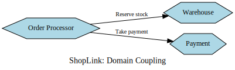

While this form of interaction is often essential in microservice architectures, excessive dependency on downstream services can be a red flag, indicating that a single microservice might be handling too much logic. For example, if a service must call multiple other services for one task, it might signal a need to rethink the service boundaries. 

To mitigate challenges associated with domain coupling:
- Minimize dependencies where possible.
- Limit the amount of shared data exchanged between services.
- Adhere to the principle of information hiding, sharing only what is necessary.

Though domain coupling is typically considered a more flexible and manageable form of coupling, care must still be taken to ensure that it does not evolve into more challenging forms of coupling, especially as the complexity of data interactions increases.

#### Temporal Coupling

Temporal coupling, another coupling type, emerges when one microservice relies on another to perform an action at the same time for the operation to succeed. Unlike domain coupling, this dependency requires both microservices to be functional and synchronized during the operation. 

In the **ShopLink** example, if the **Order Manager** microservice uses synchronous HTTP calls to the **Inventory** microservice to reserve stock, **Inventory** must be operational when the **Order Manager** initiates the request. If the **Inventory** service is unavailable, the operation fails. This requirement also forces the **Order Manager** to wait for a response, potentially causing resource bottlenecks.

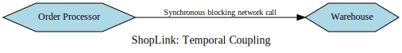

While temporal coupling isn't inherently problematic, it can become challenging as the number of microservices and their interactions grow. Issues like service downtime or increased latency in synchronous communication can significantly affect system performance and scalability.

To address temporal coupling challenges:
- Consider adopting asynchronous communication methods, such as message queues or brokers, to decouple operations.
- Design services to gracefully handle unavailability or delayed responses from dependent services.

By proactively addressing temporal coupling, organizations can improve system resilience and ensure smoother scaling, even as the complexity of their microservice architecture grows.

### **Pass-Through Coupling**

Pass-through coupling occurs when one microservice forwards data to another, not for its own use, but because the data is needed by a subsequent downstream microservice. This form of coupling can create challenges since it implies that the initial service must understand not only the next service in the chain but also the requirements of the downstream microservice.

Consider an example from the fictional system ShopLink’s order processing workflow. In this setup, the `Order Processor` service sends a request to the `Warehouse` service to prepare an item for shipping. This request includes a `Shipping Manifest`, which contains customer details and the chosen shipping method. However, the `Warehouse` service doesn’t use this information directly—it simply passes the manifest to the `Shipping` service downstream.

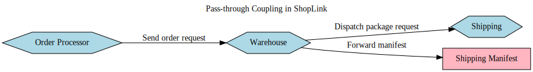

#### **Issues with Pass-Through Coupling**  
This type of coupling can cause cascading changes. If the downstream `Shipping` service modifies its requirements—for instance, changing the format of the `Shipping Manifest`—both the `Warehouse` and `Order Processor` services might need updates. This dependency chain introduces additional complexity and coordination challenges.

#### **Potential Solutions**  
There are several approaches to mitigate the impact of pass-through coupling:  

1. **Direct Communication:**  
   One option is for the `Order Processor` to bypass the `Warehouse` and communicate directly with the `Shipping` service. While this reduces the intermediary, it increases domain coupling by adding a direct dependency between the `Order Processor` and the `Shipping` service. Additionally, the `Order Processor` must now handle additional complexity, such as managing stock reservations with the `Warehouse` and initiating shipment with the `Shipping` service.

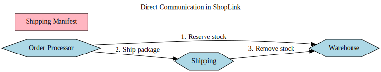

2. **Hiding Implementation Details:**  
   Another solution involves ensuring the `Warehouse` handles the creation of the `Shipping Manifest` itself. Instead of the `Order Processor` providing a manifest, it sends only the essential information (e.g., address and shipping type). The `Warehouse` then constructs the manifest before forwarding it to the `Shipping` service. This approach abstracts the manifest's structure from the `Order Processor`, isolating changes to the `Shipping` service's contract from affecting upstream services.

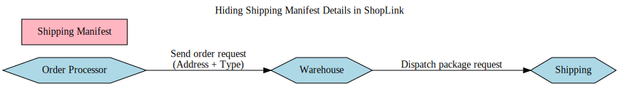

3. **Opaque Data Passing:**  
   Alternatively, the `Order Processor` can still send the `Shipping Manifest` through the `Warehouse`, but the `Warehouse` treats it as an opaque data object. It forwards the manifest without parsing or processing it, reducing the risk of needing changes if the format of the manifest evolves. However, this approach still requires changes to the `Order Processor` and `Shipping` service when the manifest's structure changes, though the `Warehouse` remains unaffected.

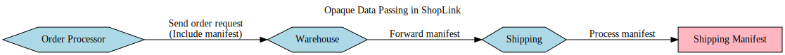

#### **Trade-Offs and Limitations**  
Even with these approaches, some scenarios might still require updates across all affected microservices. For instance, if the system introduces international shipping requiring a `Customs Declaration`, and this becomes a mandatory part of the `Shipping Manifest`, all three services—`Order Processor`, `Warehouse`, and `Shipping`—might need modifications. However, the separation of responsibilities allows for better control and sequencing of such changes.

By reducing pass-through coupling and hiding implementation details where possible, teams can minimize the risk of cascading changes and improve the resilience of their systems. This layered approach to managing dependencies ensures that changes can be phased and coordinated more effectively, rather than requiring synchronized updates across multiple services.

### **Common Coupling**

Common coupling occurs when multiple microservices depend on a shared set of data or resources. This type of coupling can manifest in various forms, such as multiple services accessing the same database, using shared memory, or utilizing a shared file system. While it can sometimes be acceptable, it often introduces significant challenges, especially when changes to the shared data structure impact multiple services.

Consider a scenario within ShopLink, where several services rely on static reference data stored in a shared database, such as country information for global operations. Multiple services reading static reference data don’t typically pose a problem since the data is read-only and infrequently changes. However, if the database schema were modified in a way that breaks backward compatibility, all consuming services would require updates. This highlights a key limitation of common coupling: shared data becomes difficult to modify as the system evolves.

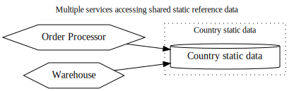

In a more problematic example, both the Order Processor and Warehouse services share and modify the same "Order" database table. Each service updates the "Status" column independently, with Order Processor managing states like *PLACED* and *PAID*, while Warehouse handles *PICKING* and *SHIPPED*. This shared responsibility for managing order states introduces a high risk of misalignment. A change made by one service might inadvertently disrupt the functionality of the other, resulting in tighter coupling and operational challenges.

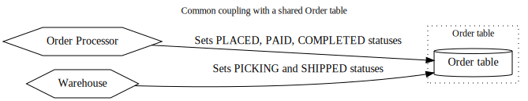

To address such issues, implementing a **finite state machine** can help ensure valid transitions between states. This approach ensures that transitions like *PLACED* to *PAID* or *PICKING* to *SHIPPED* are explicitly defined, reducing the risk of invalid state changes.

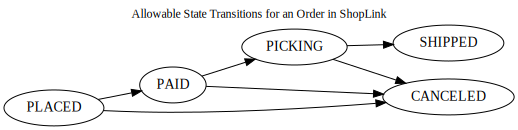

A better solution is to centralize responsibility for managing order states within a single microservice, such as an "Order" service. In this setup, other services like Warehouse and Order Processor send state change requests to the Order service, which acts as the source of truth and enforces valid transitions. This approach isolates state management logic, ensuring that updates are consistent and reducing the impact of changes to the shared resource.

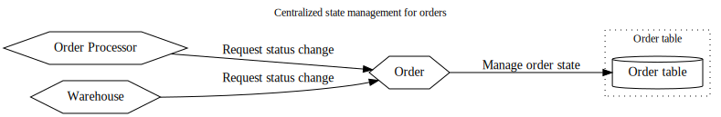

#### **Key Considerations and Warnings:**  
- Requests to a microservice should be seen as requests, not commands. The receiving service should validate and enforce any rules related to its data or logic.  
- Microservices that function as thin wrappers around CRUD operations often signal weak cohesion and excessive coupling. Logic for managing data should reside within the service itself rather than being scattered across the system.  

#### **Operational Risks of Common Coupling:**  
Sharing resources like a database or file system can also lead to contention. If too many services access a shared database simultaneously, performance issues or outages may occur, especially if expensive queries are executed. Shared data introduces constraints on scalability and makes operational stability harder to guarantee.

While common coupling is sometimes acceptable, such as for static read-only reference data, it’s often better to avoid it. This type of coupling limits flexibility, reduces cohesion, and can lead to operational bottlenecks, making it one of the least desirable forms of coupling in distributed systems.

### **Content Coupling**

Content coupling arises when an external service interferes with the internal workings of another service, often by directly modifying its internal state. A common example is when one microservice directly accesses and alters another microservice's database. While similar to common coupling, the distinction lies in ownership clarity. With common coupling, it’s clear that multiple services depend on an external shared resource. However, with content coupling, ownership boundaries blur, making the system harder to manage and modify.

Consider an example from ShopLink. In this scenario, the Order service is responsible for managing the state of customer orders and ensuring that only valid transitions between states occur. The Order Processor interacts with the Order service by sending requests for state changes, leaving the Order service to determine whether the requested transition is allowed. However, the Warehouse service bypasses the Order service entirely, directly accessing the database where order details are stored. This direct interaction undermines the logic built into the Order service, potentially leading to duplicate or inconsistent rules between the Warehouse and Order services. The result could be invalid or confusing order states.

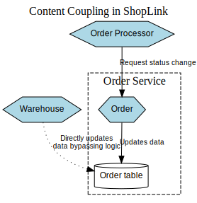

Content coupling also exposes the Order service’s internal data structure, creating additional risks. Any changes to the database schema, for instance, must account for its direct use by the Warehouse service—a dependency that might not even be clearly documented. The better approach here would be for the Warehouse service to send its requests to the Order service, allowing the Order service to validate and handle the updates while keeping its internal data structure private.

To prevent these issues, it’s crucial to maintain clear boundaries around what parts of a microservice are shared and what remains hidden. Developers must understand which changes affect the contract their microservice has with others and avoid breaking those dependencies. At the same time, internal functionality not exposed to external services should be modifiable without concern.

The problems inherent in common coupling also exist in content coupling, but content coupling introduces additional risks, earning it the label of "pathological coupling" in some circles. When a database is directly accessed by another service, it effectively becomes part of the external contract, removing the ability to hide implementation details and manage what can or cannot be changed.

In summary, content coupling should be avoided. Ensuring that interactions between services occur through well-defined APIs or contracts will help preserve information hiding and make it easier to adapt systems as requirements evolve.

---

## **The Essentials of Domain-Driven Design**

As introduced earlier, one of the key methods for identifying microservice boundaries is by closely aligning them with the domain they represent. Domain-Driven Design (DDD) serves as a critical tool to model these domains effectively. Let’s delve deeper into how DDD supports microservice architecture.

The concept of designing software to reflect the real-world systems it operates within isn’t a new idea. Programming languages such as Simula were developed with the intent of modeling real-world domains. However, successfully aligning software to a domain involves more than just using an object-oriented language.

Eric Evans, in his book *Domain-Driven Design*, introduced several transformative ideas to help software better encapsulate the problem domain. While a comprehensive exploration of DDD is beyond the scope of this text, several foundational concepts are particularly useful for microservices:

1. **Ubiquitous Language**  
   This refers to the use of a shared language that is consistently applied across the codebase and in discussions about the domain. By ensuring that developers and domain experts communicate using the same terms, misunderstandings are minimized, and alignment is improved.

2. **Aggregate**  
   Aggregates represent a collection of domain objects that are treated as a single unit. Typically, these aggregates model real-world entities or concepts, ensuring that changes to one part of the aggregate are consistent with the whole.

3. **Bounded Context**  
   A bounded context defines the clear boundary of a specific area within a domain. It encapsulates functionality for that segment of the domain while hiding unnecessary complexity from the rest of the system. This helps to ensure that changes within one context don’t inadvertently affect another, fostering modularity and clarity.

By focusing on these principles, DDD provides a structured way to approach the modeling of microservices, ensuring that they align with the business domain while maintaining independence and modularity.

### **Universal Language**

The concept of a universal or shared language emphasizes the importance of using the same terminology in code as is used by the domain experts and stakeholders. This alignment bridges the gap between the technical team and the business users, making it easier to model real-world problems while fostering clearer communication.

To illustrate this, let me share an example from a project at a large multinational bank. Our team was working on a system to manage *corporate liquidity*—essentially, the ability for businesses to transfer funds between accounts within the same organization. Our product owner was highly skilled, with a deep understanding of the domain and the features needed. Conversations with her often revolved around terms like "haircuts" and "end-of-day sweeps," concepts well understood by her and the end users.

However, the code told a different story. Instead of reflecting this rich domain-specific language, it relied on a generic data model widely referred to as "the IBM banking model." Whether this model originated from IBM or a consultant was unclear, but its core idea was to abstractly label every operation as an *arrangement*. Loans? Arrangements. Stock purchases? Also arrangements. Credit card applications? You guessed it—arrangements too.

This abstraction stripped the code of any meaningful connection to the real-world domain we were addressing. Although we were building a specialized system for managing corporate liquidity, the code felt generic and disconnected. Developers and analysts spent an excessive amount of time translating the nuanced language of the product owner into generic, vague terms, often repeating explanations for the same concepts.

When we began incorporating the product owner's terminology into the codebase, everything changed. Stories written using domain-specific terms like "haircuts" and "sweeps" became immediately comprehensible to developers. This reduced miscommunication and allowed the team to deliver features more effectively.

Adopting a shared language not only improves understanding but also ensures that the system evolves in harmony with the domain it is meant to serve. By embedding the real-world language into the code, the system becomes more intuitive and maintainable for all stakeholders involved.

### **Aggregate**

In Domain-Driven Design (DDD), an aggregate represents a cohesive unit of domain-related functionality and data. While there are multiple interpretations of aggregates, the simplest way to think of them is as models of real-world concepts such as *Order*, *Invoice*, or *Product*. Aggregates often have a life cycle that makes them ideal candidates for being implemented as state machines, managing transitions and interactions.  

For example, in a retail domain like ShopLink, an *Order* aggregate might include multiple line items, representing the products in a single purchase. These line items only make sense as part of the larger *Order* aggregate, reinforcing the idea that aggregates should encapsulate their state and behavior entirely within themselves.

#### Managing Aggregates  

To maintain a clean separation of responsibilities, a single microservice should handle the life cycle, state, and transitions of one or more aggregates. If a different service needs to modify an aggregate, it must either request a state change through the managing service or issue an event that prompts the aggregate to make changes independently. For example, an *Order* service could expose APIs to validate and manage state changes while ensuring invalid transitions are impossible.

An important rule when designing aggregates is that they should have the autonomy to reject invalid state changes. By enforcing this behavior programmatically, you can ensure that aggregates maintain consistency and avoid unexpected errors.

#### Relationships Between Aggregates  

Aggregates can have relationships with other aggregates. For instance, a *Customer* aggregate might be linked to multiple *Order* and *Wishlist* aggregates. If these relationships exist within a single microservice, they can be represented easily using relational database tools like foreign keys. However, when these relationships span multiple microservices, handling these connections becomes more complex.

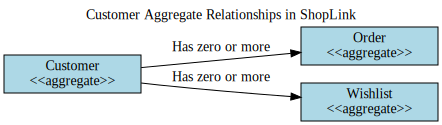

In cases where aggregates interact across service boundaries, explicit relationships should be modeled. For example, a *Finance* microservice managing a ledger might store references to *Customer* aggregates. Instead of a generic customer ID stored locally, a more explicit identifier such as a URI or a structured reference (`/customer/123`) can make the relationship clearer. This approach not only helps humans understand the data relationships but can also support direct lookups in REST-based systems or other protocols.

#### Flexibility and Evolution of Aggregates  

As systems evolve, the structure and boundaries of aggregates may need to adapt. For example, aggregates may be reshaped to improve performance or align with new implementation requirements. However, initial design should prioritize reflecting the mental model of system users, with practical considerations coming into play as the system matures.  

#### Example  

In a ShopLink system:  
- The *Order* aggregate could manage order items and their life cycle, from *PLACED* to *SHIPPED*.  
- The *Customer* aggregate might link to *Order* aggregates while also associating with *Wishlist* aggregates to encapsulate user preferences and activity.

Using such a design ensures that aggregates maintain self-containment, enforce valid transitions, and provide clear, explicit relationships, simplifying the development and maintenance of microservices architectures. 

### **Contextual Boundaries**

A **bounded context** defines a clear boundary within an organization where specific responsibilities and processes take place. Within this boundary, tasks are carried out independently, shielding internal complexities from external entities. To illustrate this, let’s explore an example.

In the case of ShopLink, the warehouse team handles operations such as shipping orders, managing returns, and receiving new inventory. Meanwhile, the finance department deals with payroll, supplier payments, and financial reporting. These departments function as separate contexts, each focusing on its unique responsibilities.

#### **Internal Details Remain Hidden**  
Bounded contexts ensure that internal details, such as the logistics of stock management or payment workflows, are encapsulated within the relevant context. For example, the type of barcode scanners used in the warehouse is of no concern to the finance team, and this information should remain isolated.

#### **Aggregates Within Contexts**  
Each bounded context contains one or more aggregates. Some aggregates might be exposed to other contexts, while others remain private. For instance, the warehouse context may expose inventory information to the ordering system but keep internal maintenance details hidden.

#### **Interdependent Contexts**  
Bounded contexts may interact with one another. These interactions translate into inter-service dependencies when the contexts are implemented as separate microservices. For example, the finance context may rely on data from the warehouse to calculate shipping costs.

#### **ShopLink Example**  
Consider ShopLink as an overarching business domain, encompassing multiple contexts, such as the warehouse, finance, and customer support. Each context handles its own responsibilities independently but collaborates with others when needed. This approach allows the business to maintain clear boundaries, ensuring that each context operates efficiently without unnecessary entanglements.

In short, bounded contexts define clear lines of responsibility and serve as building blocks for structuring systems in a way that promotes modularity and reduces complexity.

#### Hidden Models in Bounded Contexts

In the context of ShopLink, consider the **finance** department and the **warehouse** as distinct bounded contexts. Each has its own responsibilities, internal details, and interfaces exposed to the rest of the organization. For instance, the warehouse may provide inventory reports, while the finance department generates payroll slips. However, the internal workings—like warehouse equipment or financial calculators—remain confined to their respective contexts.

##### **Contextual Independence**  
These contexts operate independently, only sharing necessary information. For example, the finance department doesn’t need details about how stock is stored or retrieved in the warehouse. Instead, it requires high-level data, such as stock valuations, to update financial records.

##### **Shared Models**  
Some information needs to flow between these contexts. A **shared model**, like a Stock Item, serves as the bridge. This model allows finance to access stock counts for valuation purposes while abstracting unnecessary warehouse-specific details.

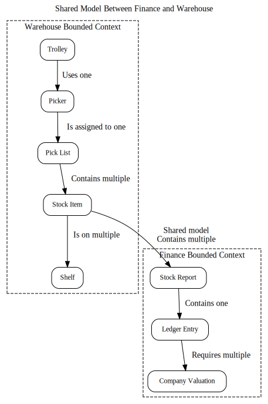

##### **Internal vs. External Representation**  
Within the warehouse context, a Stock Item might include information such as shelf locations and a total count. However, the external representation shared with finance might only include the total count, excluding internal logistics. To reduce confusion, these representations could be given distinct names—for instance, calling the external model a **Stock Count**.

**ShopLink Contextual View**  
- The **warehouse context** would include internal elements like "shelf locations" and "pickers" (employees managing orders).
- The **finance context** might focus on components like the "general ledger" or payroll systems.
- The shared model, such as **Stock Count**, bridges these contexts while maintaining a clean separation of internal details.

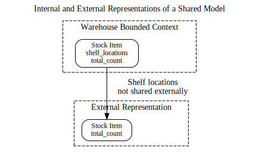

By encapsulating internal complexities and only exposing relevant information, bounded contexts ensure efficient interaction between domains while safeguarding internal logic. This approach reduces dependencies and fosters modularity across the ShopLink system.

### Shared Models

There are instances where concepts exist across multiple bounded contexts, but they serve distinct purposes in each. For example, the concept of a *Stock Item* exists in both the finance and warehouse contexts. However, this doesn't mean the same *Stock Item* is duplicated. Instead, both contexts have a legitimate need to refer to the concept but for different reasons. 

In the finance context, *Stock Item* is necessary to calculate the company’s overall valuation by assessing its monetary value. In the warehouse context, the *Stock Item* is essential for operational purposes, such as determining its physical location to fulfill orders efficiently.

In situations like this, the shared model may represent the same conceptual entity but differ in details depending on the bounded context. For example, in the warehouse, it might still be called *Stock Item*, while in the finance department, it could be more appropriately labeled as an *Asset* to reflect its financial role. The data stored for the entity would also differ. The warehouse might track shelf locations, while finance would focus on the item's value. 

Despite these differences, it may be beneficial to link the representations in both contexts to a central, global concept of the *Stock Item*. This would allow both contexts to access shared attributes like the item name or supplier details. A strategy such as the one shown in Figure 2-13, where cross-context references use a unique identifier or resource URI, can effectively support these lookups while preserving the independence of each context’s representation.

### **Mapping Aggregates and Bounded Contexts to Microservices**

Aggregates and bounded contexts serve as natural units of cohesion, each with clear interfaces to interact with the broader system. An aggregate represents a self-contained state machine, focusing on a single domain concept, while a bounded context encompasses a group of related aggregates and provides a defined interface to the rest of the system.

These characteristics make both aggregates and bounded contexts strong candidates for defining service boundaries. When beginning to design your microservices, it’s often best to start with fewer, larger services. This typically means creating services that align with entire bounded contexts. Over time, as you gain experience and your system evolves, you may choose to split these larger services into smaller, more focused ones. 

However, it’s critical to remember that aggregates should remain intact—they should not be split across multiple microservices. A single microservice can manage one or more aggregates, but an aggregate’s lifecycle and behavior should be owned by only one microservice. Keeping this in mind will help maintain cohesion and reduce inter-service dependencies.

#### Breaking Down Aggregates and Bounded Contexts into Microservices

When beginning to define your microservices, you will likely identify large, coarse-grained bounded contexts. However, these broader contexts can often be decomposed further into more specific sub-contexts. For instance, a warehouse context might include distinct areas like order fulfillment, inventory management, and goods receiving. Start by defining microservices at the level of these larger, broader contexts. As your system matures, you can consider splitting these into smaller, more granular services where appropriate.

A helpful approach is to treat the decomposition of services as an internal implementation detail that doesn’t impact the outside world. For example, even if you divide a single warehouse service into smaller services like inventory and shipping management, you can still present a unified Warehouse API to external consumers. This way, upstream consumers interact with the larger warehouse service without being aware of the internal decomposition. The Warehouse service might internally split responsibilities across Inventory and Shipping services, while externally appearing as a single entity. This ensures that changes to internal implementation don’t disrupt external systems.

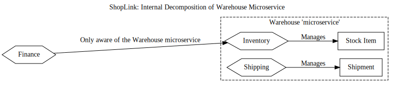

This form of information hiding allows flexibility for future adjustments without impacting upstream dependencies. Additionally, it simplifies tasks like testing. By maintaining a coarser-grained API for external collaborators, you can test services interacting with the warehouse as a single unit without needing to account for each sub-service individually. For broader integration tests, you could deploy all internal services within the warehouse context while stubbing out external collaborators. 

Ultimately, this nested approach helps maintain a clean and flexible architecture, enabling internal scalability and evolution while shielding external systems from unnecessary complexity.

### **Event Storming**

Event Storming, introduced by Alberto Brandolini, is a collaborative workshop method aimed at uncovering a domain model. Instead of relying on a single architect to create a domain model in isolation, this approach involves both technical experts and nontechnical stakeholders working together. The goal is to collaboratively develop a unified understanding of the domain, ensuring a shared perspective across the team.  

While the outputs of Event Storming are well-suited for building event-driven architectures due to their natural alignment, they are equally applicable to other paradigms, such as request-response systems. The flexibility of this method allows teams to adapt the resulting domain model to various implementation strategies while maintaining the shared clarity achieved during the exercise.

#### **Event Storming: Practical Setup**  
Alberto Brandolini, the creator of Event Storming, emphasizes specific principles for organizing and conducting this collaborative workshop. A key aspect is getting all relevant stakeholders in the same physical or virtual space. This includes domain experts, users, product owners, and any other representatives critical to accurately modeling the domain. Coordinating schedules and ensuring the presence of all necessary participants can be challenging, especially in a remote-working or hybrid environment. Nevertheless, having everyone together at the same time is crucial to achieving a comprehensive and shared understanding.

Brandolini also recommends an active, engaged environment, often suggesting the removal of chairs to encourage participants to stay on their feet and contribute. While this approach can foster energy and involvement, accessibility and comfort should be considered for all participants. A large, open space is ideal for modeling, with walls covered in butcher paper or similar materials to provide ample room for visualizing and capturing ideas.

The primary tools used in Event Storming are sticky notes, with different colors assigned to represent various concepts. This visual and interactive approach helps participants structure ideas, surface insights, and collectively build the domain model in a dynamic and inclusive way.

#### **Event Storming: The Workflow**  

The event storming process begins by identifying *domain events*. These are key occurrences or facts that the system cares about, such as “Order Placed” or “Payment Received.” These events are recorded on sticky notes (commonly orange). However, since domain events tend to be the most numerous elements in the exercise, some participants suggest choosing a more readily available color.

Next, participants identify the *commands* that trigger these events. Commands represent actions initiated by users or external systems, such as “Place Order” or “Make Payment.” They help define the boundaries of the system and identify its key actors. Commands are typically written on blue sticky notes. During this step, technical participants should focus on understanding the perspective of their non-technical counterparts without letting existing system implementations bias the conversation. The goal is to surface raw domain knowledge and insights.

Once events and commands are mapped, attention shifts to identifying *aggregates*. Aggregates are domain concepts that encapsulate state and behavior, often hinted at by domain events. For instance, in the case of “Order Placed,” the term “Order” might suggest an aggregate, and “Placed” could indicate a part of its lifecycle. Aggregates are often noted on yellow sticky notes, with associated commands and events clustered around them. This clustering also reveals relationships between aggregates, such as how an event in one aggregate may trigger behavior in another.

Finally, the aggregates are organized into *bounded contexts*. These contexts define clear boundaries within the domain, often aligning with organizational structures. The participants’ familiarity with how different parts of the organization interact can guide this grouping process, ensuring each bounded context is appropriately defined.

This overview provides a snapshot of the event storming process, but the methodology includes additional layers and nuances. For a deeper dive, consider exploring *EventStorming* by Alberto Brandolini (Leanpub), which offers more comprehensive guidance on this collaborative modeling approach.

---

## **The Case for Domain-Driven Design for Microservices**

Domain-Driven Design (DDD) provides a structured and effective way to design microservices. Here’s a summary of why this approach is valuable.

**1. Emphasis on Information Hiding**  
A key strength of DDD lies in its focus on *bounded contexts*. These contexts establish clear boundaries within the system while concealing internal complexities. This allows internal structures to evolve without affecting other parts of the system. By embracing DDD, we inherently practice information hiding—a crucial concept for defining stable and maintainable microservice boundaries.

**2. Shared Language for Clarity**  
DDD promotes the use of a *ubiquitous language*, a shared vocabulary used by both technical and non-technical stakeholders. This language simplifies the process of defining microservice endpoints, APIs, and event formats, ensuring consistency. It also strikes a balance between standardizing APIs and allowing language within a bounded context to evolve independently, reducing unnecessary constraints.

**3. Isolated Changes for Agility**  
When microservices are designed around bounded contexts that mirror the domain, changes in business logic or system behavior are often confined to a single microservice. This makes it easier to implement, test, and deploy changes quickly, minimizing the ripple effects across the system and enhancing agility.

**4. Alignment with Business Goals**  
DDD keeps the focus on the business domain, ensuring that the software reflects the needs and objectives of the organization. By embedding the business language into service design and code, DDD fosters a deeper understanding of the domain among developers. This alignment builds empathy for end users and strengthens collaboration between technical teams, product developers, and business stakeholders.

**5. Supporting Stream-Aligned Teams**  
DDD complements the concept of stream-aligned teams by aligning the technical architecture with the organization’s structure. It helps reduce silos between IT and the business, creating a unified vision and improving cross-functional collaboration—a crucial step in modernizing software development practices.

By centering the domain in both technical and organizational design, DDD bridges gaps between teams, enhances system maintainability, and enables rapid adaptation to business needs—making it an indispensable approach for designing microservices in a dynamic environment.

---

## **Alternatives to Business Domain Boundaries**

### **Exploring Alternatives to Business Domain Boundaries**  

While Domain-Driven Design (DDD) is a powerful tool for defining microservice architectures, it is by no means the sole approach for determining microservice boundaries. Relying exclusively on DDD may overlook other valuable perspectives. In practice, I often combine DDD with additional techniques to assess how a system can be partitioned effectively—or whether it should be split at all. Below are some alternative factors to consider when identifying service boundaries.  

### **Volatility**

**Volatility as an Alternative Boundary Strategy in ShopLink**  

An increasingly popular approach to microservice decomposition focuses on **volatility**, where the goal is to identify and isolate parts of the system that experience frequent changes. These volatile components are then extracted into independent services, making it easier to iterate and adapt them. While this approach has its merits, especially in scenarios where rapid development and agility are critical, relying solely on volatility as the driving factor for service boundaries can be limiting. For example, if the primary objective for ShopLink is to scale its services, a volatility-based decomposition might not provide significant benefits.

This mindset is echoed in concepts like **bimodal IT**, introduced by Gartner, which categorizes systems into two modes:  
1. **Mode 1 (Systems of Record):** Stable systems that change infrequently and require minimal business involvement.  
2. **Mode 2 (Systems of Innovation):** Agile systems that need to evolve quickly with close collaboration between IT and business teams.  

While bimodal IT simplifies categorization, it often oversimplifies the reality of modern businesses. For instance, ShopLink may find that parts of its traditionally stable systems, such as warehouse inventory management, now need to adapt to support digital storefronts, same-day delivery, or other innovations. The once-stable systems of record are increasingly required to evolve alongside systems of innovation.

### The Evolutionary Perspective for ShopLink  
Consider ShopLink’s evolution: initially, it may have only provided a catalog of products on its website, requiring customers to call for purchases. Over time, it transitioned to online ordering, prompting significant changes in warehouse operations and order processing. Looking ahead, ShopLink may need to adapt further, perhaps offering downloadable product manuals or integration with external e-commerce platforms. Such transformations underscore how traditional “slow-changing” systems often need to adapt rapidly due to shifts in customer demands and technology.

### The Pitfalls of Bimodal IT for ShopLink  
While bimodal IT might seem like a neat way to compartmentalize parts of ShopLink’s systems, it risks sidelining essential but challenging components by labeling them as “Mode 1” and ignoring their need for transformation. Such an approach could create bottlenecks, as changes in “Systems of Innovation” often require adjustments to “Systems of Record.” In practice, this dichotomy might result in what feels like two operational speeds: **slow** and **even slower**.

### The Case for a Balanced Approach  
Volatility-based decomposition has its place, particularly when ShopLink’s goal is to reduce time-to-market for rapidly evolving features like its customer-facing storefront. In such cases, extracting volatile components, such as dynamic pricing algorithms or promotional tools, into separate services makes sense. However, as with any decomposition strategy, the **business goals** should dictate the approach. Volatility-based boundaries are most effective when the primary driver is agility, but they should complement other methods, such as domain-driven design, to ensure that ShopLink’s architecture is both flexible and future-proof.

### **Data**

Many of the PCI requirements are common sense, but ensuring that the whole system complied with these requirements, not least the need for the system to be audited by an external party, was proving to be quite onerous. As a result, the company wanted to split out the part of the system that handled the full credit card data—meaning that only a subset of the system required this additional level of oversight. Services operating in the green zone (enclosed by a dotted green line) never see any credit card information—that data is limited to processes (and networks) in the red zone (surrounded by red dashes). The gateway diverts calls to the appropriate services (and the appropriate zone); as the credit card information passes through this gateway, it is in effect also in the red zone.

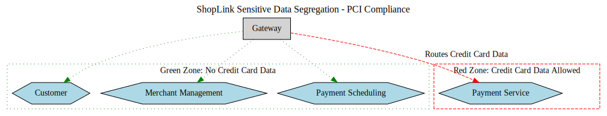

As credit card information never flows into the green zone, all services in this area can be exempted from a full PCI audit. Services in the red zone are in scope for such oversight. When working through the design, we did everything we could to limit what has to be in this red zone. It’s key to note that we had to make sure that the credit card information never flows to the green zone at all—if a microservice in the green zone could request this information, or if that information could be sent back to the green zone by a microservice in the red zone, then the clear lines of separation would break down.

Segregation of data is often driven by a variety of privacy and security concerns.

### **Technology**

In some cases, technology requirements can influence how system boundaries are defined. For instance, while it is technically possible to integrate multiple databases within a single microservice, combining distinct runtime models can pose significant challenges. If part of your system demands exceptional performance gains and you decide to implement that functionality using a high-performance language like Rust, this technological constraint can naturally dictate the service boundary.

That said, relying solely on technology as the basis for service decomposition can lead to suboptimal results. A classic example is the traditional three-tier architecture, which groups related technologies into layers such as presentation, business logic, and database. While this model may seem logical from a technology perspective, we’ve seen that it often results in a less effective overall architecture for modern systems.  

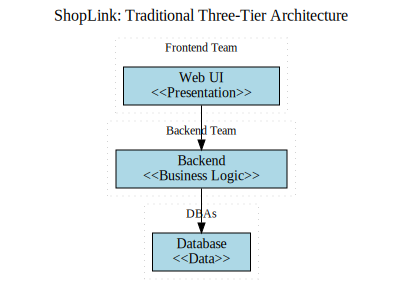

In the context of **ShopLink**, it is essential to carefully balance technological considerations with other factors, such as business requirements and domain boundaries, to avoid the pitfalls of overly technology-driven service decomposition. 

### **Organizational Structures Driving Boundaries**

As discussed earlier with Conway's Law, organizational structure has a profound influence on system architecture, shaping its design and function. This connection isn't just theoretical—real-world experiences continually demonstrate that the way teams are structured has a direct impact on the boundaries and ownership of systems, sometimes for better and sometimes for worse.

When determining microservice boundaries, it's critical to account for existing team structures. Aligning service ownership with specific teams often ensures clarity and prevents complications. A service boundary that cuts across multiple teams can lead to conflicts, unclear accountability, and inefficiencies, as shared ownership of microservices often leads to poor outcomes. Ideally, service boundaries should align with team responsibilities, or in cases where the architecture you envision doesn't fit the current organizational structure, consider adjusting the structure to support the desired design.

### Adapting to Organizational Changes

However, organizations are not static. Changes in structure might necessitate revisiting existing microservice boundaries. For example, a microservice owned by one team might now include functionality relevant to two separate teams. This could require splitting the service to reflect the new ownership or reassigning it altogether. For instance, if a warehouse team previously handled supplier ordering, but this responsibility moves to a forecasting team, having a dedicated Supplier Ordering microservice allows a seamless transition. On the other hand, tightly integrated functionality within a larger system may need to be extracted and reorganized.

### The Risks of Misaligned Boundaries

Even within an existing structure, misaligned boundaries can cause issues. Consider a real-world example where a system originally developed by one person grew in complexity as features and user base expanded. To meet the increased demands, the organization added a development team in Brazil, leading to a horizontal split of the system along technical lines: a stateless frontend managed in one location and a backend with a remote procedure call (RPC) interface in another.

This division caused several issues:
- **Brittle Interfaces:** Low-level RPC-style method calls were difficult to manage and frequently required changes to both services.
- **Performance Problems:** A chatty service interface led to inefficiencies and the need for batching mechanisms.
- **Missed Vertical Opportunities:** Instead of splitting along business functionality (vertical slices), the team opted for a horizontal division based on layers, which hindered independent development and ownership.

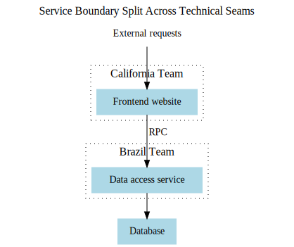

A better approach would have been to allocate end-to-end vertical slices, where the California team handled one complete functionality (frontend and data access) while the Brazil team worked on another. Vertical slices maintain clearer boundaries and align better with business logic, reducing dependency conflicts and enabling smoother collaboration.

### Balancing Layering Within and Outside Microservices

While layering within a microservice can be valuable for organizing code, issues arise when such layering dictates the boundaries of microservices themselves. Vertical slicing, focusing on delivering complete business capabilities, typically results in more cohesive, independently manageable services. Horizontal slicing, in contrast, often leads to fragmented ownership, performance bottlenecks, and misaligned responsibilities.

By considering organizational structure and aligning boundaries with team ownership, businesses like ShopLink can design microservices that are resilient, efficient, and easier to manage, regardless of how teams evolve over time.

---

## **Combining Models and Handling Exceptions**

As demonstrated so far, I'm not rigid in advocating any single approach to defining boundaries. By adhering to the principles of **information hiding** and understanding the balance between **coupling and cohesion**, you can effectively avoid many pitfalls regardless of the method you choose. While I lean toward domain-oriented architecture as a natural outcome of following these principles, it's not the only option, nor is it always the best choice in every scenario. In fact, situations often arise where combining different models becomes necessary, even if a domain-focused approach serves as your foundation.  

The approaches discussed previously often overlap, and being overly rigid in applying a single method can lead to suboptimal outcomes. For instance, decomposing services based on **volatility** makes sense when the goal is to accelerate delivery. However, if that decomposition inadvertently crosses organizational boundaries, delivery may slow due to conflicts over ownership and responsibility.  

Take, for example, a hypothetical Warehouse service. A domain-driven design might suggest grouping all its functionality into a single service. However, if certain components of the Warehouse service require implementation in distinct technologies—say, one in **C++** for high-performance needs and another in **Kotlin** for rapid feature development—you would need to refine the boundaries further based on technological constraints.  

While my initial preference is to establish service boundaries based on organizational structures or business domains, this is just a starting point. In reality, several considerations—volatility, technical requirements, organizational alignment, and data segregation—often shape the final decisions. The right choice ultimately depends on the specific challenges your system is addressing.  

One key takeaway: be wary of prescriptive advice. If someone insists, “The only correct way to approach this is X!” they are likely promoting rigid dogma rather than practical solutions. By thoughtfully examining your unique context and objectives, you can craft an architecture tailored to your needs, avoiding one-size-fits-all approaches.  

Now, with this broader perspective in mind, let’s delve further into **domain modeling** and its practical applications in microservices through the lens of **domain-driven design**.
