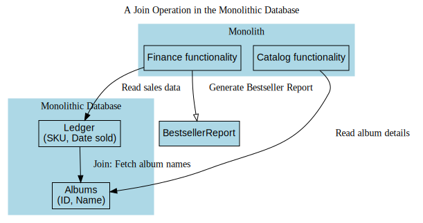

# Breaking Down the Monolith

## Define Your Purpose  

Microservices should never be the end goal. Success isn’t defined by simply adopting a microservice architecture. Instead, moving to microservices should be a thoughtful decision driven by specific objectives. Before considering this shift, evaluate whether your current architecture can meet your goals more efficiently.  

Without a well-defined purpose, it’s easy to confuse effort with results. Some teams become fixated on implementing microservices without asking the critical question: why? This mindset can be dangerous, especially given the added complexity that microservices often introduce.  

Focusing solely on microservices can also limit your perspective. Alternative solutions might address your needs more effectively. For example, if your goal is to scale your system, simpler approaches like adding more instances of your existing monolith behind a load balancer might deliver better results with less effort than a full migration to microservices.  

**Key Insight:**  
*Microservices are inherently complex. Start by exploring simpler solutions.*  

Additionally, without a clear goal, you’ll struggle to determine where to begin. Which microservice should be developed first? Without a clear understanding of the problem you’re trying to solve, your efforts risk becoming directionless.  

To avoid this, clearly define the change you want to achieve and explore less complex alternatives before committing to microservices. If microservices are indeed the best path forward, measure your progress against that goal and adjust your approach as needed.

---

## Gradual Transition

When deciding to break down your monolithic system, an incremental approach is the way to go. Instead of attempting a complete rewrite, which can lead to chaos, focus on gradually extracting pieces of functionality. This measured approach not only helps you better understand microservices as you implement them but also minimizes the fallout when things inevitably go wrong.  

Visualize your monolith as a block of marble—you could destroy it in one explosive event, but the result would likely be disastrous. Instead, sculpt it carefully, removing pieces one at a time.  

Break the overarching goal into manageable steps. Each step can be executed, evaluated, and used as a learning experience. If a mistake is made, it’s a small one, and the insights gained will guide your next move.  

This step-by-step process also allows you to identify opportunities for early success. These quick wins build confidence and momentum, making subsequent steps easier. By isolating and deploying individual microservices, you can begin to see their benefits without waiting for a large-scale release.  

My general advice for adopting microservices is to start small. Identify one or two specific functionalities to extract and transform into microservices. Deploy them to production, evaluate their impact, and determine whether this approach is helping you achieve your goals.  

**Caution:**  
The real challenges of microservices only become apparent once they’re live in production. Be prepared for the complexity that comes with this architecture.  

---

## The Monolith Is Not the Villain

As mentioned earlier, monolithic architecture can often be a valid and effective choice. It’s worth reiterating that a monolith isn’t inherently flawed or something to be eliminated at all costs. The focus should not be on simply “getting rid of the monolith” but rather on achieving the specific benefits that a new architecture promises to deliver.  

In many cases, even after transitioning to microservices, parts of the monolith remain in use, albeit in a reduced role. For instance, if your goal is to improve system scalability, you might only need to extract the 10% of functionality that creates bottlenecks, leaving the other 90% intact within the monolithic system.  

While the coexistence of monoliths and microservices might seem “messy,” real-world systems rarely have the clean, idealized architecture you might envision. System architecture evolves over time, adapting to changing requirements and newfound insights. If you seek a perfectly “clean” architecture, you might as well frame a theoretical diagram of what your system could look like under perfect conditions. Practical architecture is dynamic and must accommodate the realities of the business and technology. Learning to embrace this reality is a key skill.

By taking a gradual approach to microservices adoption, you can steadily refine your monolithic system, deliver meaningful improvements, and crucially, recognize when it’s time to stop.  

There are rare scenarios where fully dismantling the monolith is non-negotiable. These typically arise when the monolith relies on outdated or unsupported technology, is tied to infrastructure slated for decommissioning, or is a costly third-party system you want to eliminate. Even in such cases, an incremental approach to breaking down the monolith is usually the most prudent path forward.

### The Risks of Early Microservice Decomposition  

Jumping into microservices without a solid understanding of your domain can lead to significant challenges. A notable example of this comes from my previous experience at Thoughtworks with a product called Snap CI, a hosted continuous integration and delivery tool (we’ll explore these concepts further in Chapter 7). Snap CI was developed by a team that had previously worked on GoCD, an open-source continuous delivery tool designed for on-premises deployment.  

Although there was some code reuse initially between Snap CI and GoCD, Snap CI ultimately became a completely separate codebase. The team’s prior familiarity with CD tooling gave them the confidence to quickly define boundaries and implement Snap CI as a collection of microservices.  

However, it soon became evident that the use cases for Snap CI were distinct enough from GoCD that the initial service boundaries were flawed. This led to frequent cross-service changes, which came with a high cost of maintenance and complexity. To regain control, the team consolidated the services back into a monolithic architecture, giving them the space to better understand the domain and refine where boundaries should be placed. About a year later, with a clearer picture of the system’s requirements, they were able to split the monolith into microservices with far more stable and effective boundaries.  

This story is not unique—rushing into microservices can be costly, especially for teams that are unfamiliar with the domain. Interestingly, starting with a monolithic system and incrementally decomposing it into microservices tends to be more manageable. This approach allows you to learn from the existing codebase and make informed decisions about how and where to divide the system.

---

## Deciding What to Split First  

Once you’ve identified clear reasons for adopting microservices, this understanding can guide your decision on which parts of your system to split first. If your goal is scalability, prioritize extracting functionality that limits your system's capacity to handle load. If faster time-to-market is your aim, focus on areas of the codebase that change frequently. Tools like CodeScene can help identify these volatile hotspots, as shown in Figure 3-1, which illustrates code hotspots in the Apache Zookeeper project.  

However, not all functionalities are equally suited for immediate extraction. Some may be deeply embedded in the monolith, making disentanglement extremely difficult. Others might be so critical to the system that any modifications carry significant risk. Conversely, there could be components that are already relatively self-contained, making them more straightforward candidates for decomposition.  

Ultimately, the decision comes down to balancing two factors: how challenging the extraction is versus the value it will bring as a standalone microservice.  

For your initial microservices, focus on areas that lean toward the "easy" side of this spectrum. Choose components that contribute meaningfully to your broader goals but are still manageable to extract—think of them as low-hanging fruit. Early successes are crucial in a transition that may span months or years, as they help build momentum and confidence.  

If even the simplest candidate for extraction proves too difficult, it’s worth reconsidering whether microservices are the right approach for your organization at this time.  

Once you’ve achieved a few successful extractions and gained experience, you’ll be better equipped to tackle more complex or high-risk functionality. These initial wins can serve as a foundation for navigating the more challenging aspects of your migration journey.

---

## Layer-by-Layer Decomposition  

Once you’ve decided on the first microservice to extract, the next step is to break down the extraction process into smaller, manageable stages.  

For a typical three-tier web architecture, this means addressing the user interface, backend application logic, and associated data.  

#### User Interface Considerations  
The relationship between a microservice and the user interface is often not one-to-one. Extracting UI functionality related to a microservice may need to be treated as a separate task. However, it’s essential not to overlook the UI during this process. Many organizations focus solely on backend decomposition, leading to a fragmented and overly siloed system. In fact, significant gains can sometimes come from UI decomposition, so it’s critical to give this layer the attention it deserves.  

That said, UI decomposition often follows backend decomposition, as the potential for changes in the UI becomes clearer once microservices are in place. Just be cautious about letting the UI fall too far behind the rest of the system.  

#### Backend Logic and Data  
When it comes to the backend and data layers, both need to be considered together as part of the microservice extraction process. For example, if you are extracting functionality related to a customer’s wishlist, the code for managing the wishlist might reside within the monolith, and the associated data may be stored in the monolithic database.

The question then becomes: which piece do you extract first?  

Decomposing by layer allows you to approach the transition in incremental steps while ensuring that all interdependencies between the application logic and data are addressed. This helps minimize risks and keeps the transition organized. Ultimately, treating the decomposition of each layer as part of a coordinated process ensures that the resulting microservice is well-integrated and functional.

### Start with the Code  

The wishlist functionality has been extracted into a new microservice, but its data remains in the monolithic database for now. The decomposition isn’t truly complete until the related data is also migrated to the new microservice’s domain.  

Starting with the application code is a common initial step, as it tends to provide quicker short-term benefits. While leaving the data in the monolithic database can lead to complications down the line, this approach allows you to realize some immediate value from the new microservice.  

Typically, extracting application code is less complex than extracting data from a monolithic database. By focusing on the code first, you can evaluate whether the extraction process is feasible without immediately tackling the more challenging task of data migration. If cleanly extracting the code proves impossible, you can halt the process early, avoiding the additional complexity of disentangling the database.  

However, if the application code is successfully extracted and the data migration later proves unworkable, you may encounter significant challenges. For this reason, it’s crucial to assess the data layer before starting. Even if you choose to prioritize the code, you should have a clear plan for how the associated data will be migrated. Do the necessary groundwork to understand the viability and process of extracting both the code and the data to avoid running into major obstacles mid-decomposition.

### Starting with Data Extraction  

The first step in the decomposition process involves extracting the data associated with the wishlist functionality, leaving the application code in the monolith for the time being. While this approach is less common, it can be particularly helpful when there are uncertainties about whether the data can be successfully separated. By focusing on data extraction first, you can validate its feasibility before attempting to move the application logic, which is often easier to extract.  

One key advantage of starting with the data is that it mitigates risks associated with the full decomposition process. It forces you to address complex challenges early, such as ensuring data integrity without enforced relationships in a single database or managing transactional consistency across the monolithic and extracted datasets. Tackling these issues upfront can reduce potential complications later and increase the likelihood of a successful transition to a microservice.  

This strategy can be a prudent choice in cases where the data's entanglement is the primary concern, helping you proceed with greater confidence in the overall feasibility of the migration.

---

## Useful Decomposition Patterns

### Strangler Fig Pattern for Incremental Migration  

The strangler fig pattern, popularized by Martin Fowler, is a widely used approach for system rewrites. Named after a plant that gradually overtakes its host, this pattern involves incrementally replacing parts of an old system with components of a new system until the new system entirely takes over.  

The process is relatively simple. Calls to the legacy system, such as a monolithic application, are intercepted. If the required functionality has been migrated to the new microservices architecture, the call is routed to the appropriate microservice. If not, the call continues to the original monolithic system.  

One of the key advantages of this pattern is that it often doesn’t require changes to the monolithic application itself. The monolith remains unaware of the transition and continues to function as it always has, even as more functionality is moved to the new system.  

This approach allows for a gradual migration, reducing risks and making it easier to manage the complexity of transitioning from a monolithic to a microservices architecture.

### Running Systems in Parallel  

When migrating critical functionality from a reliable, established monolithic application to a new microservices-based architecture, concerns about stability and performance are natural. This is especially true for functionality that plays a vital role in your organization’s operations.

A useful approach to mitigate these concerns is the parallel run pattern. In this method, both the monolithic implementation and the newly developed microservice run simultaneously, handling the same incoming requests. Their outputs are then compared to ensure the new microservice behaves as expected without disrupting the existing system.  

This technique allows you to verify the reliability of the new system in real-world scenarios while maintaining the safety net of the original monolith.

### Feature Toggle

A feature toggle is a technique that enables you to dynamically switch a feature on or off or toggle between two different implementations of the same functionality. While it has broad applicability, this pattern proves particularly valuable during a microservice migration.

Similar to the strangler fig pattern, it’s common to retain the existing functionality in the monolith during the transition while introducing a new implementation in the microservice. A feature toggle allows you to seamlessly switch between the monolith and the microservice, providing flexibility and reducing risk during migration.  

For instance, when using an HTTP proxy as part of the strangler fig approach, the feature toggle can be incorporated into the proxy layer. This setup allows for straightforward control over which implementation—monolithic or microservice—is used at any given time.  

For a deeper dive into feature toggles, check out Pete Hodgson’s excellent article, *“Feature Toggles (aka Feature Flags).”*

---

## Data Decomposition Concerns

### Performance Challenges  

Relational databases excel at joining data across multiple tables—so much so that we often take this performance for granted. However, when transitioning to a microservices architecture, those join operations often need to move from the database layer to the application layer, significantly affecting efficiency.

Let’s consider an example from StreamTech. Suppose we decide to extract the *Media Catalog* functionality, which manages information about movies, shows, and series. Within the current monolithic system, the catalog-related code utilizes a *MediaItems* table to store details about each title, such as the movie *Interstellar* or the series *Breaking Bytes.* This table is referenced in the *Transactions* table, where we track purchases or rentals. Each row in the *Transactions* table includes the date of the transaction and an identifier, such as an SKU (stock-keeping unit), commonly used in inventory systems.

At the end of the month, StreamTech generates a report to highlight the best-selling titles. To do this, the *Transactions* table identifies the top-selling SKUs, which are then joined with the *MediaItems* table to provide human-readable details like, “*We sold 500 copies of Interstellar for $9,990.*” This join operation happens seamlessly in the monolithic database.

#### The Microservices Challenge  

In the new microservice-based architecture, the *Finance* microservice takes responsibility for generating this report, while the *Catalog* microservice owns the media data. This separation means that the *Finance* microservice no longer has direct access to the *MediaItems* data.

Here’s how the process unfolds in this new architecture:

1. The *Finance* microservice queries the *Transactions* table locally to identify the top-selling SKUs for the month. At this stage, it only knows the SKUs and the number of transactions for each.
2. To retrieve details about these SKUs, the *Finance* microservice sends requests to the *Catalog* microservice. These requests prompt the *Catalog* microservice to query its own database for the required media details.

While this approach works logically, the join operation that used to happen in the database now takes place in the *Finance* microservice. Unfortunately, this move from the database tier to the application tier introduces significant inefficiencies. Instead of a single SQL query, we now have:

- A SELECT query on the *Transactions* table.
- Multiple service calls from the *Finance* microservice to the *Catalog* microservice.
- Additional SELECT queries on the *Catalog* microservice’s database.

#### Mitigating Performance Issues  

This shift in where the join operation occurs often results in higher latency, especially if the report is generated frequently. In this example, the monthly nature of the report might make the latency tolerable, as it can be aggressively cached. However, for more frequent operations, performance degradation could become a significant problem.  

To address this, StreamTech could consider:  

1. **Batch Requests:** Instead of querying the *Catalog* microservice for each SKU individually, allow bulk lookups to reduce the number of service calls.
2. **Local Caching:** Cache media details locally within the *Finance* microservice to reduce reliance on the *Catalog* microservice for repeated requests.
3. **Denormalization:** Maintain a denormalized view of key data needed for reporting, reducing the need for cross-service queries.

While splitting data is a necessary part of microservices migration, careful consideration of these performance challenges is critical to maintaining system efficiency.

### Maintaining Data Integrity  

Databases are often relied upon to ensure the integrity of data relationships. In the context of **StreamTech**, let’s revisit the scenario. With both the *MediaItems* table (storing movie or series information) and the *Transactions* table (recording sales or rentals) residing in the same database, it’s possible to enforce data integrity using foreign key constraints. For example, a foreign key could ensure that every record in the *Transactions* table always references a valid entry in the *MediaItems* table. This would prevent deletion of a media record if it’s still being referenced in a transaction.

However, in a microservices architecture where these tables are moved to separate databases, enforcing such integrity becomes challenging. Without the foreign key relationship, there’s no mechanism to prevent deleting a row in the *MediaItems* table, which could lead to inconsistencies—such as the inability to trace which movie or series a transaction was associated with.

#### Adapting to Distributed Data  

In this new architecture, StreamTech must adjust to the reality that database-enforced integrity is no longer an option for relationships spanning multiple services. For data contained within a single database, this isn’t a problem, but when different services own their data independently, maintaining consistency requires additional effort.

#### Coping Mechanisms  

There are several ways to address this limitation—better described as "coping patterns" rather than full solutions:

1. **Soft Deletes:** Instead of permanently removing entries from the *MediaItems* table, a soft delete can be implemented by marking rows as deleted while keeping the data intact. This ensures that references in the *Transactions* table remain valid.
   
2. **Data Duplication:** Another approach is to duplicate key information, such as the name of the media, into the *Transactions* table at the time of a transaction. While this eliminates the dependency on the *MediaItems* table, it introduces challenges with synchronization. For example, if a movie’s name changes, StreamTech must decide how or whether to update the duplicate entries in the *Transactions* table.

#### Finding the Right Balance  

Each workaround comes with trade-offs. Soft deletes can increase database size and require additional logic to filter out "deleted" rows. Data duplication reduces cross-database dependencies but can lead to stale or inconsistent data if updates aren’t carefully managed. StreamTech will need to weigh these options and choose strategies based on the specific requirements and constraints of its microservices architecture.

### Transcations

### Tooling

### Tooling Challenges in StreamTech  

#### The Difficulty of Database Changes  

Modifying databases poses unique challenges, especially in a system like **StreamTech’s** evolving architecture. Unlike application code, where integrated development environments (IDEs) often provide robust refactoring tools, databases lack similar support. Furthermore, while code changes are applied to stateless systems, databases carry state, making changes significantly more complex.

In application development, you can easily refactor methods or rename variables without directly affecting underlying data. However, altering a database involves carefully managing schema changes, ensuring compatibility with existing data, and preventing disruption to services relying on that data.

#### Managing Schema Changes  

For databases, schema modifications are typically handled using tools that manage changes incrementally. These tools rely on a process where every change to the schema is defined in version-controlled migration scripts. These scripts are applied in sequence, ensuring consistency and making the changes idempotent (safe to reapply if necessary).

For instance, if StreamTech were to migrate the schema of its *MediaItems* table (containing details about movies and shows), the process might involve creating scripts to add new columns, modify constraints, or migrate data to a new structure. This ensures that all changes are recorded and executed predictably across different environments, such as development, staging, and production.

#### Recommended Tools  

While there are various tools available for schema management, two popular options stand out for their reliability and features:

1. **Flyway**: A lightweight, open-source tool that supports database versioning through SQL or Java-based migration scripts. Flyway’s straightforward approach makes it an excellent choice for teams looking to manage schema changes consistently.

2. **Liquibase**: A more feature-rich tool that also supports tracking changes in XML, YAML, JSON, or SQL formats. Liquibase is particularly useful for larger teams that need detailed change tracking and rollback capabilities.

StreamTech can adopt one of these tools—or a similar solution—if it doesn’t already have a mechanism in place for managing database schema changes. These tools help streamline the process, making database migrations less error-prone and easier to coordinate across teams.

#### Adapting to Database Evolution  

As StreamTech transitions to a microservices architecture, effective tooling for database schema management becomes critical. While modifying application code may feel intuitive and seamless, database changes require careful planning and execution. Using tools like Flyway or Liquibase will help ensure the integrity and consistency of database changes, supporting the evolving needs of StreamTech’s systems.

### Reporting Database

#### The Role of a Reporting Database  

When transitioning from a monolithic architecture to microservices at **StreamTech**, splitting databases becomes a critical step. This separation helps enforce information hiding, as it prevents direct external access to internal data stores. By isolating internal storage, StreamTech can establish stable interfaces that enable independent deployment of each microservice. However, this approach introduces challenges when data from multiple services needs to be accessed together or when providing data through APIs is less practical than offering SQL-based access.

A **reporting database** solves this problem by creating a dedicated, external-facing database. Instead of granting direct access to internal storage, each microservice is responsible for pushing relevant data into this shared reporting database, as illustrated in Figure 3-8. This approach allows StreamTech to maintain internal state management while offering an external interface for tasks like ad hoc SQL queries, complex joins, or integration with tools that expect SQL endpoints.

#### Benefits of a Reporting Database  

The reporting database offers several advantages:
1. **Controlled Access:** It hides sensitive internal data, exposing only what is necessary to meet external requirements.
2. **Custom Schema Design:** Unlike internal storage, which reflects microservice-specific needs, the reporting database can be designed specifically for consumer use. This flexibility allows StreamTech to create schemas tailored to reporting and analytics needs, even leveraging different database technologies if required.

For instance, StreamTech might configure the reporting database to combine sales and catalog data for generating detailed insights on viewer preferences, something that would otherwise require querying multiple microservices.

#### Key Considerations  

1. **Minimal Exposure:** The data in the reporting database should be a carefully curated subset of the microservice's internal data. By exposing only what is necessary, StreamTech can maintain information hiding and reduce risks associated with external access.
   
2. **Maintained Compatibility:** The reporting database must be treated as a service endpoint. Any changes to the microservice's internal implementation must not break the reporting database schema or its consumers. It is the responsibility of the microservice team to ensure the mapping from internal storage to the reporting database remains consistent and reliable.

#### Balancing Flexibility and Stability  

A reporting database allows StreamTech to achieve the benefits of a microservices architecture without sacrificing the ability to perform tasks like complex queries or integrations. By carefully managing what data is exposed and ensuring compatibility, StreamTech can support both internal agility and external accessibility, creating a scalable and consumer-friendly architecture.

---
