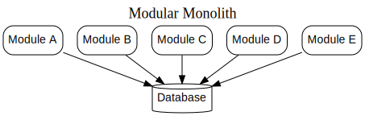

# **What Are Microservices?**

## **Microservices at a Glance**
Microservices are standalone, deployable services tailored to specific business functions. Each service provides specific capabilities and is accessible through network protocols, enabling the creation of larger systems by integrating these modular components. For instance, a single microservice could handle inventory, another might manage orders, and yet another could handle shipping. Collectively, they could form the backbone of an e-commerce platform. The microservices architecture offers flexibility and focuses on solving complex challenges with a variety of strategies.

While microservices fall under the broader category of service-oriented architectures (SOA), they have distinct characteristics, such as clearly defined service boundaries and an emphasis on independent deployment. They are technology-agnostic, which gives them a significant edge in versatility.

From an external perspective, each microservice operates as a black box, exposing its functionality through defined endpoints, such as REST APIs or messaging queues, without revealing its internal implementation.

---
## **Key Concepts of Microservices**

### Independent Deployability
One of the fundamental principles of microservices is the ability to independently update and deploy a single service without impacting others. This approach allows for isolated changes that can quickly reach users without requiring system-wide deployment. Achieving this requires managing deployments as a standard practice and ensuring each microservice is loosely coupled. Loosely coupled services demand explicit and stable interfaces to maintain compatibility, avoiding challenges such as shared databases. Independent deployability not only simplifies updates but also brings a cascade of additional benefits to the system's flexibility and reliability.

### Modeled Around a Business Domain
Microservices are designed to reflect real-world business domains, using techniques such as domain-driven design. By organizing services around business functionalities rather than technical layers, teams can develop and deploy features more effectively. For example, a microservice could encapsulate a complete business function, reducing the complexity of cross-service changes. Unlike traditional multi-layered architectures, where a change might require updates across multiple layers, microservices prioritize delivering cohesive business functionality while minimizing dependencies.

### Owning Their Own State
Microservices are responsible for managing their data and state independently, avoiding the pitfalls of shared databases. Each microservice interacts with other services through defined interfaces, ensuring separation of internal implementation and externally shared contracts. This approach promotes clear boundaries, enabling services to adapt internally without disrupting others. By encapsulating their state, microservices achieve greater flexibility and minimize the risk of backward-incompatible changes.

### Size
The size of a microservice is less about lines of code and more about its comprehensibility and functionality. Microservices should be small enough to be easily understood by a team yet large enough to handle meaningful business capabilities. This balance depends on the context and team's expertise. The goal is not micro for micro's sake but to maintain a manageable scope that aligns with the system's needs.

### Flexibility
One of the key benefits of microservices is the flexibility they offer. As James Lewis noted, microservices provide “options” for addressing various challenges. While these options come with costs, they allow organizations to adapt and respond effectively to changing requirements. By adopting microservices, businesses gain the ability to experiment with different solutions and pivot as needed, ensuring the architecture remains relevant and robust over time. This incremental approach helps mitigate the risks associated with large-scale changes, as teams can assess the impact gradually.

### Alignment of Architecture and Organization
Microservices architectures often mirror the structure of the organization creating them, a phenomenon explained by Conway’s Law. This alignment emphasizes how the way teams are structured influences system design. For example, traditional three-tier architectures often reflect team groupings based on technical specializations, like frontend, backend, and database roles. In contrast, microservices encourage structuring teams around business capabilities, enabling end-to-end ownership of services. This shift enhances collaboration and simplifies changes related to business functionality.

#### Stream-Aligned Teams
In microservices, the concept of team alignment plays a pivotal role in ensuring efficiency and accountability. A "stream-aligned team" focuses on delivering value within a specific, high-priority workstream. Such teams are empowered to build and deliver features independently, minimizing dependencies on other teams. This autonomy allows for faster delivery of user value while maintaining safety and quality. For example, a team responsible for the Customer Profile functionality would own not only the backend logic but also the related UI elements, creating an end-to-end ownership model.

Stream-aligned teams are a vital part of the microservices approach, as they align organizational structures with business outcomes, ensuring smoother collaboration and a more effective deployment of resources.

---

## **The Monolith**

Microservices are often discussed as an alternative to monolithic architectures. To better understand the value of microservices, it’s essential to clearly define what is meant by "monoliths." In this context, monoliths refer to a unit of deployment where all system functionality must be deployed together as one.

### The Single-Process Monolith

A single-process monolith represents a system where all code is deployed as a single process. While multiple instances might exist for scalability or reliability, the core concept is that all functionalities are packaged into one cohesive process. These systems often handle tasks like database interactions or presenting data through web or mobile applications.

Although common, single-process monoliths can be more complex than they appear. Organizations often employ multiple tightly coupled monoliths or integrate vendor software into their architecture. This approach can work well for smaller teams or simpler setups, allowing rapid development and scaling as the organization grows. However, as the system scales, transitioning to other architectures may become necessary.

### The Modular Monolith

A modular monolith divides a single-process system into well-defined modules. Each module encapsulates specific functionality and can be developed independently, though deployment still occurs as a single unit. This approach has roots in structured programming and provides a middle ground between the simplicity of monoliths and the flexibility of microservices.

This architecture can enable parallel development and maintain a simpler deployment process, making it ideal for many organizations. However, challenges arise when database design doesn't align with modular boundaries, creating difficulties in decomposing the system later. A variation involves decomposing the database along module lines to further align the architecture.

### The Distributed Monolith
A distributed monolith consists of multiple services that, despite their separation, must still be deployed together. This architecture combines the challenges of single-process monoliths and distributed systems without fully leveraging the benefits of either. Changes in one service often create ripple effects across others, undermining the goals of independence and flexibility.

Distributed monoliths often emerge from systems lacking clear service boundaries or effective information hiding. These highly coupled systems make even localized changes complex, impacting other parts of the architecture unintentionally.

### Monoliths and Delivery Contention
Monolithic architectures can lead to bottlenecks as multiple teams work on the same system. For example, developers may inadvertently create conflicts by modifying overlapping code or deploying at different times. This can cause delays, confusion over ownership, and difficulties in coordination, ultimately slowing down development and delivery.

### Advantages of Monoliths
Monolithic architectures, including single-process and modular monoliths, offer several benefits. Their streamlined deployment process avoids many of the complexities associated with distributed systems. This simplicity extends to development workflows, monitoring, debugging, and testing, which can all be handled more efficiently.

Monoliths also facilitate straightforward code reuse. Unlike in distributed systems, where decisions must be made about breaking code into libraries or services, monoliths allow all functionality to remain unified within a single system. This simplicity is appealing to many developers, as it eliminates unnecessary complications and allows the system to just work.

However, monoliths are often viewed as outdated or synonymous with legacy systems. This perception overlooks the fact that monoliths are a valid and, in many cases, sensible architectural choice. For simpler or smaller projects, they can be the ideal default. Adopting microservices without a compelling reason risks adding unnecessary complexity, which may not align with the needs of the system or its users.

Monoliths remain a viable option for software delivery. Undermining their value as a default approach can lead to overcomplication, deterring the effective development and maintenance of software.

---
## **Enabling Technologies**

### **Log Aggregation and Distributed Tracing**
Managing multiple processes in a microservice environment can make understanding system behavior in production settings challenging. Implementing a log aggregation tool is a crucial step, enabling centralized analysis and proactive alerts. Such tools allow you to correlate logs across services using identifiers, simplifying troubleshooting and improving system visibility. For distributed systems, tools like Humio, Jaeger, Lightstep, and Honeycomb offer advanced capabilities, including bottleneck detection and trace analysis, addressing the complexities of distributed architectures.

### **Containers and Kubernetes**
Isolation is key for microservices, ensuring one service doesn’t impact others by monopolizing resources. Containers provide lightweight, efficient environments for service execution compared to traditional virtualization. Kubernetes orchestrates these containers, enabling scalable and distributed deployments while ensuring resource optimization. Although Kubernetes offers significant advantages, adopting it early can be overwhelming. Managed Kubernetes solutions by cloud providers can simplify adoption when scaling becomes essential.

### **Streaming**
Microservices are shifting towards real-time data feedback, moving away from batch reporting systems. Technologies like Apache Kafka excel in message streaming due to their robustness and scalability, ensuring smooth handling of large data volumes. Complementary tools like Debezium and Apache Flink further enhance data streaming, enabling integration with traditional data sources and stream-processing frameworks. These technologies make streaming a powerful tool in microservice ecosystems.

Thank you for sharing. The additional information about public cloud and serverless technologies reinforces the importance of leveraging managed services for simplifying operations and reducing overhead. Here's the expanded rephrased section:

### Public Cloud and Serverless

Public cloud platforms, such as AWS, Microsoft Azure, and Google Cloud, offer a variety of managed services, ranging from databases to Kubernetes clusters and messaging systems. By using these services, organizations can offload operational complexities to cloud providers who specialize in managing these tasks efficiently.

One of the most significant offerings from public cloud providers is **serverless technology**, which abstracts away the underlying infrastructure. Serverless products, such as message brokers, storage solutions, and databases, provide a higher level of abstraction. Platforms like Function as a Service (FaaS) eliminate the need to manage servers entirely—allowing developers to focus solely on deploying code. The cloud platform automatically handles provisioning and scaling resources based on demand. This approach reduces operational burden while ensuring scalability and reliability.

---

## **Advantages of Microservices**

### Technology Heterogeneity

Microservices architecture allows for flexibility in choosing technologies tailored to specific needs. Rather than forcing the entire system to adopt a one-size-fits-all approach, each service can leverage the best-suited tools and frameworks. For instance, different parts of a system, such as social interactions and data storage, might rely on distinct technologies like graph databases or document-oriented stores. This adaptability makes it easier to meet diverse performance demands and enhances overall efficiency.

### Robustness
A key strength of microservices lies in their ability to isolate failures. If one service encounters an issue, the rest of the system can continue operating without disruption. This concept of isolation reduces the risk of complete system breakdowns, unlike monolithic architectures where a single failure might cascade across the entire application. However, maintaining robustness requires a clear understanding of distributed system challenges, including network and hardware failures.

### Scaling
Microservices enable more precise scaling strategies by allowing specific components to scale independently based on demand. Unlike monolithic systems that require scaling the entire application, microservices allow developers to focus on the parts that need additional resources. For example, a service experiencing high traffic can be scaled up without impacting other components, making the system more resource-efficient and cost-effective.

### Ease of Deployment
Deploying changes in microservices is faster and more manageable compared to monolithic systems. Teams can update individual services without affecting the rest of the system, reducing risks associated with large-scale deployments. This approach also supports quicker feature rollouts, ensuring faster delivery of new functionalities to users. Organizations like Amazon and Netflix benefit from this agility, which allows them to respond rapidly to customer needs.

### Organizational Alignment
Microservices align development teams more effectively with specific business domains. By reducing the size of codebases and enabling smaller, focused teams, organizations can enhance productivity and minimize communication overhead. This modular approach allows businesses to adapt their architecture to changing organizational needs, ensuring a better balance between technical and business objectives.

### Composability

One of the defining strengths of distributed systems and service-oriented architectures lies in the ability to reuse functionality effectively. Microservices amplify this by enabling functionality to be accessed and utilized in diverse ways, catering to various use cases. This flexibility is particularly valuable when considering how consumers engage with the software.

In the past, organizations might have focused narrowly on specific platforms, such as a desktop website or a mobile app. However, the modern landscape demands support for a wide array of channels, including web applications, mobile platforms, tablet interfaces, and even wearable devices. This shift necessitates a broader and more integrated approach to customer engagement, which microservices are well-suited to provide.

With microservices, systems become modular and adaptable, allowing external parties or different internal teams to interact with specific components. This adaptability facilitates building new applications or features in a seamless and efficient manner. Unlike monolithic architectures, which often offer only coarse-grained interfaces, microservices provide the granularity needed to deliver flexible and tailored solutions, making them an ideal choice for evolving business requirements.

# **Microservice Pain Points**

While microservices offer numerous advantages, they also introduce significant challenges. Recognizing these difficulties is vital for organizations considering adopting this architectural style.

### Developer Experience
Managing multiple microservices can strain the developer experience, particularly with resource-intensive runtimes like the JVM. Developers may face limitations in running all services locally, creating challenges in simulating and testing the complete system. As microservices grow in number, the complexities of cloud-based development increase, often necessitating discussions about how to handle services not runnable on local machines.

### Technology Overload
The diverse technologies associated with microservices can overwhelm teams. Although tools marketed as "microservice-friendly" have emerged, their sheer variety can lead to decision fatigue and a steep learning curve. Organizations must balance adopting new technologies with the need to ship features promptly. Gradual adoption of tools as needed can help mitigate these complexities while leveraging the strengths of emerging technologies.

### Cost
Adopting microservices often results in higher upfront costs. More services mean increased requirements for resources like computing power, storage, and network capacity, which can inflate operational expenses. Additionally, learning new approaches and adapting teams to microservices can slow productivity initially. While microservices may not always reduce costs, they can enable organizations to scale and create new revenue opportunities.

### Reporting
In a monolithic system, centralized databases simplify reporting. Microservices, however, scatter data across different services and schemas, complicating reporting processes. Solutions like streaming data to centralized repositories or using real-time data lakes can address this challenge but require new tools and approaches.

### Monitoring and Troubleshooting
Traditional monitoring methods fail to capture the intricacies of microservices, where numerous distributed processes interact. Diagnosing failures—such as identifying whether a single service is causing issues—becomes more difficult. Modern observability tools and frameworks are essential for ensuring reliable service performance.

### Security
With microservices, data often flows over networks, increasing exposure to vulnerabilities like interception or manipulation during transit. Protecting data across service boundaries requires robust encryption and strict access controls. Addressing these concerns necessitates dedicated security practices to safeguard service communications.

### Testing
Testing microservices demands a more nuanced approach than monolithic systems. End-to-end testing across interconnected services can be resource-intensive and prone to false negatives due to environmental factors like service timeouts. Contract-driven testing and innovative deployment strategies, such as canary releases, can help improve confidence in system reliability.

### Latency
Splitting processes across multiple microservices can introduce latency as data is serialized, transmitted, and deserialized over networks. Incrementally migrating to microservices while carefully measuring the latency of critical operations ensures performance remains acceptable.

#### Data Consistency
Transitioning from a single, centralized database to distributed data management creates challenges in ensuring consistency. Traditional database transactions may no longer suffice, necessitating approaches like eventual consistency and distributed transaction models such as sagas. Incremental system decomposition can help organizations navigate these complexities.

--- 

## **Should I use Microservices**

### **Whom They Might Not Work For**  
Microservices may not be ideal for all scenarios. For new products or startups, where the core domain is still evolving, defining stable service boundaries can be challenging. Such organizations often undergo significant changes as they refine their product offerings, leading to frequent adjustments in service boundaries. These changes can become costly and complex.  

Additionally, startups often lack the resources to manage the inherent complexities of microservices. For a small team, the overhead of managing microservices can consume valuable time and resources that might be better spent on product development. It may be more practical to adopt microservices later, once the team's workload and pain points are better understood.  

Organizations that deliver software directly to customers without managing operations themselves may also struggle with microservices. The increased complexity of deployment and operations can be overwhelming, especially for users accustomed to traditional software delivery methods. For instance, a company shifting from delivering software as a simple installer to deploying multiple Kubernetes pods may face resistance from customers unfamiliar with such technologies.  

### **Where They Work Well**  
Microservices excel in scenarios where organizations need to scale development efforts efficiently. By dividing systems into smaller, independent services, teams can work simultaneously without hindering one another, reducing delivery bottlenecks. Larger teams or rapidly growing companies often find this independence beneficial.  

Microservices are particularly well-suited for Software as a Service (SaaS) platforms, which demand continuous operations and scalability. These architectures make it easier to roll out updates and manage the system efficiently. The flexibility of microservices allows for scaling specific parts of the system based on workload demands, optimizing resource usage.  

The ability to experiment with new technologies is another advantage of microservices. By decoupling services, organizations can test new approaches without affecting the broader system. This agility is especially valuable for identifying and adopting innovations quickly.  

Lastly, microservices empower organizations to deliver services across multiple channels, enhancing customer experience. This adaptability aligns well with modern digital transformation goals, enabling companies to meet diverse user needs effectively. While microservices come with trade-offs, their flexibility and scalability make them an appealing choice for many scenarios.  
