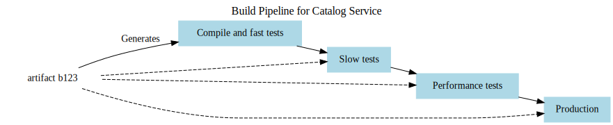
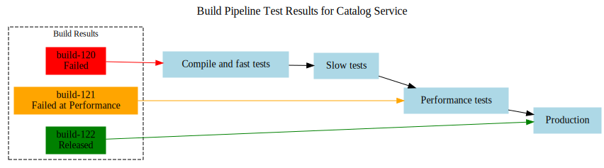
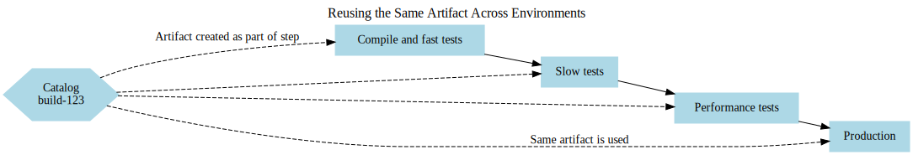
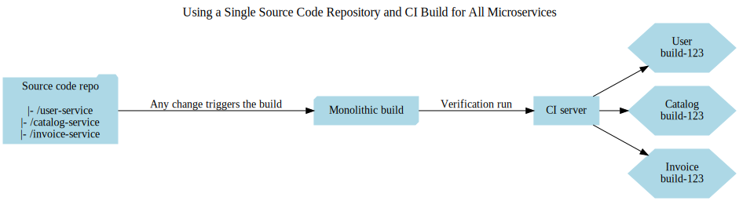
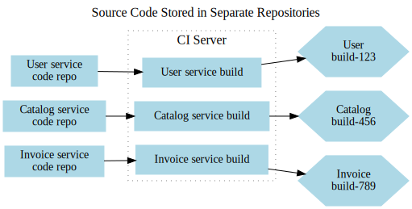
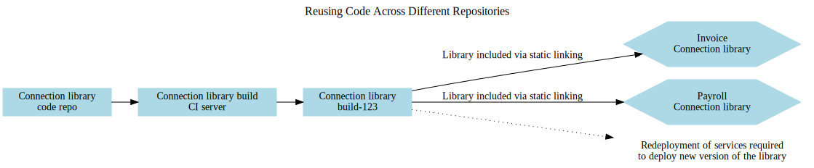
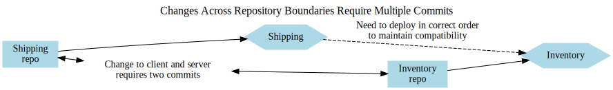
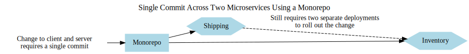
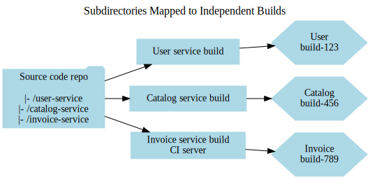
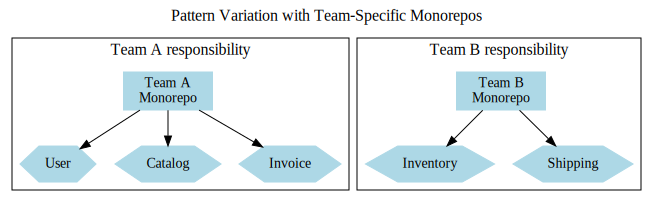

# Constructing Microservices

Thus far, we’ve focused extensively on the design principles of microservices. Now, it’s time to delve deeper into how your development workflows might need to adapt to support this architecture effectively. We’ll examine deployment and testing strategies for microservices. However, before tackling those areas, it’s essential to address the first step—what happens when a developer is ready to commit a code change?

We’ll begin this journey by revisiting two critical foundational practices: continuous integration and continuous delivery. These practices are valuable in any architectural context, but microservices introduce distinct challenges and considerations. Following that, we’ll explore pipelines and various approaches to managing source code for microservices.

## An Overview of Continuous Integration

Continuous integration (CI) has been a foundational practice in software development for many years. However, revisiting its fundamentals is valuable, especially when considering how microservices, build processes, and version control repositories intersect.

The primary objective of CI is to ensure team alignment by regularly integrating new code with the existing codebase. This is achieved by using a CI server, which detects new commits, retrieves the code, and performs essential validations, such as ensuring the code compiles and passes tests. At a minimum, this process should occur daily, though in many teams, developers integrate their changes multiple times a day.

As part of CI, artifacts are often generated for further validation. For example, deploying a service instance to test it in a realistic environment is common practice. Ideally, each artifact is built only once and reused throughout the deployment process, ensuring consistency between what is tested and what is deployed. These artifacts are stored in a repository, which might be integrated into the CI tool or exist as a separate system. This approach eliminates redundant work and guarantees that tested artifacts are the ones being deployed.

The benefits of CI are numerous. It provides rapid feedback on code quality through static analysis and automated tests. It also streamlines the creation of binary artifacts, all of which are version-controlled, allowing teams to trace deployed artifacts back to their source code. CI tools can further enhance this traceability by showing which tests were executed on the code and artifacts. When combined with infrastructure as code, CI allows teams to version control infrastructure configurations alongside microservice code, enhancing transparency and simplifying reproducibility.

These advantages have made CI an indispensable part of modern software development, particularly in the context of microservices. In subsequent sections, we’ll dive deeper into artifact management and explore testing strategies in more detail.

### Are You Truly Practicing Continuous Integration?

Continuous Integration (CI) is a vital practice for enabling rapid and seamless changes in your codebase. Without it, transitioning to a microservices architecture can be fraught with challenges. While your organization may already use a CI tool, such as Jenkins, CircleCI, or Travis, utilizing a CI tool doesn’t necessarily mean you’re effectively practicing CI. The tool is only a means to an end; the real value comes from adhering to CI principles.

How can you tell if you’re genuinely practicing CI? Jez Humble offers three insightful questions to help assess whether your CI processes align with best practices. Consider asking yourself these:

#### 1. Do you commit to the mainline at least once per day?  
Frequent integration is essential to ensure your changes align with the rest of the codebase. Infrequent commits increase the difficulty of merging changes later. Even if your team uses short-lived feature branches, the goal should be to integrate them into the mainline frequently—ideally daily.

#### 2. Do you have a comprehensive test suite to verify your changes?  
Simply merging code doesn’t confirm that it works as intended. Automated tests validate that your changes haven’t disrupted the system’s behavior. Without a reliable test suite, you’re not truly practicing CI.

#### 3. When the build fails, is fixing it the team’s top priority?  
A successful build signals that all changes have integrated correctly. A failed build indicates an issue that must be resolved immediately. Allowing further changes to pile up before addressing the failure complicates the process and increases the time required to fix it. Teams that let builds remain broken for days often find themselves in a difficult, time-consuming situation to restore a passing build.

By focusing on these principles, you can move beyond merely using CI tools to fully embracing CI as a practice, ensuring smoother integration and more reliable development processes.

### Source Code Branching Models

Branching strategies for feature development often spark significant debate in the context of build and deployment processes. Branching allows developers to work on features in isolation, minimizing disruption to others. At first glance, using separate branches for each feature—commonly referred to as *feature branching*—may appear to be a practical approach.

However, feature branching has a notable drawback: it delays integration. While working in isolation, you’re not regularly merging your changes with the broader codebase. When the time finally comes to integrate, the process can become much more complex and error-prone due to accumulated differences.

An alternative is *trunk-based development*, where all developers commit their changes to a single, shared branch, often called the “trunk.” In this approach, incomplete features can be concealed using techniques like feature flags, which prevent unfinished code from affecting others. This method promotes frequent integration and validation, ensuring changes align with the rest of the team’s work. Trunk-based development also aligns well with practices like progressive delivery.

#### Best Practices for Branching
- **Integrate Early and Often**: Avoid long-lived feature branches, and consider adopting trunk-based development. If branches are necessary, keep them short-lived to minimize integration pain.
- **Leverage Research Findings**: Studies like the 2016 *State of DevOps* report by DORA and Puppet emphasize the advantages of trunk-based development and frequent integration. The research highlights that teams with short-lived branches (less than a day) and fewer active branches perform better in terms of continuous delivery. Regularly merging into the main branch reduces complexity and boosts efficiency.

#### Trunk-Based Development vs. Branch-Heavy Models
While trunk-based development is often optimal for tightly integrated teams, branch-heavy workflows, such as GitFlow, are prevalent in open-source projects. Open-source development typically involves many contributors with varying levels of trust and availability, requiring more extensive code reviews and longer-lived branches to vet changes.

Even in open source, short-lived branches and smaller, incremental changes improve productivity:
- **Commit Changes Quickly**: Faster merges reduce the need for complex rebases and help contributors maintain momentum.
- **Work in Small Batches**: Smaller, more digestible patches are easier to review and merge than large, complex changes.

#### Conclusion
Whether your project is open-source or closed-source, the principles of frequent integration, short-lived branches, and automated testing foster greater efficiency and collaboration. Trunk-based development, combined with practices like feature flags, can streamline workflows and improve outcomes, making it an approach worth considering for most teams.

## Build Pipelines and Continuous Delivery

Early in my work with continuous integration (CI), my colleagues at Thoughtworks and I recognized the benefits of incorporating multiple stages within the build process. Testing is a prime example of where this approach proves valuable. Typically, we have a mix of fast, small-scope tests and slower, broader tests. Running them all at once can delay feedback—if a fast test fails, it doesn’t make sense to wait for the slower tests to finish. To address this, we introduced the concept of a *build pipeline*, which separates the testing process into distinct stages. For example, we might first run fast tests in one stage, and only if they pass, move on to slower tests in the next.

This staging approach provides a clear view of the software’s progress through the pipeline, offering insights into its quality. At each stage, a deployable artifact is created and used consistently throughout the pipeline. In the case of microservices, this artifact represents the service to be deployed. This process ensures that confidence in the software grows with each successful stage.

#### Continuous Delivery (CD): Extending the Pipeline

Continuous delivery builds on the foundation of CI and takes it further. As described in Jez Humble and Dave Farley’s book on the topic, CD ensures that every check-in is treated as a release candidate, with constant feedback on its production readiness. To fully implement CD, you must model the entire journey of your software from check-in to deployment. This includes visualizing all stages—manual and automated—that the software must pass, as shown in the pipeline for the Catalog service.

With modern CI tools, it’s possible to define and monitor these pipelines in real time. If the software passes all checks at a given stage, it progresses to the next. If it fails, the CI tool highlights the failed stage, enabling developers to make changes and recommit the updated version, which then re-enters the pipeline for verification. For instance, build-120 failed during fast tests, build-121 failed at performance testing, but build-122 successfully passed all stages and was deployed to production.

#### Continuous Delivery vs. Continuous Deployment

It’s important to distinguish between *continuous delivery* and *continuous deployment*, as the terms are often confused. Continuous delivery involves treating each check-in as a potential release and verifying its quality to determine if it’s ready for deployment. Continuous deployment takes this a step further: any code that passes automated checks is deployed to production without human intervention. While continuous deployment is an extension of continuous delivery, the latter can exist independently—one doesn’t necessarily require full automation.

Continuous deployment isn’t suitable for every organization. Many prefer retaining a level of human oversight in deployment decisions, which is fully compatible with continuous delivery. However, adopting continuous delivery naturally drives efforts to optimize the path to production by automating bottlenecks, such as manual regression testing. Over time, increased automation of your build, deployment, and release processes may bring you closer to achieving continuous deployment, even if it wasn’t your initial goal.

### Tooling for Continuous Delivery

When selecting tools for your development process, it’s best to choose one that natively supports continuous delivery (CD) as a core concept. A common mistake I’ve seen is teams attempting to force traditional CI tools to handle CD workflows, resulting in overly complex and cumbersome systems. In contrast, tools designed specifically for CD provide seamless ways to define, visualize, and manage your entire pipeline, from code commit to production deployment.

These tools allow you to model every step of the delivery pipeline. As a build progresses through the pipeline, it advances automatically to the next stage when it successfully clears automated verification processes.

Not all stages need to be automated. For instance, if your workflow includes a manual user acceptance testing (UAT) step, a CD tool should still allow you to model and manage it. You should be able to identify the latest build ready for deployment into the UAT environment, deploy it, and, once the manual checks are complete, mark that stage as successful. From there, the pipeline can automatically trigger the next stage if it’s automated.

Using tools that fully embrace CD not only simplifies the process but also improves visibility and control over the entire delivery workflow, ensuring a smoother path from development to production.

### Balancing Trade-Offs and Environments  

As a microservice artifact progresses through the pipeline, it is deployed into various environments, each serving a distinct purpose with unique characteristics. Designing a pipeline—and determining which environments are required—is a matter of carefully managing trade-offs.  

At the start of the pipeline, the priority is *speed*. We aim to provide developers with rapid feedback on the production readiness of their code. The sooner an issue is detected, the faster it can be resolved. However, as the software advances closer to production, the focus shifts toward confidence and stability. This means deploying into environments that increasingly resemble the production environment, as illustrated in Figure 7-3.  

#### Finding the Right Balance  

While a developer’s laptop offers the fastest feedback, it is far removed from the realities of a production-like setup. On the other hand, deploying every code commit into an environment that perfectly mirrors production ensures high confidence but introduces greater delays and costs. Achieving the right balance between speed and realism is essential. Regularly revisiting this balance—adjusting between quick feedback loops and the need for robust, production-like testing environments—becomes an ongoing process.

#### Production-Like Testing and Beyond  

Recreating production environments can be challenging, both technically and financially. This is one reason why techniques like *testing in production* are gaining traction. Approaches such as smoke testing, canary releases, and parallel runs help teams validate changes in real-world conditions while minimizing risk. These methods provide an additional safety net and allow teams to strike a practical balance between speed and certainty.  

### Creating Deployment Artifacts  

When deploying a microservice across multiple environments, you need a tangible, deployable unit—an *artifact*. The specific type of artifact you use will depend on the deployment technology you adopt, a topic we’ll explore further in the next chapter. For now, I want to highlight some essential principles for integrating artifact creation into your CI/CD pipeline.  

To simplify things, we’ll treat the artifact as a single deployable unit. There are two critical rules to follow:  

1. **Build the Artifact Once**:  
   An artifact should only be built *once*. Rebuilding the same artifact repeatedly wastes time, consumes unnecessary resources, and risks inconsistencies due to slight variations in build configurations. In some programming languages, even minor changes to build flags can alter the behavior of the software.  

2. **Deploy What You Validate**:  
   The artifact you test and verify must be the *exact* artifact you deploy. If you build, test, and confirm a microservice works correctly, then rebuild it for production, you cannot guarantee that the deployed version matches the validated one.  

#### Best Practices for Artifact Creation  

Combining these rules results in a streamlined approach:  
- **Build the Artifact Early**: Ideally, generate your deployable artifact immediately after compiling the code (if necessary) and running fast tests.  
- **Store the Artifact**: Once built, save the artifact in a repository suitable for your deployment process, such as Artifactory, Nexus, or a container registry.  
- **Reuse the Same Artifact**: Use this single, verified artifact throughout the pipeline, including slow tests, performance tests, and deployment to production.  

The *same artifact* (e.g., build-123) created during the initial stage of the pipeline is reused across all subsequent environments, ensuring consistency and reliability.  

#### Environment-Specific Configurations  

If an artifact is shared across multiple environments, any environment-specific configurations must be separated from the artifact itself. For instance:  
- During **Slow Tests**, you may configure logs to capture all details at the DEBUG level to assist in diagnosing failures.  
- For **Performance Tests** and **Production**, you might adjust logging to INFO level to reduce log volume and overhead.  

By keeping configurations external to the artifact, you ensure the deployable unit remains consistent and environment-agnostic while still accommodating environment-specific needs.  

### Key Takeaways:  
- Build your artifact **once** and reuse it across all pipeline stages.  
- Validate the artifact early and deploy the same version you tested.  
- Store environment-specific configurations outside the artifact for flexibility and consistency.

## Organizing Source Code and Builds for Microservices  

After tackling debates like feature branching versus trunk-based development, there’s yet another topic that often sparks strong opinions—how to structure source code and builds for microservices. Code organization can be a surprisingly contentious subject, with teams and developers holding differing preferences and approaches.  

Before diving into specific recommendations or preferences, it’s important to first examine the primary options available for organizing code in a microservices architecture. Each option comes with its own trade-offs and implications, and understanding these choices will help guide the best approach for your team.

### A Single Repository with a Single Build  

The most straightforward way to organize microservices code is to combine everything into a single repository, accompanied by a single build process. In this setup, all services reside in one large repository, and any code changes trigger a single build that verifies, tests, and produces artifacts for all microservices.

At first glance, this method appears appealing due to its simplicity. There’s just one repository to manage, and from a developer’s perspective, the workflow is streamlined: all code lives in one place, and committing changes doesn’t require navigating multiple repositories. If you’re working on changes that span multiple services, everything can be included in a single commit.  

This model can work well in scenarios where *lockstep releases* are acceptable—that is, when you don’t mind deploying all services simultaneously. This approach may make sense early in a project’s lifecycle, particularly when a single team owns all the microservices. However, it’s rarely ideal as a long-term solution.  

#### The Downsides of a Single Repo and Build  

While this setup may seem convenient initially, it comes with significant drawbacks:  

1. **Unnecessary Builds and Slower Cycle Times**:  
   If a minor change is made to just one service—such as a small update in the *User* service—all other services are still verified and rebuilt unnecessarily. This introduces delays, increasing the time it takes for a single change to move from development to production.  

2. **Deployment Ambiguity**:  
   Determining which artifacts need to be deployed can become confusing. If every service gets built together, should you deploy all of them, or just the one you modified? This ambiguity often leads organizations to default to deploying *everything*, which undermines the core principle of independently deployable microservices.  

3. **Build Breakages Affect All Services**:  
   If a single change breaks the build—for example, a one-line bug in the *User* service—it blocks all other services. No other changes can be tested or deployed until the issue is resolved, creating bottlenecks for other teams.  

4. **Ownership Confusion**:  
   When multiple teams work within a shared build and repository, accountability becomes murky. Who is responsible for fixing issues when the build breaks? Shared ownership can quickly lead to conflicts and inefficiencies.  

#### Is This a Monorepo?  

This approach shares some characteristics with a *monorepo*, but it represents the most limited form of one—where the entire repository maps to a single, unified build. In contrast, most effective monorepo implementations allow for multiple builds that correspond to different sections of the repository, enabling independent verification and deployment.  

In practice, this “one repo, one build” pattern rarely scales beyond the early stages of a project. While it can work temporarily for a single team, it becomes impractical as the project grows. For building independently deployable microservices, alternative approaches—like multiple repositories or carefully managed monorepos with independent builds—are far superior.

### Pattern: One Repository per Microservice (Multirepo)  

In the *one repository per microservice* approach—often referred to as the **multirepo** model—the code for each microservice resides in its own dedicated repository. This structure simplifies the connection between source code changes and CI builds.  

With this model, a change made to the code for a specific microservice (e.g., the *User* service) triggers its corresponding build pipeline. If the build succeeds, a new version of that microservice becomes available for deployment. This separation also enables ownership of each repository to be assigned to specific teams, which aligns well with a strong ownership model for microservices.  

#### Advantages and Challenges  

The **multirepo** pattern is clean and straightforward, but it introduces some trade-offs:  

1. **Working Across Multiple Repositories**:  
   Developers may need to manage multiple repositories simultaneously, which becomes cumbersome when making changes that span multiple services. Unlike a single repository, changes here are not atomic—updates must be split into separate commits for each repository.  

   For example, if you’re modifying the *Inventory* service’s API and updating the *Shipping* service to consume the new API, you’ll need to commit the changes to both repositories separately. This process can lead to inconsistencies if one change succeeds and the other fails, making rollback more complex.  

2. **Code Reuse**:  
   In multirepo setups, shared code must be packaged into versioned libraries, which downstream services declare as dependencies. For instance, both the *Invoice* and *Payroll* services depend on the *Connection* library.  

   Rolling out a new version of the *Connection* library involves:  
   - Updating the library in its dedicated repository.  
   - Triggering a build to produce a new versioned artifact.  
   - Updating the dependent services to reference the updated version of the library.  

   While dependency management tools and CI automation can simplify this process, the lack of atomic changes can complicate deployments and lead to version inconsistencies.  

3. **Service Boundaries and Coupling**:  
   Frequent changes across multiple repositories might signal underlying architectural issues, such as improperly defined service boundaries or tight coupling between microservices. Ideally, updates should occur within the boundary of a single microservice, with cross-service changes being the exception rather than the rule. 

   **Tip**: If you consistently encounter the need for cross-service changes, consider revisiting your service boundaries or even merging services back together.  

#### Simplifying Multirepo Workflows  

Managing multiple repositories can initially seem complex, but there are ways to streamline the workflow:  
- Modern **IDEs** support working with multiple repositories simultaneously, allowing developers to pull, push, and commit across repos seamlessly.  
- **Command-line scripts** can automate repetitive tasks like fetching or updating code from multiple repositories.  

#### When to Use the Multirepo Pattern  

The *one repository per microservice* approach is well-suited for teams of any size, especially when microservices are developed and maintained independently. However, if you frequently need to coordinate changes across multiple services, the multirepo model may not be ideal. In such cases, the **monorepo** approach (discussed next) might offer a better fit.  

Ultimately, frequent cross-service changes should be viewed as a potential design flaw, prompting you to evaluate and refine your service boundaries. Properly implemented, the multirepo model enforces separation of concerns, promotes service independence, and aligns well with the goals of a microservice architecture.

### Pattern: Monorepo

The **monorepo** approach consolidates the code for multiple microservices (or projects) into a single source code repository. While some smaller teams adopt this method to manage all their services centrally, it has gained prominence in large tech companies, where thousands of developers and multiple teams collaborate within the same repository.  

By storing all code in one place, monorepos allow atomic changes across multiple services, ensuring that a single commit can update code in different parts of the system simultaneously. This setup simplifies code reuse across projects and improves visibility into the overall codebase. A widely cited example of this practice is Google, which uses a monorepo to manage the vast majority of its code.  

### Advantages of Monorepos  

1. **Atomic Changes**:  
   In a monorepo, updates to interconnected microservices can be made in a single commit. For example, if you modify the *Inventory* service to add new functionality and update the *Shipping* service to use it, both changes can occur as part of a single commit.  

2. **Improved Code Reuse**:  
   Monorepos enable finer-grained code sharing. Instead of packaging shared code into versioned libraries, developers can reference specific source files directly. While this simplifies reuse, it can make build management more complex.  

3. **Simplified Visibility**:  
   Developers gain easier access to the entire codebase, allowing them to better understand dependencies and relationships between services.  

### Challenges of Monorepos  

1. **Deployment Complexity**:  
   While atomic commits are a benefit, they don’t equate to atomic deployments. Rolling out updates to multiple services simultaneously violates the principle of independent deployability, a cornerstone of microservices architecture.  

2. **Build Management**:  
   Mapping builds to a monorepo can be challenging. A common approach is to map subdirectories to individual builds. For instance, a change to the *user-service* directory would trigger the *User* service build, while a change to both *user-service* and *catalog-service* would trigger both builds (Figure 7-10). 

   As projects scale, folder structures and dependencies can grow more complex. Some teams rely on graph-based build tools, like Bazel (an open-source version of Google’s internal tool), to manage dependencies efficiently.  

3. **Ownership Confusion**:  
   As monorepos grow, defining clear ownership boundaries becomes critical. For smaller teams (fewer than 20 developers), collective ownership—where any developer can modify any code—can work well. However, as the team scales, stronger ownership models (like file-level or directory-based ownership) are often necessary. Tools like GitHub’s **CODEOWNERS** file allow teams to assign ownership to specific directories or files, ensuring changes are reviewed by the appropriate stakeholders.  

4. **Tooling and Scalability**:  
   Monorepos require significant investment in tooling to remain efficient at scale. For example:  
   - Google developed its own tools, including *Piper* for version control and Bazel for builds.  
   - Microsoft created *VFS for Git*, a virtual file system that ensures developers only download the files they need from massive repositories.  

For smaller organizations, these tools may be out of reach. While the monorepo model works well for tech giants like Google, Microsoft, and Facebook, it can be challenging for mid-sized companies that lack the resources to address the associated complexities.  

### Variations of the Monorepo Pattern  

1. **Scoped Monorepos**:  
   Some organizations limit the scope of monorepos to specific systems or teams, rather than the entire company. For example, each team might have its own monorepo that contains all microservices they own. This variation provides many benefits of the monorepo approach while reducing the complexity of large-scale repositories.  

2. **Hybrid Models**:  
   While Google stores 95% of its code in a monorepo, some projects—particularly open-source ones—are managed in separate repositories. Other companies adopt a hybrid approach, using monorepos for some systems and multirepos for others.  

### Where the Monorepo Pattern Works Best  

The monorepo model tends to succeed in two main scenarios:  

1. **Smaller Teams**:  
   For teams of 10–20 developers, managing ownership boundaries and builds in a monorepo is relatively simple. The collective ownership model works well, and the benefits of streamlined visibility and atomic commits outweigh the challenges.  

2. **Large Tech Companies**:  
   Organizations like Google, Microsoft, and Facebook have the engineering resources to build custom tooling, making monorepos feasible at massive scale.  

For mid-sized organizations, the monorepo approach can be more problematic. These teams may encounter scaling challenges without the resources to invest in tools or processes needed to overcome them.  

### Key Takeaways  

- Monorepos enable **atomic changes**, simplified code reuse, and improved visibility.  
- They require strong **ownership models** and advanced **build tools** as they scale.  
- Smaller teams benefit most from monorepos, while mid-sized organizations may struggle without sufficient tooling.  
- Scoped monorepos or per-team monorepos can offer a middle ground, balancing the benefits with reduced complexity.

### Which Approach Do I Prefer?  

From my experience, the **monorepo approach** offers benefits such as atomic commits and finer-grained code reuse, but these advantages often fail to outweigh the challenges that arise as organizations scale. While monorepos and multirepos are both viable for smaller teams, the **one repository per microservice** (multirepo) approach tends to be simpler and more manageable as you grow.  

My primary concerns with monorepos stem from the tendency to encourage cross-service changes, unclear ownership boundaries, and the necessity for specialized tooling. These issues can become particularly painful as an organization expands.  

### Scaling Challenges with Monorepos  

A recurring issue I’ve observed is that companies starting small often succeed initially with collective ownership, making monorepos a natural choice. However, as the organization grows, the limitations of monorepos become more pronounced, and switching to a multirepo model becomes far more difficult.  

This is especially true for companies experiencing rapid growth. By the time problems like tooling inefficiencies, ownership confusion, or cross-service dependencies become clear, the cost of transitioning to multirepos can appear prohibitively high. Organizations may fall into the **sunk cost fallacy**, believing that additional investment in the monorepo will resolve its issues—when, in reality, those problems may never fully disappear. Recognizing when to change direction takes courage, particularly when significant time and resources have already been spent.  

### Ownership and Tooling Considerations  

While some of the ownership issues with monorepos can be mitigated using fine-grained controls—such as file-level ownership enforcement—this often demands advanced tooling and heightened discipline. Although the development of open-source graph-based build tools (like Bazel) shows promise, adoption of these tools remains low. Without widespread tooling maturity, the operational burden of monorepos continues to outweigh their benefits for many organizations.  

### My Recommendation  

At present, I lean toward the **multirepo approach**. For most organizations, especially those anticipating growth, multirepos provide clearer ownership, reduce dependency complexity, and require fewer tooling investments to remain effective. While my stance may evolve as monorepo tooling improves, for now, multirepos offer a cleaner and more scalable path forward.
