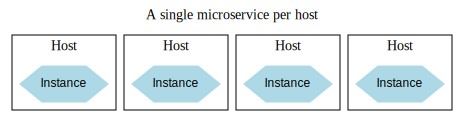

# Software Deployment  
Deploying a monolithic application, which operates as a single process, tends to be a relatively simple and predictable task. However, microservices present a far more complex challenge due to their interdependencies and the diverse array of technologies they incorporate. When I first addressed this topic, there was already an extensive set of tools and strategies to discuss. Since then, the rise of Kubernetes and Function-as-a-Service (FaaS) platforms has introduced new paradigms for delivering software to production environments.  

While the tools and technologies have evolved significantly over the past decade, the fundamental principles of software deployment have remained consistent. In fact, understanding these core principles is more essential than ever as they serve as a compass for navigating the increasingly intricate and fast-changing deployment landscape. This chapter will revisit these foundational principles, emphasizing their relevance to modern deployment challenges while exploring how current tools can either support or complicate their practical application.  

Before we delve into specific tools and strategies, let’s take a step back to examine the transition from an abstract, logical architecture to a tangible, physical deployment structure.

## Transitioning from Logical to Physical  
So far, our discussions around microservices have focused on their logical architecture rather than their physical implementation. For example, we might describe how an Invoice microservice interacts with an Order microservice, without considering the actual infrastructure that supports their deployment. A logical architecture provides a simplified, abstract view that deliberately omits the complexities of physical deployment—a perspective we need to shift in this chapter.

While a logical diagram like this is helpful for understanding high-level communication flows, it can mask significant complexities involved in deploying and operating these services on real infrastructure. To gain a clearer understanding, we need to explore the physical details that underpin this abstraction and uncover the challenges that arise when moving from design to reality.

### Managing Multiple Instances  
When considering the deployment topology of the two microservices, the scenario is rarely as simple as one service communicating directly with another. In most real-world applications, you will likely deploy multiple instances of each microservice. Running multiple instances helps manage higher loads efficiently and enhances system reliability by reducing the impact of a single instance failure. For example, you could have several instances of the **Invoice** service interacting with multiple instances of the **Order** service.  

The method for managing communication between these instances depends largely on the chosen communication mechanism. For scenarios using an HTTP-based API, a load balancer can distribute requests across the available instances.

The exact number of service instances required depends on several factors, such as anticipated load, system redundancy needs, and performance goals. Another critical consideration is where these instances are hosted. For increased fault tolerance, multiple instances should not rely on the same physical infrastructure. Ideally, instances should be distributed across different machines or, for maximum resilience, across multiple data centers. This strategy protects against localized failures, such as a complete data center outage, and results in a deployment topology.

At first glance, distributing instances across multiple data centers might seem excessive. However, the risk of an entire data center becoming unavailable—while low—is significant enough to warrant planning for such scenarios. This becomes especially relevant when working with major cloud providers like AWS, Azure, or Google Cloud. These platforms do not provide SLAs for single virtual machines or even for individual availability zones (which are roughly equivalent to standalone data centers). As a result, to meet reliability goals, any robust deployment strategy must ensure services are spread across multiple availability zones.

### **The Role of the Database**

Taking our discussion further, there’s a critical element we’ve yet to address—the database. As previously mentioned, each microservice is designed to encapsulate and manage its internal state. This design principle gives rise to the widely accepted guideline: **“do not share databases.”** The rationale behind this is to ensure that a microservice remains independent and that its data logic isn’t spread across other services.

But how does this principle hold up when multiple instances of a single microservice are deployed? Does each instance require its own separate database? The short answer is **no**. Typically, all instances of a specific microservice (e.g., Order service) should access the same shared database. This allows any instance to provide consistent information for the same underlying data.

At first glance, this might appear to conflict with the “don’t share databases” rule. However, it doesn’t. The key concern with shared databases is that state management logic can become fragmented across multiple microservices. In this case, the data is only accessed by different instances of the **same** microservice, keeping the logic centralized within a single logical boundary.

### **Database Deployment and Scaling**  

So far, we’ve discussed databases as abstract, logical entities. However, in real-world deployments, databases must account for redundancy, scalability, and performance. In practice, a database often runs on multiple physical machines to manage various operational needs.  

For instance, a common scaling strategy is to divide workloads for reads and writes. This is typically done by using a **primary database** for write operations and **read replicas** to handle read-only traffic. If we applied this to the Order service.

In this setup, all read traffic is directed to read replicas, which can scale further by adding more read nodes. Write operations, on the other hand, remain more challenging to scale horizontally, as relational databases often require complex solutions like **sharding**, which adds significant operational complexity. Nevertheless, offloading reads to replicas frees up resources on the write node, improving overall scalability.

### **Shared vs. Dedicated Database Infrastructure**  

Adding to this complexity, the same database hardware and infrastructure can host multiple logically separate databases. For example, both the **Invoice** and **Order** databases could be deployed on the same physical database infrastructure.  

This approach offers several advantages:
- Optimized hardware utilization across microservices  
- Reduced licensing and maintenance costs  
- Simplified management of shared database infrastructure  

However, it comes with a significant drawback: if the shared infrastructure fails, it could impact multiple microservices simultaneously, potentially causing widespread outages.

Organizations managing on-premises infrastructure often favor this shared model for cost efficiency. Hardware provisioning and maintenance, particularly for databases, is resource-intensive, and databases have historically been less suited to virtualized environments.

### **Cloud-Based Dedicated Databases**  

In contrast, organizations leveraging public cloud providers tend to allocate **dedicated database infrastructure** for each microservice. Cloud platforms like AWS RDS (Relational Database Service) streamline database management by automating backups, upgrades, and failover across availability zones. Other providers like Azure and Google Cloud offer similar services.

This approach lowers operational overhead and provides microservice teams with more control over their databases. Each microservice maintains its own database infrastructure, reducing the risk of shared failures and offering better isolation.

Ultimately, the choice between shared and dedicated database infrastructure depends on factors like cost, operational complexity, and the resiliency requirements of your system. While shared infrastructure may suit on-prem environments, cloud deployments often favor dedicated setups to take full advantage of automation and scalability.

### **Environments**  

When deploying software, it runs within specific **environments**, each serving distinct purposes throughout the development and deployment pipeline. The number and nature of these environments can differ widely depending on your software development practices and deployment strategies. Some environments might use real production data, while others rely on mock services or fake data for testing purposes. Additionally, certain environments may include all microservices, whereas others might only contain a subset.  

In a typical workflow, software progresses through **preproduction environments** before reaching production. Each environment fulfills a particular role, ensuring the software is developed, tested, and validated effectively. For example, the software may start on a developer's local machine, proceed through continuous integration (CI) testing, and eventually land in environments like staging or preproduction before going live. The exact structure of this pipeline depends on the team’s development methodology. An example pipeline for MusicCorp’s Catalog microservice, where the software is tested across multiple environments before being deployed to production.  

  

The journey typically begins on the developer’s local machine, where the code is first written and tested. Once the code is committed, automated CI pipelines trigger fast-running tests, deploying the service to the **CI environment**. Here, both rapid and more comprehensive tests (e.g., unit tests and integration tests) are executed. If successful, the microservice is then deployed to a **preproduction environment** for optional but valuable manual verification. After passing all tests and verifications, the service is finally deployed to production.  

Ideally, every environment would mirror the **production environment** to ensure consistency and confidence that the software will behave as expected. However, maintaining multiple identical environments is often cost-prohibitive. Therefore, earlier environments tend to prioritize **fast feedback**, even if they deviate from production-like setups. For instance, identifying an issue on a developer's machine is far less impactful than discovering it in production, though catching problems during preproduction is still better than encountering them live.  

As the deployment pipeline progresses, environments typically become more **production-like** to minimize the risk of undetected issues. Earlier stages might sacrifice precision for speed, while environments closer to production strive for greater fidelity. This progression using the Catalog service:  

    

- On the **developer's laptop**, the service runs as a single local instance. This setup is fast to build and test but runs on hardware vastly different from production.  
- In the **CI environment**, two service instances are deployed to a single machine to validate load balancing logic while keeping costs and feedback times low.  
- In the **production environment**, the service scales up to four instances distributed across four machines, spanning multiple data centers for redundancy.  

This approach highlights how deployment topologies and configurations evolve between environments. Depending on the complexity of your application, you might also maintain multiple production environments—for instance, separate deployments for each customer or region.

The key takeaway is that while a single logical microservice remains consistent across environments, its **topology**—such as the number of instances and configurations—will change to meet specific requirements. It’s essential to:  
1. Adjust the number of instances and environment-specific settings dynamically.  
2. Build service artifacts only **once** and keep environment-specific configurations separate from the deployable artifact.  

The tools and methods you use to adapt your deployment topology will depend on your chosen deployment mechanism and the extent of variation across environments. If the primary difference is the number of service instances, you could manage this easily by parameterizing instance counts during deployment.  

In summary, a logical microservice can be deployed into multiple environments, with its topology and configurations tailored to each environment's unique needs.

## **Key Principles of Microservice Deployment**

Given the wide range of deployment options available for microservices, it’s crucial to anchor your decisions in a set of fundamental principles. Understanding and applying these principles will help you navigate the complexity of microservice deployment, regardless of the technologies or strategies you choose. Below is an overview of these core principles, which we will explore in greater detail:

1. **Isolated Execution**  
Ensure that each microservice instance runs in isolation, with its own dedicated computing resources. This prevents one instance from negatively impacting the performance or execution of other microservice instances running in the same environment.

2. **Emphasis on Automation**  
As the number of microservices grows, automation becomes essential for managing deployments efficiently. Prioritize tools and technologies that enable automation and foster a culture where automation is integrated into development, testing, and deployment processes.

3. **Infrastructure as Code (IaC)**  
Define and represent your infrastructure configurations as code. This approach simplifies automation, enhances transparency, and ensures environments can be reliably recreated. Store this configuration code in version control to facilitate collaboration and maintain consistency.

4. **Zero-Downtime Deployment**  
Strive for deployments that do not disrupt the availability of your services. New versions of microservices should be deployed seamlessly without causing downtime for end users or dependent services (whether they are other microservices or human users).

5. **Desired State Management**  
Leverage platforms that can manage and maintain the desired state of your microservice. These platforms should be capable of automatically launching new instances when needed, whether due to outages, traffic surges, or resource failures, ensuring the system remains resilient and scalable.

By adhering to these principles, you can build a deployment process that is reliable, scalable, and well-suited to handle the unique challenges of microservice architectures.

### **Isolated Execution**

When starting out with microservices, there may be a temptation to deploy multiple microservice instances on a single machine—whether it’s a physical server or a virtual machine (VM). This approach seems simpler, particularly from a host management perspective. For infrastructure teams tasked with managing hosts, consolidating services onto fewer machines can appear efficient since fewer hosts mean less administrative overhead.

However, this model introduces significant challenges:  

1. **Resource Contention and Monitoring Complexity**  
   - Monitoring becomes harder. Should CPU usage be tracked for each individual service or as a total for the host?  
   - When one microservice experiences heavy load, it can starve other services on the same host of critical resources. This issue was observed by Gilt, an online retailer that initially co-located multiple microservices on a single server. Uneven load on one service negatively affected all others sharing the host, complicating failure impact analysis and overall stability.  

2. **Dependency Conflicts**  
   - Co-deploying services on the same host can lead to dependency clashes. If microservices require different versions of the same software or library, managing those dependencies on a shared host can quickly become unmanageable.  

3. **Loss of Autonomy**  
   - Teams lose their independence when sharing hosts. A centralized team often becomes responsible for managing host configurations, requiring more coordination between teams and delaying deployments.  

4. **Independent Deployability is Undermined**  
   - A core principle of microservices is independent deployability. Packing multiple microservice instances onto a single machine risks breaking this principle, as deployments for one service could unintentionally impact others.  

For these reasons, microservices should ideally operate within **isolated execution environments**.

 

With isolated environments, each microservice instance:  
- Has its own dedicated execution space.  
- Manages its own dependencies without interference.  
- Is allocated dedicated, ring-fenced resources.  

Historically, resource scarcity made this approach impractical. Acquiring new physical machines for service isolation was expensive and time-consuming, often requiring months or years of planning and financial commitment. Today, on-demand computing platforms and advancements in virtualization have made isolated environments far more accessible. Infrastructure can now be provisioned almost instantly, significantly reducing costs and effort.  

Containerization has further revolutionized this space. The isolation spectrum ranges from dedicated physical servers, offering the highest level of isolation at the greatest cost, to containers, which are cost-effective and provisioned rapidly.  

 

Platforms like **AWS Lambda** or **Heroku** automatically provide isolation, often running microservices within containers or dedicated VMs under the hood. Modern container technology has improved isolation to such an extent that containers are now the preferred choice for most microservice workloads. While containers may not offer the same level of isolation as VMs, they are “good enough” for the vast majority of use cases. Their speed, flexibility, and cost-efficiency make them a natural default option for deploying microservices in today’s environments.  

### **Emphasis on Automation**

As the number of microservices grows, so does the operational complexity—more services mean more components to configure, monitor, and maintain. Managing this complexity manually quickly becomes unsustainable, requiring more time, effort, and personnel as your system scales. Microservices shift much of the burden into operations, making automation a necessity rather than a convenience.

To address this, it’s essential to prioritize **automation** at every level. Adopt tools and technologies that allow processes to be automated—particularly in areas like infrastructure provisioning, deployment pipelines, and configuration management. Incorporating **infrastructure as code (IaC)**, which we will discuss further, helps streamline this automation.

As microservices multiply, automation becomes the key to maintaining developer productivity. Enabling developers to **self-provision services or environments** ensures they can operate independently without relying on lengthy manual processes. Automation simplifies deployments, reduces human errors, and empowers teams to focus on delivering value rather than dealing with operational roadblocks.

### **Choosing Tools for Automation**  
Start by evaluating the tools you use to manage your infrastructure and services. Ask questions like:  
- Can you programmatically create or terminate virtual machines?  
- Is it possible to automate software deployments?  
- Can database updates be applied seamlessly without manual intervention?  

Adopting tools and workflows that support automation will allow you to tame the operational complexity inherent in microservices architectures.

### **Real-World Examples of Automation in Action**  

To illustrate the impact of automation, let’s examine two case studies from companies that successfully leveraged automation to scale their microservices architecture:  

1. **REA Group (realestate.com.au)**  
   REA, an Australian property listing company, began its transition to a microservices architecture with a strong focus on automation. Early on, they invested heavily in tooling that allowed developers to provision resources, deploy code, and monitor their services efficiently. This upfront effort laid a strong foundation:  
   - In the first three months, REA deployed **just two microservices** into production.  
   - In the next three months, they scaled to **10–15 new services**.  
   - By the end of 18 months, REA had over **70 microservices** live in production, with developers owning the entire build, deployment, and support processes.  

2. **Gilt**  
   Gilt, an online retailer, provides another compelling example of automation’s power. Automation, particularly in developer tooling and deployment processes, was critical to Gilt’s microservices growth:  
   - Within one year of adopting microservices, Gilt had around **10 services** in production.  
   - By 2012, this number had grown to **over 100 microservices**.  
   - By 2014, Gilt operated more than **450 microservices**—roughly **three microservices per developer**.  

Organizations like Gilt and the Financial Times demonstrate how automation enables rapid scaling of microservices, often achieving ratios where a single developer manages multiple services—a hallmark of microservice maturity.

### **Why Automation Matters**  
A culture of automation ensures that operational challenges don’t derail the benefits of microservices. It reduces overhead, accelerates delivery, and allows teams to focus on innovation. Without automation, scaling microservices becomes a bottleneck; with it, you can effectively manage hundreds or even thousands of services.

### **Infrastructure as Code (IaC)**  

Building on the foundation of automation, **Infrastructure as Code (IaC)** is a practice where infrastructure configurations are defined and managed through machine-readable code. Instead of manually setting up infrastructure, you define your environment using tools like configuration files, scripts, or specialized frameworks. Whether it’s a Chef, Puppet, or Terraform script, the key idea is that your system can be consistently brought to a desired state using version-controlled code. While IaC can be considered a subset of automation, it stands out as a specific and powerful approach that introduces software development principles into infrastructure management.

By codifying infrastructure, the configuration can be:  
- **Version Controlled**: Changes can be tracked, reviewed, and audited.  
- **Tested**: Infrastructure scripts can be validated before deployment.  
- **Reproducible**: Entire environments can be recreated reliably at any point in time.  

For further insights, *Infrastructure as Code, 2nd Edition* by Kief Morris is an excellent resource that delves deeper into this practice.  

### **Tools for Infrastructure as Code**  

While theoretically, any programming language could be used for IaC, a range of specialized tools has emerged to simplify the process:  
- **Declarative Tools**: Platforms like **Puppet**, **Chef**, **Ansible**, and the earlier **CFEngine** allow you to describe your infrastructure’s desired state. These tools ensure your infrastructure is configured to match that state when their scripts are applied.  
- **Cloud Resource Management**: Tools like **Terraform** have expanded beyond single-machine configurations to manage entire cloud environments, enabling multi-resource orchestration.  
- **Programming Language Flexibility**: Newer tools like **Pulumi** allow infrastructure definitions to be written in general-purpose programming languages like Python, Go, or JavaScript, making IaC more accessible to developers.  
- **Platform-Specific Solutions**: Tools such as **AWS CloudFormation** and the **AWS Cloud Development Kit (CDK)** are tailored specifically for AWS environments. However, cross-platform tools like Terraform are often preferred for their flexibility, even when working within a single cloud provider.  

### **Benefits of IaC**  

1. **Improved Auditability**:  
   Version-controlled infrastructure code provides a transparent record of changes, helping organizations track who modified configurations and when—an invaluable feature for audits.  

2. **Reproducibility and Consistency**:  
   IaC allows you to recreate environments with precision. For instance, restoring an environment from the past becomes much simpler when the configuration is stored in version control.  

3. **Defect Analysis and Debugging**:  
   When troubleshooting defects or unexpected behavior, having access to historical configurations makes it easier to pinpoint issues.  

### **Real-World Importance of IaC**  

One striking example highlights the value of IaC in practice. A client of mine was once required to reproduce a complete production environment as part of a legal dispute. This included exact operating system patch levels and the state of message brokers at a specific date years prior. Without version-controlled infrastructure code, the team spent over three months manually piecing together configurations, relying on scattered emails and release notes. Had their infrastructure been defined and versioned as code, the process would have been far simpler and faster.  

### **Conclusion**  

Infrastructure as Code transforms infrastructure management into a systematic, automated process. It enables teams to treat infrastructure the same way they treat application code—by versioning, testing, and reproducing it consistently. With tools like Terraform, Pulumi, and Ansible, and principles borrowed from software development, IaC has become a cornerstone of modern infrastructure management, ensuring reliability, transparency, and scalability.

### **Zero-Downtime Deployment**

Independent deployability is a cornerstone of microservice architecture, but achieving true independence requires more than avoiding tight implementation coupling or ensuring isolated execution environments. One significant step forward is enabling **zero-downtime deployment**—the ability to release new versions of a microservice without causing any interruptions to users or other systems.

Without zero-downtime deployment, service updates may require notifying upstream consumers of planned outages. This coordination increases complexity and slows down release cycles. By contrast, systems that support seamless deployments allow teams to release updates without disrupting user experience, making deployments smoother and faster.

### **The Benefits of Zero-Downtime Deployment**  

Sarah Wells from the Financial Times highlighted zero-downtime deployment as a **game-changing factor** in accelerating delivery speed. The ability to release updates without interruptions enabled the Financial Times to significantly increase the frequency of deployments.  

Additionally, deploying during regular working hours becomes far more feasible. This shift brings several advantages:  
- **Improved Team Well-Being**: Teams no longer need to work late evenings or weekends, reducing stress and burnout.  
- **Reduced Errors**: Deploying during the day means teams are well-rested and have access to on-hand support for troubleshooting, leading to fewer mistakes.  

Ultimately, the goal is for upstream consumers to remain unaware of any deployment activity—updates happen invisibly, with no noticeable service disruption.

### **Approaches to Achieving Zero-Downtime**  

The ease of implementing zero-downtime deployments depends heavily on the nature of your microservice:  
1. **Asynchronous Communication**:  
   - If your microservice relies on middleware-backed asynchronous messaging, enabling zero-downtime deployment is relatively straightforward. Messages sent during the update can be queued and delivered once the service is back online.  

2. **Synchronous Communication**:  
   - For services relying on synchronous communication (e.g., HTTP APIs), achieving zero-downtime can be more challenging. This is where deployment strategies like **rolling updates** and **blue-green deployments** come into play.

### **Rolling Upgrades**  

With a **rolling upgrade**, your microservice remains partially active during the deployment process. Instead of taking the entire service offline, new instances of the updated version are gradually brought online while older instances are phased out. Platforms like **Kubernetes** simplify rolling upgrades, orchestrating the transition seamlessly.

However, it’s important to evaluate your needs before adopting complex platforms like Kubernetes solely for zero-downtime deployments. If your primary concern is avoiding service outages, a simpler strategy like **blue-green deployment** may suffice.  

### **Blue-Green Deployment**  

In a blue-green deployment:  
- A new version of your service (blue) is deployed alongside the existing version (green).  
- Traffic is gradually rerouted to the new version after successful validation, ensuring that users experience no interruptions.  
This approach offers a straightforward way to achieve seamless releases without the overhead of managing complex orchestration tools.

### **Challenges and Considerations**  

Zero-downtime deployment is easier to implement when services are designed with it in mind. Retrofitting this capability into an existing system can be more complex, particularly when dealing with challenges like **long-lived connections**. Therefore, it’s best to incorporate zero-downtime strategies early in your microservice architecture.

### **Conclusion**  

Enabling zero-downtime deployment increases the independence of your services, reduces release friction, and improves developer workflows. Whether through rolling upgrades, blue-green deployments, or other strategies, achieving seamless deployments will enhance system reliability and allow teams to release updates frequently without disruption.

### **Desired State Management**  

**Desired State Management** refers to the ability to define and maintain the ideal state of your infrastructure and applications automatically. Instead of manually monitoring and fixing changes, you specify your system’s requirements (e.g., the number of instances, resource allocation, or placement rules), and the platform ensures the system aligns with those definitions. If the current state drifts from the desired configuration—due to an instance failure or resource loss—the platform automatically takes action to restore the specified state.

### **How Desired State Management Works**  

For example, you might define that a microservice requires four instances with specific CPU and memory configurations. The platform managing your system analyzes available resources and provisions those instances accordingly. If an instance becomes unavailable, the platform detects this discrepancy and spins up a replacement instance automatically to maintain the desired state.  

This automated approach relieves development and operations teams from manually addressing infrastructure issues, allowing them to focus on defining the desired system state rather than worrying about its enforcement. Whether it’s a hardware failure, instance termination, or data center outage, the platform handles recovery seamlessly.

### **Tools and Platforms for Desired State Management**  

While you could build custom tools to achieve desired state management, leveraging existing platforms saves significant time and effort. Popular platforms include:  
- **Kubernetes**: Widely used for managing containerized workloads, Kubernetes automatically maintains the desired number of instances and redistributes workloads as needed.  
- **Cloud Auto-Scaling Groups**: Platforms like AWS Auto Scaling Groups and Azure Virtual Machine Scale Sets enable similar behavior by maintaining instance counts and scaling resources based on demand.  
- **Nomad**: A flexible alternative to Kubernetes that supports not just containerized workloads but also applications like Java, virtual machines, and batch processing tasks.

These platforms abstract the low-level details of resource allocation, allowing you to define high-level requirements like, “Run four instances across two data centers,” and letting the system handle implementation.

### **Challenges and Real-World Scenarios**  

While desired state management simplifies operations, it can occasionally lead to unintended behavior if not carefully configured. For example, I recall an incident where I attempted to shut down a development cluster on AWS to save costs. Unbeknownst to me, an **Auto Scaling Group** had been configured to ensure a minimum number of instances remained active. Each time I terminated an instance, AWS automatically launched a replacement. After several frustrating minutes of playing “whack-a-mole,” I realized the root cause and resolved it by properly disabling the auto-scaling rule.

This highlights two key considerations:  
1. **Automated Deployment Pipelines**: To use desired state management effectively, your microservice deployments must be fully automated. Without this, the platform cannot launch replacement instances seamlessly.  
2. **Provisioning Speed**: Instances must start quickly to minimize downtime. If launching replacements takes too long, you may need to maintain extra capacity to handle sudden failures.  

### **GitOps: Combining IaC and Desired State Management**  

A relatively new approach, **GitOps**, pioneered by Weaveworks, merges the principles of **desired state management** and **infrastructure as code** (IaC). In a GitOps workflow:  
1. The desired state of your infrastructure and applications is defined as code and versioned in a Git repository.  
2. Any changes to the desired state trigger automated tooling that updates the running system to match the new configuration.

Originally designed for Kubernetes, GitOps tools like **Flux** and **Argo CD** simplify how developers manage applications and infrastructure. They leverage Kubernetes’ ability to reconcile desired and actual states, ensuring the running system always reflects the configuration stored in version control.

### **Final Thoughts**  

Desired state management offers a powerful way to automate infrastructure and application reliability. By defining system requirements declaratively, platforms like Kubernetes and cloud auto-scaling tools maintain consistency without manual intervention. Tools like Flux further enhance this capability by integrating desired state management into modern Git-based workflows. While the concept requires fully automated deployments and careful configuration, its ability to reduce operational overhead and improve system resilience makes it an essential practice for scaling microservices.

## Deployment Options

When it comes to deploying microservices, there are numerous approaches and tools available. However, the choice of deployment strategy should align with key principles such as **isolation**, **zero-downtime deployment**, **automation**, **infrastructure as code**, and **desired state management**. The tools and platforms you select should empower these principles to ensure smooth operations and scalability.  

Here’s a quick overview of the main deployment options and how they relate to these principles:

### **1. Physical Machine**  
In this approach, a microservice instance is deployed directly onto a **physical server** without any form of virtualization.  
- **Pros**:  
   - Offers strong isolation (dedicated hardware).  
   - Eliminates virtualization overhead.  
- **Cons**:  
   - Poor resource utilization—underused hardware can lead to waste.  
   - Lack of flexibility in scaling and automation.  

### **2. Virtual Machine (VM)**  
Here, microservice instances are deployed on **virtual machines** running on shared physical infrastructure.  
- **Pros**:  
   - Strong isolation between VMs.  
   - Improved resource utilization compared to physical machines.  
   - Well-supported automation and scaling tools (e.g., AWS EC2, Azure VMs).  
- **Cons**:  
   - Virtualization adds overhead.  
   - VM startup times can be relatively slow compared to containers.  

### **3. Containers**  
Microservice instances are packaged and run as **containers** on virtual or physical machines. Tools like **Docker** manage the container lifecycle, while orchestration platforms like **Kubernetes** handle deployment and scaling.  
- **Pros**:  
   - Lightweight and fast to start.  
   - Supports strong isolation and resource control.  
   - Excellent for automation and orchestration at scale.  
   - Works seamlessly with infrastructure as code and desired state management tools.  
- **Cons**:  
   - Containers share the host OS kernel, which may reduce isolation compared to VMs.  

### **4. Application Containers**  
In this model, microservices are run inside **application containers** (e.g., Java application servers), which manage multiple application instances sharing the same runtime.  
- **Pros**:  
   - Simpler for applications requiring shared runtimes.  
   - Useful for managing legacy systems.  
- **Cons**:  
   - Limited isolation between microservices.  
   - Scaling and automation are less flexible compared to containers or VMs.  

### **5. Platform as a Service (PaaS)**  
PaaS platforms abstract the underlying infrastructure, allowing you to deploy microservices without worrying about servers. Examples include **Heroku**, **Google App Engine**, and **AWS Elastic Beanstalk**.  
- **Pros**:  
   - Abstracts infrastructure management.  
   - Provides built-in automation for deployment, scaling, and monitoring.  
   - Simplifies desired state management.  
- **Cons**:  
   - Limited control over infrastructure.  
   - Vendor lock-in may occur.  

### **6. Function as a Service (FaaS)**  
FaaS platforms, such as **AWS Lambda** and **Azure Functions**, execute microservices as **functions** in response to events. FaaS abstracts infrastructure management even further than PaaS, focusing on individual function execution.  
- **Pros**:  
   - Highly scalable and cost-effective for event-driven workloads.  
   - No infrastructure management required.  
   - Simplifies zero-downtime deployment and automation.  
- **Cons**:  
   - Stateless execution can limit use cases.  
   - Functions may introduce latency for cold starts.  
   - Mapping microservices to function artifacts can require rethinking application design.  

### **Summary**  

Each deployment option provides a unique set of trade-offs between isolation, flexibility, and automation:  
- **Physical Machines** offer strong isolation but limited scalability.  
- **Virtual Machines** balance isolation with resource utilization and automation.  
- **Containers** provide lightweight, scalable deployment with excellent automation support.  
- **Application Containers** simplify deployment for shared runtimes but limit isolation.  
- **PaaS** abstracts infrastructure for ease of use but sacrifices control.  
- **FaaS** takes abstraction further, ideal for event-driven microservices but with design constraints.  

Choosing the right deployment strategy depends on your team’s needs, infrastructure requirements, and application workload. Tools like Kubernetes and serverless platforms have made automation and scaling easier than ever, empowering organizations to align deployment methods with modern microservice principles.

### Physical Machines

Deploying microservices directly onto **physical machines**—without any virtualization or containerization layers—is now a rare practice. In this approach, microservices run directly on the underlying hardware, which was once a common method but has since fallen out of favor due to several limitations.

### **Key Challenges of Physical Machines**  

1. **Resource Underutilization**  
   Running a single microservice instance on a physical machine can result in **wasted resources**. For example, if the microservice only uses half of the machine’s CPU, memory, or I/O capacity, the remaining resources sit idle. This inefficiency has driven the adoption of virtualization, where multiple virtual machines can share a single physical server, significantly improving resource utilization and cost efficiency.

2. **Lack of Isolation**  
   Without virtualization, the temptation to deploy multiple microservices on the same physical machine increases. While this might seem efficient, it violates the principle of **isolated execution environments**, where each microservice should operate independently to avoid resource contention or interference.

3. **Difficulty in Advanced Management**  
   Tools like **Puppet** or **Chef** can help manage configurations and implement infrastructure as code on physical hardware. However, achieving advanced capabilities like **desired state management** or **zero-downtime deployments** often requires an additional abstraction layer. These features are much easier to implement with virtualization or container-based solutions, which provide built-in management tools and automation support.

### **Why Physical Machines Are Rarely Used**  

The inflexibility of physical deployments makes them an uncommon choice in modern architectures. Virtualization and containerization provide:  
- **Higher Resource Utilization**: By running multiple virtualized instances or containers on the same hardware.  
- **Better Scalability**: Scaling services up or down is easier with VMs or containers.  
- **Improved Automation**: Virtualization and orchestration tools simplify deployments, monitoring, and management.  

### **When to Consider Physical Machines**  

Direct deployment to physical machines might still be justified in specific cases, such as:  
- **Performance-Critical Applications**: Workloads requiring maximum resource performance without virtualization overhead.  
- **Strict Compliance Requirements**: Environments with regulatory constraints prohibiting virtualization.  
- **Legacy Systems**: Infrastructure where virtualization is unavailable or impractical.

### **Conclusion**  

Deploying microservices directly onto physical machines is now an outlier approach, typically reserved for niche scenarios with specific performance or compliance needs. For most modern use cases, **virtualization** and **containerization** provide far greater flexibility, efficiency, and management capabilities, making them the preferred choices for running microservices.

### Virtual Machines

Virtual machines (VMs) have revolutionized the way data centers operate by enabling the segmentation of physical servers into smaller, isolated units. Traditional virtualization technologies, such as **VMware**, **vSphere**, **Xen**, and cloud services like **AWS EC2**, have made it possible to enhance resource utilization while simplifying host management.  

### **How Virtual Machines Work**  
Virtualization allows a single **physical machine** to be divided into multiple virtual machines, each acting as a standalone server. Resources like **CPU, memory, I/O, and storage** are allocated to each VM, providing isolated environments for running microservice instances.  
- Each VM runs its **own operating system**, giving microservices the flexibility to customize their environment as needed.  
- A **hypervisor** is responsible for managing these virtual machines. It maps resources between the virtual machines and the underlying physical hardware while maintaining isolation between them.

This model ensures that microservice instances remain **hermetically sealed** from each other and the host, improving isolation.

### **Challenges of Virtual Machines**  
While virtualization offers significant benefits, it does come with certain trade-offs:  

1. **Resource Overhead**  
   Hypervisors introduce additional overhead. Just like adding dividers to a drawer reduces the space available for socks, hypervisors consume CPU, memory, and I/O resources to perform their management functions.  
   - The more VMs you run on a single machine, the more overhead accumulates.  
   - This creates diminishing returns as the infrastructure is further subdivided.

2. **Scalability Constraints**  
   Although VMs improve resource utilization, excessive segmentation can lead to performance bottlenecks due to the hypervisor overhead.

3. **Automation Gaps**  
   Managed VMs offered by **AWS**, **Azure**, or **Google Cloud** support automation through APIs and tools, enabling features like **auto-scaling groups** and **desired state management**.  
   - However, traditional virtualization platforms (e.g., VMware) are often managed by centralized operations teams, making automation more difficult and less accessible to developers.

### **Benefits of Virtual Machines for Microservices**  
Despite these challenges, virtual machines remain a strong option for running microservices due to their:  

1. **Robust Isolation**  
   Each microservice instance runs in its own virtualized environment, ensuring strong isolation.  

2. **Flexibility and Compatibility**  
   VMs can host virtually any application, making them a reliable choice when containerizing an application is not feasible.  

3. **Mature Ecosystem**  
   Cloud platforms like AWS, Azure, and Google Cloud provide extensive tools and APIs for managing virtual machines, including automation, scaling, and monitoring capabilities.

4. **Real-World Success**  
   Companies like **Netflix**, a pioneer of microservices, have successfully deployed large-scale microservice systems using managed virtual machines on AWS EC2.  

### **When to Use Virtual Machines**  
While containers are often the preferred choice for modern microservice workloads, VMs can still be an excellent option when:  
- **Strict Isolation**: You need higher levels of isolation compared to containers.  
- **Legacy Applications**: Your applications cannot yet be containerized.  
- **Operational Familiarity**: Your team already has expertise with VM management tools.  

### **Conclusion**  
Virtual machines provide a balance between strong isolation and flexible resource utilization, making them a viable option for running microservices. While they come with overhead and may lack the agility of containers, managed VMs on cloud platforms provide automation and scalability capabilities to address these limitations. For workloads requiring stricter isolation or where container adoption is impractical, virtual machines remain a dependable choice for microservice deployment.

### Containers

Over the years, containers have risen to prominence as a cornerstone for deploying server-side applications, particularly for microservices. Originally popularized by Docker, containers—especially when paired with orchestration tools like Kubernetes—have become the default choice for scaling microservice deployments efficiently.  

### **What Are Containers?**  
Containers are lightweight, portable units that package an application along with its dependencies into a self-sufficient environment. Unlike traditional virtual machines (VMs), containers share the host machine's operating system kernel, making them more efficient and faster to start. Historically, containers were a Unix/Linux concept (like Solaris Zones and LXC), but their adoption has expanded to Windows systems in recent years.  

At a conceptual level, a container acts as an abstraction layer for a process subtree within the operating system. While multiple containers can run on the same machine, they remain isolated in terms of resources like CPU and memory. The Linux kernel manages this isolation while ensuring efficient allocation of resources.  

### **Containers vs. Virtual Machines**  
Unlike VMs, containers do not require a dedicated hypervisor or full operating system per instance. Instead:  
- Containers utilize a shared kernel, reducing overhead and startup time.  
- A single machine can run far more containers than VMs, enhancing hardware utilization.  
- Provisioning a container takes seconds, whereas VMs often require minutes to boot.  

For instance, a single host could run Ubuntu as its operating system and execute CentOS-based containers seamlessly, provided they rely on the shared kernel. This lightweight design enables deploying one service per container, ensuring efficient resource utilization and service isolation.  

### **Why Containers Excel for Microservices**  
Containers align perfectly with microservice principles due to their ability to:  
1. **Isolate Execution**: Each container runs independently, reducing cross-service interference.  
2. **Portability**: Containers package applications and dependencies into self-contained units, simplifying deployment across different environments.  
3. **Scalability**: Containers are resource-efficient, enabling organizations to run many microservices on limited hardware.  
4. **Speed**: Rapid startup times improve development workflows and operational responsiveness.  

For development and testing, tools like **Docker Desktop** allow developers to run containerized services locally. This mirrors production environments and simplifies troubleshooting.  

### **Container Management Challenges**  
While containers solve many deployment challenges, they introduce new concerns:  
1. **Networking**: Routing external traffic to specific containers requires additional effort, which older tools like LXC didn’t address adequately. Docker significantly improved this area.  
2. **Isolation Limitations**: Containers offer process-level isolation, which is less secure than VMs. Historically, vulnerabilities allowed processes to "break out" of a container, though modern improvements have mitigated this risk.  
3. **Resource Management**: Fine-tuning CPU, memory, and I/O allocations across multiple containers can be complex.  

### **Windows Containers**  
Containers initially thrived in Linux environments, but Windows Server 2016 introduced native container support. However, Windows containers faced challenges due to the large size of the operating system:  
- **Nano Server**: A lightweight version of Windows designed for smaller workloads.  
- **Server Core**: A larger OS optimized for legacy applications.  

Both options are functional but remain larger compared to minimal Linux distributions like **Alpine**, which is just a few megabytes. Windows containers also offer flexible isolation levels:  
- **Process Isolation**: Similar to Linux containers, sharing the kernel.  
- **Hyper-V Isolation**: Provides stronger separation by running containers in lightweight VMs. This is ideal for workloads requiring heightened security but comes with additional runtime overhead.  

### **Modern Trends**  
A growing focus on combining the lightweight benefits of containers with the robust isolation of VMs has led to innovations like:  
- **Firecracker**: A micro-VM used by AWS Lambda to isolate workloads efficiently.  
- **Hyper-V Containers**: Balancing performance with virtualization-level security.  

### **The Docker Ecosystem**  
Docker was instrumental in popularizing containers by simplifying container management through tools like:  
1. **Docker Engine**: Manages container provisioning and networking.  
2. **Docker Registry**: A centralized location for storing and retrieving container images.  
3. **Docker Images**: Self-contained artifacts that bundle applications with dependencies for seamless deployment.  

With Docker, developers can build, test, and run identical container images locally and in production, reducing inconsistencies across environments.  

However, Docker alone handles containers on a single machine. Managing containers across multiple hosts requires orchestration tools like **Kubernetes**—an area where Docker’s own tools (Docker Swarm) fell short.  

### **Conclusion**  
Containers are a natural fit for microservices, offering efficient resource utilization, rapid deployment, and portable environments. Tools like Docker simplify container management, while orchestration platforms like Kubernetes help scale and maintain systems reliably. For organizations embracing microservices, containers strike an excellent balance between isolation, flexibility, and cost-effectiveness.

### Application Containers

If you’ve ever deployed .NET applications using IIS or Java applications on platforms like Weblogic or Tomcat, you’re already familiar with the concept of *application containers*. In this model, multiple services or applications reside within a single application container, which operates on a shared host. The core idea is that application containers offer benefits like centralized management, clustering capabilities for managing grouped instances, and built-in monitoring tools.

#### **Resource Efficiency and Benefits**  
This approach can reduce runtime overhead. For example, if five Java microservices are deployed in a single Java servlet container, they all share one JVM instance. This is more efficient compared to running five separate JVMs, each encapsulated in its own container on the same machine. However, despite these advantages, application containers come with significant trade-offs, and it’s worth evaluating whether they’re truly necessary for your deployment strategy.

#### **Key Limitations and Trade-Offs**  
One major drawback of application containers is their restrictive nature—they force you to commit to a specific technology stack. This can limit the flexibility of both service implementation and automation tooling. Automation, which is crucial for managing complex microservice systems, may become unnecessarily constrained as a result.

Moreover, many touted features of application containers, such as clustering support for shared in-memory session state, are often redundant or counterproductive in a microservices architecture. Shared session state complicates scalability and is something to avoid wherever possible. Similarly, the built-in monitoring tools provided by application containers often fall short in a microservices environment, where unified, end-to-end monitoring across distributed services is essential.

Another significant downside is their typically slow startup times, which can negatively impact development workflows and reduce the speed of feedback loops. Managing application lifecycles in environments like the JVM can also become unnecessarily complex when multiple applications share the same process space. Additionally, analyzing resources, such as memory usage or thread behavior, becomes more challenging when multiple applications coexist within the same container.

#### **A Legacy Model for Resource Scarcity**  
Historically, this deployment model was designed to optimize limited computing resources. However, the modern landscape of scalable infrastructure and efficient virtualization technologies makes these constraints less relevant. Today, we can achieve better resource isolation and manageability by running each microservice as an independent, self-contained process. 

While application containers might still be a fit for specific use cases, the lack of true isolation is a fundamental limitation that makes this approach less suitable for microservice architectures. As a result, this model has become increasingly outdated for teams embracing modern microservices principles. For most scenarios, treating each microservice as an independent, deployable unit with its own isolated process is a far more practical and flexible solution.

### Platform as a Service (PaaS)

Platform as a Service (PaaS) provides a higher level of abstraction compared to managing individual servers or containers. PaaS solutions are designed to automate much of the underlying infrastructure management, enabling developers to focus primarily on the application itself. These platforms often accept technology-specific artifacts, such as Java WAR files or Python packages, and automatically handle their deployment, execution, and scaling. Depending on the service, scaling might be fully automated based on demand or configurable to allow manual control over resource allocation.  

Heroku, one of the pioneering PaaS platforms, remains a well-regarded example in this space due to its simplicity and developer-friendly approach. Platforms like Heroku not only run application instances but also offer integrated services, such as managing databases or other dependencies, which eliminates much of the operational burden for developers. However, this ease of use comes with trade-offs. When a PaaS solution works as intended, it can be incredibly effective. But when it fails to align with the specific needs of your application, customization and troubleshooting options are often limited, as the platform abstracts away much of the system's inner workings.  

Many PaaS solutions incorporate intelligent features like autoscaling, but these can sometimes cause problems. Automated scaling algorithms tend to use generalized heuristics, which may not suit every application. For non-standard or highly customized workloads, this can lead to inefficiencies or unexpected behavior. Therefore, applications that deviate significantly from "typical" patterns may face challenges when hosted on these platforms.  

PaaS solutions are particularly valuable in microservice architectures, where managing many services and their dependencies can become overwhelming. By abstracting the complexities of deployment, monitoring, and scaling, PaaS offerings help reduce operational overhead and improve developer productivity. However, the lack of robust self-hosted options continues to be a limitation, as most PaaS solutions remain cloud-hosted and proprietary.  

In recent years, the evolution of serverless computing and managed cloud services has partially replaced some PaaS use cases. Rather than offering a single black-box platform to host applications, cloud providers now deliver modular, managed services like databases, messaging systems, and storage. These components can be combined to create flexible, customized solutions. Within this landscape, **Function as a Service (FaaS)**—a specific form of serverless computing—has emerged as a popular alternative for certain workloads.  

Ultimately, the suitability of a PaaS solution for microservices depends on the specific use case and the nature of the application. For instance, platforms like Heroku differ significantly from others like Netlify, but both can serve as effective deployment solutions depending on the requirements of the system.

### Function as a Service (FaaS)

In recent years, **Function as a Service (FaaS)** has emerged as a significant component of the broader **serverless** paradigm. Serverless, as the name suggests, removes the need for developers to manage or think about underlying servers, while providers take care of infrastructure, scaling, and operational overhead. Although servers are still in use, the responsibility of managing them is abstracted away from developers.  

FaaS specifically focuses on deploying code in the form of individual **functions**. These functions remain dormant until triggered by an event, such as a new file upload, an incoming HTTP request, or a message arriving in a queue. Once triggered, the platform runs the function and shuts it down when execution completes. The FaaS platform also manages concurrency, launching multiple instances when needed to handle demand.  

### **Key Advantages**  
FaaS brings several advantages:  
1. **Cost Efficiency**: Since you only pay for the execution time of your functions, costs can be minimized, especially for workloads with irregular or low demand.  
2. **Scalability**: The underlying platform automatically handles scaling, spinning up or shutting down instances as needed. This ensures robustness and availability without manual intervention.  
3. **Reduced Operational Overhead**: Developers can focus on writing code without managing infrastructure, servers, or scaling configurations.  

For example, **AWS Lambda**, introduced in 2014, pioneered the adoption of FaaS. Other major platforms like **Azure Functions** and **Google Cloud Functions** have followed suit, enabling event-driven execution across various runtimes and use cases.  

### **Challenges and Limitations**  
Despite its benefits, FaaS comes with certain constraints:  
- **Runtime Limitations**: Execution times are capped. For instance, AWS Lambda has a 15-minute cap, while Google Cloud Functions stop after 9 minutes.  
- **Limited Resource Control**: You cannot fine-tune CPU or I/O resources directly—platforms typically allow control over memory allocation only, with CPU scaling proportionally.  
- **Language Support**: FaaS platforms support a limited set of programming languages by default. While AWS now allows custom runtimes, this adds operational complexity.  
- **Stateless Execution**: FaaS environments are stateless, meaning functions cannot retain information from prior invocations unless external storage solutions like databases or object stores are used.  

### **Cold Starts and Scalability Issues**  
One frequently cited challenge with FaaS is the **cold start** delay, where functions experience a longer startup time when invoked after a period of inactivity. This is especially true for runtimes like Java or .NET. However, most providers mitigate this issue by keeping runtimes "warm" for recurring workloads, and languages with lightweight runtimes (like Python, Node.js, or Go) generally perform better in this regard.  

Dynamic scaling can also pose problems. For instance, if functions scale up rapidly, they may overwhelm other infrastructure components that lack similar elasticity, such as databases or message brokers. This mismatch can cause performance bottlenecks or outages.  

### **Mapping FaaS to Microservices**  
FaaS deployment aligns well with microservices, but the mapping between the two can vary:  
1. **One Function per Microservice**: A microservice instance can be deployed as a single function, maintaining its role as a unit of deployment. Developers route incoming requests to the appropriate functionality within the function.

2. **Function per Aggregate**: In domain-driven design, a microservice’s aggregates can be split into separate functions. Each function handles the logic for one aggregate while still maintaining a unified external interface for consumers. Initially, these functions might share the same database, but over time, they can evolve to use separate data stores to improve independence.  

 
 
 

### **Future Trends and Emerging Alternatives**  
While FaaS platforms have advanced significantly, there are still improvements to be made, particularly around resource management and cold start performance. Emerging technologies like **WebAssembly (Wasm)** are gaining traction for their lightweight and secure execution model. WASI (WebAssembly System Interface) extends Wasm’s capabilities to server-side environments, potentially challenging containers as the default deployment model in the future.  

### **Practical Adoption**  
FaaS is not a one-size-fits-all solution but can work effectively as part of a hybrid architecture. For instance, the **BBC** successfully integrates AWS Lambda alongside EC2 instances in its technology stack. Lambda functions handle event-driven tasks, while EC2 instances are used for workloads where continuous operation or cost efficiency is critical.  

Ultimately, FaaS is an excellent choice for event-driven, stateless workloads with dynamic scaling requirements. It simplifies deployment, minimizes operational complexity, and aligns well with microservice architectures. While it may not be suitable for all applications, FaaS continues to evolve and offers significant advantages for teams looking to embrace serverless technologies.

### Choosing the Right Deployment Approach

When it comes to deciding on the ideal deployment method for your microservices, the sheer number of choices can feel overwhelming. Each option has its own advantages and drawbacks, and the right decision depends heavily on your specific needs and constraints.

**Start with What Works**  
First and foremost, if your current deployment strategy works well, there’s no need to change it. Avoid making changes purely for the sake of following the latest trends. Technology decisions should be driven by real business needs, not hype.

### Key Considerations for Choosing a Deployment Option

To help navigate the options, here are some straightforward principles—let’s call them **Guiding Rules for Deployment Decisions**:

1. **Stick with What Works**  
   If your existing deployment approach meets your needs, keep using it. Avoid unnecessary disruptions.

2. **Embrace Abstraction Where Possible**  
   If you can delegate infrastructure concerns to a Platform as a Service (PaaS) like **Heroku** or a Function as a Service (FaaS) solution like **AWS Lambda**, take advantage of it. These platforms reduce operational overhead and allow your team to focus on delivering value.  

3. **Containers Offer Flexibility and Balance**  
   Containerizing your microservices with tools like **Docker** provides an excellent trade-off between isolation, cost-efficiency, and control. While setting up containers isn’t trivial, it simplifies local development and improves consistency across environments.

4. **Skip Kubernetes If You Can**  
   While Kubernetes is powerful, it’s not always necessary. If you’re already using the public cloud and FaaS fits your use case, stick with it—your team’s productivity will likely benefit. Overengineering can lead to unnecessary complexity.

5. **Leverage PaaS for Simpler Use Cases**  
   If platforms like Heroku or **Vercel** align with your requirements, let them handle the heavy lifting. These solutions offer exceptional developer experience and ease of use, freeing your team to focus on building products instead of managing infrastructure.

6. **Containers Are the Go-To for Everyone Else**  
   If neither FaaS nor PaaS suits your needs, containerization will likely be your best option. Containers provide flexibility, scalability, and a clear path to manage microservice architectures at scale—often alongside orchestration tools like **Kubernetes**.

### The Evolving Role of Configuration Tools  

Traditional tools like **Puppet**, **Chef**, and **Ansible** were once central to automating infrastructure management. These tools ensure machines achieve a specified state and can handle recurring tasks such as configuring runtimes or placing files in the right locations.  

However, the rise of containers has shifted their role. Instead of managing individual machines repeatedly, a **Dockerfile** now defines container images, which are built and deployed as immutable artifacts. Containers eliminate the complexity of bringing systems to a specific state repeatedly because every deployment starts fresh.

These tools remain relevant in areas like:  
- Managing **legacy systems** or traditional infrastructure.  
- Provisioning and configuring container orchestration clusters.  

For modern cloud deployments, tools like **Terraform** and **Pulumi** have become popular for defining infrastructure as code. Pulumi, in particular, offers an edge by allowing developers to use standard programming languages instead of domain-specific ones.  

### Final Thoughts

The choice of deployment strategy is ultimately about trade-offs—balancing control, simplicity, isolation, and cost. For teams starting fresh, containers often provide the right mix of flexibility and power. If your workload fits well into PaaS or FaaS offerings, leverage them to save time and reduce operational burdens. Whatever path you take, aim for solutions that allow your developers to focus on delivering value instead of managing infrastructure.

## Kubernetes and Container Orchestration

As the adoption of containers skyrocketed, the need to efficiently manage them across multiple machines became increasingly evident. Solutions began emerging to address this challenge, such as Docker’s early attempts with **Docker Swarm** and its later iteration, **Swarm Mode**. Other companies introduced their own tools, including **Rancher** and **CoreOS**, while general-purpose platforms like **Mesos** also supported containerized workloads alongside other tasks. Despite the variety of approaches, **Kubernetes** has firmly established itself as the leading container orchestration solution in recent years.

Before diving into what Kubernetes offers, it’s worth understanding the problems that tools like Kubernetes aim to solve.

### The Need for Container Orchestration

Kubernetes is often described as a **container orchestration platform** or, in older terminology, a **container scheduler**. But what exactly do these platforms do, and why do we need them?

When you run a container, it isolates specific resources—like CPU, memory, and I/O—on an underlying machine. Tools such as **Docker** help define the container and spin it up on a single machine. However, in real-world systems, containers often need to run across **multiple machines**. This could be to handle increased load, ensure fault tolerance, or provide redundancy in case one machine fails. **Container orchestration platforms** address this complexity by managing how and where these containerized workloads are deployed and executed.

The term **"scheduling"** becomes clear in this context. You define what needs to run—essentially declaring your desired state—and the orchestration platform takes care of the scheduling. It finds available resources across the machines, allocates them, and maintains the system as specified, including relocating workloads when necessary.

Additionally, orchestration platforms handle **desired state management**, ensuring that the containerized workloads (like microservice instances) remain in the expected state. They allow you to define how workloads should be distributed—whether to optimize for resource usage, minimize latency, or ensure system robustness.

Without orchestration, managing containers manually becomes cumbersome very quickly. Writing custom scripts to deploy, network, and maintain container instances across multiple machines is tedious and error-prone—something I can confirm from personal experience.

Most container orchestration solutions—whether it’s Kubernetes, Docker Swarm Mode, AWS ECS, or more general-purpose schedulers like **Mesos** and **Nomad**—offer similar core features. However, Kubernetes has emerged as the dominant solution, and for good reason. It offers several unique and powerful capabilities that are worth examining more closely.

### An Overview of Key Kubernetes Concepts  

Kubernetes introduces numerous concepts, but we’ll focus on the essentials you need when starting out. A deep dive into everything Kubernetes offers could easily fill an entire book, so for now, let’s keep it simple.  

#### The Kubernetes Cluster  
At its core, a **Kubernetes cluster** has two main components:  
1. **Nodes**: These are the machines (physical or virtual) where workloads are deployed.  
2. **Control Plane**: This is the set of processes responsible for managing the cluster and orchestrating the workloads running on the nodes.  

Kubernetes does not directly schedule containers but instead works with **pods**. A **pod** is the smallest deployable unit in Kubernetes and can contain one or more containers that are deployed and managed together.  

Typically, a pod contains just one container, such as your microservice instance. However, there are scenarios where multiple containers within a pod make sense. For instance, using **sidecar containers**—like Envoy proxies for managing communication within a **service mesh**—is a common use case.  

#### Services: Stable Endpoints  
A **service** in Kubernetes provides a consistent and stable network interface for accessing pods, even as those pods are replaced or restarted. While individual pods are transient and may be terminated or relaunched at any time, a **service** ensures continuity by routing traffic to the active pods.  

The service acts as an intermediary between your pods and the cluster network, making it easier to manage communication. It’s important to note the terminology here—while “service” generally refers to your deployed functionality, in Kubernetes, a **service** specifically refers to this routing mechanism.  

#### Managing Pods with Replica Sets  
A **replica set** is how Kubernetes ensures a specific number of pod instances are running. For example, if you define that you want **four pods**, the replica set ensures this desired state is maintained. If a pod fails, Kubernetes will automatically replace it to meet the defined count.  

That said, you rarely need to interact directly with replica sets. Instead, you manage them through a **deployment**, which provides a higher-level abstraction.  

#### Deployments: Managing State and Changes  
A **deployment** is where much of Kubernetes’ power comes into play. With deployments, you can:  
- Roll out changes to your pods gradually (using **rolling updates**) to prevent downtime.  
- Scale up or scale down the number of pod instances to handle changes in load.  
- Roll back to a previous state if something goes wrong.  

To summarize, deploying a microservice in Kubernetes involves the following:  
1. **Pod**: Defines your microservice instance within a container.  
2. **Service**: Provides a stable way to route traffic to your pods.  
3. **Deployment**: Manages scaling, updates, and overall desired state of your pods.  

While the process may sound straightforward, Kubernetes has far more depth and additional capabilities, which can take time to fully grasp. For now, this overview gives you a foundational understanding of how the main components interact.

### Multitenancy and Federation

From a resource efficiency perspective, it makes sense to consolidate all computing power into a single Kubernetes cluster. This approach allows workloads from across an organization to share resources dynamically, improving utilization and reducing costs by reallocating unused capacity where it’s needed.

However, Kubernetes has some inherent limitations when it comes to *multitenancy*—the ability to manage multiple users or departments with distinct control requirements. While Kubernetes is adept at managing workloads, its built-in capabilities for isolating control and resources among teams are minimal. This design choice keeps Kubernetes’ core functionality focused and avoids unnecessary complexity. Organizations addressing multitenancy challenges generally take one of two approaches.

### **Option 1: Leveraging Platforms with Built-in Multitenancy**
Organizations can adopt platforms built on Kubernetes, like **Red Hat OpenShift**, which include enhanced access controls and enterprise-grade features. These platforms simplify multitenant management and provide tools tailored for larger organizations. However, this approach has trade-offs: it often involves additional licensing costs, and teams must adapt to the vendor-specific abstractions layered on top of Kubernetes. This means developers need to learn not only Kubernetes but also the vendor's platform-specific tools and workflows.

### **Option 2: Using Federated Kubernetes Clusters**
The second approach involves creating multiple Kubernetes clusters and managing them through *federation*. Federation introduces a higher-level software layer that coordinates across clusters, enabling organizations to manage workloads globally. For example, an application might be deployed across geographically dispersed clusters for redundancy or disaster recovery. This setup ensures resilience.

#### **Federation and Resource Challenges**
While federation provides flexibility, it complicates resource allocation. Consider a scenario with two clusters: Cluster A is fully utilized, while Cluster B has spare capacity. Moving resources (e.g., nodes) between clusters isn’t straightforward because a node belongs to only one cluster at a time. The complexity of shifting nodes depends on the federation tooling in use, making such operations potentially non-trivial.

On the bright side, managing multiple clusters can ease the challenges of cluster upgrades. Instead of upgrading an active cluster in place (which may risk disruption), workloads can be migrated to a newly upgraded cluster. This approach provides a safer and more gradual path for updates.

### **Choosing the Right Approach**
Ultimately, these considerations depend on the scale of your organization. Smaller teams or organizations can often operate efficiently within a single Kubernetes cluster, sharing resources without significant issues. Larger enterprises, however, that require strict resource isolation, higher fault tolerance, or global distribution will need to explore multitenancy platforms or federated architectures.

### Background of Kubernetes
Kubernetes originated as an open-source project at Google, drawing inspiration from its internal container orchestration systems, **Borg** and **Omega**. Both of these systems manage massive workloads across Google’s global infrastructure, handling tens of thousands of containers. Kubernetes inherits key concepts from Borg and Omega but with a focus on a broader developer-friendly audience rather than global-scale internal infrastructure alone.

While Kubernetes addresses developer usability and openness, Google’s strategic motivation behind Kubernetes was also to address competition in the public cloud market, particularly against AWS. At the time, Google was concerned that AWS could establish a near-monopoly, making cloud migration between providers costly and impractical for customers. Kubernetes emerged as a standard platform for containerized workloads that could run across different cloud providers, reducing the risk of vendor lock-in.

In this light, Kubernetes represents both a generous contribution to the open-source community and a strategic move by Google to remain relevant in the growing cloud computing industry. Both interpretations can coexist—Kubernetes is both a boon for the IT industry and a calculated effort to shift cloud adoption dynamics.

### The Cloud Native Computing Foundation  
The **Cloud Native Computing Foundation** (CNCF) operates as part of the nonprofit Linux Foundation. Its primary mission is to foster and support cloud-native technologies, with Kubernetes and related projects at the forefront. Rather than developing these projects directly, the CNCF serves as a centralized hub where various open-source initiatives that contribute to the cloud-native ecosystem can be housed, collaboratively enhanced, and aligned under shared standards.  

In many ways, the CNCF mirrors the role of the Apache Software Foundation, which similarly hosts open-source projects and ensures a degree of quality and community-driven support. Projects within the CNCF benefit from increased visibility, broader collaboration, and a sense of reliability, even when their development is steered by commercial organizations.  

Beyond curating projects, the CNCF plays an active role in educating the community through events, certifications, and comprehensive training programs. It also acts as a forum for diverse contributors—from small startups to industry giants—to collaborate, despite often being competitors. While it can be challenging for smaller entities to significantly influence the organization, the level of cross-industry participation is notable and has strengthened the cloud-native movement.  

From an external perspective, the CNCF has been instrumental in driving the adoption and success of Kubernetes and related technologies. By providing a shared space for discussion, innovation, and governance, it has ensured that these technologies evolve transparently with input from a wide range of stakeholders. Without such centralized efforts, it’s likely the cloud-native ecosystem would remain disjointed and fragmented.

### Platforms and Portability  
Kubernetes is frequently referred to as a **“platform”**, but it doesn't fully align with the traditional developer understanding of the term. At its core, Kubernetes simply offers the ability to **run and manage container workloads**. Most users end up building their own platform on top of Kubernetes by integrating tools such as service meshes, message brokers, monitoring systems, and log aggregation solutions. In larger organizations, this task is typically handled by **platform engineering teams**, who design, maintain, and assist developers in leveraging the platform effectively.  

This flexibility can be both advantageous and problematic. The **modular ecosystem**—supported largely by the Cloud Native Computing Foundation (CNCF)—allows teams to select best-of-breed tools for their specific needs. However, this freedom of choice can also create **decision fatigue**, where the sheer number of options becomes overwhelming. Solutions like **Red Hat OpenShift** simplify this by providing a pre-built platform with many choices already made, enabling teams to get started more quickly.  

While Kubernetes promises a **portable container runtime environment**, the reality is often more complex. A given application may depend on the **customized platform** assembled around Kubernetes—such as CI/CD pipelines, security configurations, and specific operational workflows. As a result, migrating an application from one Kubernetes cluster to another may require **reconstructing the entire platform stack** at the new destination.  

Many organizations adopt Kubernetes out of concern for **vendor lock-in**, assuming it guarantees seamless portability across clusters. While Kubernetes itself is portable **in theory**, the practical dependencies on custom tooling and workflows can complicate this portability. Applications may run on Kubernetes clusters in different environments, but ensuring a smooth transition often demands more effort than expected.

### Helm, Operators, and CRDs: Simplifying Kubernetes Management  

A persistent challenge in the Kubernetes ecosystem is managing the **deployment and lifecycle** of third-party applications and subsystems. Take an example like deploying **Kafka** on Kubernetes—you could manually define your own pods, services, and deployments to get it running. However, handling complex tasks such as **upgrades** or routine maintenance, especially for stateful applications, quickly becomes cumbersome.  

To address this, several tools have emerged that aim to simplify application management by providing **higher-level abstractions**. These tools offer a way to treat applications as **packages** that can be deployed and managed more effectively. Among the most popular are **Helm** and **Operators**, which serve slightly different purposes but can also be used together.  

- **Helm**: Often referred to as the “missing package manager” for Kubernetes, Helm simplifies the **initial deployment** of applications by bundling configurations into reusable charts.  
- **Operators**: While Operators can also handle deployments, their primary focus is on **ongoing lifecycle management**—managing tasks like upgrades, scaling, and more complex operational workflows.  

Interestingly, Helm and Operators aren’t mutually exclusive; in some scenarios, they complement each other. Helm can handle the initial setup, while Operators manage post-deployment operations, such as updates and monitoring.  

A newer and more advanced approach to extending Kubernetes capabilities is **Custom Resource Definitions (CRDs)**. CRDs enable users to extend the **native Kubernetes APIs** to create custom behaviors tailored to their specific needs. By leveraging CRDs, you can introduce entirely new abstractions into Kubernetes. For instance, while built-in resources like pods, replica sets, and services are standard, CRDs allow you to add **custom resources**—making Kubernetes highly adaptable to unique requirements.  

The seamless integration of CRDs into the existing Kubernetes ecosystem—such as with its **CLI, role-based access controls, and tooling**—makes them feel like native components rather than external add-ons. They’re versatile enough to manage everything from configuration settings to complex applications like **Kafka** or service meshes like **Istio**.  

That said, the **flexibility** of CRDs can also create uncertainty. Determining the best use cases for CRDs isn’t always straightforward, and there isn’t universal agreement in the Kubernetes community about their ideal application. This reflects a broader trend in Kubernetes, where the ecosystem is still evolving, and consensus remains elusive in some areas.  

Ultimately, tools like Helm, Operators, and CRDs represent an ongoing effort to **streamline Kubernetes management**, offering powerful ways to deploy, manage, and extend workloads. However, the overlapping functionality and emerging patterns in this space suggest that best practices are still being established.   

### Introducing Knative  

**Knative** is an open-source initiative designed to deliver a **Function-as-a-Service (FaaS)** experience on top of Kubernetes. While Kubernetes offers powerful container orchestration, it’s often perceived as too complex and not particularly user-friendly—especially when compared to developer-centric platforms like **Heroku**. Knative bridges this gap by simplifying Kubernetes for developers, enabling **FaaS-style workflows** and abstracting away the intricate details of Kubernetes. The ultimate goal is to make the software lifecycle more manageable for development teams.  

A critical dependency for Knative is the use of a **service mesh** to facilitate communication between services. While Knative theoretically supports various service meshes, **Istio** is currently the only stable option, with alternatives like **Ambassador** and **Gloo** still in early stages of development. This means organizations considering Knative must also adopt Istio, which adds another layer of technology to manage.  

It’s important to note that both Kubernetes and Istio—projects primarily backed by **Google**—took considerable time to reach production stability. Kubernetes saw significant changes even after its 1.0 release, and Istio has only recently undergone a major rearchitecture to stabilize its core components. Given this history, it’s reasonable to assume that Knative, which relies on both Kubernetes and Istio, may take time to mature into a fully production-ready solution.  

While some companies are already experimenting with Knative, its early adoption may come with challenges. Developers should be prepared for potential **breaking changes** or major updates that require painful migrations. For organizations seeking a more reliable FaaS-like solution for Kubernetes, alternatives like **OpenFaaS** are worth exploring. OpenFaaS, unlike Knative, does not require a service mesh and is already proven in production environments worldwide.  

Another notable aspect of Knative is that **Google has chosen not to contribute it to the Cloud Native Computing Foundation (CNCF)**. Unlike Kubernetes, which benefited greatly from broad industry collaboration under the CNCF umbrella, Knative remains under Google’s direct stewardship. This decision suggests Google wants to retain control over Knative’s direction, but it also limits the opportunity for broader community involvement and input. Kubernetes initially struggled with adoption because it reflected Google’s specific vision for container management, but it ultimately succeeded due to widespread industry collaboration. It’s unfortunate that Knative doesn’t currently follow this same collaborative path.  

In summary, Knative holds promise for bringing developer-friendly FaaS capabilities to Kubernetes, but its dependencies, current maturity level, and limited community involvement raise concerns. While it’s an exciting project for early adopters, organizations seeking stability may want to consider alternatives that are already battle-tested in production environments.

### Looking Ahead  

The widespread adoption of **Kubernetes** shows no signs of slowing down. More organizations are likely to deploy their own **Kubernetes clusters** for private clouds or utilize **managed Kubernetes services** offered by public cloud providers. However, the current situation—where developers must directly engage with Kubernetes—feels like a temporary phase.  

At its core, Kubernetes excels at orchestrating containerized workloads and acting as a foundational platform for other tools and systems. Despite this, it does not provide an intuitive or developer-friendly experience. Initiatives like **Knative**, driven by Google, highlight a shift toward higher-level abstractions that simplify Kubernetes for developers. This trend will likely continue, where **Kubernetes becomes ubiquitous**, but its complexity will be abstracted away, hidden beneath layers of tools and platforms designed to improve usability.  

In the future, Kubernetes will likely form the **backbone of application deployments** across industries. Yet, developers may not need to interact with it directly or even realize they are using it. Instead, they’ll focus on building applications while relying on tools and platforms that streamline Kubernetes management.  

That said, developers cannot afford to ignore the realities of building **distributed systems**. While Kubernetes may hide many of the low-level implementation details, the inherent challenges of distributed architectures—such as **latency, resilience, and data consistency**—will still require careful consideration. The key difference is that developers will have to worry less about mapping their software to underlying infrastructure, enabling them to concentrate more on solving business problems.

### Is Kubernetes Right for You?  

If you’re not already onboard the Kubernetes train, you might be wondering whether it’s worth adopting. Here are some key considerations to guide your decision.  

First and foremost, **running and maintaining your own Kubernetes cluster** is no small task—it’s complex and resource-intensive. Much of your developers' experience will depend on how well the platform is managed by your operations team. For this reason, many large organizations that choose to run on-premises Kubernetes often **outsource cluster management** to specialized vendors.  

A simpler option is to **use fully managed Kubernetes services** provided by public cloud providers like **Google Kubernetes Engine (GKE)**, **Azure Kubernetes Service (AKS)**, or **Amazon Elastic Kubernetes Service (EKS)**. These services handle much of the heavy lifting, allowing you to focus on deploying your workloads. That said, before jumping in, take a step back and ask yourself: **Is Kubernetes really what you need?**  

If your primary goal is to create a developer-friendly platform for deploying and managing microservices, **Function as a Service (FaaS)** offerings might be a better fit. Serverless platforms like AWS Lambda, Google Cloud Functions, or Azure Functions can reduce operational overhead. Similarly, **Platform as a Service (PaaS)** tools such as **Heroku**, **Google App Engine**, or **Azure Web Apps** can provide the simplicity you need without the complexity of Kubernetes.  

Before committing, give your team a chance to **experiment with Kubernetes**. Developers can use lightweight local environments like **Minikube** or **MicroK8s** to simulate a full Kubernetes experience on their laptops. For platform administrators, a deeper dive into Kubernetes concepts will be necessary. Platforms like **Katacoda** offer excellent hands-on tutorials, and the CNCF provides high-quality training resources to get teams up to speed.  

Most importantly, avoid adopting Kubernetes just because it’s trendy or because “everyone else is using it.” Blindly following trends can be just as risky as making poor architecture choices. Kubernetes is powerful, but it’s not a one-size-fits-all solution. If you only have a small team managing a handful of microservices, even a managed Kubernetes platform may be overkill. Evaluate your needs carefully to determine if Kubernetes truly aligns with your goals and scale.

## Incremental Software Delivery  

Over the past decade, we’ve become significantly more sophisticated in how we deliver software to end users. New methods, inspired by diverse challenges across the tech industry, have emerged to make software deployments far less risky. The core idea is simple: **if we reduce the risk of releasing new software, we can increase the frequency of deployments**.  

There are numerous ways to identify issues before they impact real users, with **pre-production testing** being one of the most common. However, as we’ll explore further in Chapter 9, testing in pre-production environments has its limits.  

In the book *Accelerate*, authors Nicole Forsgren, Jez Humble, and Gene Kim provide solid evidence based on extensive research: **organizations that deploy software frequently tend to outperform those that don’t**. These high-performing teams not only release more often but also experience fewer failures when changes are deployed. This evidence challenges the traditional idea of “move fast and break things.” Instead, modern practices show that **speed and stability are complementary**—releasing frequently can actually improve reliability.  

To achieve this, many organizations have adopted practices like **feature flags**, **canary deployments**, and **parallel runs**, among others. These strategies allow teams to release functionality in a **controlled and gradual manner**, avoiding risky “big-bang” deployments. For example, a new version of an application might first be rolled out to a **small subset of users** before being made available more broadly.  

This approach is collectively referred to as **progressive delivery**. At its core, progressive delivery reflects a fundamental shift in how we approach software releases: **decoupling deployment from release**. Deployments—pushing code to production—can occur frequently, but the visibility or activation of new features can be carefully controlled and targeted.  

By adopting these methods, organizations gain the ability to innovate faster while maintaining stability, improving user experience, and reducing the risk traditionally associated with software releases.

### Distinguishing Deployment from Release  

Jez Humble, coauthor of *Continuous Delivery*, emphasizes the importance of separating **deployment** from **release**, a concept he identifies as a key strategy for reducing the risks associated with software delivery:  

- **Deployment** refers to installing a specific version of your software in an environment, typically production.  
- **Release** is the moment when a feature or system becomes accessible to end users.  

By decoupling deployment and release, teams can validate that the software functions correctly in the production environment without exposing users to potential failures.  

One of the most straightforward implementations of this principle is **blue-green deployment**. In this method, the existing version of the software (the "blue" environment) remains live while the new version (the "green" environment) is deployed alongside it in production. The team verifies that the new version operates as expected before redirecting traffic to it. If an issue is identified prior to the switch, the live system remains unaffected, ensuring users experience no disruption.  

Blue-green deployments illustrate the concept in its simplest form, but there are far more advanced techniques available that build on this principle. Adopting this approach empowers teams to test, verify, and deploy with confidence while shielding end users from potential risks.

### Introducing Progressive Delivery  

The term **progressive delivery** was introduced by James Governor, cofounder of the developer-focused research firm RedMonk, to describe a variety of techniques aimed at safely delivering software. He defines progressive delivery as *"continuous delivery with fine-grained control over the blast radius”*. Essentially, it extends the principles of continuous delivery while adding mechanisms to carefully limit and manage the impact of new software releases.  

Building on this idea, Adam Zimman from LaunchDarkly explains the broader **business implications** of progressive delivery. The shift lies in how we think about deploying new features—it’s no longer a single event but instead a gradual, phased rollout. This approach provides **product owners** with greater control over how and when new features are activated for users. As Adam puts it, progressive delivery allows the feature’s control to be placed in the hands of those **most responsible for its success**.  

For progressive delivery to be effective, product owners need to have a solid understanding of the techniques involved or receive support from a technically knowledgeable team. This ensures they can make informed decisions about feature rollouts.  

We’ve already discussed **blue-green deployments** as one example of progressive delivery. Let’s explore a few more techniques that fall under this umbrella.  

### Feature Toggles  
Feature toggles, often referred to as **feature flags**, allow you to control whether certain functionality in your software is active or hidden. This is particularly useful in **trunk-based development**, where incomplete or experimental features can be deployed to production but remain invisible to end users until they are ready. Beyond that, feature toggles can also be used to **activate or deactivate features dynamically**, such as enabling a feature at a specific time or turning it off if issues arise.  

Feature toggles can also enable **granular control** over feature visibility. For instance, you can configure toggles to behave differently based on user attributes, such as enabling a feature only for a select group of users (e.g., beta testers) while keeping it hidden for everyone else. This makes feature toggles an excellent tool for implementing **canary releases**, where new functionality is gradually rolled out to smaller subsets of users before full deployment.  

While there are robust platforms like **LaunchDarkly** and **Split** that offer advanced feature toggle management, you can start with something far simpler, such as a **configuration file**. These tools become more relevant as your use of feature toggles grows in complexity.  

For a comprehensive guide on implementing and leveraging feature toggles, I highly recommend Pete Hodgson’s detailed article *“Feature Toggles (aka Feature Flags),”* which dives deep into best practices, implementation strategies, and the numerous ways feature toggles can be utilized.  

### Canary Release  
The saying goes, *“To err is human, but to truly mess things up, you need a computer.”* Mistakes are inevitable, and when software fails, it can impact users rapidly and at scale. Since errors are unavoidable, it’s essential to adopt strategies that **minimize the scope and impact** of these mistakes. **Canary releases** are one such technique.

The concept takes inspiration from canaries once used in coal mines to detect toxic gases. In a canary release, a new feature or service is gradually introduced to a **small subset of users** first. If issues arise, only that limited group is affected. Once the new version proves stable and reliable, it is progressively rolled out to a larger audience until it reaches all users.

In a **microservice architecture**, canary rollouts can be implemented in a few ways. You can use **feature toggles** at the microservice level to selectively enable functionality for specific users or requests. Another approach is to run **two versions** of a microservice concurrently—old and new—and use a traffic-routing mechanism to direct a small percentage of requests to the new version. In this case, the canary logic resides in the **networking or routing layer** rather than within a microservice.

Historically, canary releases were managed **manually** by incrementally increasing the traffic directed to the new version over a period of days or weeks. Teams would monitor **error rates, bug reports, and performance metrics** during this time to catch issues early. Today, this process is often **automated**. Tools like **Spinnaker** can handle canary releases intelligently by analyzing metrics in real time. For example, the tool can gradually increase traffic to the new version if key indicators—such as error rates—remain within acceptable thresholds.

In short, a **canary release** reduces risk by providing an early-warning system. It allows teams to test new functionality on a small scale, ensuring that any problems are caught before they can affect a broader user base.

### Parallel Run  
In a **canary release**, a request is directed to either the old version or the new version of functionality, but not both. This approach prevents direct comparisons between the two versions when handling the same input, which is sometimes necessary to ensure the new implementation behaves **identically** to the old one. In contrast, a **parallel run** solves this issue by executing both versions simultaneously and comparing their results.

With a parallel run, you deploy **two versions** of the same functionality—whether as separate services in a microservice architecture or as coexisting implementations within the same service. Each incoming request is sent to **both versions** for processing. This enables you to validate that the new version produces the same results as the trusted, existing version before fully switching over.

It’s critical to note that in a parallel run, only **one result** is used to drive actual outcomes—the current, trusted implementation serves as the **source of truth**. For instance, in scenarios involving financial transactions or state changes, sending duplicate operations can cause unintended consequences. You wouldn’t want to send two identical invoice payments or duplicate order confirmations. Therefore, care must be taken to prevent side effects from the secondary version’s execution.

Parallel runs are particularly useful when migrating functionality, such as moving from a **monolithic system** to a **microservice architecture**. By running both implementations side by side, you can confirm the new microservice matches the behavior of the legacy system. This approach is explored in greater depth in migration strategies, such as those outlined in *Monolith to Microservices*.

Organizations like GitHub have embraced parallel runs when rewriting critical parts of their codebase. To facilitate this, they developed an open-source tool called **Scientist**. Scientist allows you to execute and compare both versions within a single process, ensuring the system can validate the new functionality before adopting it as the primary version.

**Tip:**  
Techniques like **blue-green deployments**, **feature toggles**, **canary releases**, and **parallel runs** are integral components of **progressive delivery**. These methods are highly complementary—for example, you can use feature toggles to implement a canary release. Start by decoupling the concepts of **deployment** and **release**, then gradually adopt methods that allow you to release software more frequently while reducing risk. Collaborate closely with product owners and stakeholders to ensure these approaches align with business goals, improving both **speed** and **reliability**.
