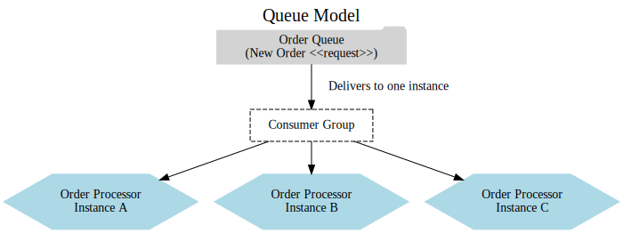
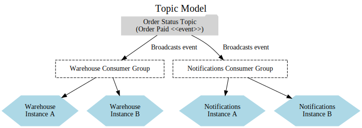
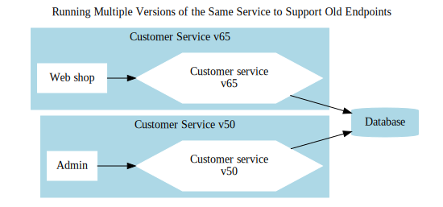
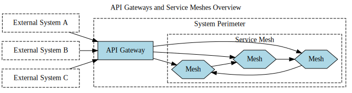
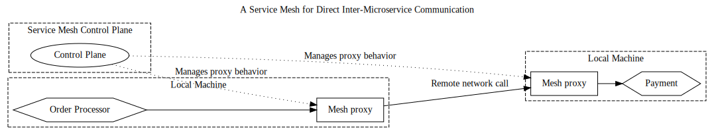

# Microservice Communication: Where and How to Use It

Previously, we explored how the choice of communication style significantly influences your technology selection. Whether you opt for blocking synchronous calls, nonblocking asynchronous interactions, request-response patterns, or event-driven collaboration, these decisions play a crucial role in narrowing down what could otherwise be an overwhelming array of technological options. This chapter delves into the technologies commonly employed for facilitating microservice communication.

## Choosing the Right Technology

With a vast array of choices available for enabling communication between microservices, selecting the most suitable option can feel overwhelming. Should you consider SOAP, XML-RPC, REST, gRPC, or one of the many emerging technologies? To make an informed decision, it's essential to first define your requirements and understand what you aim to achieve with the technology you choose before diving into the specifics.

### Ensuring Seamless Backward Compatibility

When updating microservices, maintaining compatibility with existing consumers is crucial to avoid disruptions. The chosen technology should facilitate backward-compatible modifications, ensuring that straightforward updates, such as adding new fields, do not impact clients negatively. Additionally, it’s ideal to have mechanisms in place to validate compatibility changes and receive feedback before deploying the updated microservice to a production environment.

### Defining Clear Interfaces

A microservice should have a clearly defined interface that explicitly outlines the functionality it provides to external consumers. This clarity not only helps consumers understand what the microservice offers but also ensures that developers working on the microservice are aware of the features that must remain consistent for external users. Avoiding accidental compatibility issues during updates is a key priority.

The use of explicit schemas is highly beneficial in achieving this clarity. While some technologies mandate schemas and others treat them as optional, adopting a schema-based approach is strongly recommended. Combined with comprehensive documentation, this practice ensures that consumers have a clear understanding of the microservice's capabilities.

### Ensure Technology-Agnostic APIs

The fast-paced evolution of the IT industry is a constant, with new tools, frameworks, and programming languages emerging regularly to enhance productivity and efficiency. While your current environment might rely on a specific technology stack, such as .NET, there's no guarantee it will remain the best fit a year or five years from now. Exploring alternative stacks might open up opportunities for greater innovation and flexibility.

To adapt to this ever-changing landscape, it’s crucial to design microservice APIs in a technology-agnostic manner. By avoiding integration methods that lock you into specific technology stacks, you retain the freedom to evolve and experiment with new tools or platforms without disrupting your microservices architecture. This forward-thinking approach helps future-proof your system while embracing the core principles of microservices.

### Prioritizing Consumer Simplicity

A microservice’s value diminishes if it’s difficult or cumbersome for consumers to use, no matter how well-designed it is internally. To maximize its usability, it’s important to focus on making the service accessible and straightforward for clients. Ideally, consumers should have the flexibility to choose their own technology stack without restrictions. 

Providing a client library can simplify adoption and enhance ease of use, but it’s not without trade-offs. Such libraries might introduce tighter coupling, potentially conflicting with other goals like maintaining loose dependencies. Striking a balance between ease of use and architectural flexibility is key to designing consumer-friendly microservices.

### Abstract Internal Implementation Details

To minimize coupling and maintain flexibility, it’s essential to shield consumers from the internal workings of a microservice. Exposing implementation details ties consumers to your service’s internal structure, making any internal changes risk breaking their integrations. This tight coupling raises the cost of making changes—precisely the scenario microservices are designed to prevent.

Moreover, the fear of disrupting consumers can discourage necessary updates, allowing technical debt to accumulate over time. To avoid these pitfalls, prioritize technologies that help encapsulate internal representations, ensuring that external consumers interact only with a stable, well-defined interface.

---

## Exploring Technology Options

Instead of exhaustively covering every available technology, let's focus on some of the most widely used and compelling options for microservice communication. Here’s a summary of the approaches we’ll examine:  

- **Remote Procedure Calls (RPCs):**  
  These frameworks enable invoking methods on remote processes as though they were local. Popular examples include technologies like SOAP and gRPC.  

- **REST:**  
  This architectural style involves exposing resources such as *Customer* or *Order* and interacting with them using standard HTTP methods like GET and POST. While there’s more depth to REST, we’ll delve into its details shortly.  

- **GraphQL:**  
  A modern protocol empowering consumers to create tailored queries that retrieve data from multiple microservices, returning precisely the information required without over-fetching.  

- **Message Brokers:**  
  Middleware facilitating asynchronous communication through queues or topics, allowing for decoupled and scalable message exchanges between services.

### Understanding Remote Procedure Calls (RPC)

Remote Procedure Call (RPC) is a method for invoking functionality on a remote service as if it were a local call. There are various RPC implementations, many of which rely on explicit schemas to define service interfaces. These schemas, often called Interface Definition Languages (IDLs), facilitate interoperability. For instance, SOAP uses Web Service Definition Language (WSDL) as its schema format, enabling the creation of client and server stubs across different technology stacks. This allows, for example, a Java server to expose a SOAP interface that a .NET client can consume using the same WSDL definition.  

In contrast, some RPC technologies, like Java RMI, avoid explicit schemas by embedding service definitions directly in the language’s type system. This approach results in tighter coupling, as both the client and server must share the same underlying technology. Despite these variations, the fundamental principle remains consistent: RPC frameworks make remote calls behave like local ones.  

### Serialization and Networking Protocols  
Most RPC frameworks define how data is serialized and deserialized. For example, gRPC uses Protocol Buffers (Protobuf) for this purpose. Some frameworks are tied to specific networking protocols, such as SOAP’s reliance on HTTP, while others offer flexibility, supporting multiple protocols like TCP and UDP. This flexibility allows for customization based on specific use cases—for example, choosing TCP for its reliable delivery or UDP for its minimal overhead.  

### Schema-Driven Code Generation  
One of the significant advantages of RPC frameworks with explicit schemas is their ability to generate client-side code. This eliminates the need for separate client libraries, as clients can create their code directly from the service specification. However, this requires the client to access the schema beforehand. Avro RPC takes a unique approach by optionally embedding the full schema within the payload, allowing clients to dynamically interpret it during runtime.  

### Key Benefits  
The primary appeal of RPC lies in its simplicity for developers. The ability to call a remote service using standard method calls, without needing to manage the underlying complexity, significantly streamlines development. This ease of use, combined with robust tooling for code generation, makes RPC a popular choice for microservice communication.

### Challenges in Using RPC Technologies  

While RPC offers notable benefits, it is not without its challenges. Some of these issues are inherent to the approach, while others vary depending on the specific implementation. Let’s explore these challenges in greater detail.  

#### **1. Technology Coupling**  
Certain RPC technologies, such as Java RMI, tightly bind the client and server to a specific platform, limiting flexibility and interoperability. For example, Java RMI requires both client and server to run within the JVM. This coupling effectively exposes internal implementation details, which can restrict future scalability or technology changes.  

Fortunately, more modern RPC frameworks like gRPC, SOAP, and Thrift support interoperability across various technology stacks, reducing these constraints and enabling multi-language environments. However, developers must still consider potential limitations when choosing an RPC framework.  

#### **2. Remote vs. Local Calls**  
RPC attempts to abstract the complexity of remote calls, often making them appear similar to local method calls. However, this abstraction can obscure critical differences. For instance:  
- **Performance Costs:** Remote calls involve marshaling and unmarshaling data and network transmission, which introduce latency and resource overhead. Unlike local in-process calls, these factors must be carefully considered when designing APIs.  
- **Transparency Issues:** Overly opaque abstractions can mislead developers into treating remote calls like local ones, leading to inefficiencies or unintended performance bottlenecks.  

Moreover, distributed systems are inherently unreliable. Networks can fail, packets may be lost or corrupted, and latency can fluctuate. Designing robust APIs requires addressing these failure modes explicitly, such as handling timeouts, retries, and slow responses.  

#### **3. Brittleness of RPC Implementations**  
Some RPC technologies are prone to brittleness, especially when schemas or binary stubs tightly couple clients and servers. Consider the following scenarios:  
- **Evolving APIs:** Adding a new method to an interface, such as `createCustomer(String emailAddress)` in addition to existing methods, requires regenerating client stubs. This change may also necessitate updates for clients that don’t even use the new method, increasing maintenance overhead.  
- **Tightly Coupled Objects:** Changes to serialized objects, such as removing an unused field (`age`) or restructuring fields, can break client deserialization. These changes often necessitate synchronized updates to both client and server, resulting in lockstep deployments that are challenging to manage.  

#### **4. Expand-Only Types**  
Objects used in binary serialization across RPC calls often become "expand-only" types. Removing or restructuring fields risks breaking clients, even if those fields are unused. Over time, this leads to bloated, inflexible objects containing obsolete fields that cannot be safely removed.  

#### **Mitigating These Challenges**  
- **Favor Interoperable Technologies:** Opt for frameworks like gRPC, SOAP, or Thrift that support multiple platforms and languages.  
- **Design Explicit APIs:** Clearly differentiate between local and remote interfaces, and consider the implications of network communication when defining service boundaries.  
- **Handle Failures Gracefully:** Implement resiliency strategies, such as circuit breakers and retries, to mitigate the impact of network unreliability.  
- **Versioning and Schema Evolution:** Use schema evolution techniques to ensure backward compatibility, and avoid lockstep dependencies between client and server deployments.  

While RPC remains a powerful tool, awareness and careful handling of its challenges are essential for creating maintainable, scalable, and resilient systems.

### Where RPC Fits Best  

Despite its limitations, RPC remains a valuable communication model, especially with modern implementations like gRPC offering robust and efficient solutions. However, not all RPC technologies are equal. For instance, Java RMI is hindered by brittleness and limited platform compatibility, while SOAP is often considered overly complex and heavy for developers compared to newer alternatives.  

When opting for RPC, it’s important to recognize its potential drawbacks and mitigate them effectively. Avoid abstracting remote calls to the extent that network interactions are completely hidden from clients, as this can lead to design and performance pitfalls. Additionally, ensure that server interfaces can evolve without necessitating synchronized updates across all clients, which can be challenging to manage. Striking a balance in client code design is essential—clients should be aware they are making network calls and not assume local-like behavior. Poorly structured client libraries can introduce unnecessary complications, so careful planning is required.  

Among RPC options, **gRPC** stands out as a top contender. Leveraging HTTP/2, gRPC delivers excellent performance and usability while supporting both synchronous request-response patterns and integration with reactive extensions. The surrounding ecosystem, including tools like Protolock for schema management, adds significant value and will be explored further in this chapter.  

gRPC is an excellent choice when you have substantial control over both client and server implementations. However, if your microservices must accommodate a diverse range of clients or external applications, the need for client-side code compilation against server-side schemas may create challenges. In such scenarios, a RESTful API over HTTP might offer greater flexibility and interoperability.

---

### REST: A Resource-Centric Approach  

Representational State Transfer (REST) is an architectural style rooted in the principles of the web. While it encompasses a variety of constraints and guidelines, its core concepts are particularly useful when addressing integration challenges in microservices and exploring alternatives to RPC-based service interfaces.  

At the heart of REST is the concept of **resources**, which represent entities the service manages—such as a Customer. The server can provide different representations of a resource, like a JSON version of a Customer, regardless of how it is stored internally. This decoupling between external representation and internal storage is a key strength of REST. Clients can retrieve and manipulate these representations, though the server ultimately decides whether to accept modifications.  

REST encompasses various implementation styles, and the **Richardson Maturity Model** offers an excellent framework for understanding and comparing these approaches. While REST doesn’t inherently mandate a specific protocol, it is most commonly implemented over HTTP due to its built-in support for features like verbs (e.g., GET, POST, PUT, DELETE), which streamline RESTful interactions. Using other protocols for REST is possible but often requires additional effort to replicate such capabilities.  

By focusing on resources and leveraging HTTP’s features, REST provides a flexible and widely adopted approach to building service interfaces, making it a compelling choice in the microservices landscape.

#### REST and the Power of HTTP  

The HTTP protocol offers built-in features that align seamlessly with the REST architectural style, making it an ideal choice for implementing RESTful services. HTTP verbs like **GET**, **POST**, and **PUT** have well-defined meanings in the HTTP specification and can be applied uniformly across all resources in a RESTful system. For example, **GET** retrieves a resource in an idempotent manner, while **POST** creates a new resource. This eliminates the need for numerous specific methods like `createCustomer` or `editCustomer`. Instead, a client can simply send a representation of a Customer to the appropriate endpoint using **POST**, and retrieve it later with a **GET** request. REST, in this context, leverages HTTP’s existing operations to define interactions with resources in a straightforward and standardized way.  

##### **HTTP’s Supporting Ecosystem**  
One of HTTP’s key advantages is the extensive ecosystem of tools and technologies built around it. Features such as HTTP caching proxies (e.g., Varnish), load balancers (e.g., mod_proxy), and monitoring tools with robust HTTP support make it easier to handle high traffic volumes efficiently. These components provide capabilities for smart routing, scalability, and transparent operations.  

In addition, HTTP brings a suite of security controls, from basic authentication to client certificates, simplifying the process of securing communications. However, leveraging these benefits requires adhering to HTTP’s best practices. Misuse of HTTP can result in systems that are insecure or challenging to scale, but proper implementation unlocks its full potential.  

##### **REST vs. RPC with HTTP**  
Although HTTP is often associated with REST, it can also be used to implement RPC. For instance, **SOAP** relies on HTTP but makes minimal use of its features, ignoring verbs and standard error codes. In contrast, modern RPC frameworks like **gRPC** are designed to take full advantage of HTTP/2, supporting features such as multiplexed streams within a single connection. However, simply using HTTP does not equate to implementing REST. REST requires adhering to principles like resource-based interactions and uniform interfaces, which go beyond the transport protocol.  


### Hypermedia as the Engine of Application State (HATEOAS)  

One of the core principles of REST is the concept of **Hypermedia as the Engine of Application State**, commonly abbreviated as HATEOAS (a welcome simplification of its lengthy name). While this idea may initially seem abstract, it introduces a powerful way to reduce client-server coupling by leveraging hypermedia controls to guide interactions.  

#### **What Is Hypermedia?**  
Hypermedia refers to content that contains links or controls that direct users to related content or actions—think of hyperlinks on a web page. The essence of HATEOAS is that clients navigate these links to perform actions or state transitions without needing to know specific URIs upfront. For example, instead of hardcoding the endpoint for customer information, the client retrieves it dynamically by following a link provided in a resource representation.  

#### **A Familiar Analogy**  
Consider an e-commerce website like Amazon. Over time, the location, design, or implementation of the shopping cart has changed, but users intuitively understand its purpose and interact with it accordingly. As long as the implicit contract—what the cart represents and how it functions—is upheld, these changes are seamless to users.  

HATEOAS aims to replicate this flexibility for clients consuming APIs. By embedding hypermedia controls within resource representations, clients can locate and interact with resources dynamically, without being tied to specific implementation details.  

#### **An Example in Practice**  
Imagine a MusicCorp API providing information about an album. Alongside album details, the API includes hypermedia controls, as shown below:  

```xml
<album>
  <name>Give Blood</name>
  <link rel="/artist" href="/artist/theBrakes" />
  <description>
    Awesome, short, brutish, funny, and loud. Must buy!
  </description>
  <link rel="/instantpurchase" href="/instantPurchase/1234" />
</album>
```  

In this example:  
1. The `artist` link allows the client to navigate to information about the album’s artist.  
2. The `instantpurchase` link provides the path to buy the album.  

The client doesn’t need to hardcode the URIs for these actions. Instead, it reads the resource representation, understands the semantic meaning of the controls, and interacts accordingly. If the URI changes or the control’s implementation is updated, the client remains unaffected as long as the semantic meaning is preserved.  

#### **The Advantages of HATEOAS**  
By decoupling clients from specific URI structures or implementations, HATEOAS provides several benefits:  
- **Flexibility:** The server can change URIs, introduce new resources, or redirect to other services without breaking clients.  
- **Extensibility:** New controls or state transitions can be added without impacting existing consumers.  
- **Abstracted Details:** Clients focus on the protocol’s semantics rather than the underlying implementation.  

#### **Challenges in Adoption**  
Despite its theoretical appeal, HATEOAS is rarely implemented in practice. Many REST-based systems are not built as distributed hypermedia systems, making this level of abstraction seem unnecessary or overly complex for certain use cases. Additionally, the effort required to design and maintain hypermedia-driven systems can be significant, which may discourage its adoption.  

While the benefits of HATEOAS are clear in terms of decoupling and flexibility, its practical application often depends on the specific needs and goals of the system being developed. For organizations committed to REST, adopting hypermedia controls can yield long-term benefits, though it may involve a steeper initial learning curve.

### When to Use REST-Based APIs  

REST-over-HTTP APIs have become a natural choice for synchronous request-response communication, particularly when broad compatibility with a wide variety of clients is essential. While REST may sometimes be perceived as a “good enough” solution, its ubiquity and simplicity make it an attractive option for building accessible and interoperable interfaces.  

One of REST’s key strengths lies in its integration with HTTP’s inherent capabilities, such as caching. These features make REST APIs particularly effective for large-scale systems where efficient request caching and robust interoperability are crucial. For these reasons, REST-based APIs are often the preferred choice for exposing services to external consumers or creating client-facing interfaces.  

However, REST may not always compare favorably to more specialized communication protocols in certain scenarios. For example:  
- REST’s performance can lag behind that of more optimized communication frameworks.  
- While it’s possible to design asynchronous interaction patterns over REST, this approach is less natural and efficient compared to protocols specifically built for asynchronous microservice communication.  

#### **HATEOAS in Practice**  
Although HATEOAS, with its emphasis on hypermedia-driven navigation, is a compelling concept, its adoption in real-world systems has been limited. In my experience, the additional effort required to implement HATEOAS often doesn’t translate into tangible long-term benefits, especially within microservice architectures. Factors such as limited tool support, unfamiliarity with the concepts, or incompatibility with typical system designs might contribute to its lack of widespread adoption.  

That said, HATEOAS may work well in specific use cases, even if it hasn’t found a foothold in most microservice implementations. For most systems, however, the simpler aspects of REST are more commonly leveraged.  

### Hypermedia as the Engine of Application State (HATEOAS)  

One of the core principles of REST is the concept of **Hypermedia as the Engine of Application State**, commonly abbreviated as HATEOAS (a welcome simplification of its lengthy name). While this idea may initially seem abstract, it introduces a powerful way to reduce client-server coupling by leveraging hypermedia controls to guide interactions.  

#### **What Is Hypermedia?**  
Hypermedia refers to content that contains links or controls that direct users to related content or actions—think of hyperlinks on a web page. The essence of HATEOAS is that clients navigate these links to perform actions or state transitions without needing to know specific URIs upfront. For example, instead of hardcoding the endpoint for customer information, the client retrieves it dynamically by following a link provided in a resource representation.  

#### **A Familiar Analogy**  
Consider an e-commerce website like Amazon. Over time, the location, design, or implementation of the shopping cart has changed, but users intuitively understand its purpose and interact with it accordingly. As long as the implicit contract—what the cart represents and how it functions—is upheld, these changes are seamless to users.  

HATEOAS aims to replicate this flexibility for clients consuming APIs. By embedding hypermedia controls within resource representations, clients can locate and interact with resources dynamically, without being tied to specific implementation details.  

#### **An Example in Practice**  
Imagine a MusicCorp API providing information about an album. Alongside album details, the API includes hypermedia controls, as shown below:  

```xml
<album>
  <name>Give Blood</name>
  <link rel="/artist" href="/artist/theBrakes" />
  <description>
    Awesome, short, brutish, funny, and loud. Must buy!
  </description>
  <link rel="/instantpurchase" href="/instantPurchase/1234" />
</album>
```  

In this example:  
1. The `artist` link allows the client to navigate to information about the album’s artist.  
2. The `instantpurchase` link provides the path to buy the album.  

The client doesn’t need to hardcode the URIs for these actions. Instead, it reads the resource representation, understands the semantic meaning of the controls, and interacts accordingly. If the URI changes or the control’s implementation is updated, the client remains unaffected as long as the semantic meaning is preserved.  

#### **The Advantages of HATEOAS**  
By decoupling clients from specific URI structures or implementations, HATEOAS provides several benefits:  
- **Flexibility:** The server can change URIs, introduce new resources, or redirect to other services without breaking clients.  
- **Extensibility:** New controls or state transitions can be added without impacting existing consumers.  
- **Abstracted Details:** Clients focus on the protocol’s semantics rather than the underlying implementation.  

#### **Challenges in Adoption**  
Despite its theoretical appeal, HATEOAS is rarely implemented in practice. Many REST-based systems are not built as distributed hypermedia systems, making this level of abstraction seem unnecessary or overly complex for certain use cases. Additionally, the effort required to design and maintain hypermedia-driven systems can be significant, which may discourage its adoption.  

While the benefits of HATEOAS are clear in terms of decoupling and flexibility, its practical application often depends on the specific needs and goals of the system being developed. For organizations committed to REST, adopting hypermedia controls can yield long-term benefits, though it may involve a steeper initial learning curve.

#### **Where REST Excels**  
REST is an excellent choice for:  
- **Exposing APIs to external clients:** Its simplicity, familiarity, and compatibility make it a go-to solution for public-facing interfaces.  
- **Synchronous communication between microservices:** REST provides a straightforward way to handle synchronous requests and responses, though it may not always be the most efficient.  

While REST may not be the best fit for every situation, it remains a versatile and widely understood standard that serves many use cases effectively.

### Understanding GraphQL

GraphQL has become increasingly popular in recent years, primarily because of its ability to address a specific challenge: enabling clients to define queries that retrieve only the necessary data, often in a single request. This capability significantly improves performance for resource-constrained client-side devices and reduces the need for custom server-side aggregation logic.  

#### **A Practical Example**  
Consider a mobile app that needs to display a dashboard summarizing a customer's recent activity. The page might require:  
- Key details about the customer (e.g., name and email).  
- A summary of the five most recent orders, including fields like the order date, total value, and shipping status.  

Using traditional REST APIs, the client might need to make multiple requests to retrieve data from different microservices. These calls could result in over-fetching, pulling back more data than is actually needed, which can be especially inefficient for mobile devices. This not only consumes more of the device's data plan but also increases latency.  

GraphQL simplifies this by allowing the client to issue a single, precise query. With one request, the app can retrieve only the data it needs from multiple sources, improving performance and reducing unnecessary data transfer.  

#### **How It Works**  
To use GraphQL, a microservice must expose a GraphQL endpoint. This endpoint serves as the central entry point for all client queries and provides a schema that defines the available types and relationships. Clients use this schema to construct queries, often with the help of a graphical query builder that simplifies the process.  

By enabling clients to query for exactly what they need, GraphQL reduces the number of API calls and minimizes data payloads. This makes it particularly well-suited for user interfaces in systems built with microservice architectures.  

#### **Key Benefits of GraphQL**  
- **Efficiency:** Clients retrieve only the required data, avoiding over-fetching or under-fetching.  
- **Flexibility:** A single query can aggregate data from multiple sources, streamlining client-server communication.  
- **Enhanced Developer Experience:** Graphical tools and the self-describing schema make it easier to build and debug queries.  

GraphQL is an excellent choice for systems where performance and client-side efficiency are critical, especially in applications with diverse and evolving data requirements.

### Challenges of GraphQL  

Although GraphQL has matured significantly in recent years, addressing early limitations like restricted language support, it still presents unique challenges for developers and organizations adopting the technology. Here are some of the key concerns to be mindful of:  

#### **1. Dynamic Queries and Server Load**  
One of GraphQL’s strengths is its ability to allow clients to issue flexible and dynamic queries. However, this same flexibility can lead to performance bottlenecks. Dynamically crafted queries might unintentionally impose heavy loads on the server, akin to how poorly optimized SQL queries can strain databases.  

Unlike SQL, which benefits from query planners and optimization tools to identify and mitigate problematic statements, GraphQL lacks equally robust tooling for diagnosing and managing expensive queries. Addressing this issue often requires implementing server-side request throttling, but when queries span multiple microservices, managing resource consumption becomes increasingly complex.  

#### **2. Caching Complexity**  
Caching with GraphQL is notably more challenging compared to traditional REST APIs. REST APIs can easily leverage HTTP response headers or tools like Content Delivery Networks (CDNs) to cache responses. GraphQL, however, returns highly specific and often dynamic data, making general caching mechanisms less effective.  

Some strategies, such as associating unique IDs with returned resources for client-side caching, can partially address this limitation. However, implementing such solutions often requires additional development effort, and integrating CDNs or reverse proxies for caching remains cumbersome. For applications with user-specific queries, where cache hit rates are naturally low, this limitation may be less impactful. Still, it might necessitate a hybrid approach, using GraphQL for complex, tailored queries while relying on REST for more generic requests.  

#### **3. Challenges with Write Operations**  
While GraphQL supports both read and write operations, its design and use cases often make it better suited for reading data. Many teams find that using REST for writes and GraphQL for reads provides a more balanced solution, as GraphQL's flexibility aligns more naturally with retrieving and aggregating data.  

#### **4. Perception of Microservices as "Data Wrappers"**  
GraphQL’s data-centric nature can inadvertently encourage the perception that microservices are little more than database wrappers. This misconception undermines one of the fundamental principles of microservices: exposing meaningful functionality and encapsulating internal logic.  

Some developers compare GraphQL to technologies like OData, which are designed primarily for accessing database-like data through generic APIs. It’s crucial to ensure that GraphQL APIs remain decoupled from the underlying data stores of your microservices, preserving the logic and behavior unique to each service.  

#### **5. Hybrid Solutions and Tooling Limitations**  
GraphQL’s lack of comprehensive support for certain features, such as robust caching or seamless write operations, often results in hybrid architectures. Teams may use GraphQL alongside REST APIs to compensate for its limitations, which can add complexity to the system. While specific libraries, like Apollo, have introduced solutions to mitigate some of these challenges, the overall experience still requires careful planning and design.  

### Final Thoughts  
GraphQL offers significant benefits in terms of flexibility and efficiency, particularly for read-heavy, dynamic client queries. However, its challenges, including caching difficulties, server load management, and potential misalignment with microservice principles, require thoughtful consideration. By addressing these issues and ensuring that GraphQL is used appropriately, teams can maximize its strengths while avoiding common pitfalls.

### Where GraphQL Excels  

GraphQL is particularly effective when used at the system's perimeter, where it exposes functionality to external clients, often in the form of graphical user interfaces (GUIs). It is especially well-suited for mobile devices, which typically operate under constraints such as limited bandwidth and display capabilities. Mobile networks can also benefit from the reduced data payloads and fewer API calls enabled by GraphQL’s ability to retrieve only the necessary information in a single query.  

Beyond mobile, GraphQL has been adopted for external APIs, with GitHub being a notable example. For APIs that would otherwise require multiple client calls to gather related information, GraphQL offers a more efficient and user-friendly approach, consolidating data retrieval into a single request.  

### GraphQL in a Microservices Context  
At its core, GraphQL functions as a mechanism for call aggregation and data filtering. Within a microservice architecture, its role is typically to combine responses from multiple downstream services into a single, cohesive query result for the client. However, it is not designed to replace direct microservice-to-microservice communication, which often requires more lightweight and specialized protocols.  

### Alternatives to GraphQL  
While GraphQL is an excellent solution for certain scenarios, alternatives like the **Backend for Frontend (BFF)** pattern may be more appropriate in some cases. The BFF pattern also focuses on aggregating and customizing data for specific client needs, and we’ll explore how it compares to GraphQL and other aggregation strategies in later chapters.  

In summary, GraphQL is an ideal choice for simplifying data retrieval at the edge of your system, particularly for external-facing APIs and applications. However, it is best utilized as a complement to other tools and patterns rather than a one-size-fits-all solution.

### Message Brokers: Facilitating Asynchronous Communication  

Message brokers, often referred to as middleware, act as intermediaries that enable communication between processes. They are widely used to implement asynchronous communication in microservices architectures due to their robust capabilities and flexibility.  

At their core, message brokers handle the transmission of **messages**, a broad term that can refer to requests, responses, or events. Instead of microservices communicating directly with one another, a service sends its message to the broker, which manages the delivery based on predefined routing or handling rules.  

This decoupling allows systems to be more scalable, resilient, and adaptable, making message brokers an essential component in distributed systems.

### Topics and Queues: Communication Models in Message Brokers  

Message brokers often support two primary models for message handling: **queues** and **topics**, each suited to different communication needs.  

#### **Queues**  
Queues operate on a point-to-point communication model. In this setup:  
- A producer places a message on the queue.  
- A single consumer, typically part of a **consumer group**, retrieves and processes the message.  

Queues are particularly useful for load balancing. For example, if a microservice like an **Order Processor** has multiple instances (all part of the same consumer group), the broker ensures that each message from the queue is delivered to only one instance. This distribution mechanism implements the **competing consumers pattern**, allowing workload sharing among multiple service instances. 



#### **Topics**  
In contrast, topics use a publish-subscribe model, allowing multiple consumers to receive the same message. Here’s how it works:  
- A producer publishes an event to a topic.  
- Any consumer group subscribed to the topic receives a copy of the message.  

For instance, an event indicating an order has been paid might be published to an **Order Status** topic. This event could be consumed by the **Warehouse** microservice and the **Notifications** microservice, each in separate consumer groups. Within each group, only one instance will process the event.  



#### **Key Differences**  
At a glance, a queue might resemble a topic with a single consumer group. However, the fundamental distinction lies in the level of awareness:  
- **Queues:** The sender is aware of the specific destination for the message.  
- **Topics:** The sender is agnostic about who will receive the message (or if anyone will).  

#### **When to Use Queues vs. Topics**  
- **Queues:** Best suited for request-response patterns or scenarios requiring load balancing among service instances.  
- **Topics:** Ideal for event-driven architectures where messages need to be broadcast to multiple subscribers.  

While these are general guidelines, the choice between queues and topics should depend on the specific requirements and communication patterns of your system. Both models provide powerful mechanisms to build scalable and resilient microservice architectures.

### Guaranteed Delivery in Message Brokers  

A key reason for using a message broker is the set of capabilities it offers for managing asynchronous communication. Among these, one of the most valuable features is **guaranteed delivery**, a commitment by the broker to ensure that messages reach their intended destination reliably.  

From the perspective of the microservice sending the message, guaranteed delivery is particularly advantageous. If the downstream service is temporarily unavailable, the broker retains the message and delivers it once the destination becomes reachable. This alleviates the burden on the sending service, which no longer needs to handle complex error-handling logic, such as deciding whether to retry a failed HTTP call or abandon the request entirely.  

#### **How Guaranteed Delivery Works**  
To ensure guaranteed delivery, brokers must store undelivered messages in a **durable and persistent manner** until they can be processed. This typically requires the broker to operate as a **clustered system**, where redundancy ensures that a hardware failure or node outage does not result in message loss. However, setting up and managing these clusters correctly is critical, as misconfigurations can undermine the reliability of the system.  

For example, brokers like **RabbitMQ** require low-latency communication between cluster nodes to maintain accurate message state. If latency increases, nodes can lose synchronization, potentially leading to data loss. While this is not unique to RabbitMQ—all brokers have specific requirements for proper configuration and deployment—understanding and adhering to these constraints is essential for achieving reliable message delivery.  

#### **Interpreting Guaranteed Delivery**  
It’s important to note that the exact definition and implementation of "guaranteed delivery" can vary between brokers. Some may guarantee delivery only under certain conditions or configurations, so it’s vital to consult the documentation of your chosen broker to understand its specific guarantees and limitations.  

In summary, message brokers with guaranteed delivery significantly simplify asynchronous communication by buffering undelivered messages and ensuring their eventual delivery. However, to fully benefit from this feature, careful configuration and adherence to the broker’s operational guidelines are crucial.

### Trust in Message Brokers  

A key appeal of message brokers is their ability to provide features like **guaranteed delivery**, but this capability relies heavily on both the reliability of the broker itself and how it is deployed and managed. Trusting a broker means having confidence not only in the developers who built the software but also in the infrastructure and operational practices supporting it.  

If your system depends on guaranteed delivery and the broker fails to uphold that promise—whether due to a software bug, misconfiguration, or operational oversight—the consequences can be significant. By using a broker, you are essentially outsourcing the complexities of message handling to specialized software created by experts. Ideally, this should allow you to focus on your application rather than the intricacies of reliable communication.  

However, it ultimately comes down to how much you trust the broker to meet your system’s requirements. Careful evaluation of the broker’s features, documentation, and operational practices is essential to determine whether it can reliably fulfill its promises in your specific context.

### Additional Features of Message Brokers  

Beyond guaranteed delivery, message brokers offer other valuable features that can enhance communication and reliability in distributed systems. However, these characteristics vary between brokers, and understanding their nuances is critical when selecting a broker for your architecture.

#### **Message Ordering**  
Many brokers can ensure messages are delivered in the same order they were sent, but this guarantee often comes with limitations. For instance, **Kafka** guarantees ordering only within a single partition. If messages might be received out of order, your consumer needs to account for this, potentially deferring the processing of messages until missing ones are received.

#### **Transactional Operations**  
Some brokers provide support for transactional writes. For example, Kafka allows you to write to multiple topics within a single transaction. Additionally, certain brokers offer transactional reads, ensuring that a message is successfully processed by the consumer before it is removed from the broker. This feature, often accessible through APIs like Java Message Service (JMS), is helpful when you need to maintain consistency in message processing.

#### **Exactly-Once Delivery**  
One of the most debated features offered by some brokers is **exactly-once delivery**. Many brokers handle guaranteed delivery by allowing messages to be resent if necessary, which can result in consumers receiving the same message more than once. While most brokers minimize this risk or abstract it from the consumer, others claim to guarantee exactly-once delivery.  

This is a complex topic, with some experts arguing that achieving exactly-once delivery in all scenarios is impossible, while others suggest it is feasible with certain techniques or trade-offs. If a broker claims to provide this feature, it’s essential to thoroughly understand how it is implemented.  

Regardless of the broker's capabilities, it is often best to design your consumers to handle duplicate messages gracefully. A simple approach is to include a unique identifier with each message. Consumers can check this ID against a record of already-processed messages and ignore duplicates, ensuring idempotent processing.

### Final Thoughts  
While these features can add significant value, it is crucial to evaluate how each broker implements them and determine whether they align with your system's requirements. Additionally, designing consumers to handle edge cases, such as out-of-order or duplicate messages, will make your system more resilient and robust, regardless of the broker used.

### Choosing a Message Broker  

There are many options available when it comes to message brokers, ranging from open-source solutions to fully managed services provided by cloud vendors. Some of the most commonly used brokers include **RabbitMQ**, **ActiveMQ**, and **Kafka**—each offering unique features suited to different use cases. We’ll delve deeper into these brokers shortly.  

For organizations using public cloud platforms, the choices expand to include managed services tailored to specific environments. For instance, AWS offers a variety of fully managed broker solutions, including:  
- **Simple Queue Service (SQS):** A fully managed message queuing service designed for decoupling and scaling applications.  
- **Simple Notification Service (SNS):** A messaging service for broadcasting messages to multiple subscribers.  
- **Kinesis:** A platform for processing and analyzing real-time streaming data.  

These cloud-native offerings often simplify setup and maintenance while integrating seamlessly with other cloud services. Notably, **SQS** is one of AWS's oldest products, launched in 2006 as the company’s second-ever service, highlighting its maturity and reliability.  

When choosing a message broker, consider your specific requirements, including scalability, ease of use, and integration capabilities with your existing infrastructure or cloud environment.

### Kafka: A Unique and Scalable Message Broker  

Kafka stands out among message brokers due to its widespread popularity and versatility, particularly in managing large-scale data pipelines and enabling stream processing. Originally developed at LinkedIn to unify multiple messaging systems into a single platform, Kafka is designed for high scalability and resilience, making it an appealing choice for organizations with complex data processing needs.  

#### **Key Features of Kafka**  

1. **Built for Scale**  
Kafka is engineered to handle exceptionally large workloads, supporting thousands of producers and consumers within a single cluster. While most organizations may not require this level of scalability, Kafka’s ability to accommodate high volumes of data and users makes it a valuable tool for companies managing extensive systems.  

2. **Message Retention**  
One of Kafka’s standout features is its capability to retain messages for a configurable period, even after they’ve been consumed. Unlike traditional brokers that discard messages once they’re processed, Kafka can store messages indefinitely. This allows for:  
   - Reprocessing of previously consumed messages.  
   - Enabling newly added consumers to process historical data.  
   
   This feature is particularly useful for applications that require auditability or replaying events for debugging and analytics.  

3. **Stream Processing Capabilities**  
Kafka has expanded its functionality to include built-in stream processing. Instead of relying on external tools like Apache Flink, Kafka allows users to process data directly within its ecosystem using **KSQL**, a SQL-like language for querying and transforming data across topics. This functionality offers a dynamic, materialized view of data streams, enabling more flexible and efficient real-time data management.  

#### **Use Cases for Kafka**  
Kafka is well-suited for organizations transitioning from batch processing to real-time data processing. Its ability to manage large-scale data flows and its support for stream processing make it ideal for:  
- Building real-time analytics pipelines.  
- Managing distributed systems with high volumes of event-driven interactions.  
- Providing a durable event log for audit and recovery purposes.  

#### **Further Learning**  
For those interested in diving deeper into Kafka, consider exploring the following resources:  
- *Designing Event-Driven Systems* by Ben Stopford (O’Reilly), which explores event-driven architectures in detail.  
- *Kafka: The Definitive Guide* by Neha Narkhede, Gwen Shapira, and Todd Palino (O’Reilly), a comprehensive resource on Kafka’s capabilities and use cases.  

Kafka’s blend of scalability, durability, and stream processing makes it a powerful option for modern distributed systems, particularly those requiring robust data pipelines and real-time processing.

---

## Choosing Serialization Formats  

When working with certain technologies, particularly some RPC frameworks, the choice of serialization format may already be determined for you. For example, **gRPC** requires data to be serialized using the Protocol Buffers format. However, other technologies, such as message brokers like **Kafka**, offer flexibility, allowing you to send messages in a variety of formats.  

This raises an important question: with so many options available, how do you decide which serialization format to use? The choice depends on the specific requirements of your system, including factors like performance, compatibility, and ease of integration. Understanding the trade-offs of different formats will help you make an informed decision that aligns with your architecture and use case.

### Text-Based Serialization Formats  

Textual serialization formats offer significant flexibility, particularly when it comes to consuming resources. While it’s possible to send binary data over HTTP, as frameworks like **gRPC** demonstrate, most REST APIs rely on text-based formats for request and response bodies. These formats are both accessible and easy to work with across a variety of platforms.

#### **JSON vs. XML**  
Over time, **JSON** has largely replaced **XML** as the preferred text serialization format. Several factors have contributed to JSON's dominance:  
- JSON aligns well with browser-based applications, a primary consumer of APIs.  
- It is considered more compact and simpler than XML, which makes it easier to use in many contexts.  
- JSON emerged as part of a broader shift away from XML, with its simplicity being a key selling point.  

That said, the size difference between JSON and XML payloads is often negligible, especially when compression is applied. Additionally, the simplicity of JSON comes with trade-offs—for example, JSON lacks built-in schema support, which XML provides natively.  

#### **Avro: Schema-Based JSON Alternative**  
**Avro** is an intriguing option for serialization. It combines JSON's structure with schema-based definitions, making it well-suited for use in messaging systems. One of Avro’s standout features is its ability to embed the schema within the payload, simplifying support for multiple messaging formats. This characteristic has made it a popular choice in scenarios where schema evolution and compatibility are important.

#### **The Case for XML**  
While JSON may be the go-to format for many, **XML** still has its advantages. Its extensive tool support allows for powerful operations, such as extracting specific parts of a payload using well-established standards like **XPath**. Tools for JSON, such as **JSONPath**, are available but less mature and widely supported. Additionally, XML naturally supports advanced features like hypermedia controls, which many developers try to retrofit into JSON.  

Despite these strengths, XML’s verbosity and complexity have led to its decline in favor of JSON. However, in scenarios requiring robust tooling or schema enforcement, XML remains a strong contender.

#### **Final Thoughts**  
JSON’s simplicity and widespread adoption make it the dominant choice for text-based serialization, particularly in web and API development. Formats like **Avro** provide additional schema-based capabilities for more complex needs, while XML continues to serve niche use cases where its tooling and features excel. The best choice ultimately depends on the specific requirements of your system, such as tooling support, schema validation, and compatibility needs.

### Binary Serialization Formats  

Text-based formats like JSON and XML are popular for their readability and interoperability, but when efficiency becomes a priority—whether it’s minimizing payload size or optimizing read/write performance—binary serialization formats take center stage. These formats are particularly valuable in scenarios where performance and resource constraints are critical.  

#### **Protocol Buffers and Beyond**  
**Protocol Buffers** (Protobuf) are among the most widely used binary serialization formats in microservice communication, often employed in and beyond gRPC. Their compact, efficient design has made them a staple for systems requiring optimized data exchange.  

However, Protobuf is not the only option in this space. Other formats, such as **Simple Binary Encoding (SBE)**, **Cap’n Proto**, and **FlatBuffers**, have been developed to address different performance needs and trade-offs. Each offers unique benefits, and while many benchmarks exist to compare these formats, such tests may not accurately reflect your system's specific use case.  

#### **Choosing a Binary Format**  
If you need to squeeze out every possible performance gain—whether by reducing payload size or speeding up serialization and deserialization—binary formats are worth exploring. However, choosing the right format requires careful evaluation in the context of your system. Running your own benchmarks tailored to your use case is crucial to ensure you’re selecting the best option.  

#### **When to Optimize**  
It’s worth noting that most systems rarely need to delve deeply into binary serialization for optimization. Often, significant performance improvements can be achieved by reducing the amount of data being sent or avoiding unnecessary calls altogether. For the majority of applications, the added complexity of binary formats may not be justified.  

That said, for ultra-low-latency distributed systems where every microsecond counts, investing in the right binary serialization format can yield significant benefits. In such cases, be prepared to thoroughly explore the trade-offs and intricacies of these formats to find the optimal solution for your needs.

## The Role of Schemas in Microservices  

One recurring question in microservices design is whether to use schemas to define what an endpoint exposes and accepts. Schemas come in various forms, often tied to the serialization format you choose. For instance:  
- **XML** typically uses XML Schema Definition (**XSD**).  
- **JSON** relies on JSON Schema.  
- **SOAP** requires a Web Services Description Language (**WSDL**).  
- **gRPC** mandates a Protocol Buffer specification.  

Some technologies, particularly many RPC implementations, enforce the use of schemas, making them a necessary part of the development process. Others, however, treat schemas as optional, leaving it up to the developer to decide whether to incorporate them. This flexibility opens up a broader discussion about the value schemas provide.  

#### **The Case for Using Schemas**  
I advocate for explicit schemas in microservices for two primary reasons:  

1. **Clarity and Communication**  
Schemas act as an unambiguous representation of what a microservice endpoint offers and accepts. This clarity benefits both the developers building the microservice and those consuming it. While schemas do not eliminate the need for proper documentation, they can significantly reduce the amount of documentation required by providing a structured and machine-readable description of the API.  

2. **Change Management and Error Prevention**  
Explicit schemas help mitigate accidental breakages by enforcing a clear contract between the service provider and its consumers. When a schema is in place, it becomes easier to detect breaking changes during development, reducing the risk of deploying updates that disrupt dependent services.  

#### **Conclusion**  
While schemas may not be mandatory for every technology or scenario, they are a valuable tool for maintaining clear communication and reducing errors in microservices architectures. Their role in catching potential breakages and simplifying integration makes them an essential consideration for robust system design. As we delve into managing changes between microservices, we’ll explore how schemas can further contribute to system stability and evolution.

### Structural Versus Semantic Contract Breakages

Contract breakages in microservices can generally be categorized into two types: **structural breakages** and **semantic breakages**. Both can disrupt service functionality for consumers, but they differ in nature and how they impact the system.  

#### **Structural Breakages**  
A structural breakage occurs when the structure of an endpoint changes in a way that makes it incompatible with its consumers. This might involve removing fields or methods, or introducing new required fields that existing consumers are unaware of.  

**Example:**  
Consider a microservice named **Hard Calculations** that provides a `calculate` method requiring two integers as input. If the service is updated so that the `calculate` method now accepts only a single integer, requests from consumers sending two integers would fail. This is a structural change and, fortunately, such changes are often easier to detect through schema validation or automated testing.  

#### **Semantic Breakages**  
Semantic breakages are more subtle and harder to identify because the structure of the endpoint remains unchanged while its behavior shifts. These changes may violate the expectations of consumers, leading to unexpected outcomes.  

**Example:**  
Imagine the same **Hard Calculations** microservice initially adds the two integers provided to the `calculate` method and returns the result. Later, the service is updated so that `calculate` multiplies the integers instead. Although the method's structure and input requirements remain unchanged, its altered behavior could break existing consumers relying on the original addition functionality.  

#### **Key Differences**  
- **Structural breakages** are easier to spot since they involve clear changes in the interface or schema.  
- **Semantic breakages** are more challenging to detect because they require understanding and testing the behavior of the service.  

#### **Conclusion**  
Both types of breakages can impact system reliability, but their detection and mitigation strategies differ. Structural changes can often be caught early through schema validation, while semantic changes require thorough communication, testing, and documentation to ensure consumer expectations are aligned with service behavior. Recognizing and addressing these differences is crucial for maintaining stability in a microservices ecosystem.

### Should You Use Schemas?

Schemas offer significant advantages in microservice design, particularly for identifying and preventing **structural breakages**. By explicitly defining the structure of an API, schemas make it possible to detect compatibility issues between versions. While **semantic breakages** still require robust testing to identify, schemas offload much of the burden of catching structural issues, providing a layer of safety that complements testing efforts.

#### **Schemas vs. Testing**  
Without schemas, or if schema compatibility isn’t checked, the responsibility for identifying structural issues shifts entirely to testing. This situation parallels the difference between **statically typed** and **dynamically typed** programming languages. In statically typed languages, type errors are caught at compile time, allowing developers to focus testing on other aspects of the system. Dynamically typed languages, while flexible, rely on testing to catch issues that a compiler would have flagged in a statically typed environment.  

When it comes to microservices, however, the trade-offs between schemas and “schemaless” communication are not as balanced. The benefits of having an explicit schema far outweigh the perceived flexibility of a schemaless design.

#### **Explicit vs. Implicit Schemas**  
Even when working with a schemaless API, there is an implicit schema—developers inherently expect data to have a specific structure. This implicit schema lives in the assumptions codified within the client’s logic. The difference is that explicit schemas make these expectations clear and enforceable, improving communication between teams and providing a safety net for evolving systems.  

Schemas don’t just define structure; they also serve as a contract between the client and server, ensuring both parties have a shared understanding of the data. Explicit schemas make it easier to understand what a service exposes, reducing ambiguity and fostering better collaboration.

#### **Arguments Against Schemas**  
The primary criticism of schemas is that they introduce additional effort and provide limited value. This argument often reflects a lack of imagination or poor tooling, as good schema validation tools can significantly reduce the manual overhead of maintaining schemas and make them invaluable for catching structural issues early.

#### **When to Skip Schemas**  
While schemas are generally beneficial, there are scenarios where their absence is less problematic. For example, when the client and server are developed and maintained by the same team, the cost of change is lower, and the need for schemas is diminished. However, in most distributed systems where microservices are owned by different teams, explicit schemas are essential for maintaining stability and reliability.

#### **Conclusion**  
Schemas provide clarity, act as a safety net, and facilitate smoother communication between teams. They make explicit what might otherwise remain implicit, reducing risks and improving system robustness. While there may be situations where schemas are less critical, for most microservice architectures, their value far exceeds the effort required to implement them.

---

## Handling Change Between Microservices

One of the most frequent questions about microservices—second only to "How big should a microservice be?"—is, "How do you handle versioning?" While this might sound like a question about numbering schemes, it typically reflects a deeper concern: how to manage changes in the contracts between microservices.  

Addressing this challenge involves two main considerations:  
1. **Avoiding breaking changes whenever possible.**  
2. **Managing breaking changes when they become necessary.**  

Let’s first explore strategies to minimize breaking changes, followed by how to handle them effectively when they cannot be avoided.

---

## Preventing Breaking Changes  

Minimizing breaking changes in microservices requires thoughtful design and adherence to a few essential principles. These practices make it easier for microservices to evolve independently without disrupting the systems that depend on them.  

#### **1. Expansion Changes**  
Focus on extending a microservice’s interface rather than altering or removing existing elements. By adding new features or fields while keeping old ones intact, you maintain compatibility with existing consumers.  

#### **2. Tolerant Readers**  
When consuming data from a microservice, design clients to handle unexpected or additional information gracefully. This flexibility ensures that consumers can adapt to changes in the interface without breaking.  

#### **3. Choosing the Right Technology**  
Select technologies that simplify backward-compatible changes. For example, schema-driven technologies like Protocol Buffers or Avro are designed to support non-breaking modifications, such as adding optional fields.  

#### **4. Explicit Interfaces**  
Clearly define and document what a microservice exposes. An explicit interface reduces ambiguity, making it easier for consumers to use the service correctly and for maintainers to understand what aspects of the interface are safe to modify.  

#### **5. Catching Accidental Breakages Early**  
Implement tools and processes to identify potential breaking changes during development or testing, before they reach production. Techniques like schema validation, contract testing, and automated CI/CD pipelines can be invaluable in detecting and preventing issues.  

### The Core Principle: Information Hiding  
These strategies align with the principle of **information hiding**, which emphasizes encapsulating internal details while exposing only what is necessary. By adhering to this concept, you can reduce coupling between microservices, making your system more resilient to change.  

Let’s explore each of these practices in more detail to understand how they reinforce one another and contribute to a stable, adaptable microservices architecture.  

### Expansion Changes

One of the simplest ways to avoid breaking changes is to focus on **adding new elements** to a microservice’s contract without removing or altering existing ones. For instance, introducing a new field to a payload is generally safe, provided that consumers are designed to handle such additions gracefully.  

For example, adding a `dateOfBirth` field to a customer record should not disrupt existing clients, as long as they are tolerant of changes and can ignore fields they don’t recognize. This approach ensures backward compatibility while allowing the service to evolve over time.

### Tolerant Reader

The way a microservice's consumer is implemented plays a critical role in enabling backward-compatible changes. To achieve this, client code should avoid tightly coupling to the microservice's interface. By embracing flexibility, you make it easier to adapt to changes without breaking existing functionality.

#### **Example Scenario**  
Consider an **Email** microservice tasked with sending notifications, such as an "order shipped" email, to customers. To send the email, the service retrieves customer information using an ID and receives a payload like the following:

```xml
<customer>
  <firstname>Sam</firstname>
  <lastname>Newman</lastname>
  <email>sam@magpiebrain.com</email>
  <telephoneNumber>555-1234-5678</telephoneNumber>
</customer>
```

The Email service only needs `firstname`, `lastname`, and `email` to function. If it is implemented to simply extract the required fields and ignore others, such as `telephoneNumber`, it remains resilient to changes. For example, if the `telephoneNumber` field is later removed or the `Customer` structure is reorganized (as shown below), the service continues to operate without disruption.

```xml
<customer>
  <naming>
    <firstname>Sam</firstname>
    <lastname>Newman</lastname>
    <nickname>Magpiebrain</nickname>
    <fullname>Sam "Magpiebrain" Newman</fullname>
  </naming>
  <email>sam@magpiebrain.com</email>
</customer>
```

However, overly rigid client implementations, particularly in strongly typed languages, may attempt to bind to all fields in the response, leading to unnecessary failures if unused fields are removed or restructured.

#### **The Tolerant Reader Pattern**  
The **tolerant reader** pattern, as described by Martin Fowler, involves designing client code to handle changes it doesn't care about. Instead of hardcoding assumptions about where data fields are located, the client should focus on extracting only the fields it needs. Techniques like XPath can help locate required fields regardless of structural changes, allowing the client to adapt to modifications seamlessly.

#### **Postel's Law in Microservices**  
This approach aligns with **Postel's Law** (the robustness principle):  
> "Be conservative in what you do, be liberal in what you accept from others."  

Originally applied to network interactions, this principle encourages building clients that can tolerate unexpected changes or additional data in payloads. For microservices, this means creating consumer logic that gracefully adapts to evolving interfaces, fostering greater system stability.  

By applying the tolerant reader pattern, you can minimize the risk of breaking changes and ensure that microservices remain flexible and resilient in dynamic environments.

### Choosing the Right Technology  

The choice of integration technology plays a critical role in determining how easily microservices can adapt to changes without breaking their clients. Some technologies are inherently more brittle and resistant to change, while others are designed to accommodate evolution with minimal disruption.

#### **Technologies Supporting Change**  
Certain technologies are built to make interface changes seamless. For instance:  
- **Protocol Buffers** (used with gRPC) leverage a concept called **field numbers**. Each field in the serialized payload is assigned a unique number, which the client code expects. When new fields are added, they are simply ignored by older clients, preserving compatibility.  
- **Avro**, another serialization format, allows the schema to be transmitted along with the payload. This enables clients to interpret payloads dynamically, offering flexibility akin to working with dynamic types.  

#### **REST and HATEOAS**  
At the far end of the spectrum, REST introduces the concept of **HATEOAS** (Hypermedia as the Engine of Application State). By using hypermedia links embedded in responses, clients can navigate and interact with REST endpoints dynamically, even if the structure of those endpoints changes over time. Adopting HATEOAS requires embracing its broader mindset, as it shifts the responsibility of understanding changes to the hypermedia controls provided by the server.

#### **Avoiding Brittle Technologies**  
On the other hand, some integration approaches, like **Java RMI**, can be more rigid, making it harder to evolve interfaces without requiring synchronized updates to both clients and servers. These technologies may impose strict coupling, which can lead to greater challenges when interfaces need to be updated.

#### **Conclusion**  
When designing a microservices architecture, selecting the right technology can significantly impact your ability to evolve interfaces while maintaining compatibility. Opt for solutions that prioritize flexibility and backward compatibility, and avoid technologies that tightly bind clients to specific implementations. This foresight can save significant effort and reduce risks as your system grows and evolves.

### Explicit Interface

An explicit interface, defined by a clear schema, provides significant benefits in microservice development. It offers transparency to consumers, showing them exactly what they can expect, and helps developers understand what parts of the service must remain unchanged to avoid breaking downstream systems. Essentially, the schema defines the boundaries of what the service exposes, making the line between exposed and hidden functionality clear.

#### **Schemas for Different Protocols**  
For **RPC implementations**, explicit schemas have long been a standard requirement. They are essential for defining the interface and ensuring compatibility.  

In contrast, **REST APIs** have historically treated schemas as optional, leading to their limited adoption. However, this is changing with the increasing popularity of tools like the **OpenAPI Specification** and the maturation of the **JSON Schema** specification. These tools are making schemas for REST endpoints more common and practical.  

For **asynchronous messaging**, schemas for message payloads are relatively straightforward to implement, with formats like **Avro** frequently used. However, defining explicit schemas for event-based interfaces, such as identifying which events a microservice emits, is more complex. Emerging standards like **AsyncAPI** and **CloudEvents** (supported by the Cloud Native Computing Foundation and vendors like Azure Event Grid) are addressing this gap. While still evolving, these specifications are gaining traction and could significantly improve interoperability in event-driven architectures.  

---

### Semantic Versioning  

**Semantic versioning** provides a systematic way to communicate changes in a service's interface through version numbers. Each version follows the format: **MAJOR.MINOR.PATCH**, where:  
- **MAJOR**: Indicates backward-incompatible changes.  
- **MINOR**: Reflects new features added in a backward-compatible way.  
- **PATCH**: Denotes bug fixes or other backward-compatible improvements.  

#### **How It Works**  
Semantic versioning simplifies compatibility decisions for consumers. For example:  
- If a client supports version `1.2.0` of a service, it should work seamlessly with version `1.3.0` (new features) but may not work with `1.1.0` (missing features) or `2.0.0` (breaking changes).  
- This versioning scheme allows clients to determine at a glance whether they need to adjust their integration for a newer version.  

Semantic versioning can be applied to entire services or even to individual endpoints, particularly if you need to support multiple versions simultaneously. This concise versioning approach streamlines communication about compatibility and expectations, making it easier for teams to manage changes.  

#### **Adoption in Distributed Systems**  
Despite its benefits, semantic versioning is not yet widely adopted in distributed systems, leaving its full potential untapped. With proper implementation, it could significantly enhance the clarity and predictability of service updates, fostering smoother collaboration and reducing integration risks.  

In summary, explicit interfaces and semantic versioning are powerful tools for managing microservice evolution. They improve transparency, communication, and compatibility, making them valuable practices for maintaining stable and scalable distributed systems.

### Identifying Breaking Changes Early 

Catching breaking changes early is critical to maintaining the stability of a microservices ecosystem. Even with the most flexible technologies, an unintentional change in a microservice can disrupt its consumers. Proactively identifying these issues helps prevent problems from reaching production.

#### **Schema-Based Validation**  
Using schemas to define microservice contracts is one of the most effective ways to detect structural changes. Tools are available to compare different versions of schemas and evaluate their compatibility. Examples include:  
- **Protolock** for Protocol Buffers  
- **json-schema-diff-validator** for JSON Schema  
- **openapi-diff** for OpenAPI specifications  

These tools go beyond identifying differences—they can validate whether the changes are backward-compatible, enabling you to integrate this process into CI/CD pipelines. For instance, a CI build can fail if a schema change is detected that would break compatibility, preventing deployment of the microservice until the issue is resolved.  

#### **Confluent Schema Registry**  
The **Confluent Schema Registry** supports JSON Schema, Avro, and Protocol Buffers. It compares newly uploaded schema versions to ensure backward compatibility. Although it’s part of the Kafka ecosystem, it can also be used independently for validating schemas in other contexts.

#### **Catching Semantic Breakages and Schemaless Changes**  
Structural breakages can often be caught using schemas, but **semantic changes**—where behavior changes without altering the structure—require a different approach. This is particularly relevant if schemas aren’t being used. Testing becomes the primary safeguard in these cases.  

One effective technique is **consumer-driven contract testing**, which ensures that changes in a service’s behavior align with its consumers' expectations. Tools like **Pact** are specifically designed for this purpose, helping validate that updates don’t unintentionally break existing consumers.  

#### **Testing Client Libraries**  
If your microservice supports multiple client libraries, running automated tests for each library against the latest service version can help identify potential compatibility issues. This ensures that all supported clients remain functional as changes are introduced.

#### **Handling Detected Breakages**  
When you identify a potential breaking change, you have two options:  
1. **Avoid the breaking change:** Adjust the implementation to maintain compatibility.  
2. **Embrace the breaking change:** Proactively communicate with the teams responsible for the affected consumers to coordinate necessary updates.  

### Final Thoughts  
By integrating schema validation and comprehensive testing into your development process, you can minimize the risk of breaking changes. Combining these tools with robust communication ensures that any necessary changes are introduced smoothly, preserving the reliability of your microservices.

---

## Managing Breaking Changes

Despite your best efforts to maintain backward compatibility, sometimes breaking changes to a microservice’s interface are unavoidable. When this happens, there are three primary strategies you can employ to minimize disruption:

#### **1. Lockstep Deployment**  
Coordinate updates so that both the microservice exposing the interface and all its consumers are updated simultaneously. This ensures that every dependent system is aligned with the new interface. While effective, this approach can be complex and risky, particularly in distributed systems with multiple consumers, as it requires careful synchronization and collaboration.

#### **2. Coexistence of Incompatible Versions**  
Deploy both the old and new versions of the microservice simultaneously, allowing consumers to continue using the old interface while transitioning to the new one. This approach provides flexibility, as clients can migrate at their own pace. However, it introduces additional overhead in maintaining and supporting multiple versions of the service.

#### **3. Interface Emulation**  
Update the microservice to expose the new interface while also emulating the old one. This allows existing consumers to continue using the old interface without interruption. Over time, you can phase out the emulated interface as clients migrate to the new version. This method offers a balance between maintaining backward compatibility and moving forward with the new interface.

Each of these strategies has trade-offs in terms of complexity, effort, and impact on your system. The right choice will depend on your specific context, including the number of consumers, the nature of the change, and the level of disruption you can tolerate.

### Lockstep Deployment

Lockstep deployment fundamentally contradicts the principle of independent deployability in microservices. It requires simultaneous updates to both the microservice with the breaking change and all its consumers, ensuring compatibility across the board.  

However, if the goal is to deploy a new version of a microservice independently, this approach falls short. To achieve independent deployability, it’s crucial to provide consumers sufficient time to transition to the updated interface. This need for flexibility leads to the next two alternative strategies.

### Running Multiple Versions of a Microservice  

Another approach to managing breaking changes is to run multiple versions of the same service simultaneously. In this setup, older consumers continue to interact with the previous version of the service, while newer consumers use the updated version. This strategy is sometimes employed by organizations like Netflix, particularly when the cost of updating older consumers—such as legacy devices tied to outdated APIs—is prohibitively high. However, this approach has significant drawbacks and is generally used sparingly.



#### **Challenges of Coexisting Versions**  

1. **Increased Maintenance Complexity**  
   Maintaining multiple versions of a service can significantly increase the operational burden. Fixing a bug in the service requires patching and deploying updates across both versions, which may involve branching the codebase—a practice fraught with challenges.  

2. **Routing Complexity**  
   Directing consumers to the appropriate version of the service introduces additional complexity. This routing logic is often implemented in middleware or tools like **nginx** scripts, making the system’s behavior harder to understand and debug.  

3. **Shared State Management**  
   If the service manages persistent data, both versions need to interact with the same underlying state. Data created by one version must remain accessible to the other, adding further complications to data management and consistency.  

#### **When to Use This Approach**  
Running multiple versions may be practical for **short-term coexistence** during transitional periods, such as a **canary release**. In these cases, the overlap might last only minutes or hours, with only two active versions at most. This minimizes the complexity and allows for gradual adoption of the new version while ensuring stability.  

However, if the migration process for consumers is prolonged, it may be better to handle different endpoints within the same service rather than maintain separate service versions. Doing so avoids many of the pitfalls associated with this strategy.  

#### **Conclusion**  
While running multiple versions can provide a temporary solution for handling breaking changes, the added complexity and maintenance burden make it a less appealing option for most projects. For longer-term scenarios, alternative strategies, such as emulating old interfaces or designing backward-compatible changes, may be more practical and sustainable.

### Emulating the Old Interface  

When avoiding breaking changes is no longer possible, the next step is to minimize their impact. The primary goal is to ensure that consumers are not forced to update their systems simultaneously with yours, preserving the independent deployability of microservices. One effective way to achieve this is to allow both the old and new versions of the interface to coexist within the same running service.  

#### **How It Works**  
In this approach, when you release a breaking change, you deploy a new version of the service that exposes both the old and the new versions of the endpoint. This enables the updated service to go live while giving consumers the flexibility to transition to the new interface at their own pace. Once all consumers have migrated, the old endpoint and its associated code can be safely removed.  

#### **Managing Multiple Versions**  
Maintaining multiple versions of an endpoint in a single service is manageable but comes with its own challenges. During one implementation, for instance, three different endpoint versions were running concurrently. This created complexity in maintaining code and testing for all the versions. To simplify, older requests (e.g., V1) were internally transformed to V2 requests, and V2 requests were converted to V3 requests. This internal mapping made it clear which code could eventually be retired as older endpoints were phased out.  


This strategy exemplifies the **expand and contract pattern**, which involves phasing in breaking changes. The system initially expands to support both old and new interfaces. Once consumers switch to the new interface, the API contracts, and the old functionality is removed.  

#### **Routing Requests**  
If you choose to support multiple endpoints, you’ll need a mechanism for routing requests. In HTTP-based systems, this can be done either by versioning in the request header or by including the version in the URI (e.g., `/v1/customer/` or `/v2/customer/`). While embedding version numbers in URIs is clear and simplifies routing, it can encourage clients to hardcode URI templates, which isn’t ideal for long-term flexibility.  

For RPC systems, handling multiple versions is more complex. Using **protocol buffers**, for example, you might differentiate versions by namespacing methods (e.g., `v1.createCustomer` and `v2.createCustomer`). However, managing different versions of the same types across the network can quickly become cumbersome.  

#### **Conclusion**  
Emulating the old interface while introducing the new one allows for a smooth transition and prevents disruptions for consumers. While this approach requires additional effort in maintaining and testing legacy code, it is an effective way to handle breaking changes while preserving the autonomy of microservices.

### Preferred Approach to Managing Breaking Changes  

When the same team is responsible for both a microservice and all of its consumers, I’m generally open to a **lockstep deployment** in rare, controlled scenarios. If the impact is contained within the team and it truly is a one-time situation, this can be acceptable. However, I approach this option with significant caution. What begins as a "one-off" solution can quickly evolve into a standard practice, undermining independent deployability. Frequent lockstep releases can ultimately lead to a tightly coupled distributed monolith—something we must avoid.  

As for **coexisting multiple versions of a microservice**, this strategy has clear drawbacks, as we’ve already discussed. I would consider this option only if the plan is to run the different versions side by side for a very short time. In practice, though, giving consumers enough time to migrate often means weeks or even longer. Coexistence works better for scenarios like **blue-green deployments** or **canary releases**, where the timeframes are much shorter and the complexity is more manageable.  

My overall preference is to **emulate old endpoints** whenever feasible. While emulation has its challenges, these are typically more manageable compared to the complexities of running multiple microservice versions. By supporting both the old and new endpoints within the same service, we can achieve backward compatibility while maintaining the flexibility for consumers to migrate at their own pace.

### The Social Agreement

Choosing the right approach for handling breaking changes often hinges on the expectations and needs of your service's consumers. Maintaining outdated interfaces comes with costs—both in terms of infrastructure and ongoing maintenance—so you’ll want to remove them as soon as feasible. At the same time, it’s critical to provide consumers with ample time to adapt to any changes. It’s worth noting that many breaking changes are typically made to fulfill consumer requests or to deliver improvements that ultimately benefit them. Striking the right balance between the priorities of service maintainers and consumers requires open discussion and clear communication.

In many cases, challenges arise because these expectations have never been explicitly addressed. Just as schemas provide clarity for service interfaces, having a transparent plan for managing backward-incompatible changes can significantly ease the process.

You don’t need elaborate documentation or lengthy meetings to establish a process, but there are some key questions that both service owners and consumers should agree upon:

1. **How will the need for an interface change be communicated?**  
2. **What process will ensure collaboration between microservice teams and consumers in designing the change?**  
3. **Who will be responsible for updating the consumer applications?**  
4. **Once the change is finalized, how long will consumers have to transition to the new interface before the old one is retired?**

A core principle of an effective microservice architecture is adopting a **consumer-first mindset.** Microservices exist to serve their consumers, and those consumers’ requirements should take precedence. If you’re introducing changes that could disrupt upstream consumers, their needs must be carefully considered and prioritized.

However, there are cases where changing the consumers isn’t feasible. Netflix, for instance, has historically encountered challenges with older set-top boxes using outdated versions of its APIs. These devices couldn’t be easily updated, meaning that older endpoints had to remain active until their usage fell below a manageable threshold. In situations like this, the decision to deprecate support for outdated consumers often comes down to a cost-benefit analysis—balancing the cost of maintaining the old interface against the revenue or value those legacy consumers still generate.

### Monitoring Usage of Deprecated Interfaces

Even if a clear timeline is established for consumers to transition away from an outdated interface, how can you be sure they’ve actually stopped using it? Implementing proper logging for each endpoint exposed by your microservice is essential for tracking usage. Additionally, having a way to identify specific clients can be invaluable when coordinating with teams that need assistance migrating to the new interface.

A simple solution might involve asking consumers to include a unique identifier in the `User-Agent` header for their HTTP requests. Alternatively, you could enforce client identification by routing all API calls through an API gateway, where each client is required to use an authentication key. This not only helps monitor usage but also facilitates direct communication with teams still relying on older endpoints, making the transition process smoother.

### Drastic Measures for Transitioning Consumers

If a consumer continues to rely on an outdated interface despite clear communication and adequate time to migrate, what can you do? First and foremost, engage with them directly. Sometimes offering assistance or collaborating on their migration process can make a significant difference. However, if this approach fails and the consumer still refuses to upgrade after committing to do so, there are a few extreme measures you might consider.

One notable example comes from a large tech company that allowed a generous one-year period for migrating off deprecated interfaces. After this timeframe, the old interface was simply turned off without verifying whether it was still in use. The philosophy was that the responsibility rested with the consuming teams—they had been given sufficient time to transition. While effective in some environments, this approach is undeniably harsh and may not work for every organization. Additionally, by not tracking usage, the company missed opportunities to retire interfaces earlier than planned if all consumers had already migrated. Even in extreme cases like this, I’d recommend tracking usage to understand the potential impact before shutting down an endpoint.

Another creative—albeit radical—example involved retiring outdated internal libraries rather than microservice interfaces, though the principle could theoretically apply to services as well. A team trying to phase out an old library added a deliberate delay (`sleep`) to its operations, along with logging to indicate the cause of the slowdown. Over time, the delay was gradually increased, sending a clear message to teams still using the library. Eventually, this inconvenience motivated them to switch to the updated library. This approach, while effective in certain scenarios, should only be considered after exhausting all reasonable options and with a clear understanding of its potential risks and consequences.

### Key Takeaway:
Such extreme measures are a last resort. Always prioritize communication, collaboration, and transparency to help consumers migrate. Only consider drastic steps if all other efforts have failed, and ensure that potential impacts are carefully tracked and evaluated beforehand.

---

## The DRY Principle and Challenges of Code Reuse in Microservices

As developers, we often hear about the DRY principle: "Don’t Repeat Yourself." While it’s frequently oversimplified to mean avoiding code duplication, the true essence of DRY is to prevent the replication of system behavior and knowledge. This is generally sound advice. When code that performs the same function is scattered across multiple locations, the codebase becomes unnecessarily large and harder to understand. Additionally, when you need to update that behavior, it’s easy to miss some instances, which can introduce bugs. As a result, adopting the DRY principle is typically a wise strategy.

The DRY principle often encourages us to create reusable code. By consolidating repetitive code into abstractions, we can make it accessible from multiple parts of the system. This might even lead to the creation of shared libraries that can be used across the board. However, in a microservice architecture, the practice of sharing code becomes significantly more complex. As with most things in this environment, it’s not a one-size-fits-all solution, and there are multiple factors to weigh when deciding how to handle code reuse.

### Code Reuse Through Libraries in Microservices

When sharing code via libraries in a microservice architecture, it's critical to avoid creating tight coupling between a microservice and its consumers. Such coupling can lead to cascading issues where even minor changes to the microservice necessitate updates across all dependent consumers. This problem is exacerbated when shared libraries are involved. For instance, at one client site, a shared library of domain objects—representing core system entities—was used by all services. Any modification to these domain objects required updates across all services, including draining message queues of now-invalid messages. The consequences of forgetting any step were severe.

If shared code leaks beyond the boundaries of your microservice, it introduces a form of coupling that can hinder flexibility. Shared internal libraries, such as those for logging, are usually safe since they don’t impact external service behavior. A notable example is how the website realestate.com.au uses a customized service template to initialize new microservices. Instead of linking services to a shared template, the code is copied for each new service, thereby avoiding unwanted coupling.

The primary challenge of sharing code via libraries is that updates cannot be applied simultaneously across all microservices. Since microservices typically bundle libraries within their deployments, upgrading the library in one service necessitates redeploying that service. If every microservice using the library must update to a new version at the same time, you’re looking at a significant effort that might require simultaneous deployments of multiple microservices—an operational nightmare.

For this reason, when reusing libraries across microservices, it’s important to accept that different versions of the library may coexist in the system for some time. While you can work toward eventually aligning all services to the latest version, you must embrace this as a reality of microservice architecture. However, if you need all consumers to use the same code simultaneously, a better approach might be to centralize the shared functionality in a dedicated microservice instead of a library.

### Client Libraries in Microservices

Many teams advocate for creating client libraries as a foundational part of building microservices, arguing that they simplify service consumption and reduce redundant code. While this reasoning has merit, it introduces risks that need careful management.

One major concern is that when the same team develops both the server-side API and its client library, there’s a tendency for server-side logic to creep into the client. I’ve experienced this firsthand. When too much business logic resides in the client library, it undermines cohesion and creates dependencies that force changes across multiple clients whenever the server evolves. This also constrains the choice of technologies, especially if using the client library becomes a mandatory requirement.

A model I find effective is the one used by Amazon Web Services (AWS). The underlying SOAP or REST APIs can be consumed directly, but most developers opt to use one of the many software development kits (SDKs) available. These SDKs provide convenient abstractions over the API, and interestingly, they are often created by either external developers or by teams within AWS that are separate from those who manage the APIs themselves. This separation ensures that server logic doesn’t bleed into the client library. Moreover, it puts the client in control of deciding when to upgrade their libraries, maintaining a degree of autonomy.

Netflix offers another compelling example of client library usage, but their approach extends beyond simple code reuse. At Netflix, client libraries are designed to ensure reliability, scalability, and consistent behavior across their highly distributed systems. These libraries manage aspects like service discovery, failure handling, and logging, which aren’t directly tied to the specific functionality of a service. This strategy makes it easier for teams to adopt best practices and enhances system reliability. However, as acknowledged by some within Netflix, this approach has also introduced a level of coupling between client and server that has created challenges over time.

If you’re considering adopting client libraries, it’s critical to separate concerns. For instance, isolate the transport protocol handling—such as service discovery and fault tolerance—from functionality specific to the destination service. Decide whether the library will be optional or mandatory, allowing flexibility for teams using different technology stacks. Most importantly, ensure that consumers retain control over when and how they update their libraries. This autonomy is essential for preserving the independent deployability of services and minimizing unnecessary coordination between teams.

## Understanding Service Discovery

As the number of microservices in your system grows, one critical question arises: how do you keep track of everything? You might need to monitor what’s running in a particular environment, identify the location of the Accounts microservice so that other services can communicate with it, or provide developers with an easy way to see what APIs exist to avoid duplication of effort. These scenarios all fall under the umbrella of **service discovery**, a vital component in managing microservices effectively. And, as is typical in the microservices world, there are multiple approaches to solving this problem.

Service discovery solutions generally address two key tasks. First, they provide a mechanism for service instances to announce their presence by registering themselves—essentially saying, “I’m available and ready.” Second, they offer a way for other services or consumers to locate and interact with these registered services. This process becomes even more complex in dynamic environments where services are frequently created, scaled, or terminated. The chosen service discovery solution needs to be robust enough to handle these changes seamlessly.

Let’s explore some of the most widely used methods for implementing service discovery and evaluate the options available.

### Domain Name System (DNS) for Service Discovery

Starting with the simplest approach, **DNS** offers a straightforward way to associate service names with the IP addresses of the machines hosting them. For example, you could designate `accounts.musiccorp.net` as the address for your Accounts microservice. This DNS entry could point to the IP of the machine hosting the service or a load balancer distributing traffic among multiple instances. However, this setup requires you to update DNS entries whenever services are deployed or scaled.

For services running in different environments, you can adopt a naming convention for DNS entries, such as `<service-name>-<environment>.musiccorp.net`. Using this template, you might have entries like `accounts-uat.musiccorp.net` or `accounts-dev.musiccorp.net`. Alternatively, you could use separate DNS servers for different environments, allowing `accounts.musiccorp.net` to resolve to different hosts depending on the environment where the lookup occurs. This method can simplify configuration but requires managing multiple DNS servers, which may not be worth the effort unless there are additional benefits.

DNS is widely used and supported, making it a reliable choice for service discovery. However, it has some challenges, particularly in dynamic environments with ephemeral hosts. Updating DNS entries can be cumbersome, as most DNS management systems are not optimized for frequent changes. Services like Amazon Route 53 are better suited for such tasks, but equivalent self-hosted options are rare. Additionally, limitations in the DNS specification itself can create complications.

One common issue with DNS is its **time to live (TTL)** setting, which determines how long a DNS entry is cached before being refreshed. If you update a DNS entry, clients may continue to use stale IP addresses until the TTL expires. DNS entries can also be cached at multiple levels, from operating systems to application layers like the JVM, further exacerbating the problem.

A practical solution to these issues is to use a DNS entry to point to a **load balancer**. The load balancer manages traffic routing to individual service instances, allowing you to update the backend hosts without changing DNS records. Some teams also explore DNS round-robin techniques, where multiple IPs are assigned to a single DNS name. However, this approach can be problematic, as it hides the status of individual hosts, making it difficult for clients to stop routing traffic to unhealthy instances.

ServiceMesh

### Key Considerations

DNS is well-understood, widely supported, and simple to implement for static or single-node deployments. For multi-instance setups, DNS entries should ideally resolve to load balancers that can dynamically add or remove hosts. While DNS may not be the most flexible option for highly dynamic environments, its familiarity and compatibility with most technology stacks make it a worthwhile option to explore before adopting more complex service discovery solutions.

---

### Dynamic Service Registries

DNS often struggles in dynamic environments, prompting the adoption of service registries. These registries enable services to register their location and allow other services to discover them. Beyond discovery, many registries offer advanced features, making them versatile yet sometimes complex solutions. Let’s explore some notable options.

#### ZooKeeper

Originally part of the Hadoop ecosystem, ZooKeeper is a versatile tool used for tasks such as configuration management, leader election, synchronization, message queuing, and service discovery. It operates as a distributed system requiring multiple nodes (typically at least three) to ensure data consistency and fault tolerance.

At its core, ZooKeeper provides a hierarchical namespace for storing and accessing service data. Clients can register services, monitor changes, and even store configurations like logging levels or feature toggles. Despite its flexibility, ZooKeeper isn’t the best choice for modern dynamic service discovery due to more specialized alternatives.

#### Consul

Consul extends service discovery to include features like configuration management and health checks. Unlike ZooKeeper, Consul simplifies integration by exposing an HTTP API for service discovery and includes a built-in DNS server capable of serving SRV records, allowing IP and port discovery without extensive system changes.

Consul supports dynamic health checks, ensuring that unhealthy nodes are excluded from service pools. Integration tools like **consul-template** allow dynamic updates to configuration files based on registry changes, enabling seamless updates to tools like HAProxy. Coupled with Vault, Consul also excels in secrets management, making it a highly capable tool for complex microservice environments.

### etcd and Kubernetes

In containerized environments like Kubernetes, service discovery is handled natively through **etcd**, a configuration store used for managing metadata and service configurations. Kubernetes simplifies discovery by grouping service instances (pods) using metadata and routing requests through dynamically managed services.

While Kubernetes’ built-in capabilities often suffice for container workloads, dedicated tools like Consul can unify service discovery across mixed environments, such as combining Kubernetes with traditional infrastructure.

#### Rolling Your Own

Custom-built systems can also handle service discovery, leveraging existing infrastructure. For instance, AWS tags can label instances with metadata such as `service=accounts`, `environment=production`, and `version=154`. APIs then query these tags to locate services. While such solutions can include CLI and UI tools for ease of use, they lack the robust features and scalability of dedicated tools like Consul or Kubernetes.

Modern tooling has matured significantly, making bespoke systems less practical. Opting for established tools reduces complexity, enhances functionality, and avoids reinventing the wheel.

### Final Thoughts

Dynamic service registries like Consul and Kubernetes offer robust solutions for managing service discovery in ever-changing environments. While custom systems might suit specific needs, leveraging proven tools ensures scalability, reliability, and ease of integration across diverse platforms. Choose a registry based on your system’s specific requirements and operational complexity.

### Don’t Overlook Human Access!

While the tools discussed so far are excellent at enabling service instances to register and discover one another, humans often need access to this information too. Providing a way for people to view and interact with service discovery data—whether through user-friendly APIs, dashboards, or other tools—can be crucial. These human-readable registries make it easier for developers, operators, and other stakeholders to understand the system and ensure smoother operations. We'll explore these human-friendly registries in more detail shortly.

---

## Service Meshes and API Gateways

The concepts of service meshes and API gateways have generated significant attention, hype, and confusion in the realm of microservices. While each serves a distinct purpose, their responsibilities can sometimes overlap, leading to misunderstandings and even misuse. The API gateway, in particular, is frequently misunderstood and misapplied. To clarify their roles, let’s explore how these technologies fit into a microservice architecture, the benefits they offer, and potential pitfalls to avoid.

In traditional networking terminology, "east-west" traffic refers to communication within a data center, while "north-south" traffic pertains to interactions between the data center and external systems. However, as the definition of a data center evolves—spanning Kubernetes clusters, virtual LANs, and hybrid cloud environments—it’s more practical to think of a networked perimeter. This perimeter could represent any virtual or physical boundary within which internal communication occurs.

Broadly speaking, an **API gateway** operates at the system’s perimeter, managing north-south traffic. Its primary role is to handle external requests entering the system and route them to internal microservices. Conversely, a **service mesh** focuses on managing internal microservice communication—east-west traffic—within the perimeter.



Both service meshes and API gateways serve as intermediaries that can provide shared functionality without requiring changes to microservice code or the creation of additional client libraries. Essentially, they act as proxies, enabling features like service discovery, logging, or access control. However, it’s critical that any shared functionality implemented through these proxies remains generic and independent of the specific behaviors of individual microservices.

That said, the lines aren’t always neatly drawn. Some API gateways offer features designed for east-west traffic, blurring the distinction between their role and that of service meshes. We’ll dive deeper into these overlaps later. For now, let’s start by examining API gateways and their typical use cases.

### API Gateways

API gateways primarily handle **north-south traffic** in a microservices architecture, facilitating the routing of external requests to internal microservices. While their functionality often resembles a basic HTTP reverse proxy, API gateways typically build on this with a host of additional features. These may include managing API keys for external clients, logging, rate limiting, and more. Some gateways also provide developer portals aimed at making it easier for external users to interact with and integrate APIs.

#### Historical Context and Evolving Role
The concept of an API gateway gained traction during the rise of the so-called "API economy." This period marked a growing realization within the tech industry of the advantages of offering APIs for services. Companies recognized the potential of APIs to give their customers more flexibility by enabling integration with their software or platforms. SaaS solutions like Salesforce and cloud platforms like AWS exemplified the power of APIs to extend functionality and create new revenue streams.

To meet this growing demand, many organizations turned to API gateway products. These gateways were initially designed to manage API keys, enforce usage limits, and provide tracking for billing or usage reporting—features tailored for third-party external clients. However, the anticipated explosion of the API economy didn’t materialize at the scale some had predicted. Many businesses that adopted these feature-rich gateways discovered that they primarily needed them for internal purposes, such as connecting their web applications or mobile apps to back-end services, with no third-party involvement.

#### Modern Use Cases
Today, most organizations use API gateways not for third-party integration but to manage communication between their own client applications (e.g., web and mobile apps) and their back-end services over the public internet. A particularly common use case is within Kubernetes environments. While Kubernetes excels at handling networking between services inside a cluster, it does not natively address external traffic entering or leaving the cluster. Here, an API gateway becomes essential for managing external access.

#### Avoid Over-Engineering
Many organizations have found themselves using API gateways that are overburdened with unnecessary features—often because these products were originally designed with external-facing APIs in mind. If your primary need is to enable communication between internal services and your applications, an overly complex API gateway may be excessive. 

When selecting or implementing an API gateway, clearly define its intended purpose. Simplicity and specificity are key. Avoid overloading your API gateway with unnecessary features, and focus on its core role in facilitating secure and efficient communication between your services and their consumers. A streamlined approach will help maintain clarity and prevent unnecessary complexity.


### Service Meshes

A **service mesh** offloads common inter-microservice communication functionality into a dedicated infrastructure layer, reducing the burden on individual microservices and ensuring consistent implementation across services. This approach minimizes the need for each microservice to independently handle generic tasks while centralizing these responsibilities.

#### Features of a Service Mesh
Service meshes commonly handle tasks such as:

- **Mutual TLS** for secure communication
- **Correlation IDs** for tracing requests across services
- **Service discovery and load balancing**
- Additional features like traffic routing, observability, and fault injection

These features are often generic and consistent across multiple microservices. Traditionally, developers would rely on shared libraries to implement this functionality. However, this approach introduces challenges, such as:

1. **Version Management:** Different microservices may use different versions of the shared libraries, leading to inconsistencies.
2. **Language Limitations:** Shared libraries are often tied to a specific programming language or runtime, complicating multi-language microservice environments.

#### The Role of Service Meshes in Modern Architectures
Historically, companies like Netflix mandated that all network communication occur between services running the same runtime (e.g., JVM-to-JVM) to ensure compatibility and reuse of shared libraries. However, service meshes eliminate this constraint by abstracting communication functionality into the mesh, enabling seamless reuse across microservices written in different languages or technologies.

Service meshes are particularly valuable for:

- **Standardizing Behavior Across Teams:** By centralizing communication-related functionality, service meshes ensure consistent behavior across microservices developed by different teams.
- **Supporting Multi-Language Services:** They allow organizations to adopt diverse programming languages and frameworks without compromising consistency or functionality.
- **Flexibility in Updates:** Unlike shared libraries, which require redeploying all dependent microservices to implement changes, a service mesh allows updates to be rolled out across the mesh infrastructure without rebuilding or redeploying individual services.

#### Growing Popularity with Kubernetes
Service meshes have become an integral part of modern microservices platforms, especially in **Kubernetes environments.** Kubernetes' dynamic nature and the need for self-service deployment and management make service meshes an ideal solution for implementing common functionality across distributed services. 

#### Key Advantage: Centralized Control and Flexibility
A service mesh simplifies inter-microservice communication and provides centralized control. It eliminates the need for microservices to implement common communication features individually, making it easier to maintain, update, and ensure consistency. Changes to communication behavior can be rolled out across the mesh infrastructure itself, reducing the operational overhead of managing these updates in each microservice. This flexibility is one of the service mesh's most significant advantages, particularly for teams operating in complex or large-scale microservice ecosystems.

### How They Function: Service Meshes and API Gateways

In a microservices architecture, **east-west traffic** (inter-microservice communication) typically far outweighs **north-south traffic** (external-to-internal system interactions). For instance, a single north-south request, like placing an order, may trigger numerous east-west calls between internal microservices. As a result, when implementing proxies for in-perimeter communication, it's crucial to minimize the overhead caused by these additional interactions. This consideration is central to how **service meshes** are designed and operate.

#### Architecture of Service Meshes
Service meshes share a common architectural goal: **reducing the latency and impact of proxy calls** on the microservices they support. This is typically achieved by deploying distributed proxy processes that reside on the **same physical host or container** as the microservices they serve. By co-locating the proxy and microservice instance, remote network calls are avoided for the first hop, making communication significantly faster and more reliable.

In practice, this works as follows:

1. When one microservice (e.g., the **Order Processor**) sends a request to another (e.g., the **Payment Service**), the call is first routed through a local proxy instance running alongside the Order Processor.
2. The request then travels to the Payment Service via the proxy running on its host.
3. To the Order Processor, this setup is seamless—it perceives the interaction as a standard network call, oblivious to the routing optimizations happening behind the scenes.

This architecture, ensures that inter-microservice communication benefits from local routing (which is faster and less vulnerable to network partitions), while the system retains full control over the traffic via the proxies.



---

#### Control Planes for Management
Overseeing these distributed proxy instances is the responsibility of a **control plane**, which:

- **Configures Proxies**: Allows administrators to define and modify proxy behaviors (e.g., enabling features like load balancing or mutual TLS).
- **Provides Observability**: Aggregates metrics and logs to give insights into how traffic flows through the service mesh.

For Kubernetes environments, this setup becomes even more efficient. Each **pod** (Kubernetes' smallest deployable unit) typically includes both the microservice container and a **sidecar proxy** container. This co-location guarantees that each microservice instance has its own proxy, and any failure is isolated to a single pod, preventing cascading issues across the system. This structure also allows for **individual proxy configuration**, offering flexibility based on the needs of specific services.

#### Role of the Envoy Proxy
Many modern service meshes, including Istio and Ambassador, are built on top of **Envoy**, a lightweight and highly efficient proxy written in C++. Envoy excels in facilitating dynamic and secure inter-service communication, making it a foundational tool for implementing service meshes.

The control plane plays a critical role in managing these Envoy-based proxies, enabling centralized control of distributed systems. For instance, when implementing **mutual TLS**, the control plane handles the distribution of certificates required for secure authentication between microservices.

#### Advantages of Service Meshes
Service meshes provide a robust, scalable way to manage inter-microservice communication by:

1. **Improving Performance:** Local proxy routing minimizes latency.
2. **Enhancing Security:** Built-in features like mutual TLS ensure secure communication between services.
3. **Streamlining Configuration:** Control planes offer centralized management for complex traffic routing and policies.
4. **Supporting Observability:** Metrics and logs from proxies provide valuable insights into service behavior.

This architecture is especially suited for environments with high levels of **dynamic service deployments**, such as Kubernetes-based platforms, making service meshes a vital part of modern microservices infrastructure.

### Are Service Meshes Just "Smart Pipes"?

When discussing the idea of delegating shared behaviors to a service mesh, it's natural to question whether this approach might lead to the same pitfalls as enterprise service buses (ESBs) or over-engineered API gateways. Are we at risk of overloading the service mesh with too much complexity or functionality?

#### Maintaining the Boundary of Responsibility
The key distinction lies in **what kind of behavior is being delegated to the service mesh**. The responsibilities assigned to the service mesh are **generic and infrastructure-focused**, not tied to the unique business logic of any individual microservice. For example, the service mesh handles functionality like request timeouts, retries, mutual TLS, or load balancing—none of which are specific to the application logic of a microservice.

By maintaining this separation, we avoid the "smart pipe" problem that plagued ESBs, where significant business logic became entangled in centralized systems, creating brittle and hard-to-maintain architectures.

#### Flexibility for Service-Specific Needs
A well-designed service mesh allows microservices to configure shared behaviors according to their specific needs without relying on centralized changes. For instance, with a platform like **Istio**, individual microservices can define their timeouts, retries, or traffic routing policies through self-service configuration files. This empowers teams to make adjustments at the service level while keeping the mesh's shared functionality general and reusable.

#### The Balance
The approach taken with service meshes strikes a balance:
- **Centralized Management**: Common behaviors are standardized and managed centrally for consistency and efficiency.
- **Local Configuration**: Teams retain the autonomy to adjust settings for their specific services without requiring platform-wide changes.

In essence, a service mesh focuses on enhancing infrastructure-level functionality in a microservices ecosystem while avoiding the pitfalls of overloading the platform with microservice-specific logic. This keeps the architecture clean, scalable, and easier to manage.

### Do You Really Need a Service Mesh?

When service meshes first gained traction, shortly after the release of the first edition of this book, the concept seemed promising. However, the ecosystem was turbulent, with frequent changes in deployment models, a flood of new vendors entering the space, and even significant revisions to well-established tools. For instance, **Linkerd**, one of the early pioneers, underwent a complete overhaul in its transition from version 1 to version 2. Similarly, **Istio**, Google’s flagship service mesh, took years to reach a stable 1.0 release and subsequently made notable architectural changes—ironically adopting a more monolithic design for its control plane.

For much of the last five years, when people asked, *“Should we adopt a service mesh?”* my response was often, *“If you can wait six months before deciding, then wait six months.”* While the concept had merit, the lack of maturity in the space was concerning. Service meshes occupy a critical part of the infrastructure stack, akin to a message broker or cloud provider. They directly impact the stability and scalability of your system, so choosing an unstable or rapidly changing product posed significant risks.

#### The Current Landscape

Fortunately, the service mesh ecosystem has matured considerably in recent years. While the space still has a healthy variety of options, the overall pace of change has slowed. However, service meshes are not universally necessary. Here are some factors to consider:

1. **Kubernetes Dependency**: If you're not running on Kubernetes, your choices are limited, and adopting a service mesh might not make sense.
2. **Added Complexity**: Service meshes introduce additional layers of complexity. If your architecture consists of only a few microservices (say, five or fewer), implementing a service mesh is likely overkill. In fact, the same could be argued for Kubernetes itself in such cases.
3. **Large-Scale Microservices**: For organizations with a more extensive microservices architecture, particularly those requiring language-agnostic capabilities, service meshes can be invaluable. However, thorough evaluation is crucial—switching between service meshes is both painful and costly.

#### Case Study: Monzo

Monzo, a digital bank, has shared insights into how its service mesh was instrumental in enabling it to scale its architecture effectively. Initially, Monzo leveraged **Linkerd v1** to manage inter-service RPC communication, which provided significant benefits. However, as Monzo grew, Linkerd’s older architecture no longer met its needs, leading to a challenging migration to a new solution. Ultimately, Monzo adopted a custom-built service mesh based on the **Envoy** proxy, which helped them achieve the scale and performance required.

#### Conclusion

While service meshes can offer significant advantages, particularly in large and complex microservice ecosystems, they are not a one-size-fits-all solution. They add complexity and require careful planning and implementation. If your organization is ready to embrace a service mesh, ensure you do your homework and thoroughly evaluate the available options, as switching between service meshes can be extremely disruptive.

### Handling Non-HTTP Protocols

API gateways and service meshes are predominantly designed to manage HTTP-based communications, covering protocols like REST, SOAP, or gRPC. However, challenges arise when dealing with other communication methods, such as those involving message brokers like **Kafka** or **RabbitMQ**. In such cases, the service mesh is usually bypassed, with microservices directly interacting with the broker.

This limitation means that you cannot rely on a service mesh to mediate every interaction between your microservices. Instead, for non-HTTP protocols, you'll need to consider alternative strategies or accept that these communications won't benefit from the features provided by the service mesh, such as observability, encryption, or request routing. It's essential to factor this into your overall architecture, especially if your system relies heavily on non-HTTP-based messaging patterns.

### Handling Other Protocols

API gateways and service meshes are predominantly designed to manage HTTP-based communication, such as REST, SOAP, or gRPC requests. These tools are well-suited for handling such protocols, ensuring smooth interaction between services. However, things become less straightforward when dealing with other communication methods, such as message brokers like Kafka.

In scenarios involving message brokers, service meshes are often bypassed entirely, as communication occurs directly between the microservices and the broker. This creates a limitation—your service mesh cannot act as an intermediary or provide consistent oversight for all forms of inter-service communication. Consequently, you need to account for this limitation when implementing a service mesh in systems that rely heavily on alternative protocols.

---

## Service Documentation

When we break our systems into smaller, more focused microservices, the goal is to create numerous accessible APIs that enable others to perform useful and innovative tasks. While proper service discovery ensures we know where everything is, it doesn’t tell us what those services do or how to interact with them. 

The solution lies in documenting the APIs. However, the challenge with documentation is that it can easily become outdated. To address this, it’s essential to ensure that API documentation remains synchronized with the actual microservice and is readily available whenever the service's endpoint is located. This approach helps maintain clarity and usability for consumers of the service.

### Detailed Schemas

Explicit schemas significantly simplify understanding the capabilities of any given endpoint, but they often fall short of providing complete clarity. While schemas illustrate the structure of an endpoint, they may not fully convey its behavior. As a result, additional documentation is often necessary to help users understand how to properly interact with the service.

If you choose not to use explicit schemas, your documentation will need to take on a larger role. It must describe both the functionality and the detailed structure of the interface. Furthermore, without explicit schemas, ensuring that documentation remains accurate and synchronized with actual endpoints becomes more challenging, making outdated documentation a recurring issue. Explicit schemas, however, improve the likelihood of maintaining up-to-date documentation.

The OpenAPI specification serves as both a schema format and a tool for generating documentation. Many open-source and commercial solutions now support OpenAPI descriptors, enabling the creation of developer-friendly portals to access API documentation. That said, open-source portals for viewing OpenAPI documentation can sometimes lack advanced features like search functionality. For Kubernetes users, Ambassador’s developer portal is noteworthy. As a popular API gateway for Kubernetes, Ambassador offers a portal capable of auto-discovering OpenAPI endpoints, making it easy to deploy new microservices with automatically generated documentation.

Event-based interfaces have traditionally been harder to document, but this is improving with emerging formats like AsyncAPI and CloudEvents. AsyncAPI builds on the principles of OpenAPI, while CloudEvents, backed by the Cloud Native Computing Foundation (CNCF), has gained traction due to its robust integration support. CloudEvents, however, has historically been more restrictive in supported event formats, offering JSON as the primary option until recent reintroduction of protocol buffer support. This could be a deciding factor when choosing between the two formats.

### The Self-Describing System

### Self-Describing Systems

In the early days of Service-Oriented Architecture (SOA), tools like Universal Description, Discovery, and Integration (UDDI) were developed to map and manage services. These methods were often too cumbersome, leading to alternative, lightweight approaches like Martin Fowler’s concept of the humane registry. This approach suggests using simple tools, such as a wiki, where people can document and track organizational services.

Understanding the structure and behavior of a system is particularly critical at scale. Various tools and techniques can provide insights directly from the system itself. For instance:

- **Service Discovery**: Platforms like Consul or etcd can reveal where microservices are running.
- **OpenAPI and CloudEvents**: These tools help document the capabilities of service endpoints.
- **Monitoring and Health Checks**: These offer real-time visibility into the health of individual services and the overall system.
- **Correlation IDs**: They enable tracing call chains and understanding service interdependencies.

By making all this data programmatically accessible, you can go beyond static registries. Instead of relying on a wiki that is prone to becoming outdated, organizations can create dynamic dashboards to aggregate and visualize live system information. This allows teams to make sense of their increasingly complex ecosystems.

To start, a basic static page or wiki can serve as an initial solution, potentially pulling in live system data. Over time, integrating more dynamic and comprehensive information can make this tool a powerful asset for managing system complexity.

### Practical Implementations

Many organizations have faced these challenges and developed their own registries to manage service metadata. Some of these tools scan source code repositories for metadata files, while others integrate real-time data from service discovery tools like Consul or etcd to create a complete picture of what services are running and who maintains them.

The Financial Times developed **Biz Ops** as a solution to these challenges. With hundreds of services built by teams worldwide, Biz Ops serves as a central platform for accessing information about microservices, as well as other IT infrastructure like networks and file servers. Built on a graph database, it allows flexible data modeling and can ingest a wide variety of information.

Biz Ops goes further by introducing a **System Operability Score**, which evaluates how well a service adheres to operational best practices. This score ensures that teams address gaps, such as missing documentation or insufficient health checks, providing an immediate overview of areas needing improvement.

### Emerging Tools in the Space

The field of service catalogs and registries continues to evolve. For example:

- **Spotify’s Backstage**: An open-source tool designed to create service catalogs with a plug-in model for extensibility. It can integrate live Kubernetes data or even trigger the creation of new services.
- **Ambassador’s Service Catalog**: Focused on Kubernetes environments, this tool provides visibility into Kubernetes-based services but lacks the broader scope of Biz Ops.

Both tools, along with others, represent exciting advancements in the space, offering flexible and dynamic solutions for managing microservice environments.
