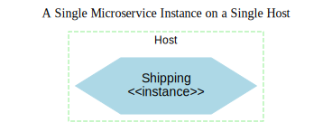
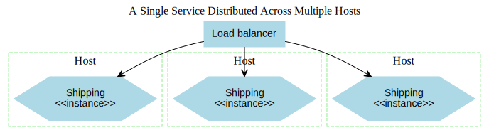
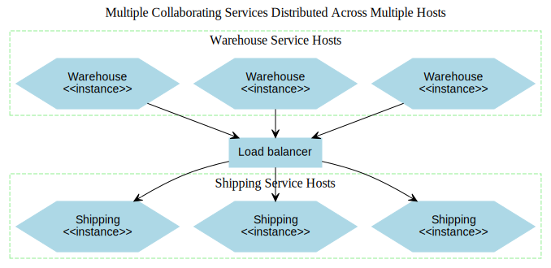
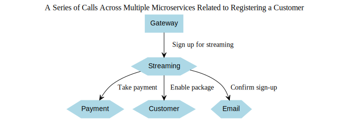
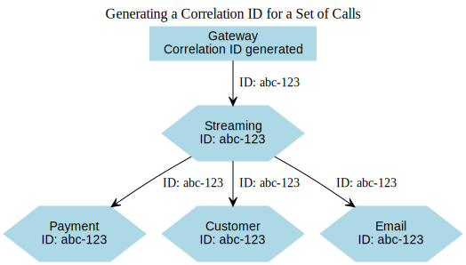

# Transitioning from Monitoring to Observability

Breaking a system into smaller, fine-grained microservices can deliver numerous advantages, as we've explored so far. However, this approach also introduces substantial new layers of complexity. Nowhere is this complexity more apparent than in understanding and managing the behavior of systems in a live production environment. Tools and practices that were effective for simpler, monolithic applications often fall short when applied to microservice architectures.

In this discussion, we’ll explore the specific challenges of monitoring microservices and examine why adopting new tools is not always enough. A fundamental shift in mindset is often required to truly comprehend what’s happening in production. We’ll delve into the growing emphasis on **observability**—the ability to ask targeted questions about a system’s behavior to diagnose issues and uncover root causes.

### The Realities of Production

The true challenges of a microservice architecture become clear only when it’s deployed in production and exposed to real-world traffic. It’s then that the complexities and potential pain points become unavoidable, underscoring the need for robust strategies to understand and manage these systems effectively.

## Chaos, Stress, and Confusion

Imagine this scenario: it’s a peaceful Friday afternoon, and your team is eagerly anticipating an early start to the weekend. Then, out of nowhere, the alerts begin flooding in. The website isn’t working properly, Twitter is exploding with complaints about your company, your boss is demanding immediate answers, and any hope of a relaxing weekend evaporates.

A tweet humorously captures the situation perfectly:

*"We replaced our monolith with microservices so that every outage could feel like solving a murder mystery."*

Identifying the root cause of the issue becomes the top priority, but this task is much harder when there are countless possible culprits.

In a traditional monolithic application, troubleshooting often starts in one obvious place: the monolith. If the website is slow, it’s probably the monolith. If errors are appearing, blame the monolith. CPU usage at 100%? Likely the monolith again. The simplicity of a single point of failure makes diagnosing issues relatively straightforward, if not entirely painless.

Now, contrast that with a microservice-based system. Here, user-facing features are distributed across multiple services, which in turn rely on other services. While this architecture has many advantages (and justifies the effort you’re putting into learning about it), it creates significant challenges in monitoring and troubleshooting. 

You’re faced with an array of servers to monitor, countless logs to analyze, and numerous points where network latency or other issues could arise. The complexity has grown, and with it, the difficulty of diagnosing problems. The surface area of failure has expanded, giving you more to examine and more places for things to go wrong.

So how can we bring order to this potential chaos? The key is to approach the problem strategically:

1. **Monitor granular details** while providing an aggregated view to understand the broader context.  
2. **Equip yourself with tools** that allow for detailed analysis and flexible data exploration during investigations.  
3. **Rethink system health** by adopting practices like testing in production to proactively identify and address vulnerabilities.

## A Single Microservice on a Single Server

Consider a straightforward scenario: a single microservice instance running on a single server. To ensure we can detect and resolve issues when something goes wrong, monitoring becomes essential. But what should we focus on?



#### Host Metrics

Start by gathering metrics from the host itself. Information like CPU usage and memory utilization can provide valuable insights into the server's performance and potential bottlenecks.

#### Logs

Next, access the logs generated by the microservice. These logs are crucial for diagnosing issues—if a user encounters an error, you should be able to trace it back through these logs to pinpoint the cause. For a setup this simple, logging directly to the server and analyzing the logs using command-line tools may suffice.

#### Application Monitoring

Lastly, it’s important to monitor the microservice’s behavior from an external perspective. At a basic level, you should track the response time to ensure the service is operating as expected. If a web server sits in front of the microservice, examining its logs could provide useful insights. For a more proactive approach, consider implementing a health check endpoint to verify the microservice's status and determine if it’s functioning correctly—something we’ll discuss in greater detail later.

As time goes on and demand grows, this simple setup may no longer suffice, leading to the need for scaling and more advanced monitoring strategies.

## Scaling a Single Microservice Across Multiple Servers

Now imagine the microservice is no longer confined to a single host—it’s distributed across multiple servers. Requests are routed to these instances through a load balancer, introducing new complexities. While the fundamentals of monitoring remain the same, the approach must now accommodate the need to isolate and diagnose issues effectively.



#### Host Metrics and Aggregation

Tracking host-level metrics like CPU usage and memory utilization remains crucial. However, it’s now necessary to determine whether a problem is systemic—affecting all hosts—or isolated to a specific server. For example, high CPU usage across all hosts might point to an issue with the microservice itself, while a spike on a single host could indicate a local issue, such as a rogue process.

To manage this, you’ll need tools capable of aggregating metrics from all hosts while still allowing you to drill down into individual servers. This approach ensures you can monitor system-wide trends and pinpoint specific problems when needed.

#### Centralized Logging

With multiple servers, the practice of logging into each host to check logs quickly becomes tedious. For a small number of servers, tools like SSH multiplexers can simplify the process by enabling you to run the same commands across all hosts simultaneously. For instance, using a simple `grep "Error"` command on the logs might help identify issues. While this manual approach might suffice initially, it will soon prove inefficient as your system scales.

Centralized log collection becomes critical at this stage. Tools that consolidate logs from multiple hosts into a single, searchable interface will save time and improve the efficiency of troubleshooting.

#### Response Time Monitoring and Load Balancer Health

Monitoring response times now involves multiple layers. Response times at the load balancer can provide insight into the overall system’s performance, while monitoring at the microservice level can reveal issues within specific instances. Additionally, if the load balancer itself becomes a bottleneck, it’s essential to monitor both its performance and that of the downstream microservices.

As the system grows, the concept of a "healthy" service becomes increasingly important. Defining and monitoring health indicators—such as latency, error rates, or custom health check endpoints—enables the load balancer to automatically remove unhealthy nodes from the rotation, ensuring the system continues to function smoothly.

By this point, you should have a clearer understanding of what a "healthy" microservice looks like, allowing you to configure your monitoring tools and load balancer effectively.

## Scaling to Multiple Services Across Multiple Servers

As illustrated in Figure 10-3, tT together to deliver functionality to users, each running on a variety of physical or virtual hosts. This introduces a new set of challenges: how do you locate the error buried in thousands of log entries spread across numerous servers? How can you determine whether an issue stems from a problematic server or a systemic fault? And how do you trace an error deep within a chain of calls between services to uncover its root cause?



#### The Role of Aggregation

Centralizing data, including metrics and logs, becomes essential in managing this complexity. Aggregation allows you to collect and organize information from all the services and hosts, providing a unified view of the system. However, gathering data is only the first step.

#### Making Sense of the Data

The real challenge lies in analyzing this massive stream of information and extracting actionable insights. It’s not just about collecting data; it’s about being able to identify patterns, correlations, and root causes quickly and effectively.

#### A Shift in Perspective

Navigating such a dynamic and distributed environment requires a fundamental shift in mindset. Moving away from static, reactive monitoring approaches, you need to embrace a proactive, observability-driven approach. This means focusing on designing systems that allow you to ask the right questions, trace issues across services, and even test in production to uncover potential weaknesses before they impact users. 

This evolution from traditional monitoring to observability is key to managing the complexities of modern, distributed systems.

## Observability vs. Monitoring

Before diving into solutions for the challenges we've discussed, it's important to clarify a term that has gained significant traction in recent years—**observability**.

Though the concept of observability has been around for decades, its application to software systems is relatively new. Observability refers to the ability to infer a system's internal state by analyzing its external outputs. It requires viewing your software as a cohesive system rather than as isolated components.

In practice, a highly observable system allows you to identify and diagnose issues more efficiently when problems arise. By analyzing external outputs, you can uncover the root cause of an issue quickly. However, achieving this often requires designing systems to produce meaningful outputs and utilizing appropriate tools to interpret them.

By contrast, **monitoring** is an action—it’s something you actively perform. Monitoring involves observing a system and collecting data. The problem arises when monitoring is approached as a task without clear goals. Simply collecting metrics and setting alerts isn't enough if you don't understand what you aim to achieve through this activity.

Traditional monitoring often involves predicting potential issues in advance and setting up alerts to notify you when those issues occur. While this works for simpler systems, it falls short in complex, distributed architectures where unexpected problems can arise. 

With a highly observable system, you’re not limited to predefined alerts. Instead, you have access to a wide range of external outputs that allow you to ask new, unanticipated questions. Observability provides the ability to explore and analyze your production system dynamically, enabling you to address challenges you couldn’t have foreseen.

In essence, monitoring is an action you take, while observability is a characteristic of the system itself. Monitoring relies on predefined rules and alerts, whereas observability empowers you to discover and resolve issues through a deeper understanding of the system's behavior.

### The Pillars of Observability? Not Quite

Some have tried to boil down the concept of observability into a few fundamental ideas, often referred to as the "three pillars": metrics, logging, and distributed tracing. Others, like New Relic, have gone a step further with acronyms like MELT (metrics, events, logs, and traces). While these frameworks might initially seem appealing (and who doesn’t love a good acronym?), I’ve come to view them as overly simplistic and somewhat misleading.

#### Observability: Beyond the Tools

Reducing observability—a property of a system—to a collection of implementation details feels backward. Observability is about understanding a system's internal behavior through its external outputs, and there are countless ways to achieve this. Focusing too much on specific tools or methodologies risks prioritizing the process over the outcome. It’s a bit like organizations adopting microservices without a clear understanding of the goals they’re trying to achieve.

Moreover, the supposed "pillars" are not always distinct. Metrics can exist within log files, and distributed traces can be reconstructed from logs. These overlaps blur the boundaries, making the separation feel arbitrary. 

#### A Note of Caution

Observability is fundamentally about making your system comprehensible through external outputs. While logs, events, and metrics are useful in achieving this, the goal is to make the system understandable—not to layer on tools for the sake of it. 

It’s tempting to view the "pillars" narrative as a marketing strategy. Vendors may push the idea that you need separate tools for metrics, logs, and traces, each with its own protocols and data formats, to check all the boxes. This approach is easier to sell, but it risks losing sight of the ultimate goal: meaningful insights and actionable understanding.

#### A More Unified Perspective

At its core, observability can be viewed as collecting and analyzing events—any external output from your system. These events might represent anything from CPU usage to failed transactions or user logins. From this unified event stream, you can derive traces, searchable indices, or aggregated metrics. While today’s tools often collect these outputs in different ways, this shouldn’t constrain how you think about understanding your system.

#### Focus on Outcomes, Not Tools

When designing for observability, think in terms of the events you need to collect and analyze, rather than being tied to specific tools or frameworks. While you may need multiple tools now to expose different types of data, this could change as the landscape evolves. By focusing on the system’s outputs and their relevance to your goals, you ensure that observability remains about understanding and improving your system, not just checking boxes.

## Key Components for Achieving Observability

What do we truly need for observability? At its core, we need to ensure our software is meeting user expectations. If something goes wrong, we want to identify the issue—ideally before users even notice. When problems do arise, our goal is to restore functionality as quickly as possible and gather enough information to understand what went wrong. This understanding allows us to prevent similar issues in the future.

In the remainder of this chapter, we’ll explore the essential components that can enhance observability in your system architecture:

- **Log Aggregation**  
  Centralizing logs across multiple microservices is a cornerstone of any monitoring or observability strategy. It enables easier troubleshooting and a unified view of system behavior.

- **Metrics Aggregation**  
  Collecting and analyzing raw numerical data from microservices and infrastructure can help detect anomalies, plan for capacity needs, and even support automated scaling.

- **Distributed Tracing**  
  Following the flow of requests across multiple microservices allows you to pinpoint failures and gain precise insights into latency issues.

- **Assessing Service Health**  
  Leveraging concepts like error budgets, service-level agreements (SLAs), and service-level objectives (SLOs) ensures your microservices continue to meet user requirements.

- **Effective Alerting**  
  Understanding what to alert on and designing meaningful alerts that provide actionable insights are critical for minimizing disruptions.

- **Semantic Monitoring**  
  Rethinking system health by focusing on what truly matters and deciding what warrants waking you up at 3 a.m.

- **Testing in Production**  
  Exploring techniques that allow you to safely test and validate changes directly in a live environment.

We’ll begin with one of the simplest yet most impactful steps: **log aggregation**. This foundational practice can significantly improve your ability to monitor and understand your system. Let’s dive in.

### Foundational Element: Log Aggregation

In even a modest microservice architecture, relying on manual methods like logging into individual machines or using SSH multiplexing to retrieve logs is impractical. Instead, a centralized log aggregation system is essential for collecting, storing, and analyzing logs from across your services and infrastructure.

#### The Importance of Logs in Distributed Systems

Logs quickly become one of the most critical tools for understanding the behavior of a production system. In simpler deployment environments, logs and their structure are often an afterthought. However, in a distributed architecture, they are indispensable. Logs not only help you diagnose problems when they arise but also alert you to the fact that an issue exists in the first place.

Centralized logging systems work by collecting logs from local files, forwarding them to a central repository, and making them available for query and analysis, as illustrated in Figure 10-4. These systems are designed to be minimally invasive to your microservices. Your services can continue logging to the local filesystem without requiring changes to use a specific API. That said, understanding the potential failure points in log shipping processes is critical, especially if you want to minimize the risk of lost logs.

#### Why Log Aggregation is a Prerequisite for Microservices

While I typically avoid prescriptive advice, this is an exception: **implementing a log aggregation tool should be considered a prerequisite for adopting a microservice architecture.** 

The reasons are twofold:  
1. **Incredible Utility**: When done correctly, log aggregation transforms logs into a powerful resource. If you treat logs as a well-structured and reliable source of information, you’ll find them invaluable—especially when paired with techniques like using correlation IDs for tracing requests across services.  
2. **Organizational Readiness Test**: Setting up log aggregation is relatively straightforward compared to many other complexities of microservice architecture. If an organization struggles with this foundational task, it may indicate a lack of readiness for the more significant challenges ahead.

#### Start Here, Expand Later

Before taking any further steps in building a microservice architecture, prioritize setting up a robust log aggregation solution. Consider this your foundation—it will save you time, effort, and headaches down the road. 

While log aggregation has its limitations and might eventually be supplemented or replaced by more advanced tools, it remains an excellent starting point. It’s a manageable first step toward establishing an observable and reliable system, and your future self will thank you for it.

### Standardized Log Format

When aggregating logs, it’s crucial to adopt a consistent log format to make querying and extracting meaningful information straightforward. Without a standard format, writing effective queries can become unnecessarily complex or even impossible. Essential elements like date, time, microservice name, log level, and other key data should always appear in consistent positions within your logs.

#### Reformatting Logs: Proceed with Caution

Some log forwarding tools allow you to reformat logs before sending them to a central log store. While this might seem convenient, it’s generally best avoided. Reformatting logs can be resource-intensive, and I’ve seen cases where it caused production issues by consuming excessive CPU resources. A better approach is to ensure that your microservices write logs in the desired format from the start. Reserve reformatting through log forwarding tools for scenarios where modifying the source log format isn’t possible, such as with legacy systems or third-party software.

#### Picking an Internal Standard

Despite the lack of a universal industry standard for logging, you can establish consistency within your own system. Many teams extend common formats, like the access log formats used by web servers such as Apache or Nginx, by adding custom columns of data. The most important thing is to select a format that works for your system and ensure all services adhere to it.

#### Simple Text Logs vs. Structured Logs

For simple logging, you might emit plain text log lines with specific data in fixed positions. For example:

```
15-02-2020 16:00:58 Order INFO [abc-123] Customer 2112 has placed order 988827  
15-02-2020 16:01:01 Payment INFO [abc-123] Payment $20.99 for 988827 by cust 2112
```

In this example:
- The timestamp is in the first two columns.
- The microservice name ("Order" or "Payment") follows.
- The log level ("INFO") comes next.

While this format is workable for many use cases, it can present challenges for certain queries. For instance, the customer ID (2112) appears in different positions depending on the log line, making it harder to write consistent queries.

To address such issues, you may consider structured logging, such as using JSON. Structured logs make it easier to consistently capture data like customer or order IDs in fixed fields:

```json
{
  "timestamp": "2020-02-15T16:00:58",
  "service": "Order",
  "level": "INFO",
  "trace_id": "abc-123",
  "customer_id": 2112,
  "message": "Customer 2112 has placed order 988827"
}
```

While structured logs are easier to parse and query programmatically, they can be harder to read manually in plain text. Additional tools may be needed to make the data human-readable.

#### Final Thoughts

Whether you choose simple text logs or structured formats like JSON, ensure that your log aggregation tool is configured to parse the logs and extract key information effectively. A standardized format is critical for simplifying debugging, monitoring, and understanding the behavior of your distributed systems.

### Linking Log Entries: The Role of Correlation IDs

In a distributed system with multiple microservices working together to fulfill user requests, a single action can trigger numerous downstream calls. For instance, imagine a customer signing up for a new streaming service, as illustrated in Figure 10-5. When the customer selects their desired package and clicks “Submit,” the request first hits a Gateway service, which forwards it to the Streaming service. The Streaming service then interacts with:
- The **Payment** service to process the initial payment,
- The **Customer** service to update the subscription status, and
- The **Email** service to send a confirmation email.



Now, suppose the Payment service encounters an unexpected error during this process. Diagnosing the root cause becomes a challenge. While the Payment service logs the error, understanding its context within the larger sequence of events can be difficult. Even if all the individual services generate log entries, without a way to connect them, the broader picture remains unclear.

#### The Power of Correlation IDs

This is where correlation IDs become invaluable. By generating a unique identifier at the start of a user request (e.g., in the Gateway), you can attach this ID to all subsequent calls within the flow. As each microservice logs its activity, the correlation ID is included consistently in the log entries. For example:

```
15-02-2020 16:01:01 Gateway INFO [abc-123] Signup for streaming
15-02-2020 16:01:02 Streaming INFO [abc-123] Cust 773 signs up ...
15-02-2020 16:01:03 Customer INFO [abc-123] Streaming package added ...
15-02-2020 16:01:03 Email INFO [abc-123] Send streaming welcome ...
15-02-2020 16:01:03 Payment ERROR [abc-123] ValidatePayment ...
```

Using correlation IDs, you can easily group all log entries related to a specific user request. This allows you to trace the full sequence of calls, identify where an error occurred, and understand its impact in the broader context.



#### Standardizing and Enforcing Correlation IDs

To effectively use correlation IDs, you must ensure every service in your architecture is configured to generate and propagate the ID throughout the call chain. This requires a standardized approach and strict adherence across the system. Once implemented, correlation IDs can unlock powerful tooling to analyze system behavior, such as:
- Identifying cascading failures or event storms,
- Diagnosing edge cases, and
- Detecting high-cost transactions by examining the complete call flow.

#### Early Implementation is Key

Although correlation IDs may seem unnecessary at first, their utility grows as your system becomes more complex. Retrofitting them into an existing system can be time-consuming and challenging, so it’s highly recommended to implement them as early as possible.

#### Beyond Correlation IDs: Distributed Tracing

While correlation IDs significantly enhance the usefulness of logs, they have limitations. For more intricate troubleshooting and performance monitoring, distributed tracing tools can provide deeper insights. However, correlation IDs are an excellent starting point, allowing you to delay the adoption of dedicated tracing tools until your system complexity justifies it.

**Tip**  
Once you have a log aggregation system in place, prioritize implementing correlation IDs. They’re easy to introduce at the start and hard to add later, but they will dramatically increase the value of your logs and improve your ability to diagnose issues effectively.

### Understanding Timing in Logs

When examining a sequence of log entries, it’s easy to assume they provide an accurate, chronological view of events, helping us determine what happened and in what order. After all, each log entry includes a timestamp—shouldn’t that be sufficient to reconstruct the sequence of events? For example, in the series of calls from Example 10-2, we see a log entry from the Gateway service, followed by logs from Streaming, Customer, Email, and finally Payment. This might lead us to believe that the calls occurred in this exact order. Unfortunately, this assumption can be misleading.

#### The Issue of Clock Skew

Log entries are created on the servers where the corresponding microservices are running, with timestamps reflecting the local clock of each machine. Once written, these logs are forwarded to a central location for aggregation and analysis. The problem arises because the clocks on different machines may not be perfectly synchronized. For example, the clock on the machine hosting the Email service might be a few seconds ahead of the one running the Payment service. This misalignment could make it appear as though an event in the Email service occurred before an event in the Payment service, even if the reverse is true.

Clock skew is a well-known challenge in distributed systems and can significantly impact our ability to reconstruct the true sequence of events. While protocols like the Network Time Protocol (NTP) are widely used to minimize clock skew, they cannot guarantee perfect synchronization. Even when NTP is working optimally, it only reduces skew, rather than eliminating it entirely. For closely spaced events, even a small discrepancy of one second between clocks can lead to a misinterpretation of the event order.

#### Limitations of Timestamps in Logs

This inherent clock skew introduces two key limitations when relying on timestamps in logs:
1. **Inaccurate Timing**: The timestamps in logs may not accurately represent the true flow of events across services.  
2. **Uncertain Causality**: It becomes difficult to determine whether one event caused another or simply happened around the same time.

#### Addressing the Problem

One potential solution to understanding the true order of events is the use of logical clocks, a concept introduced by Leslie Lamport. Logical clocks use counters to track the order of events, providing a way to infer causality. Variations of this approach exist, and it can be implemented if precise sequencing is critical.

However, for both accurate timing and event ordering, a more practical and robust solution is to use distributed tracing tools. These tools are designed specifically to address the limitations of logs by capturing the flow of calls across services and providing a detailed timeline of events.

### Available Log Aggregation Solutions

The log aggregation space is one of the most competitive areas in the tech industry, offering a wide range of tools and solutions to choose from.

#### Popular Open Source Solutions

One commonly used open-source stack involves utilizing a log forwarding agent, such as Fluentd, to send logs to Elasticsearch, with Kibana serving as the interface for querying and visualizing the log data. While this stack is widely adopted, managing Elasticsearch can be a significant challenge due to its operational overhead. However, this may be less of an issue if Elasticsearch is already part of your infrastructure for other purposes, or if you leverage a managed service.

That said, there are a couple of caveats with using this toolchain:
1. **Elasticsearch as a Database**: Although Elasticsearch is often marketed as a database, it’s fundamentally a search index—a projection of data rather than the original source of truth. Unlike traditional databases, Elasticsearch has had issues with data loss in the past, which may not be critical for logs that can be re-indexed but could pose significant risks if treated as a database. If retaining all log data is critical, ensure you can re-index logs from the original source in case of issues.
   
2. **Licensing Concerns**: Elastic, the company behind Elasticsearch and Kibana, recently changed the licensing for these tools from the widely used Apache 2.0 open-source license to the Server Side Public License (SSPL), which is not considered open source by many in the community. This change was driven by competition from cloud providers like AWS, which offered commercial services based on Elastic’s technology. In response, AWS has forked Elasticsearch and Kibana, maintaining them under the Apache 2.0 license. This licensing change has sparked controversy, particularly among contributors who believed they were supporting an open-source project.

#### Commercial and Alternative Options

Kibana was initially a strong open-source alternative to expensive commercial tools like Splunk. While Splunk is highly regarded for its capabilities, many users find it prohibitively expensive, both in terms of licensing and infrastructure costs. Despite the price, many organizations continue to see significant value in Splunk.

For those seeking alternatives, there are plenty of options, both open source and commercial:
- **Humio**: Known for its high performance and ease of use.
- **Datadog**: A popular choice for log aggregation and monitoring.
- **Cloud Provider Solutions**: Public cloud platforms offer built-in log aggregation tools, such as CloudWatch for AWS or Application Insights for Azure, which may be sufficient for simpler use cases.

#### The Wide Range of Choices

The log aggregation space offers an abundance of solutions to fit various needs, budgets, and operational preferences—ranging from open source to proprietary tools, and from self-managed to fully hosted services. Whatever your microservice architecture requirements, finding a suitable log aggregation tool should not be a significant hurdle. The key is to select a solution that aligns with your specific operational and business needs.

### Limitations of Logs

Logs are an invaluable and straightforward tool for extracting information from your running systems. For early-stage microservice architectures, few investments will provide a higher return in terms of improving production visibility. They often serve as the backbone for diagnosing issues and gathering insights. However, logs come with several significant challenges that you should keep in mind.

#### Timing and Sequence Issues

One key limitation of logs, as previously discussed, is their inability to reliably capture the sequence of events due to clock skew between machines. This discrepancy can also make it difficult to accurately determine the timing of calls in a distributed system, which in turn reduces their usefulness for diagnosing latency bottlenecks.

#### Data Overload

As your architecture grows to include more microservices and calls, the volume of log data can quickly become overwhelming. This increase can lead to:
- **Higher Costs**: Storing and processing large volumes of log data requires more hardware and resources. Additionally, some log aggregation providers charge based on usage, which can escalate costs rapidly.
- **Scaling Challenges**: Many log aggregation tools, such as Elasticsearch, rely on indexing log data to speed up queries. However, maintaining an index is computationally expensive. As the volume of logs and the size of the index grow, the system may struggle to scale effectively. For example, one team managing an Elasticsearch cluster found that it could only store six weeks’ worth of logs before hitting capacity, forcing them to constantly move data to keep the system manageable. 

To address these issues, you may need to be more selective about what you log, which can create additional work and lead to potentially omitting valuable information. Solutions like **Humio** address some of these scaling challenges by focusing on efficient data ingestion without relying heavily on indexing, making them more scalable for large volumes of data.

#### Security and Privacy Concerns

Logs often contain sensitive and valuable information, which can introduce additional challenges:
- **Access Restrictions**: To protect sensitive data, access to logs may need to be limited, which can complicate collaboration and hinder the shared ownership of production systems.
- **Security Risks**: Logs can become a target for malicious actors. If they contain sensitive data, a breach could lead to significant consequences. To mitigate this, you may need to avoid logging certain types of information altogether, as data that isn’t stored cannot be stolen.

#### Conclusion

While logs remain a critical component for observability, their limitations highlight the need for thoughtful planning and implementation. Understanding these shortcomings allows you to optimize your logging strategy, ensuring you maximize their value while minimizing the risks and challenges associated with their use.

### Aggregating Metrics for Better Insights

Just as with logs, it’s essential to find more effective ways to gather and analyze data about your systems when working in a complex environment. However, interpreting metrics isn’t always straightforward. For example, if your website is experiencing 50 HTTP 4XX errors per second, is that a red flag? Or if the CPU usage on your catalog service jumps by 20% since lunch, does it indicate a problem? The key to answering these questions is to collect metrics over a sufficiently long period to establish patterns and understand what “normal” looks like.

#### Collecting Metrics in Dynamic Environments

In modern systems, where new instances of microservices are frequently spun up, the tools you use must make it easy to collect metrics from new hosts automatically. You’ll also want to view metrics in different scopes, such as:
- **System-wide metrics**: Aggregated across all services (e.g., average CPU load).
- **Service-specific metrics**: Aggregated for all instances of a particular service.
- **Instance-specific metrics**: Isolated to a single service instance.

This requires associating metadata with each metric to enable flexible filtering and aggregation.

#### Using Metrics for Capacity Planning

One of the most valuable uses of metrics is capacity planning. By analyzing trends, you can answer critical questions like:
- Are we nearing resource limits?
- How long do we have before scaling becomes necessary?

In the past, capacity planning involved annual forecasting for physical servers. Today, with cloud infrastructure, scaling up or down can happen in seconds. By understanding usage patterns, you can ensure that your infrastructure remains cost-efficient and responsive to demand, avoiding both overprovisioning and underprovisioning.

#### Different Data Resolutions for Different Needs

Metrics often need to be stored and reported at varying levels of granularity:
- **High-resolution data**: For real-time analysis, such as reacting to a spike in CPU usage, you might sample metrics every 10 seconds over the past 30 minutes.
- **Low-resolution data**: For historical trend analysis, such as assessing last month’s performance, hourly averages might suffice.

This practice helps reduce data storage costs and improve query performance, but it comes at a cost—aggregation can result in information loss. Deciding in advance what data to aggregate and what detail to sacrifice requires careful planning, as it may limit your ability to extract certain insights later.

#### Limitations of Standard Metrics Tools

Traditional metrics tools are excellent for identifying trends and diagnosing simple failure scenarios. They’re often indispensable in these contexts. However, they can fall short when it comes to making systems more observable. Standard tools may constrain the kinds of questions you can ask by focusing only on straightforward metrics like response times, CPU usage, or disk utilization. The real value comes when you move beyond these basic metrics to think creatively about the types of data that would provide deeper insights into your system’s behavior.

#### Final Thoughts

While metrics aggregation is critical for understanding system trends, diagnosing issues, and planning capacity, it’s important to think beyond the basics. By designing your metrics collection to capture meaningful, actionable data and allowing for flexible analysis, you can ensure your system remains both observable and adaptable to changing demands.

### Understanding Low vs. High Cardinality in Observability

Many modern tools are designed to handle the challenges of storing and querying high-cardinality data, but it’s important to understand what cardinality means in this context. Cardinality refers to the number of unique fields or dimensions in your data that you might want to query. The more fields or attributes you need to analyze, the higher the cardinality your system must support. However, this becomes particularly challenging in time-series databases due to the way many of these systems are architected.

#### What Does High Cardinality Look Like?

Consider a scenario where you want to track and query data such as:
- The name of the microservice,
- Customer ID,
- Request ID,
- Build number of the software, and
- Product ID.

On top of that, you might also want to capture system-level details like the operating system, system architecture, cloud provider, and more. As the number of attributes or dimensions grows, so does the cardinality, and traditional systems not designed for high cardinality may struggle to handle this complexity.

As Charity Majors, founder of Honeycomb, explains, this boils down to how metrics and their associated metadata (tags) are stored. A metric itself is relatively lightweight—a simple number with a name. However, each tag (the metadata) adds overhead to the system. Storing a small number of metrics is cheap, but adding many tags per metric creates a "write explosion," which can quickly overwhelm traditional storage engines.

#### Low Cardinality Systems and Their Limitations

Systems optimized for low cardinality, like Prometheus, are excellent for handling simple metrics, such as tracking CPU usage on a specific machine. These systems are efficient and well-suited for traditional metrics storage and querying. However, they have clear limitations when it comes to high-cardinality data. Even the Prometheus documentation advises against using labels for attributes with unbounded cardinality, such as user IDs, email addresses, or any other field with a vast number of unique values. Each unique combination of labels creates a new time series, which can lead to an explosion of stored data.

#### Why High Cardinality Matters

High-cardinality systems allow for far greater flexibility, enabling you to ask more nuanced questions about your system—often questions you didn’t anticipate needing to ask. This level of flexibility is particularly valuable in complex, distributed environments, where traditional tools may not provide the necessary depth of insight. As systems grow in complexity, it becomes critical to collect richer data and use tools capable of handling and analyzing that data effectively.

For those accustomed to simpler monolithic architectures, the need for high-cardinality data may not initially seem obvious. Even in larger systems, many teams have historically relied on low-cardinality tools because they had no alternative. However, as your system evolves, improving its observability will require capturing more detailed information and adopting tools that allow you to explore that data in flexible, dynamic ways.

#### Final Thoughts

Low-cardinality tools can work well for simpler use cases, but as your system grows in scale and complexity, they may become a bottleneck. Embracing high-cardinality systems not only enables more detailed analysis but also equips you to handle unforeseen challenges and questions, ultimately improving the observability of your system.

### Metrics Tools and Their Evolution

Since the first edition of this book, Prometheus has gained significant popularity as an open-source solution for collecting and aggregating metrics. In many cases, where Graphite was previously recommended, Prometheus now serves as a practical alternative. Meanwhile, the commercial landscape for metrics aggregation has grown substantially, with both new and established vendors tailoring their tools to support the needs of microservice architectures.

#### High vs. Low Cardinality Considerations

It’s essential to keep in mind the differences between low- and high-cardinality data. Tools designed for low-cardinality use cases can be extremely difficult—if not impossible—to adapt for high-cardinality scenarios. If your system requires handling high-cardinality data for deeper insights and more advanced observability, tools like **Honeycomb** and **Lightstep** are worth considering. While these platforms are often associated with distributed tracing (a topic we’ll discuss in detail later), they are highly effective at storing, filtering, and querying high-cardinality data, enabling a broader range of questions to be asked about your system's behavior.

#### Monitoring and Observability Tools as Production Systems

As you adopt tools to manage your microservices, it’s critical to treat them as production systems in their own right. Whether it’s a log aggregation platform, a distributed tracing tool, or an alerting system, these tools are just as vital as the applications you build and maintain. They enable you to keep your software running smoothly and troubleshoot issues effectively. Consequently, these observability and monitoring systems deserve the same level of care, maintenance, and diligence as your core production software.

#### Security Risks and the Need for Vigilance

Observability tools can also introduce potential security risks, making them an attractive target for attackers. For example, at the time of writing, a major breach was uncovered in the SolarWinds network management software. This breach, believed to be a supply chain attack, allowed malicious actors to exploit software installed in customer environments. Given that SolarWinds was used by 425 of the US Fortune 500 companies—including the US Treasury—this attack highlights the critical need to secure monitoring and observability systems. Protecting these tools is essential to ensuring the integrity of your infrastructure and safeguarding against external threats.

### Final Thoughts

Whether you're using open-source solutions like Prometheus or more advanced commercial tools like Honeycomb and Lightstep, selecting the right observability platform depends on your system's specific needs, particularly in terms of cardinality. At the same time, don’t forget that these tools are as crucial to your production environment as the systems they monitor, and they must be secured and maintained with the same level of rigor.

### Understanding Distributed Tracing

Up until now, we've primarily focused on collecting data points in isolation, even when they are aggregated. However, understanding the broader context in which this information is captured is just as crucial. A microservice architecture inherently involves a network of processes collaborating to complete specific tasks. As discussed earlier, these processes often coordinate their activities in various ways. To truly grasp how your system behaves in a production environment, it’s vital to uncover the relationships and interactions between these microservices. This perspective allows you to better understand system performance, evaluate the impact of potential issues, and identify the root causes of unexpected behaviors.

#### The Need for Tracing in Complex Systems

As systems grow more intricate, it's essential to trace the flow of requests and interactions across services. This requires pulling together disparate pieces of data to create a cohesive view of correlated calls. While using correlation IDs in logs is a great starting point, it has its limitations. For instance, it often necessitates building custom tools to visualize and analyze the data, which can quickly become cumbersome and insufficient for complex architectures. This is where distributed tracing becomes invaluable.

#### What is Distributed Tracing?

Distributed tracing provides a structured and comprehensive way to track requests as they move through different microservices in your system. By stitching together data from multiple services, it offers a unified view of the entire request lifecycle. This not only simplifies the task of diagnosing issues but also helps you optimize system performance by identifying bottlenecks and dependencies.

Distributed tracing tools are designed to address the challenges of modern, distributed systems, offering insights that go far beyond what traditional logging and correlation IDs can achieve. By adopting distributed tracing, you gain a powerful mechanism to understand the interactions and dependencies within your system, ensuring smoother operations and faster resolution of issues.

### How Distributed Tracing Works

While the specific implementations of distributed tracing tools can differ, they generally operate using a similar underlying approach. Each activity within a local thread is recorded as a **span**, which represents a single unit of work. These spans are tied together using a unique identifier to establish their relationship. The spans are then sent to a centralized collector, where they are combined to form a complete **trace**, illustrating the flow of operations across the microservice architecture. 

For example, in Figure 10-7, a trace visualized in Honeycomb provides insights into where time is being spent within a set of operations spanning multiple services.

#### What is Captured in a Span?

Spans serve as the fundamental building blocks of a distributed trace and can capture a wide range of information. The specifics depend on the protocol in use, but in the case of the OpenTracing API, each span typically includes:
- **Start and end times** to track duration,
- A set of associated logs,
- Key-value pairs for additional metadata, such as customer ID, order ID, hostname, or software build number, which can be used for filtering and querying later.

#### The Impact of Trace Collection on System Performance

Collecting the data required for tracing inevitably impacts the system's performance, making it necessary to adopt **sampling strategies**. Sampling involves excluding certain data from trace collection to maintain system performance while still gathering meaningful insights. The challenge lies in ensuring the right data is captured, even when some information is intentionally dropped.

#### Sampling Strategies

Sampling can range from simple random sampling to more sophisticated dynamic approaches:
- **Random Sampling**: This basic method selects a fixed percentage of requests to sample. For example, Google’s Dapper system, which inspired many modern tracing tools, employed aggressive random sampling by capturing only a small percentage of requests. Similarly, Jaeger’s default setting captures only 1 out of every 1,000 requests.
- **Dynamic Sampling**: Tools like Honeycomb and Lightstep enable more advanced sampling strategies. For instance, you might choose to sample all requests that result in errors while only sampling 1 in 100 successful requests if they are largely identical. This targeted approach ensures you collect more relevant data without overloading the system.

#### Balancing Data Collection and System Performance

The goal of distributed tracing is to provide meaningful insights into system behavior without overwhelming the system itself. By leveraging thoughtful sampling strategies and collecting relevant metadata, distributed tracing tools help you achieve observability while maintaining system performance. This makes it possible to identify bottlenecks, understand dependencies, and resolve issues in complex, distributed architectures.

### Setting Up Distributed Tracing

Implementing distributed tracing for your system involves a few key steps. Here's what you'll need to get started:

#### Capturing Span Data

First, you need to collect **span information** within your microservices. Spans are the building blocks of a trace, capturing details about specific operations. Many third-party libraries and frameworks already provide built-in support for standardized APIs like **OpenTracing** or the newer **OpenTelemetry API**. For instance, they may automatically record information about HTTP requests or other routine operations. However, even with this built-in functionality, you’ll likely need to instrument your own code to provide additional insights tailored to what your microservices are doing at various points in time.

#### Forwarding Span Data to a Collector

Once span data is captured, it needs to be sent to a central **collector**. While you can send this data directly from your microservice to the collector, it’s more common to use a **local forwarding agent**. Similar to log aggregation systems, a local agent runs alongside your microservices, buffering and periodically sending span data to the central collector. This approach offers several advantages:
- **Improved buffering** to reduce network overhead.
- The ability to dynamically adjust sampling rates.
- The capability to enrich spans with additional metadata (tags) before forwarding.

#### Setting Up a Central Collector

Finally, you’ll need a central **collector** to receive, store, and process the span data. This collector is responsible for piecing together individual spans into complete traces, providing a unified view of system activity.

#### Tooling Options

In the open-source ecosystem, **Jaeger** is a widely adopted choice for distributed tracing, offering robust features for collecting and visualizing traces. On the commercial side, tools like **Lightstep** and **Honeycomb** are highly regarded for their advanced tracing capabilities. 

#### The Importance of OpenTelemetry

When selecting a tracing solution, it’s highly recommended to choose one that supports the **OpenTelemetry API**. OpenTelemetry is an open specification designed to standardize observability practices. It enables easier integration with libraries, frameworks, and tools (e.g., database drivers and web frameworks) that provide out-of-the-box support for tracing. Additionally, it ensures vendor portability, allowing you to switch between tracing solutions without significant effort. OpenTelemetry builds upon the foundations laid by earlier APIs like OpenTracing and OpenConsensus, and it enjoys broad support across the industry.

#### Conclusion

By setting up distributed tracing with thoughtful instrumentation, reliable forwarding mechanisms, and robust collection tools, you can achieve deeper observability into your system. Leveraging OpenTelemetry further ensures a future-proof and flexible implementation, capable of adapting to evolving tracing requirements.

### Are We Performing Well Enough?

As system operators, we’ve discussed the mindset and the type of information you should gather to monitor your systems effectively. But how can you determine whether your efforts are sufficient—or even necessary? How do you evaluate whether your system is performing adequately?

#### Beyond “Up” or “Down”

In simple systems, such as single-process monoliths, system health often feels binary: it’s either “up” or “down.” However, in distributed systems, these black-and-white definitions lose their clarity. For instance:
- If one instance of a microservice becomes unreachable, does that constitute a failure?
- Is a microservice considered “healthy” just because it’s accessible?
- What if a microservice, like the **Returns** service, is operational, but half of its functionality relies on a downstream **Inventory** service that’s currently facing issues? Is the **Returns** service healthy or not?

As systems grow more complex, evaluating their health requires a broader perspective—one that considers the system as a whole rather than just its individual components.

#### A Holistic Approach to Health

Think of your system like a beehive. Assessing the health of an individual bee, such as one that has lost a wing and can no longer fly, doesn’t provide meaningful insights into the hive’s overall health. Similarly, in distributed systems, the status of a single component often doesn’t reflect the health of the entire system. Instead, you need to evaluate the system holistically, considering how its components interact and contribute to its overall functionality.

#### Defining Health Metrics

You can attempt to measure service health using specific metrics, such as CPU usage or response times. Alerts can be triggered when values fall outside predefined thresholds. However, these metrics often fail to directly answer the more fundamental question: **Is the system functioning as expected?** The more interconnected your services are, the harder it becomes to answer this question by relying on isolated metrics alone.

To truly determine whether your system is “working,” you need to shift your focus toward defining acceptable behavior for the system as a whole. This involves going beyond raw data points and thinking in terms of broader service-level objectives.

#### Drawing Insights from Site Reliability Engineering (SRE)

Site reliability engineering (SRE) offers valuable approaches to answering the question of system health. The SRE discipline focuses on ensuring systems remain reliable while accommodating change, introducing concepts that help define and maintain acceptable behavior.

Get ready—we’re about to dive into a world of acronyms that will help frame these ideas and provide practical tools for evaluating system performance.

### Understanding Service-Level Agreements (SLAs)

A **Service-Level Agreement (SLA)** is a formal agreement between those who provide a system and those who use it. It defines the baseline level of performance and reliability that users can expect, along with the consequences or remedies if these expectations are not met. SLAs often outline the "bare minimum" acceptable standards—standards that, if barely met, may still leave users dissatisfied.

#### SLAs in Practice

Take AWS as an example. AWS offers an SLA for its compute service, EC2, which states there is effectively no guarantee for the uptime of a single EC2 instance. While AWS aims to ensure 90% uptime for a given instance, its SLA specifies that if this target is not met, the remedy is simply a refund for the affected hour of downtime. In theory, if your EC2 instances consistently fail to meet 90% availability, AWS would issue refunds for the downtime—but that wouldn’t address the significant instability this would cause in your systems. 

The reality is that SLAs often set a baseline, and providers generally aim to deliver performance that far exceeds these minimum thresholds. For instance, in my experience, AWS typically achieves uptime levels much higher than what its SLA guarantees, as is often the case with many service providers.

#### SLAs as a Baseline, Not a Goal

While SLAs provide a framework for defining acceptable system behavior, they should not be viewed as the ultimate goal. Instead, they represent a safety net, ensuring accountability and providing users with remedies in the event of poor service. To truly ensure user satisfaction, systems often need to perform well beyond what is specified in the SLA.

### Understanding Service-Level Indicators (SLIs)

To evaluate whether your Service-Level Objectives (SLOs) are being met, you need to rely on concrete, measurable data—this is where **Service-Level Indicators (SLIs)** come into play. An SLI is a metric that quantifies a specific aspect of your system's performance or behavior.

#### What SLIs Measure

SLIs capture measurable actions or outcomes within your software. Examples include:
- The response time of a particular process,
- The successful registration of a customer,
- The frequency of errors encountered by users, or
- The number of orders successfully placed.

#### The Role of SLIs

By collecting and monitoring these indicators, you can determine how well your system is performing relative to the defined SLOs. SLIs provide the visibility and insight needed to ensure that your objectives are being met and that your system is delivering the expected level of service.

### Understanding Alerting in Microservices

Occasionally—hopefully not too often, but likely more often than desired—issues will arise in your systems that require immediate human intervention. These could include scenarios like a microservice becoming unexpectedly unavailable, an unusual spike in error rates, or even a complete system outage affecting users. In such cases, it's essential to notify the appropriate personnel so they can address the issue.

#### The Challenge in Microservice Architectures

In a microservice environment, the complexity of the system introduces additional challenges. With a higher volume of calls, a greater number of individual processes, and a more intricate infrastructure, things are bound to go wrong from time to time. The key challenge lies in determining:
1. **What warrants an alert**: Not every problem requires a human response. Deciding which issues are significant enough to trigger alerts is critical to avoid alert fatigue.
2. **How alerts are delivered**: Alerts need to be timely, actionable, and routed to the right people or teams to ensure effective resolution.

By carefully defining what constitutes an alert and optimizing the alerting process, you can strike a balance between responsiveness and avoiding unnecessary interruptions, ensuring your team stays focused while maintaining system reliability.

### Not All Problems Are Created Equal

When things go wrong in a system, it’s natural to want to be informed—but should every issue demand immediate attention? Are all problems equally urgent? As the number of potential failure points increases in complex systems, prioritizing these issues becomes essential to determine whether human intervention is needed and, if so, how quickly.

One of the most critical questions to ask when setting up alerts is, **"Should this issue wake someone up at 3 a.m.?"**

#### A Real-World Example from Google

Years ago, during a visit to Google’s campus, I noticed a fascinating exhibit in one of their reception areas: an old server rack. The servers were unlike what you’d typically expect. Instead of being housed in enclosures, they were bare motherboards slotted into the rack. What caught my eye, however, was the hard drives—they were attached with Velcro instead of screws. When I asked about this, a Googler explained, “Hard drives fail so often that we don’t bother screwing them in. We just rip them out, throw them away, and Velcro in a new one.”

Google's systems were designed to assume hard drive failures as routine. Their infrastructure was optimized so that replacing a failed drive was simple and efficient. Since the system was built to tolerate these failures, a single hard drive failure rarely impacted users. While it was important to replace faulty drives eventually, this task could wait until regular business hours. In their data centers, replacing drives was part of someone’s daily routine—hard drive failures were treated as expected, low-priority issues that didn’t justify an after-hours alert.

#### Prioritizing Alerts

As your system grows in complexity and the number of potential problems increases, the ability to prioritize becomes critical. Not all alerts are urgent or worthy of disrupting someone’s sleep. Some issues can be addressed during regular hours without any significant impact on the system or its users. If you fail to distinguish between routine and urgent problems, you risk overwhelming your team and losing focus on what truly matters.

#### Key Takeaway

Building a system that can tolerate certain types of failures is crucial, but equally important is designing an alerting system that reflects the varying levels of urgency. By categorizing problems and determining their priority, you ensure that only the most critical issues demand immediate attention, while routine ones are handled as part of regular operations.

### Understanding Alert Fatigue

Too many alerts can overwhelm operators, leading to serious consequences. A notable example occurred in 1979 during the partial meltdown at the Three Mile Island nuclear power plant in the US. Investigations revealed that operators were inundated with so many alerts that they couldn’t determine which issues required immediate action. Although there was an alert indicating the root cause of the problem, it was buried in a sea of other notifications, rendering it ineffective. During a public hearing, operator Craig Faust described the alert panel as unhelpful, stating, “I would have liked to have thrown away the alarm panel. It wasn’t giving us any useful information.” The incident report concluded that the control room was inadequately designed to handle such emergencies.

A more recent example of alert fatigue involves the 737 Max aircraft incidents, which included two crashes that resulted in the loss of 346 lives. An investigation by the US National Transportation Safety Board (NTSB) highlighted the confusion caused by multiple, simultaneous alerts triggered during system failures. The report emphasized the importance of helping operators—pilots, in this case—prioritize actions in highly integrated systems. It stated:

> "In non-normal conditions, such as those involving system failures with multiple alerts requiring various actions, it is critical to provide clear guidance on which actions take priority. This is especially true for interconnected systems where a single failure can generate multiple alerts from interacting subsystems."

#### Lessons for IT Systems

While most of us aren’t operating nuclear reactors or designing aircraft, there are valuable lessons to be learned from these incidents. Both examples involve complex, interdependent systems where failures in one area can cascade into others. When operators are overwhelmed with alerts and lack the ability to prioritize, the consequences can be severe. Excessive alerts can narrow an operator’s focus, deplete mental resources, and lead to delayed or poorly prioritized responses.

From the NTSB report:

> "Multiple competing alerts may exceed available mental resources, narrowing attentional focus and leading to delayed or inadequately prioritized responses."

The takeaway? Simply adding more alerts to an operator’s dashboard is unlikely to yield the desired outcome—and could lead to confusion or inaction instead.

#### Alarms vs. Alerts: Clarifying Terminology

In exploring the broader topic of alerting, I found that the terms “alarm” and “alert” are often used interchangeably across industries. However, in IT, "alert" is the more common term. While some people draw distinctions between the two terms, these distinctions are inconsistent. For the sake of clarity and standardization, I’ve opted to use the term **alert** throughout this discussion.

#### Final Thoughts

Alert fatigue is a real problem, even in IT systems. By overwhelming operators with too many alerts, you risk reducing their ability to respond effectively to critical issues. The key is to prioritize and streamline alerts to ensure operators can focus on the most important problems, avoiding unnecessary confusion and ensuring timely, effective action.

### Understanding Semantic Monitoring

Semantic monitoring involves defining a model that outlines the acceptable behavior or "semantics" of your system. In other words, it focuses on determining the key properties your system must exhibit to be considered as operating correctly. This approach requires a shift in perspective—from simply identifying the presence of errors to asking a more fundamental question: **Is the system behaving as expected?** By focusing on overall behavior, semantic monitoring helps you better prioritize how to handle the errors that do arise.

#### Building a Model for Correct System Behavior

The first step in semantic monitoring is to establish a model that defines what constitutes correct behavior for your system. This model doesn't need to be overly formal, although some organizations use formal methods for this purpose. Even simple, high-level statements about expected system behavior can provide valuable guidance. For instance, in the case of MusicCorp, the system might be considered to be functioning correctly if:
- **New customers can successfully register.**
- **Sales exceed $20,000 per hour during peak times.**
- **Orders are being shipped at a normal, expected rate.**

These statements serve as benchmarks to evaluate whether the system is meeting expectations. While they align with SLAs (Service-Level Agreements) and SLOs (Service-Level Objectives), semantic monitoring often goes beyond these minimum obligations to ensure the system is performing well in a broader context.

#### Defining Semantic Monitoring Goals

A critical challenge in semantic monitoring is gaining consensus on what the "correct behavior" model should be. Unlike low-level metrics like "disk usage must stay below 95%," semantic monitoring focuses on higher-level objectives that reflect the overall functionality of the system. For example:
- Are key business processes, such as customer registrations and product sales, running smoothly?
- Are critical user interactions meeting predefined performance benchmarks?

As the operator or developer of the system, you might not have the full context to define these higher-level goals. This is where collaboration with product owners becomes essential. It may fall on you to initiate and facilitate these discussions to ensure the monitoring model aligns with business priorities.

#### Verifying System Behavior

Once you've defined the model for expected system behavior, the next step is to evaluate whether the system meets those expectations. This can be achieved through two main approaches:
1. **Real User Monitoring (RUM)**: Observing real user interactions with the system to assess its behavior under actual conditions.
2. **Synthetic Transactions**: Simulating user interactions to test whether the system behaves as expected. This technique, often categorized under testing in production, will be explored further.

By implementing semantic monitoring, you shift the focus from detecting isolated errors to assessing whether the system as a whole aligns with your defined expectations. This approach not only enhances your ability to prioritize and resolve issues but also ensures the system continues to deliver value to users.

### Understanding Real User Monitoring (RUM)

Real User Monitoring (RUM) involves observing the actual behavior of your production system and comparing it to the expected behavior defined in your semantic model. For instance, at MusicCorp, this might involve tracking the number of customers signing up, the volume of orders processed, or total sales during a given period.

#### Challenges of Real User Monitoring

One of the primary challenges with RUM is ensuring timely access to the data you need. For example, if MusicCorp expects to sell at least $20,000 worth of products per hour, but this information is buried in a database, it may not be readily available for monitoring or alerts. To address this, it's essential to make business-related metrics more accessible to your production tooling. Just as you might log CPU usage into a metrics store for alerting, you could also record sales events and their dollar values into the same system. This integration enables quicker access and response to key performance indicators.

#### Drawbacks of Real User Monitoring

While RUM provides valuable insights, it comes with notable limitations:
1. **Information Overload**: Real user monitoring generates a large volume of data, making it difficult to sift through and identify issues efficiently.
2. **Reactive Nature**: RUM reflects what has already happened, meaning you may only become aware of problems after they’ve affected users. For example, if a customer fails to register successfully, the issue is detected only after the customer has experienced the problem—potentially leading to dissatisfaction.

#### Complementing RUM with Synthetic Transactions

To overcome these drawbacks, synthetic transactions—another form of production testing—can serve as a valuable complement to RUM. Synthetic transactions simulate user interactions, helping identify issues proactively and reducing the noise associated with real user data. This allows teams to catch potential problems before they impact actual users, offering a more balanced approach to monitoring system behavior.

### The Value of Testing in Production

> "Not testing in production is like not practicing with the full orchestra because your solo sounded fine at home."  
> – Charity Majors

Testing in production is a highly valuable—and often misunderstood—practice. As we’ve explored throughout this book, from **canary deployments** in *“Canary Release”* to balancing pre- and post-production testing strategies, testing in production can be both safe and incredibly effective. While some view it as risky, it’s worth noting that many teams engage in forms of testing in production without even realizing it.

#### Why Test in Production?

All forms of testing in production can be considered extensions of monitoring. The goal is to confirm that your production environment is behaving as expected. This approach is especially powerful for identifying issues before they affect users. By testing directly in the live environment, you gain insights that are often impossible to replicate in pre-production settings, allowing you to detect and address problems more effectively.

#### Common Forms of Testing in Production

Over the course of this book, we’ve discussed several testing strategies that involve live environments. While there are many approaches, here’s a recap of some we’ve covered, along with a few additional examples commonly used in the industry:
- **Canary Deployments**: Gradually rolling out changes to a subset of users to test for issues.
- **Synthetic Transactions**: Simulating user interactions to detect potential problems before real users experience them.
- **A/B Testing**: Experimenting with different features or designs to assess user response.
- **Feature Toggles**: Activating or deactivating features in real time to test functionality without redeploying.
- **Chaos Engineering**: Intentionally introducing failures to evaluate system resilience.

#### Overcoming the Fear of Testing in Production

Many teams are apprehensive about testing in production due to the perceived risks. However, when implemented carefully and thoughtfully, it can be one of the most reliable ways to ensure your system operates as expected in real-world conditions. In fact, much of what we already do in monitoring can be seen as a form of production testing. Testing in production not only enhances confidence in system reliability but also allows teams to identify and address issues before they become visible to users.

### Understanding Synthetic Transactions

Synthetic transactions involve simulating user behavior in a production environment with controlled inputs and expected outcomes. These artificial interactions allow you to monitor your system’s performance and detect issues before real users are impacted. For instance, at MusicCorp, you could create a synthetic transaction that generates a new customer account and verifies that the account was successfully created. These transactions are typically executed at regular intervals to identify problems as quickly as possible.

#### A Practical Example

I first encountered the use of synthetic transactions back in 2005 while working with a Thoughtworks team on a project for an investment bank. The system we were building needed to process market event data throughout the trading day, calculating the impact of these events on the bank’s portfolio. The goal was to complete all calculations within 10 seconds of receiving an event. 

The system was complex, consisting of multiple services, including one that leveraged a computing grid using idle CPU cycles across approximately 250 desktop machines in the bank’s disaster recovery center. Given the tight deadlines and numerous moving parts, we couldn’t rely solely on low-level metrics like CPU usage or response times to understand system health—especially since we didn’t have the luxury of gradually scaling the system or learning baseline performance over months of use.

Our solution was to generate synthetic transactions in the form of fake events. These events priced a section of the portfolio that wasn’t connected to downstream systems. Every minute, we used a tool called Nagios to insert a synthetic event into one of our queues. The system processed it like any other event, with the results logged in a "junk" book designated for testing purposes. If the system didn’t complete the required calculations within a specific time frame, Nagios flagged it as an issue.

#### Benefits of Synthetic Transactions

In my experience, synthetic transactions are an excellent tool for semantic monitoring. They provide a clearer, more actionable indicator of system health than lower-level metrics like CPU rates or response times. While synthetic transactions won’t replace the need for detailed low-level metrics—those are still essential for diagnosing why a synthetic transaction might fail—they are highly effective for identifying issues early and ensuring your system is operating as expected. 

By injecting fake interactions into your production environment, synthetic transactions enable you to catch problems proactively, offering a critical safeguard for maintaining system reliability.

### Implementing Synthetic Transactions

Historically, implementing synthetic transactions was a complex and time-consuming task. Thankfully, advancements in tools and practices have made this much more accessible. If you're already running tests for your systems—and you absolutely should be—you’ve likely got most of what you need to start incorporating synthetic transactions into your monitoring approach.

#### Leverage Existing Tests for Monitoring

Take a look at your existing end-to-end tests, whether they evaluate individual services or your entire system. These tests already interact with your system and validate expected outcomes. By running a subset of these tests on an ongoing basis, you can repurpose them for semantic monitoring in production. Essentially, you're using the hooks and checks already built into your tests to ensure the system continues to operate as intended in real-time.

#### Key Considerations for Implementation

1. **Data Management**: 
   Your tests might rely on specific data, which could change in a live environment. To address this, consider:
   - Designing tests that adapt to variations in live data.
   - Using a controlled dataset or a predefined set of fake users with known attributes to ensure consistent results.
   
2. **Avoiding Side Effects**: 
   Running tests in production comes with risks, particularly the potential for unintended consequences. For example, a misconfigured test could mistakenly perform real actions in the production environment, like placing actual orders. A cautionary tale comes from an ecommerce company that accidentally triggered its production ordering system during testing—resulting in dozens of washing machines being delivered to their head office. Careful planning and safeguards are essential to prevent such incidents.

#### Making Synthetic Transactions Work for You

By repurposing your existing tests as synthetic transactions, you can turn testing into a powerful, proactive monitoring tool. However, it's crucial to design and execute these transactions carefully, ensuring they interact with production in a way that validates functionality without introducing unnecessary risks. Done correctly, synthetic transactions can help identify issues before they impact users, adding an invaluable layer of protection to your production environment.

### Understanding A/B Testing

A/B testing involves deploying two variations of the same feature or functionality, with different users exposed to either version "A" or version "B." This approach allows you to compare how each version performs and determine which one delivers better results. 

A/B testing is particularly useful when evaluating different strategies for implementing a specific feature. For instance, you might test two distinct designs for a customer registration form to identify which one achieves higher sign-up rates or provides a smoother user experience. This data-driven method enables teams to make informed decisions and optimize their systems based on real user behavior.

### Canary Release

In a canary release, a new feature or functionality is initially rolled out to a small subset of users. This controlled release allows you to observe how the new version performs in a real-world setting. If everything operates as expected, you can gradually expand the rollout to include more users until the new version is available to everyone. However, if issues arise, the impact is limited to a smaller audience, making it easier to either revert the change or address the identified problems before a wider release. This approach minimizes risk while enabling real-time testing and feedback.

### Parallel Run

A parallel run involves operating two equivalent implementations of the same functionality simultaneously. When a user makes a request, it is sent to both versions, but the user only experiences the output from one of them. This approach enables you to compare the results produced by the two versions in real-time, without impacting the user experience. Parallel runs are particularly valuable when evaluating factors like the performance or load handling capabilities of a new implementation of critical functionality. This method ensures a thorough analysis of the new version's behavior under real-world conditions while maintaining a seamless experience for users.

### Smoke Tests

Smoke tests are executed after deploying software to the production environment but prior to its release to users. Their primary purpose is to confirm that the software is functioning correctly. These tests are typically automated and can vary in complexity—from simple checks to ensure a microservice is operational, to more comprehensive tests involving simulated user interactions or synthetic transactions. Smoke tests serve as an initial validation step to catch any major issues before the software becomes fully available to end users.

### Synthetic Transactions

Synthetic transactions involve simulating a complete, artificial user interaction within the system. These interactions closely resemble the end-to-end tests commonly used in software development, mimicking real user behaviors to assess the system's performance and functionality.


### Chaos Engineering

Chaos engineering involves deliberately introducing faults or disruptions into a production system to verify its ability to handle unexpected issues effectively. This practice ensures that the system is resilient and capable of maintaining functionality despite these disruptions. One of the most well-known examples is Netflix's **Chaos Monkey**, a tool designed to randomly disable virtual machines in the production environment. The goal is to confirm that the system is robust enough to continue operating without impacting the end-user experience. This concept, emphasizes proactive testing of system resilience under real-world conditions.

## Emphasizing Standardization

As discussed earlier, one of the key challenges in managing microservices is finding the balance between allowing service-specific decisions and enforcing system-wide standardization. Monitoring and observability are areas where standardization plays a crucial role. In a distributed system where microservices work together using various interfaces to deliver user capabilities, a holistic view of the system becomes essential.

#### The Importance of Consistency

Standardizing practices such as logging formats and metric naming conventions is vital. For instance:
- Logs should adhere to a consistent format to facilitate easier aggregation and analysis.
- Metrics should be stored in a centralized location and follow a unified naming convention. It's inefficient and frustrating to have one service use a metric labeled `ResponseTime` while another uses `RspTimeSecs` for the same measurement.

#### Leveraging Tools for Standardization

As with any standardization effort, having the right tools can simplify the process. Providing a platform with built-in capabilities—such as centralized log aggregation or predefined metrics—encourages teams to adopt best practices effortlessly. The goal is to make it as straightforward as possible to "do the right thing." 

In many organizations, the responsibility for enabling such standardization often falls to the **platform team**, a topic we’ll delve into further in Chapter 15. By establishing a solid foundation, platform teams can help streamline operations and improve consistency across the entire microservice ecosystem.

## Choosing the Right Tools

As we've discussed, there are numerous tools available to enhance the observability of your system. However, this is a rapidly evolving field, and the tools we use today may look very different from those we'll rely on in the future. Platforms like Honeycomb and Lightstep are setting new standards for observability in microservices, while other tools in the market are working to catch up. Given the pace of innovation, it's reasonable to expect significant changes and advancements in this space.

If you're just starting to adopt microservices, the tools you currently use may need to be updated or replaced. Additionally, as the landscape continues to evolve, your needs may shift, prompting you to explore new solutions in the future. Keeping this in mind, it's crucial to evaluate your options carefully. Below are some key considerations to guide your selection of observability tools.

### Inclusive and Accessible Tools

Choosing tools that are overly complex or difficult to use can create a bottleneck, limiting their usability to only the most experienced operators. Similarly, if a tool is prohibitively expensive and reserved exclusively for critical production environments, developers may lack exposure to it until they encounter it in high-pressure situations.

To foster a culture of shared responsibility and collaboration, it’s essential to select tools that meet the needs of all team members. For a true model of collective ownership, the tools must be accessible and usable by everyone on the team, not just a select few. Ensuring that these tools are incorporated into development and testing environments, rather than being restricted to production, helps to bridge the gap and enables the entire team to become familiar with them early in the process.

### Seamless Integration

Extracting the right information from your application architecture and underlying systems is essential, particularly as your observability needs grow to include more data in varied formats. Simplifying this process is critical to success. Efforts like **OpenTracing** have made strides in providing standardized APIs, enabling better compatibility across client libraries and platforms. This, in turn, facilitates easier integration and greater portability across different toolchains.

Of particular note is the emerging **OpenTelemetry** initiative, backed by a wide array of organizations, which is shaping the future of observability standards. Choosing tools that align with these open standards not only simplifies integration but also offers the flexibility to switch vendors more easily if the need arises.

### Delivering Context

When analyzing a piece of information, it’s crucial for the tool to offer as much relevant context as possible to help guide the next steps. I found a helpful categorization system for different types of context, shared in a Lightstep blog post, which organizes context into four key dimensions:

- **Temporal Context**: How does the current state compare to a minute, hour, day, or even a month ago?  
- **Relative Context**: How has this behavior changed in relation to other components or metrics within the system?  
- **Relational Context**: What dependencies exist? Is this component dependent on something else, or are other systems relying on it?  
- **Proportional Context**: How severe is the issue? Is it limited in scope, or does it have widespread impact? Who or what is being affected?  

Having tools that can present this layered context enables teams to better interpret data and make informed decisions faster.

### Immediate Insights

Timely access to information is critical—you need it as soon as possible. While the exact definition of "immediate" may differ depending on your context, the goal is to receive data quickly enough to identify and address issues before they impact users. At the very least, you should have the necessary information ready to respond promptly if a problem is reported. In most cases, this means receiving updates within seconds, not minutes or hours.

### Tailored to Your Scale

The field of distributed systems observability has been heavily influenced by innovations designed for large-scale systems. However, this can lead to the temptation to replicate solutions intended for systems far larger than your own, without fully understanding the trade-offs involved.

Large-scale systems often make compromises, sacrificing certain functionalities to manage their vast scale. For instance, Google's Dapper employs aggressive random sampling—effectively discarding a significant amount of data—to handle Google's immense workload. As Ben Sigelman, the founder of LightStep and one of Dapper's creators, explains:

*"Google’s microservices generate about 5 billion RPCs per second; building observability tools that scale to 5B RPCs/sec therefore boils down to building observability tools that are profoundly feature poor. If your organization is doing more like 5 million RPCs/sec, that’s still quite impressive, but you should almost certainly not use what Google uses: at 1/1000th the scale, you can afford much more powerful features."*

When selecting a tool, it’s essential to ensure it aligns with your current scale and offers the flexibility to grow with your system. Scalability must also be cost-effective—while a tool may technically support your system's future growth, it’s crucial to determine whether its costs will remain sustainable as your system evolves.

## The Role of Human Expertise in the System

Throughout this chapter, tools have taken center stage more than in any other part of the book. This emphasis stems from the significant shift in mindset required to move beyond traditional monitoring and toward making systems more observable. While tools play an important role in supporting this transition, it would be a mistake to assume that this transformation is solely about adopting new technologies, as I’ve tried to highlight. Nonetheless, with numerous vendors competing for attention, it’s essential to approach their promises with caution.

For over a decade, I’ve witnessed vendors repeatedly claim that their tools possess advanced capabilities to identify problems and provide precise solutions automatically. These claims tend to come in waves, and the growing excitement around machine learning (ML) and artificial intelligence (AI) has only amplified them. Many of these promises revolve around automated anomaly detection, but I remain skeptical of how effective such systems can be in a fully automated context. Even if they succeed, it’s dangerous to assume that all the expertise required to run a system can be entirely replaced by automation.

The push toward AI often aims to encode expert knowledge into automated systems, creating the allure of eliminating the need for human expertise. While this idea may appeal to some as a cost-saving measure, it’s a risky assumption with current technology. The notion of automating expertise is rooted in the hope that these complex challenges are fully solvable, but for now, they aren’t.

I recently collaborated with a data science startup in Europe that worked with a company providing bed-monitoring hardware for patients. The hardware collected a variety of data, which the data scientists analyzed to identify unusual clusters of patients. While they could detect patterns and groupings, they had no context for what those clusters meant. It took a clinician to interpret the findings and explain that some clusters represented patients who were generally sicker than others. Expertise was required both to uncover the patterns and to make sense of them. Similarly, in the context of observability tools, an automated system might flag something as “unusual,” but understanding and acting on that anomaly still demands human expertise.

While features like “automated anomaly detection” are likely to improve over time, we must acknowledge that, for now and the foreseeable future, humans remain the most critical experts in the system. Tools can help by providing clearer insights, enabling informed decision-making, and facilitating faster execution of those decisions. However, the inherently complex and dynamic nature of distributed systems requires skilled human operators to ask the right questions and make well-informed choices. 

The goal should be to create tools that enhance the ability of human operators, not force them to compensate for poor design. Likewise, we shouldn’t fall for the tempting yet unrealistic belief that a cutting-edge tool can solve all our problems on its own.

## Starting Out

As discussed, there’s a lot to consider when building observability into your microservice architecture. To help you get started, here’s a foundational approach to capturing and analyzing the right information.

Begin by gathering essential data about the hosts running your microservices. This includes metrics like CPU usage, I/O activity, and other key performance indicators. Ensure that you can trace each microservice instance back to the specific host it is running on. For each microservice, record response times for its interfaces and log all downstream calls. Introduce correlation IDs in your logs from the outset to make it easier to trace and analyze interactions across services. Also, log significant steps in your business processes to provide context. To achieve this, you’ll need at least a basic toolchain for metric and log aggregation.

While distributed tracing tools can offer immense value, you may not need to implement one right away. If using a self-hosted solution adds too much complexity, it might be better to hold off initially. However, if a fully managed service is accessible, setting up tracing from the beginning could be highly beneficial for long-term insights.

For critical operations, consider employing synthetic transactions to proactively verify whether the key functions of your system are performing as expected. Design your system with this testing capability in mind from the beginning.

This approach covers the basics of gathering and analyzing information. The next step is ensuring you can effectively query and interpret this data to answer vital questions about system performance. Can you confidently confirm that your platform is meeting user expectations? As your system evolves, you’ll need to refine your data collection processes and enhance your tooling to continually improve the observability of your architecture.
