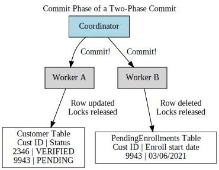

# Process Coordination in Microservices

In the earlier chapters, we explored the dynamics of communication between individual microservices. However, challenges arise when multiple microservices need to work together to achieve a shared objective, such as executing a business process. Designing and implementing such collaborative processes within distributed systems demands careful consideration.

This chapter delves into the complexities of managing distributed workflows, particularly the limitations of relying on distributed transactions to address these challenges. We will also introduce the concept of sagas, a framework that offers a more effective approach to orchestrating workflows among microservices.

# Handling Transactions in Databases

In the realm of computing, a transaction generally refers to a set of actions that we wish to treat as a single, cohesive unit. When performing multiple modifications as part of a broader operation, it’s essential to verify that all changes are completed successfully. Additionally, we need mechanisms to revert those changes if an error occurs during the process. This is where database transactions play a crucial role.

Database transactions ensure that one or more state modifications—such as deleting, inserting, or updating data—are executed reliably. In relational databases, this might involve updating several tables within the scope of a single transaction, maintaining consistency and integrity across the system.

### ACID Properties in Database Transactions

When discussing database transactions, the term often refers to ACID transactions, which ensure data integrity and reliability. ACID is an acronym representing four essential properties—atomicity, consistency, isolation, and durability. These characteristics collectively enable robust and dependable data storage systems. Here's what each property entails:

**Atomicity**  
This guarantees that all operations within a transaction are treated as a single, indivisible unit. If any part of the transaction fails, the entire operation is rolled back, leaving the database as if no changes were attempted.

**Consistency**  
Ensures that any changes made during a transaction leave the database in a valid and consistent state, adhering to predefined rules and constraints.

**Isolation**  
Allows multiple transactions to occur simultaneously without interfering with one another. Temporary states from one transaction remain hidden from others until the transaction is complete.

**Durability**  
Once a transaction is successfully completed, the changes are permanent and resilient to potential system failures, ensuring data persistence.

Not all databases fully support ACID transactions. Relational databases typically do, and many modern NoSQL systems, such as Neo4j, have adopted ACID properties. However, some databases, like MongoDB in earlier versions, restricted ACID compliance to single-document changes, posing challenges for multi-document atomic updates.

For a deeper dive into these principles, I recommend *Designing Data-Intensive Applications*, which covers these concepts comprehensively. While all ACID properties are crucial, this discussion focuses on atomicity, as it often becomes a primary challenge when splitting functionality across microservices.

### ACID Transactions in Microservices: The Challenge of Atomicity

Even within a microservices architecture, ACID-style transactions can still be applied—but their scope becomes more limited. A microservice can use ACID transactions for operations confined to its own database. However, once we move beyond the boundaries of a single microservice, the guarantees provided by ACID transactions, particularly atomicity, are no longer straightforward.

Take, for example, the onboarding process for a new customer at StreamTech. At the final step of the process, we need to update the customer's status (e.g., from `PENDING` to `VERIFIED`) and remove the corresponding entry from the `PendingEnrollments` table. If these operations are handled within a single database, they can be completed under the scope of one ACID transaction—ensuring that either both changes are applied or neither are.

Now consider a scenario where these changes are handled by two different microservices, each managing its own database. The `Customer` microservice updates the customer status in its database, while the `Enrollments` microservice removes the pending enrollment from its separate database. Here, we rely on two separate transactions, each of which can succeed or fail independently. This separation means the atomicity of the overall operation is no longer guaranteed.

One possible approach is to sequence these transactions, ensuring the enrollment row is removed only after the customer status is successfully updated. However, this introduces additional complexity, requiring custom logic to handle cases where the second transaction fails after the first one succeeds. Reordering or managing these steps effectively can help, and it’s a concept we’ll revisit when discussing sagas. Nevertheless, by breaking the operation into two distinct transactions, we lose the inherent atomicity of handling the process as a single unit.

This loss of atomicity can create challenges, particularly when transitioning from systems that previously relied on such guarantees. A common solution many consider is implementing a distributed transaction that spans multiple services. Unfortunately, as we’ll explore, distributed transactions often come with significant drawbacks. To better understand these challenges, let’s examine the two-phase commit protocol, one of the most widely used algorithms for managing distributed transactions.

## Distributed Transactions: The Two-Phase Commit Protocol

The two-phase commit protocol (commonly referred to as 2PC) is often employed to enable transactional consistency in distributed systems, where multiple independent processes must be updated as part of a single operation. Many teams transitioning to microservices architectures consider 2PC as a solution to their challenges. However, as we’ll explore, it may not solve all problems and could introduce new complexities.

#### The Two Phases of 2PC

The 2PC process is divided into two stages: the *voting phase* and the *commit phase*.

**1. Voting Phase**  
In this phase, a central coordinator communicates with all participants (or workers) involved in the transaction to determine if the requested state changes can be made. For example, Worker A is asked to update a customer’s status to `VERIFIED` in the `Customer` table, while Worker B is tasked with removing a row from the `PendingEnrollments` table. If all participants agree that the requested changes are valid and feasible, the transaction proceeds to the commit phase. However, if any participant denies the request—perhaps due to a conflict or violation of local constraints—the entire transaction is aborted.

It’s important to note that agreeing to the change during the voting phase does not mean the change is applied immediately. Instead, the worker guarantees it will be able to make the change later, often by locking the relevant resource to prevent any conflicting modifications. For instance, Worker A might lock the specific customer record to ensure no further changes occur that would make the transition to `VERIFIED` invalid.

If any worker declines the change or fails to respond, the coordinator sends a rollback request to all participants. This ensures that any locks are released, and local cleanup is performed.

**2. Commit Phase**  
If all participants agree to proceed, the system enters the commit phase. At this stage, the actual changes are applied to the workers' databases, and any locks held during the voting phase are released.

#### Challenges of 2PC

One significant limitation of 2PC is the inability to ensure that all commits happen simultaneously. The coordinator sends commit requests to all participants, but due to network latency or processing delays, these requests may be received and executed at different times. As a result, it is possible to observe inconsistent states—where Worker A has applied the change but Worker B has not. This inconsistency violates the *isolation* property of ACID, which mandates that intermediate states during a transaction must not be visible.

Additionally, the protocol inherently relies on distributed locks, which introduce complexity and potential failure modes. Managing locks within a single system is challenging enough; coordinating them across multiple independent systems is far more difficult. Deadlocks, resource contention, and other issues can arise, especially as the number of participants increases or network latency grows.

#### Failure Modes

The 2PC protocol is susceptible to various failure scenarios. For instance, a worker might vote to proceed during the voting phase but then fail to respond to the commit request. In such cases, the system may be left in a partially completed state, requiring manual intervention to resolve. While some failure modes can be addressed programmatically, others can leave the system in a state of inconsistency that requires operator involvement.

#### Limitations and Practical Use

The more participants involved in a 2PC transaction and the higher the system’s latency, the more likely issues will arise. Furthermore, 2PC can significantly degrade system performance, as resources remain locked for the duration of the transaction. For this reason, 2PC is typically reserved for short-lived operations where the scope of locking is minimal. Longer transactions increase the risk of resource contention and introduce more opportunities for failure.

In summary, while the two-phase commit protocol can provide a mechanism for coordinating distributed transactions, its inherent complexity, latency, and failure risks make it an imperfect solution, particularly in high-latency or large-scale microservices environments. Other approaches, such as sagas, may offer more practical alternatives for managing distributed workflows.

## Distributed Transactions—An Approach to Avoid  

For all the reasons discussed, it’s generally best to avoid distributed transactions like the two-phase commit when managing state changes across microservices. But if distributed transactions are not the solution, what are your alternatives?

#### Keep the Data Together  
One option is to avoid splitting your data in the first place. If you have related pieces of state that need to be handled atomically and consistently, and achieving this without ACID-style transactions proves challenging, it might be better to keep the data in a single database. Similarly, the functionality managing that state should remain within a single service—or even within a monolithic architecture.  

If you’re in the process of decomposing a monolith, and the need for transactional consistency makes splitting certain parts of the system overly complex, it might be wise to delay splitting that particular section. Instead, focus on other areas of the system that are less tightly coupled, and revisit this challenge later.  

#### If Splitting Is Unavoidable  
What if you truly need to separate the data but want to avoid the difficulties of distributed transactions? For operations involving multiple services—especially those that may take minutes, days, or even months—you’ll need a more practical approach that avoids locking. One effective alternative to consider is **sagas**.  

### Distributed Transactions in Databases  

While distributed transactions across microservices are generally problematic, distributed transactional algorithms have been successfully implemented in specific use cases—particularly in large-scale distributed databases like Google Spanner.  

In such systems, the distributed transaction is handled transparently by the underlying database. From an application’s perspective, the transaction appears as a single logical operation, even though the database itself may be distributed across multiple machines or data centers. This approach allows consistent state changes within a single logical database while abstracting the complexities of distributed coordination from the application layer.

#### The Challenges of Distributed Transactions  
Google Spanner is a remarkable example of successfully implementing distributed transactions at scale, but it’s important to acknowledge the extraordinary effort required to achieve this. The system relies on costly infrastructure, including advanced data centers and satellite-based atomic clocks, to ensure global consistency and coordination.  

If you’re interested in learning more about how Google accomplished this, the presentation *“Google Cloud Spanner: Global Consistency at Scale”* provides an excellent overview. However, the sheer complexity and expense of such solutions underscore why distributed transactions are rarely the right choice for most microservices architectures.  

By avoiding distributed transactions and exploring alternative patterns like sagas, you can simplify the coordination of state across your microservices while reducing the risks and overhead associated with distributed locking and consistency.

## Sagas: A Practical Alternative to Two-Phase Commit

Sagas offer a compelling approach to coordinating multiple state changes across distributed systems while avoiding the drawbacks of long-term resource locking. Unlike the two-phase commit protocol, sagas break down a process into discrete, independently executable steps. This design not only reduces contention for resources but also encourages explicit modeling of business processes, yielding additional clarity and benefits.

#### The Origin of Sagas  
The concept of sagas, first introduced in the paper *“Sagas”* by Hector Garcia-Molina and Kenneth Salem, addresses a specific challenge: managing long-lived transactions (LLTs). These transactions span extended periods—ranging from minutes to days—and involve multiple changes to data.  

In a traditional database transaction model, an LLT would require locking resources, such as rows or tables, for the entire duration of the process. This could lead to significant bottlenecks and conflicts, especially if other operations attempt to access these locked resources.  

To address this, sagas decompose LLTs into a sequence of smaller transactions. Each of these smaller transactions is independent, shorter in duration, and operates on a subset of the data. By doing so, sagas minimize contention in the database and reduce the scope and duration of locks.

#### Sagas in Distributed Systems  
Although originally designed for single-database LLTs, the saga pattern is equally applicable to distributed systems. In a microservices architecture, a saga can coordinate state changes across multiple services by breaking a single business process into a series of service calls. Each step in this sequence constitutes part of the saga and is handled independently by the respective service.

For example, consider the order fulfillment process at **StreamTech**. This process can be modeled as a single saga, with each step—such as verifying payment, reserving inventory, and scheduling delivery—delegated to a different microservice. Within each service, any state change can still leverage local ACID transactions. For instance, the `Warehouse` service might create a reservation entry in its local database during the stock reservation step. This change would be executed using a traditional database transaction, ensuring atomicity at the service level.

#### Limitations of Sagas  
It’s essential to understand that sagas do not provide atomicity at the level of the entire process. While each step within the saga can rely on ACID principles locally, the overall saga lacks the atomicity guarantees of a traditional database transaction. Instead, sagas provide a framework to track and reason about the process state, leaving it to the application to handle failure scenarios and their implications.

For example, in the event of a failure during one step of the saga, compensating actions may need to be executed to undo or mitigate earlier state changes. This requires careful design and implementation to ensure consistency throughout the system.

#### Example: Order Fulfillment at StreamTech  
Let’s consider a simplified order fulfillment flow at StreamTech. Each step in this process—checking inventory, reserving stock, processing payment, and scheduling shipment—is executed by a different service. The saga coordinates these operations, allowing each service to handle its own state changes locally while ensuring the overall business process is completed.

The `Warehouse` service, for instance, might log the stock reservation in its local `Reservation` table using a standard database transaction. Meanwhile, the `Payment` service processes the payment, and the `Shipping` service schedules the delivery. Together, these steps form the saga, ensuring that the order fulfillment flow is carried out as intended, even in a distributed system.

Sagas provide a powerful tool for managing complex workflows across microservices, reducing contention, and ensuring flexibility in long-lived processes. However, they require thoughtful design to handle failure scenarios effectively and to ensure the system remains consistent and reliable. By embracing sagas, teams can achieve a more scalable and resilient architecture without the overhead and risks of distributed transactions like two-phase commit.

### Handling Failures in Sagas  

When a saga breaks a business process into individual transactions, it’s crucial to address how failures should be handled and recovery processes initiated. The original saga paper outlines two primary approaches to recovery: **backward recovery** and **forward recovery**.

#### Backward Recovery  
Backward recovery focuses on undoing the effects of a failure by rolling back previously completed steps. To achieve this, the system must define compensating actions for each transaction. These actions effectively reverse the state changes made during a failed step, ensuring the system is returned to a consistent state.

#### Forward Recovery  
Forward recovery, on the other hand, involves continuing from the point of failure and retrying the failed transaction. This approach requires the system to persist enough contextual information to allow for retries, enabling the saga to resume processing without starting over.

The choice between backward recovery, forward recovery, or a combination of the two depends on the specific business process being modeled and the nature of the failures that might occur.

### Business vs. Technical Failures  

Sagas are designed to handle **business failures**, not **technical failures**. A business failure occurs when the intended operation cannot be completed due to a valid business rule or condition. For example, if a payment attempt fails because a customer has insufficient funds, this is a business failure that the saga can address, perhaps by triggering a compensating action or retrying with a different payment method.

In contrast, technical failures, such as a Payment Gateway timeout or a `500 Internal Server Error`, are not inherently handled by the saga. These issues require separate strategies to ensure the reliability of the system components. The saga assumes that the underlying system and services are functioning correctly and focuses solely on orchestrating their interactions.

### Balancing Recovery Approaches  

For many business processes, a combination of backward and forward recovery may be necessary. For instance:
- Backward recovery might be used to refund a payment if an order cannot be fulfilled.
- Forward recovery could retry inventory allocation if a temporary network issue prevented the reservation of stock.

Understanding which recovery strategy to apply—and when—is essential for ensuring the overall success of the process.

### Limitations of the Saga Pattern  

While sagas provide a robust mechanism for handling failures at the business level, they rely on the assumption that the underlying system components are dependable. If technical failures occur frequently, they can disrupt the entire process. Strategies for making technical components more reliable will be discussed in Chapter 12, but for a deeper dive into the inherent limitations of sagas, the paper *“The Limits of the Saga Pattern”* by Uwe Friedrichsen is an excellent resource.  

In summary, sagas excel at managing business process failures but must be complemented with additional measures to address technical reliability and resilience.

### Saga Rollbacks  

In an ACID transaction, a rollback ensures that if a problem occurs, all changes are undone before a commit takes place. After the rollback, it’s as if the attempted operation never happened. However, sagas involve multiple transactions that may have already been committed before a failure is detected and a rollback is triggered. So, how do we "undo" changes that have already been committed in a saga?

#### Rolling Back a Saga  

Let’s revisit the example of order processing at **StreamTech**. Imagine we’ve reached the packaging step of the process and encounter an issue: the system believes the item is in stock, but it’s not actually on the shelf. In this case, we decide to cancel the entire order instead of placing the item on backorder. The complication is that earlier steps in the saga—such as taking payment and awarding loyalty points—have already been completed.

If all these steps were part of a single ACID transaction, a simple rollback would undo everything. However, since each step in the order fulfillment process is handled by a different service with its own transactional scope, there’s no way to perform a single, unified rollback for the entire process.

#### Compensating Transactions  

To roll back a saga, we must employ **compensating transactions**, which are operations designed to reverse the effects of previously committed transactions. In this scenario, we would trigger compensating transactions for every step in the saga that has already been completed. For example:
- The payment could be refunded.
- Loyalty points awarded to the customer could be revoked.
- 

While compensating transactions achieve the effect of a rollback, it’s important to understand that they don’t behave the same as a traditional database rollback. In a database rollback, the changes are undone before a commit, making it as though the transaction never occurred. In a saga, the original transactions have already happened, and the compensating transactions create new operations to reverse their effects. Essentially, we are correcting the state rather than erasing history.

#### The Concept of Semantic Rollbacks  

Because compensating transactions can’t always perfectly undo every action, they are sometimes referred to as **semantic rollbacks**. The aim is to restore the system to a consistent state that makes sense within the context of the saga, even if some actions cannot be undone entirely.

For example, if the order fulfillment process included sending an email to the customer informing them their order was on the way, this action cannot be "unsent." Instead, a compensating transaction could trigger a follow-up email to notify the customer that their order was canceled due to an issue.

#### Keeping a Record of Rollbacks  

It’s often beneficial to retain information about a rollback in the system. For instance, the Order service might log details about the canceled order and the reasons for its failure. This record can be useful for auditing, debugging, customer service, or other operational purposes.

By implementing compensating transactions and accepting the concept of semantic rollbacks, sagas provide a flexible mechanism for handling failures in distributed systems. While they don’t offer the clean rollback guarantees of traditional ACID transactions, they allow enough recovery to maintain the integrity and reliability of business processes in a microservices architecture.

### Reordering Workflow Steps to Simplify Rollbacks  

In the previous scenario, rollback complexity could have been reduced by reordering steps in the original workflow. For example, a simple adjustment would be to award loyalty points only after the order has been successfully dispatched.

### Minimize Rollback Efforts with Workflow Adjustments  

By delaying steps that may require compensating actions, such as awarding points, to a point where they are less likely to be affected by failures, you reduce the number of rollbacks needed. In this case, if a failure occurs during the packaging or dispatching phase, there’s no need to roll back the loyalty points, as they haven’t been awarded yet. Adjusting workflows to execute steps more prone to failure earlier in the process allows you to fail fast, avoiding the need to perform unnecessary compensating transactions for steps that were never executed.

This type of optimization can significantly simplify rollback operations and eliminate the need for compensating transactions in certain scenarios. For processes where implementing compensating transactions is particularly challenging, moving such steps to later stages can be especially beneficial.

### Combining Fail-Backward and Fail-Forward Recovery  

It’s often practical to combine fail-backward (rollback) and fail-forward (retry) strategies within a workflow, depending on the type of failure. Consider the order fulfillment process at **StreamTech**:  
- If a failure occurs early in the process, such as an inability to package the item, rolling back (fail-backward) makes sense to restore consistency.  
- However, in later stages, such as dispatching the package, a fail-forward approach might be more appropriate.  

For instance, if the dispatch fails because the delivery service cannot pick up the package today, rolling back the entire order would be unnecessary. Instead, you could retry the dispatch operation (e.g., schedule it for the next day) or escalate the issue for manual resolution.

### Key Takeaways  

Reordering steps to reduce rollback requirements not only simplifies failure handling but also improves the efficiency and reliability of your workflows. By failing earlier for high-risk steps and delaying less critical ones, you can minimize the operational overhead of compensating transactions. Additionally, adopting a mixed approach to failure recovery—combining rollback for critical errors and retries for recoverable issues—provides flexibility to handle diverse failure scenarios effectively.

### Approaches to Implementing Sagas  

Understanding the logical framework of sagas is only the beginning. To put sagas into practice, we need to explore the different implementation strategies available. Two primary styles of saga implementation are **orchestrated sagas** and **choreographed sagas**. Each approach offers unique advantages and challenges depending on the requirements of your system.

### Orchestrated Sagas  

Orchestrated sagas rely on a **centralized coordinator** to manage and track the progress of the saga. The coordinator is responsible for determining the sequence of steps, initiating each step in the process, and handling failures or compensating transactions as needed.  

This approach closely aligns with the original concept of sagas, offering a structured solution with clear oversight. Because the coordinator manages the flow of the entire process, it simplifies tracking and recovery, ensuring visibility into the state of the saga at all times.

However, this centralized approach introduces a potential single point of failure, as the coordinator becomes a critical component of the system. Additionally, this style can lead to tighter coupling between services, as they must all communicate with the central coordinator.

### Choreographed Sagas  

In contrast, choreographed sagas take a **decentralized approach**, where each service involved in the saga knows how to react to specific events and independently determines the next steps. Instead of relying on a central coordinator, services communicate through an event-driven model, passing messages to one another to progress the saga.  

This loosely coupled design promotes flexibility and resilience, as no single component is responsible for overseeing the entire process. However, tracking the progress of the saga becomes more complex, as there is no centralized system maintaining the overall state. Debugging and error handling in this model can also be more challenging, as failures must be detected and resolved across multiple services.

### Choosing the Right Approach  

The choice between orchestrated and choreographed sagas depends on your system's requirements:
- **Orchestrated sagas** are well-suited for scenarios requiring strong oversight, clear state tracking, and predictable flows. They provide a structured and centralized mechanism for managing workflows.
- **Choreographed sagas** are better for systems that prioritize flexibility, scalability, and loose coupling, particularly when workflows can evolve over time or when services are independently developed and maintained.

By understanding these implementation strategies, teams at **StreamTech** can design sagas that align with their business needs and technical constraints.

### Orchestrated Sagas  

Orchestrated sagas rely on a **central coordinator**, often referred to as an orchestrator, to manage and control the flow of operations. The orchestrator determines the sequence of steps in the process and is responsible for initiating any necessary compensating transactions when something goes wrong. This "command-and-control" model provides a clear, centralized way to monitor the progress and state of the saga.

### Example: Order Fulfillment with an Orchestrator  

In the order fulfillment process at **StreamTech**, a central component, the **Order Processor**, acts as the orchestrator. It manages the overall workflow, interacting with various services such as the `Payment Gateway`, `Warehouse`, and `Loyalty` service.  

The orchestrator knows:
- Which services are needed for the operation.
- When to call each service.
- How to respond to failures or issues during execution.  

For example, the **Order Processor** sends requests to the `Payment Gateway` to process payment and to the `Warehouse` to reserve stock. These interactions typically follow a request-response pattern, where the orchestrator waits for confirmation or results before moving to the next step.  

### Benefits of Orchestrated Sagas  

One significant advantage of orchestrated sagas is **visibility**. Because the business process is explicitly defined within the orchestrator, it is easy to trace and understand how the process works. This centralized logic can simplify onboarding new developers and improve understanding of the system's core workflows.

### Challenges of Orchestrated Sagas  

Despite their advantages, orchestrated sagas also come with trade-offs:  

1. **Coupling**:  
   The orchestrator inherently creates some degree of coupling between itself and the services it interacts with. The **Order Processor**, for instance, must know about all relevant services, leading to tighter domain coupling. While domain coupling isn’t always bad, minimizing it is usually desirable.  

2. **Centralization of Logic**:  
   Over time, the orchestrator can start absorbing logic that ideally belongs to individual services, resulting in "anemic" services—services that perform minimal logic and mostly execute commands from the orchestrator. It’s critical to design services as independent entities with their own local state and behavior, ensuring they maintain their own internal state machines.

3. **Single Point of Failure**:  
   The orchestrator becomes a central component of the system, and if it fails, the entire process may be disrupted.

### Avoiding Over-Centralization  

One strategy to mitigate over-centralization is to use multiple orchestrators for different workflows. For example:
- An **Order Processor** could manage placing orders.
- A **Returns Processor** could handle refunds and returns.
- A **Goods Receiving Service** could oversee incoming stock and restocking shelves.  

Services like the `Warehouse` service can remain reusable components shared across these orchestrators, preserving modularity and functionality.

### BPM Tools for Orchestrated Sagas  

Business Process Modeling (BPM) tools are designed to help define and manage workflows, often using visual drag-and-drop interfaces. The goal of these tools is to allow non-developers to define business processes by assembling prebuilt blocks of functionality.  

In theory, BPM tools seem like a natural fit for implementing orchestrated sagas. In practice, however, they often fall short for several reasons:
- **Developer Unfriendliness**: Despite being aimed at non-developers, developers frequently end up using these tools, which are often clunky and alien to how developers typically work.
- **Lack of Version Control**: The workflows created in BPM tools can be difficult to version control or test.
- **GUI-Driven Changes**: Making changes requires using graphical interfaces, which can slow development and reduce flexibility.

Instead, many developers prefer to implement workflows directly in code, leveraging familiar tools and practices. Code-based workflows also allow for easier testing, debugging, and visualization.

### Modern BPM Tools  

While traditional BPM tools have drawbacks, there are efforts to create more developer-friendly orchestration tools. Frameworks like **Camunda** and **Zeebe** are open-source solutions targeting microservice developers, providing a more code-centric approach to business process modeling. These tools are worth exploring if you’re interested in blending orchestration with developer productivity.

### Summary  

Orchestrated sagas provide a structured way to manage distributed workflows with clear visibility and centralized control. While they can lead to challenges such as coupling and centralization of logic, these issues can be mitigated with thoughtful design and modular orchestrators. Developers should carefully evaluate whether to use BPM tools or code-based solutions based on their team's expertise and project requirements. Open-source orchestration frameworks like Camunda and Zeebe offer promising alternatives for implementing orchestrated sagas in modern microservices architectures.

### Choreographed Sagas  

Choreographed sagas distribute the responsibility for managing a saga across multiple collaborating services, avoiding the need for a central coordinator. If orchestrated sagas follow a "command-and-control" model, choreographed sagas lean more toward a "trust-but-verify" approach. This style often relies heavily on **event-based communication** between services.

### How Choreographed Sagas Work  

In a choreographed saga, services react to events that are broadcast across the system. These events are not sent directly to specific services but are emitted into the system, where any interested service can listen for them and respond. For example:
- When the `Order Placed` event is emitted, the `Warehouse` service listens for it, reserves stock, and emits a new event once the stock has been reserved. If the stock cannot be reserved, the `Warehouse` service emits an `Insufficient Stock` event, which could lead to the order being canceled.

This event-driven model also enables **parallel processing**. For instance, when the `Payment Taken` event is emitted by the `Payment Gateway`, both the `Loyalty` service and the `Warehouse` service can react simultaneously:
- The `Loyalty` service awards points to the customer.
- The `Warehouse` service dispatches the package.

To facilitate reliable event broadcasting and delivery, a **message broker** is typically used. Microservices can subscribe to topics based on the type of events they are interested in, and the broker ensures that these events are delivered reliably to all subscribers. For example, a `Recommendation` service might also subscribe to `Order Placed` events to update its database with personalized recommendations for the customer.

### Advantages of Choreographed Sagas  

1. **Reduced Coupling**:  
   Services in a choreographed saga don’t need to know about each other. They only need to know how to react to specific events. This significantly reduces domain coupling compared to orchestrated sagas, making the system more modular and easier to evolve.  

2. **Decentralized Logic**:  
   Since the logic of the saga is distributed across services, there’s no risk of centralizing too much functionality in one place, as can happen with an orchestrator. Each service is responsible for its own behavior and state management.

### Challenges of Choreographed Sagas  

1. **Complexity in Understanding Processes**:  
   Without a central orchestrator to explicitly model the process, understanding the flow of a choreographed saga can be difficult. Developers must examine the behavior of each service individually to reconstruct the overall process, which can be cumbersome, especially for more complex workflows.

2. **Tracking Saga State**:  
   Unlike orchestrated sagas, choreographed sagas lack a central point to track the current state of the saga. This makes it harder to identify which step a process is at or to initiate compensating actions if something goes wrong.  

### Solving the State Tracking Challenge  

To address the lack of centralized state tracking, a common solution is to **project the state of the saga** by consuming the events emitted during its execution. By using a **correlation ID**, which is a unique identifier for the saga, all events related to the same saga can be tied together.  

Here’s how it works:
- When a saga starts, a correlation ID is generated and included in all related events.
- Each service extracts the correlation ID when reacting to an event and includes it in any further events or logs.
- A separate service or system collects these events, aggregates them, and presents a real-time view of the saga’s state.

This projection system can also take corrective actions if issues arise, such as triggering compensating transactions or notifying relevant teams. A correlation ID is invaluable for choreographed sagas and is also a generally useful practice in distributed systems, as explored further in Chapter 10.

### Summary  

Choreographed sagas provide a decentralized and loosely coupled approach to managing distributed workflows, relying on event-based communication to enable collaboration between services. While this approach reduces coupling and prevents the over-centralization of logic, it introduces challenges in process visibility and state tracking. By incorporating correlation IDs and projecting the saga’s state from emitted events, these challenges can be mitigated, enabling robust and scalable distributed workflows at **StreamTech**.

### Mixing Saga Styles  

Although orchestrated and choreographed sagas may appear to represent completely opposite approaches to implementing sagas, it’s possible—and often practical—to blend these two styles. Certain business processes in your system might align better with one approach, while others might benefit from a hybrid of the two. Even within a single saga, you might find scenarios where a combination of both styles is appropriate.

For example, in the order fulfillment process at **StreamTech**, the overarching saga could follow a choreographed model. However, within the boundaries of the `Warehouse` service, the packaging and dispatching of orders could be handled using an orchestrated flow. This localized orchestration ensures tighter control over certain operations while still maintaining the benefits of the larger choreographed system.

---

### Key Considerations When Mixing Styles  

If you decide to mix orchestration and choreography, maintaining a clear view of the saga's state is essential. Without proper tracking, understanding failure points and recovering from them can become extremely challenging. Ensure that your system has mechanisms to identify:
- The current state of the saga.
- The actions that have already been completed.
- The compensating actions required in case of failure.

Having this clarity is crucial for diagnosing issues and implementing effective recovery strategies.

---

### Tracing Calls in Distributed Processes  

Regardless of whether you use orchestration, choreography, or a combination of the two, tracing calls across multiple microservices is critical for monitoring and debugging your business processes. Tracing helps answer questions such as:
- **Is the process functioning as expected?**
- **Where did a failure occur?**
- **What actions have been completed successfully?**

To achieve this, implement tools and practices like:
1. **Correlation IDs**: Assign a unique identifier to every saga or process instance. This ID is included in all service-to-service communications and logs, making it easier to trace the flow of the saga end-to-end.
2. **Log Aggregation**: Collect and centralize logs from all participating services to create a unified view of the process. This simplifies the identification of issues and helps in building a timeline of events.

These techniques provide visibility into distributed processes and enable you to diagnose and resolve issues efficiently. Chapter 10 delves deeper into how to use correlation IDs and log aggregation to streamline monitoring and debugging.

---

### Summary  

Blending orchestrated and choreographed sagas allows you to tailor the implementation to the needs of your system. While choreography provides loose coupling and scalability, orchestration can offer more control and visibility for specific operations. By combining the two, you gain the flexibility to optimize each segment of your workflow. However, always ensure robust mechanisms for tracking and tracing to maintain clarity and reliability, regardless of the approach you choose.

### Should You Use Choreography, Orchestration, or Both?  

Choosing between choreographed or orchestrated sagas—or even a mix of the two—depends on your team’s familiarity with the underlying principles and the structure of your organization.  

Choreographed sagas often rely heavily on **event-driven collaboration**, which can be unfamiliar territory for many teams. The need to track saga progress without a central orchestrator adds complexity. However, in practice, the benefits of **loose coupling** and increased flexibility in a choreographed architecture typically outweigh the challenges of implementation.  

---

### When Orchestration Makes Sense  

For teams where a single group owns the entire saga implementation, **orchestrated sagas** can be an excellent choice. Since all responsibility lies within one team, the higher degree of coupling inherent in an orchestrated model is much easier to manage. The central coordination provided by the orchestrator allows for straightforward monitoring and debugging, which can simplify operations when only one team is involved.  

---

### When Choreography is Better  

When multiple teams are responsible for different parts of the saga, a **choreographed approach** is often preferable. The decentralized nature of choreographed sagas enables teams to work independently, as the architecture reduces interdependencies between services. This loosely coupled model allows for better scalability and flexibility, making it ideal for distributed teams or systems requiring frequent updates to individual components.  

---

### Event-Driven vs. Request-Response  

As a general observation:
- **Orchestration** typically aligns with request-response interactions, where one service explicitly invokes another and waits for a response.  
- **Choreography** naturally complements event-driven models, where services broadcast and react to events.  

This is not a hard-and-fast rule, but a useful guideline. Your team’s familiarity with event-driven systems should also factor into your decision. If event-driven interaction feels unintuitive or difficult for your team to grasp, a choreographed saga might introduce unnecessary complexity.  

---

### Personal Perspective  

From my own experience, I tend to favor **choreography**, primarily because I prefer the scalability and modularity offered by event-driven architectures. However, it’s essential to tailor your approach to your team’s strengths and the specific requirements of your system. If your team is more comfortable with direct interactions, orchestration might be the better choice.

---

### Key Takeaways  

- **Orchestration** works well when a single team manages the saga or when simplicity and centralized control are priorities.  
- **Choreography** is ideal for systems managed by multiple teams, as it reduces coupling and allows independent development of components.  
- Your decision should align with your team’s familiarity with request-response and event-driven models, as well as the complexity and scale of the system you are building.  

Ultimately, don’t feel constrained by a single approach—many systems benefit from blending both styles where appropriate.
