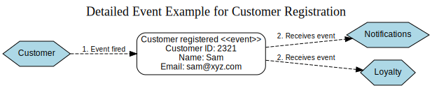

# Communication Patterns in Microservices

Effectively managing communication between microservices poses challenges for many practitioners. A significant reason for this difficulty is the tendency to default to a specific technological solution without first evaluating the various communication methods available. I aim to dissect the different communication patterns to clarify their advantages and disadvantages, helping you determine which method aligns best with your specific requirements.

We will explore both synchronous blocking and asynchronous non-blocking communication techniques, and contrast request-response interactions with event-driven collaborations.

By the conclusion of this section, you will have a clearer understanding of the available communication strategies and possess a foundational knowledge that will be beneficial as we delve into more intricate implementation details.

## Transitioning from In-Process to Inter-Process Communication

Communication between separate processes over a network (inter-process) differs significantly from interactions within a single process (in-process). On one level, this distinction might seem negligible. For instance, you might envision one object invoking a method on another object and directly translate this to two microservices interacting over a network. However, aside from the fact that microservices encompass more than just objects, this analogy can lead to considerable complications.

### Performance Considerations

The efficiency of an in-process call fundamentally contrasts with that of an inter-process call. When executing an in-process call, the compiler and runtime environment can implement numerous optimizations to minimize the call's impact, such as inlining the method invocation, making it almost as if the call never occurred. These optimizations aren’t feasible with inter-process calls, which require sending packets over a network. Consequently, inter-process calls incur considerable overhead compared to in-process calls. For example, the time taken to round-trip a single packet within a data center is typically measured in milliseconds, whereas the overhead of a method call within the same process is negligible.

This disparity often necessitates a reevaluation of API design. An API that operates efficiently within a single process might not be suitable for inter-process communication. Making a thousand in-process API calls is generally manageable, but making the same number of network calls between microservices could be impractical.

When passing a parameter to a method within a process, the data structure usually remains in place, with only a pointer to its memory location being passed. This means that passing an object or data structure to another method doesn’t require additional memory allocation for copying the data.

In contrast, when making network calls between microservices, the data must be serialized into a format suitable for transmission over the network. After transmission, the data must be deserialized on the receiving end. This process requires careful consideration of the payload sizes being exchanged between processes. Unlike within a single process, where the size of a data structure might be inconsequential, inter-process communication demands awareness of data size. This awareness might lead you to minimize the amount of data being sent or received, choose more efficient serialization methods, or even store data on a filesystem and pass references to those file locations instead.

While these differences might not immediately present challenges, being cognizant of them is crucial. There have been numerous instances where attempts to abstract away the fact that a network call is occurring have led to problems. While abstractions help streamline development and improve efficiency, overly concealing underlying details can be detrimental. Developers need to recognize when their actions result in network calls to prevent unexpected performance issues caused by hidden inter-service interactions.

### Modifying Interfaces

When updating an interface within a single process, deploying the change is relatively straightforward. Both the implementation of the interface and the code that uses it are contained within the same process. For example, if you alter a method signature using an IDE that supports refactoring, the IDE can automatically update all calls to that method. This allows the change to be deployed atomically, as both the provider and the consumer of the interface are bundled together in one process.

However, in a microservices architecture, the service that offers an interface and the services that consume it are deployed independently. Making a backward-incompatible modification to a microservice's interface requires careful handling. You must either perform a coordinated deployment where all consumer services are updated simultaneously to use the new interface, or implement a phased rollout strategy for the updated service contract.

### Managing Errors in Distributed Systems

When operating within a single process, invoking a method typically results in straightforward error handling. Errors are generally predictable and manageable, either being anticipated and easily addressed or severe enough to be propagated up the call stack. Overall, errors in this context are deterministic.

In contrast, distributed systems introduce a different landscape for error management. Numerous potential failures lie beyond your control, such as network timeouts, temporary unavailability of downstream microservices, network disconnections, containers being terminated due to excessive memory usage, or even catastrophic events like parts of your data center experiencing fires.

In their book *Distributed Systems*, Andrew Tanenbaum and Maarten Steen categorize five primary failure modes encountered in inter-process communication. Here is a simplified overview:

1. **Crash Failure**: The server operates normally until it unexpectedly crashes, necessitating a reboot.
   
2. **Omission Failure**: A request is sent, but no response is received. This can also include scenarios where a downstream microservice fails to send expected messages or events and simply stops functioning.
   
3. **Timing Failure**: An event occurs either too late (missing the expected timeframe) or prematurely.
   
4. **Response Failure**: A response is received, but it is incorrect or incomplete. For instance, requesting an order summary might return missing essential details.
   
5. **Arbitrary Failure (Byzantine Failure)**: An undefined error occurs, making it difficult for participants to agree on whether a failure happened or understand its cause. This type of failure is particularly problematic.

Many of these errors are transient, meaning they are temporary issues that might resolve on their own. For example, if a request to a microservice times out (an omission failure), it might indicate that the downstream service never received the request, prompting a retry. However, some issues require manual intervention by an operator. Consequently, having a comprehensive set of error semantics is crucial to enable clients to respond appropriately.

HTTP serves as a good example of a protocol that incorporates detailed error semantics. Each HTTP response includes a status code, with the 400 and 500 series codes designated for errors. The 400 series codes indicate client-side issues with the request, suggesting that retrying the same request (e.g., a 404 Not Found) is unlikely to succeed. On the other hand, 500 series codes represent server-side problems, some of which may be temporary. For instance, a 503 Service Unavailable error signals that the server cannot handle the request at the moment, and a client might choose to retry the request later. Conversely, a 501 Not Implemented response indicates that retrying would not be beneficial.

Regardless of whether you choose an HTTP-based protocol for microservice communication, implementing a rich set of error semantics facilitates clients in performing compensating actions. This approach enhances the resilience and robustness of your system by allowing it to handle failures gracefully and maintain reliable operations.

## Selecting the Appropriate Technology for Inter-Process Communication: Navigating Abundant Options

The spectrum of technologies available for inter-process communication is extensive, which can lead to decision fatigue. Many individuals tend to choose technologies they are already comfortable with or gravitate towards the latest innovations showcased at conferences. The issue with this approach is that adopting a specific technology often means accepting its inherent philosophies and limitations, which may not be suitable for your particular needs or the challenges you're aiming to address.

For instance, using single-page application frameworks like Angular or React is not ideal when the goal is to establish inter-process communication for a website. Similarly, leveraging Kafka for request-response interactions is inappropriate, as Kafka is designed primarily for event-driven communication. Despite these mismatches, it is common to see technologies being misapplied. People frequently embrace new technologies, such as microservices, without fully considering whether they are the right fit for their specific problems.

Therefore, when faced with the vast array of communication technologies available for microservices, it is essential to first define the type of communication you require. Only after establishing the desired communication style should you seek out the technology that best supports that approach. With this perspective, let’s examine a framework I have been using for several years to differentiate between various methods of microservice-to-microservice communication. This framework will help you narrow down the technology options that are most appropriate for your needs.

## Microservice Communication Approaches


**primary communication styles:**

1. **Synchronous Blocking**
   - A microservice sends a request to another microservice and halts its operations until it receives a response.

2. **Asynchronous Nonblocking**
   - The microservice initiating the request continues its processing without waiting for the call to be completed.

3. **Request-Response**
   - One microservice sends a request to another, asking it to perform a specific task, and awaits a reply indicating the outcome.

4. **Event-Driven**
   - Microservices generate events that other microservices listen to and act upon. The originating microservice does not need to know which microservices, if any, will handle the events it emits.

5. **Shared Data**
   - Although not typically classified as a communication style, microservices interact through a common data source.

When using this framework to guide teams in selecting the appropriate communication approach, I prioritize understanding the specific context they are working within. Factors such as the need for reliable communication, acceptable latency levels, and the volume of interactions significantly influence the choice of technology. Generally, the first decision is whether a request-response or an event-driven communication style is more suitable for the situation at hand. If a request-response model is chosen, the next step is to decide between synchronous and asynchronous implementations. Conversely, if an event-driven approach is preferred, the options are typically limited to nonblocking asynchronous methods.

Beyond the communication style, numerous other factors must be considered when selecting the right technology. These include requirements for low-latency communication, security considerations, and scalability potential. Making an informed technology choice necessitates a thorough understanding of the specific requirements and constraints of your problem domain.

### Combining Communication Styles


In a microservice architecture, it’s common to use a combination of communication styles, as no single approach fits all scenarios. Certain interactions are better suited for a request-response model, while others are more effective with an event-driven approach. In fact, individual microservices often support multiple collaboration styles simultaneously. For example, an Order service might provide a request-response API for placing or modifying orders while also emitting events to notify other services when changes occur.

## Pattern: Synchronous Blocking Communication

In a synchronous blocking interaction, a microservice initiates a call to a downstream process—often another microservice—and pauses its execution until the call is completed and potentially until a response is received. An Order Processor might send a request to the Loyalty service to add points to a customer's account and then wait for a response before proceeding.


This type of call typically involves waiting for feedback from the downstream process. The calling service may require the response to continue its operations or to verify that the call was successful, enabling it to attempt retries if necessary. Consequently, most synchronous blocking calls also fall under the category of request-response communication.

### Benefits of Synchronous Blocking

Synchronous blocking calls are straightforward and intuitive, partly because they align with the programming style many of us first learned. This approach feels natural—reading code sequentially like a script, where each line executes one after the other, waiting its turn. Many common inter-process interactions, such as querying a database with SQL or making an HTTP request to a downstream API, typically follow this blocking, synchronous pattern.

When transitioning from a less distributed system, such as a monolithic application, maintaining familiar paradigms can be helpful amidst the complexity of adopting new architectural patterns. Sticking with this well-understood style provides a sense of consistency while managing the challenges of a distributed microservice environment.

### Drawbacks of Synchronous Blocking

One of the primary drawbacks of synchronous blocking calls is the temporal coupling they create. For example, when the Order Processor makes a request to the Loyalty microservice, the latter must be available for the call to succeed. If the Loyalty service is unreachable, the call will fail, forcing the Order Processor to decide on a compensating action—whether to retry immediately, buffer the request for later, or abandon the operation altogether.

This temporal coupling is also bidirectional. Typically, the response is sent back to the upstream service (Order Processor in this case) over the same network connection. If the Order Processor instance becomes unavailable while the Loyalty microservice is processing the request, the response will be lost. This means the coupling isn't just between two services but between specific instances of those services.

Additionally, since the sender of the call waits for a response, any delays in the downstream service or network latency can leave the sender blocked for extended periods. For example, if the Loyalty microservice is experiencing high load and responds slowly, the Order Processor's response times will also degrade as a result.

Because of this tight dependency, synchronous blocking calls can make a system more susceptible to cascading failures. An issue in one service, such as an outage or slow response times, can ripple through the system, affecting upstream services more readily than with asynchronous communication patterns.

### When to Use Synchronous Blocking

For straightforward microservice architectures, synchronous blocking calls can be a practical choice, largely due to their simplicity and familiarity, especially for teams new to distributed systems.

However, challenges arise when call chains grow longer. Consider an example, where a payment needs to be checked for fraud as part of an order processing flow. In this scenario, the Order Processor calls the Payment service to process the payment, which then consults the Fraud Detection microservice to verify the transaction. Fraud Detection, in turn, queries the Customer service for additional details.

If all these calls are synchronous and blocking, the system becomes highly susceptible to disruptions. Any issue—be it in one of the four microservices or the network connections between them—could cause the entire operation to fail. Furthermore, such long chains of synchronous calls can lead to significant resource contention. For instance, the Order Processor must keep a network connection open while awaiting a response from Payment, which in turn waits for Fraud Detection, and so on. This increases the likelihood of running out of connections or encountering network congestion.


To mitigate these issues, the interactions between services could be redesigned. One option, involves moving Fraud Detection out of the critical purchase flow and processing it in the background. If fraudulent activity is detected, the customer’s records can be updated, and this information could be checked earlier in the payment process. This approach reduces the length of the synchronous call chain, improving overall latency and removing Fraud Detection as a dependency in the primary workflow, thereby enhancing system reliability.


Alternatively, the blocking calls could be replaced with nonblocking interactions, allowing the workflow to remain the same but reducing the risks associated with blocking dependencies.

## Pattern: Asynchronous Nonblocking Communication

In asynchronous communication, sending a request over the network does not block the calling microservice. The microservice is free to continue processing other tasks without waiting for a response. There are various forms of nonblocking asynchronous communication, but in microservice architectures, three common approaches stand out:

1. **Shared Data Communication**  
   The upstream microservice modifies shared data, which other microservices can later access and utilize as needed.

2. **Request-Response**  
   A microservice sends a request to another service to perform a specific operation. Once the operation is complete—whether successful or not—a response is sent back to the calling microservice. Importantly, any instance of the calling microservice should be able to process the response.

3. **Event-Driven Communication**  
   A microservice emits an event, essentially announcing that something has occurred. Other microservices that are interested in the event can listen for it and take appropriate action based on the information received.

### Advantages of Asynchronous Nonblocking Communication

Asynchronous nonblocking communication provides temporal decoupling between the microservice initiating the request and the microservices processing it. The receiving services do not need to be available at the exact moment the request is made, eliminating concerns related to temporal coupling.

This approach is especially advantageous when the triggered operation requires significant time to complete. For example, consider the StreamTech scenario, specifically the process of dispatching a package. The Order Processor initiates payment and then decides it's time to ship the package. It sends a request to the Warehouse microservice to start the dispatch process. Tasks like locating the CDs, removing them from inventory, packaging, and scheduling a pickup can take hours or even days, depending on the warehouse workflow. In such cases, it makes sense for the Order Processor to use a nonblocking asynchronous call, allowing the Warehouse to notify it later about the progress. This is an example of asynchronous request-response communication.


Attempting this process with synchronous blocking calls would be impractical. The Order Processor would need to maintain an open connection, send the request, block any further operations on the calling thread, and wait for a response—potentially for hours or days—making the entire interaction infeasible. Asynchronous communication avoids this bottleneck, allowing the system to remain efficient and responsive.

### Drawbacks of Asynchronous Nonblocking Communication

Compared to blocking synchronous communication, the primary challenges of adopting a nonblocking asynchronous approach lie in its added complexity and the abundance of choices. There are multiple styles of asynchronous communication, each suited to different scenarios. Deciding which one fits your use case can be daunting. Furthermore, implementing these communication styles involves navigating a wide array of technologies, which can be overwhelming.

For developers who are accustomed to synchronous patterns, the shift to asynchronous communication can initially be difficult. It may not align with their existing mental models of computation. As we delve deeper into the nuances of asynchronous communication, it becomes clear that these patterns offer ample opportunities to inadvertently introduce complexity or errors into your system.

**The Paradox of Async/Await: When Asynchronous Becomes Blocking**

In software development, terms like "asynchronous" can carry different meanings depending on the context, leading to potential misunderstandings. A notable example is the use of constructs like `async/await`, which allow developers to work with asynchronous data sources but in a way that mimics blocking, synchronous behavior.

Consider the JavaScript example. Here, a currency exchange rate is fetched asynchronously, with updates delivered via a message broker. A `Promise` is defined to eventually resolve to the latest EUR-to-GBP exchange rate. While the promise itself is inherently asynchronous, the `await` keyword is used to block execution until the promise resolves.

```javascript
async function f() {
  let eurToGbp = new Promise((resolve, reject) => {
    // Code to fetch the latest exchange rate between EUR and GBP
    ...
  });

  var latestRate = await eurToGbp; // 1. Wait until the promise is fulfilled.
  process(latestRate);            // 2. Process won't run until the state is resolved.
}
```

In this example:
1. The `await` keyword halts the execution of the function until the promise resolves, effectively creating a blocking operation at that point.
2. The `process(latestRate)` function does not execute until the state of `eurToGbp` is resolved.

Although the underlying technology fetching the exchange rate operates asynchronously (e.g., waiting for a message from a broker), the use of `await` causes the code to behave synchronously. From the code's perspective, the interaction becomes inherently blocking. This highlights how asynchronous tools, depending on their implementation, can still introduce blocking behaviors, often leading to unexpected inefficiencies if not carefully managed.

### When to Use Asynchronous Nonblocking Communication

Deciding whether asynchronous communication is suitable for your system requires careful consideration of the type of asynchronous communication to adopt, as each approach comes with its own set of trade-offs. However, certain scenarios clearly benefit from asynchronous communication.

One such scenario involves long-running processes. When a task requires significant time to complete, asynchronous communication allows the initiating service to continue its operations without waiting for the task to finish. Similarly, complex systems with long, unmodifiable call chains are strong candidates for asynchronous approaches, as they can help minimize blocking dependencies.

In general, asynchronous communication is particularly valuable for improving system responsiveness and scalability in these contexts. We’ll explore three of the most common forms of asynchronous communication in detail: request-response patterns, event-driven interactions, and communication through shared data.

## Pattern: Communication Through Shared Data

Communication through shared data is a versatile pattern used when one microservice writes data to a specified location, and another microservice—or multiple microservices—later accesses and utilizes that data. This could be as straightforward as one microservice saving a file in a shared location, which another microservice retrieves and processes at a later time. By its nature, this style of communication is inherently asynchronous.

An example of this pattern, where the New Product Importer microservice generates a file that is subsequently consumed by the downstream Inventory and Catalog microservices.


This approach is arguably one of the most prevalent inter-process communication patterns, even if it’s not always recognized as such. The indirect nature of the communication, with no immediate interaction between the microservices, often makes it less obvious as a formal communication style. Nonetheless, its flexibility and simplicity make it a widely used pattern in distributed systems.

### Implementation

Implementing the communication-through-shared-data pattern requires a persistent data storage solution. In many cases, a simple filesystem may suffice. For example, systems can periodically scan a directory, detect the presence of new files, and act accordingly. Alternatively, more robust options like distributed memory stores can also be utilized. It's important to note that downstream microservices must have a mechanism to detect the availability of new data, with polling being a commonly used approach.

Two widely recognized implementations of this pattern are data lakes and data warehouses. Both are designed for processing large volumes of data, but they differ significantly in terms of coupling:

- **Data Lakes**: Data producers upload raw, unstructured data in any format, leaving the responsibility of interpreting and processing the data to downstream consumers. This approach promotes loose coupling between producers and consumers.

- **Data Warehouses**: These are structured data stores where producers must format their data according to the warehouse's schema. If the structure changes in a way that is not backward-compatible, the producers must be updated to align with the new schema, resulting in tighter coupling.

In both cases, the data flow is typically unidirectional: one microservice publishes data to the shared store, and downstream consumers read and act on it. This one-way flow simplifies reasoning about the data's movement and reduces complexity.

However, a more problematic variation of this pattern arises when multiple microservices both read and write to the same shared database. This scenario, can lead to conflicts and inconsistencies. Both the Order Processor and the Warehouse microservices modify the same row in an order table, creating a tightly coupled and error-prone system. Such implementations are generally discouraged due to the challenges they introduce.


### Benefits of Communication Through Shared Data

This pattern offers simplicity and can be implemented using widely understood and accessible technologies. If you have the ability to read from or write to a file or interact with a database, you can easily adopt this approach. Its reliance on familiar tools also makes it highly interoperable, enabling seamless communication between diverse systems, including legacy mainframe applications and customizable off-the-shelf (COTS) software.

Additionally, this pattern is well-suited for handling large data volumes. When dealing with substantial amounts of data that need to be transferred in bulk, this approach can be particularly effective, offering a practical and straightforward solution for inter-system communication.

### Drawbacks of Communication Through Shared Data

One major limitation of this pattern is that downstream microservices typically detect new data through polling mechanisms or scheduled jobs. This means the pattern is not ideal for scenarios requiring low-latency communication. While it's possible to mitigate this delay by combining the shared data approach with a notification mechanism—such as sending a signal or message to alert the consuming microservice about the new data—this adds complexity. For instance, a file could be written to a shared location, and a notification could then inform the relevant service to process it, narrowing the gap between data publication and processing. However, in cases where this pattern is used for large volumes of data, low latency is often not a critical requirement. If real-time processing of large data streams is needed, technologies like Kafka may be more appropriate.

Another significant drawback, is the potential for coupling between microservices due to the shared data store. If the structure of the data store changes, it can disrupt communication and break dependent systems. This tight coupling can hinder flexibility and scalability.

Finally, the reliability of this communication pattern depends on the robustness of the underlying data store. While not a disadvantage per se, it's an important consideration. For example, if files are written to a shared filesystem, you need to ensure that the filesystem is resilient and won't fail in unexpected ways, as any failure at the storage level could impact the overall system.

### When to Use Communication Through Shared Data

This pattern excels in scenarios requiring interoperability between systems, particularly when some of those systems have limitations on the technologies they can support. While it might be more convenient for your microservice to expose a gRPC interface or publish to a Kafka topic, older systems often lack the capability to work with such modern tools. Legacy systems, like mainframes, are generally capable of reading data from files, making this pattern a practical choice for integrating with these environments where the cost of change or modernization is prohibitively high. However, the effectiveness of this approach depends on choosing data store technologies that are widely compatible—while using a Redis cache, for example, might work well for modern systems, it's unlikely that a legacy mainframe could interact with Redis.

Another ideal use case for this pattern is when dealing with large data volumes. If you need to transfer a multigigabyte file or load millions of rows into a database, this pattern is highly effective, providing a simple and efficient way to handle substantial amounts of data.

## Pattern: Request-Response Communication

In a request-response interaction, one microservice sends a request to a downstream service to perform an operation and expects a response with the outcome. This pattern can be implemented as a synchronous blocking call or as an asynchronous nonblocking interaction. At StreamTech, an example of this pattern could involve the **Recommendation** microservice, which generates personalized movie suggestions for users. It might send a request to the **Metadata** service asking for detailed information about a specific movie to ensure its recommendations are accurate and up-to-date.


Requesting data from other services is a common use case for this pattern. However, request-response is also frequently used to ensure specific tasks are completed before proceeding. For instance, StreamTech’s **Order Processing** microservice might need to reserve streaming licenses for a movie before confirming a user's rental. In this scenario, the **Order Processing** service sends a request to the **License Management** service to reserve the necessary license. Only after receiving confirmation that the license has been successfully reserved can the **Order Processing** service finalize the transaction. If the license cannot be reserved—perhaps because all licenses are already in use—the transaction would be canceled. This approach ensures that operations are performed in a precise sequence, making request-response a natural fit for scenarios like this.


### Commands Versus Requests: A StreamTech Perspective

In discussions around asynchronous request-response communication, some people use the term "command" instead of "request." While both terms refer to an upstream microservice asking a downstream service to perform an operation, the implications of these terms differ subtly. A "command" suggests a directive that must be executed, while a "request" allows for the possibility of rejection.

At StreamTech, the term "request" is preferred because it aligns better with the principles of microservice independence. For example, if the **Metadata** service receives a request that conflicts with its internal logic—such as a request for metadata about a movie that doesn’t exist—it should reject the request. A "request" conveys the idea that the receiving microservice retains the authority to decide whether to act on the request, reinforcing autonomy and maintaining system integrity.

Whether you choose to use the term "request" or "command," the key is to recognize that a microservice has the right to decline the operation if it violates its internal rules. This flexibility helps ensure that each microservice operates as an independent and self-contained entity.

### Implementation: Synchronous vs. Asynchronous

At StreamTech, request-response communication can be implemented either synchronously or asynchronously, depending on the requirements of the system.

**Synchronous Communication**:  
In a synchronous implementation, a network connection is established between two services, such as the **Streaming License Management** service and the **Order Processing** service. For example, when the **Order Processing** service sends a request to reserve a movie streaming license, it keeps the connection open while waiting for a response. The service responding (e.g., **License Management**) doesn’t need to know details about the requesting service—it simply sends the response back through the same connection. However, if either service or the network connection fails, the process might encounter issues, such as dropped responses.

**Asynchronous Communication**:  
In an asynchronous setup, the process is more flexible but slightly more complex. Let’s revisit the example of reserving licenses. Instead of a direct synchronous request, the **Order Processing** service sends a reservation request via a **message broker**. The request is queued and processed by the **License Management** service when it is ready. After reserving the license, the service sends the response to another queue that the **Order Processing** service monitors. This setup allows requests to be buffered, preventing the system from being overwhelmed during high traffic.


One challenge with asynchronous communication is ensuring that the response is correctly associated with the original request. For instance, if multiple license reservation requests are being processed, the system must relate the “license reserved” response to the correct order. A common solution is to store the state of the original request in a database. When the response arrives, the system retrieves the relevant state and continues processing.

Timeout handling is also crucial in both synchronous and asynchronous approaches to ensure the system doesn’t get stuck waiting indefinitely for a response. At StreamTech, timeout thresholds are configured based on the technology stack used.

### Parallel vs. Sequential Calls

Request-response communication often requires making multiple calls before continuing with a process. At StreamTech, consider a scenario where the **Content Distribution** service needs to determine which cloud provider offers the lowest cost to distribute a movie. It queries three different providers' APIs to retrieve pricing information.

1. **Sequential Calls**:  
   If the service sends requests to the providers one at a time—waiting for each response before making the next request—it adds up the latencies of all three calls. For example, if each API call takes one second, the total latency would be three seconds before StreamTech can select the best provider.

2. **Parallel Calls**:  
   A more efficient approach is to issue all three API calls simultaneously. By doing so, the system only waits for the slowest response, reducing overall latency. For instance, if the slowest API takes one second, the total wait time is just one second, significantly improving response times.

StreamTech leverages tools like **async/await** or reactive extensions to manage parallel calls, enabling faster decision-making and better performance. These techniques allow the system to handle multiple requests simultaneously, optimizing operations where latency is a concern.

### When to Use Request-response communication

Request-response communication is ideal in scenarios where the outcome of a request is required before subsequent processing can proceed. For instance, at StreamTech, this pattern works perfectly for the **Order Processing** service, which needs confirmation from the **License Management** service that a streaming license has been successfully reserved before finalizing a customer's order. 

This approach is also effective when a service must handle failures and perform corrective actions, such as retries. For example, if the **License Management** service fails to reserve a license due to availability issues, the **Order Processing** service can retry the request or inform the customer about the unavailability.

If these use cases match your needs, a request-response pattern is a logical choice. The next decision is whether to use a synchronous or asynchronous implementation, depending on factors like latency requirements and system complexity, while weighing the trade-offs previously discussed.

## Pattern: Event-Driven Communication

Event-driven communication differs significantly from traditional request-response interactions. Instead of one microservice requesting another to perform an action, a microservice emits events that other microservices can choose to react to. This interaction is inherently asynchronous, as the microservices subscribing to events operate independently on their own execution threads.

An event is essentially a declaration of something that has occurred, often originating from within the emitting microservice. The emitting microservice neither knows nor cares which other microservices, if any, will react to the event. Its responsibility ends once the event is broadcast.

For example, consider the **StreamTech Warehouse** microservice emitting events about the progress of packaging a customer’s movie rental package. These events might be consumed by the **Notifications** microservice to send status updates to the customer and by the **Inventory** microservice to adjust stock levels accordingly. The Warehouse simply broadcasts events, leaving it to the subscribed microservices to take appropriate action. 


This loosely coupled approach stands in contrast to request-response communication, where the Warehouse would need to know what actions each dependent microservice should perform and explicitly instruct them. With event-driven communication, the Notifications and Inventory services autonomously decide how to handle the events, reducing the Warehouse microservice's complexity and promoting better modularity.

### Intent of Events vs. Requests

An event signifies a fact—something that has happened—while leaving it to the recipients to decide what, if any, actions to take. By contrast, a request implies a directive, where the requesting service has a clear expectation of what the downstream service should do. This difference shifts responsibility in significant ways:

- **Request-Response**: The requester has detailed knowledge of the capabilities of the downstream microservice, leading to tighter domain coupling.
- **Event-Driven**: The emitting service doesn't need to know about or interact directly with the downstream services, fostering greater decoupling.

This distribution of responsibility mirrors modern organizational trends that aim to empower autonomous teams by decentralizing decision-making. In StreamTech's case, responsibility is shifted from the Warehouse microservice to Notifications and Inventory, enabling each to operate independently and reducing the central service's complexity.

### Events vs. Messages

While events and messages are sometimes confused, they serve distinct purposes:
- **Event**: Represents a fact or occurrence, such as "Order packaged" or "License reserved."
- **Message**: Serves as the medium to transport information (including events) across an asynchronous communication mechanism like a message broker.

In event-driven architectures, the event itself is often encapsulated in a message and broadcast via a message broker. This allows subscribing microservices to process the event as needed. Similarly, a request can also be sent as the payload of a message, enabling a hybrid form of asynchronous request-response communication.

Event-driven communication helps build loosely coupled, scalable systems, where each service focuses on its responsibilities without relying on knowledge of others, fostering flexibility and resilience.

### Implementation of Event-Driven Communication

When implementing an event-driven architecture, there are two primary components to consider: how microservices emit events and how consumers are notified about those events.

#### Using Message Brokers
Message brokers, like RabbitMQ or Kafka, are commonly used to address both of these concerns. Producers use APIs provided by the broker to publish events. The broker, in turn, manages subscriptions and ensures that consumers are notified when relevant events occur. Many brokers also track the state of consumers, helping ensure that no messages are missed or processed multiple times. These systems are designed for scalability and resilience, making them well-suited for loosely coupled, event-driven systems.

However, message brokers come with trade-offs. They introduce additional complexity to the development process, as you’ll need to deploy and maintain the broker infrastructure. This includes provisioning resources, managing configurations, and ensuring its availability. While this may increase operational overhead, the benefits of a robust and scalable event-driven system often outweigh the challenges.

One caution when adopting middleware like message brokers is to avoid overloading them with excessive functionality. Some vendors offer feature-rich middleware (e.g., enterprise service buses) that centralize too much logic, leading to tightly coupled architectures. It's generally better to keep middleware simple and let the microservices handle complex logic, preserving modularity and flexibility.

#### Using HTTP and Atom Feeds
An alternative approach is to leverage HTTP for propagating events. The Atom specification, for instance, allows the creation of resource feeds that microservices can publish to and consumers can poll for updates. This approach has several advantages:
- HTTP scales well and is widely supported.
- Reusable Atom libraries simplify the development process.

However, there are limitations:
- Atom feeds are not optimized for low-latency scenarios, which message brokers handle better.
- Consumers must manage polling schedules and track which events they have already processed, adding complexity.

In practice, attempts to replicate the capabilities of message brokers using Atom can become cumbersome. For example, implementing patterns like competing consumers (where multiple workers handle messages in parallel) is straightforward with message brokers but requires additional effort and shared state management with Atom. Without careful coordination, workers might process the same message multiple times, leading to duplicated work. A standard queue in a message broker resolves this issue out of the box.

#### Making the Right Choice
If you already have access to a reliable message broker, it’s often the best option for publishing and subscribing to events. If a message broker is unavailable or infeasible, Atom feeds can be a starting point, but be mindful of the limitations and potential complexity. If you find yourself building features that replicate the functionality of a message broker, it might be time to reconsider your approach and adopt a proper broker.

#### Data Formats
Regardless of the mechanism, the data exchanged in asynchronous communication should follow the same principles as synchronous communication. If your system currently uses JSON for encoding requests and responses, you can continue to use it for event payloads to maintain consistency and simplicity.

### What's in an Event?

In an event-driven architecture, deciding what data should be included in an event is critical. Let’s consider an example at **StreamTech**, where the **User Management** microservice broadcasts an event every time a new user registers. This event, called **User Registered**, is consumed by two downstream services: **Loyalty** and **Notifications**.

- The **Loyalty** service uses the event to create a rewards account for the user.
- The **Notifications** service sends a welcome email to the user, introducing them to StreamTech's services.

This broadcast mechanism, as shown in **Figure 4-12**, enables decoupled communication between the **User Management** service and the subscribing services. However, the challenge lies in determining how much information should be included in the event.


#### **Minimal Events: Just an ID**

One approach is to include only an identifier in the event, such as the user ID. For example, the **Loyalty** service needs only the user ID to set up the rewards account. However, the **Notifications** service would need additional details—like the user’s name and email address—to send the welcome email. Since these details aren’t included in the event, the **Notifications** service must make an additional API call to the **User Management** service to retrieve them.



While this approach keeps the event lightweight, it introduces domain coupling between the **Notifications** service and the **User Management** service. Furthermore, if multiple services require additional information from the **User Management** service, this could lead to a surge of API requests, increasing latency and system load.


#### **Detailed Events: All Relevant Information**

An alternative approach is to include all necessary information directly in the event. For instance, the **User Registered** event could include the user ID, name, and email address. In this case, both **Loyalty** and **Notifications** can perform their tasks without making additional calls to the **User Management** service. This approach, promotes loose coupling and enables more autonomous operation of downstream services.

Detailed events also offer additional benefits:
- **Historical Record**: Events can serve as an audit log or be used for debugging.
- **Event Sourcing**: Events containing complete data can help reconstitute an entity's state at a given point in time.

However, this approach has its downsides:
1. **Event Size**: Including extensive data in events may increase their size. While modern brokers like Kafka and RabbitMQ have generous message size limits, larger events can still introduce performance concerns.
2. **Data Visibility**: Sending sensitive information, such as personally identifiable information (PII), to services that don’t need it may lead to privacy concerns. To mitigate this, you can split the event into two types—one with sensitive data for limited consumption and another with generalized data for broader use. However, this adds complexity to event management.

#### **Balancing Event Content**

When designing events, a hybrid approach often works best. Include essential information that most consumers need while allowing non-critical or large data to be retrieved separately when required. For instance, **Loyalty** might only receive the user ID, while **Notifications** gets a more detailed event containing the user’s name and email.

Additionally, remember that once data is included in an event, it becomes part of the public contract. Removing or modifying fields in the future may break existing consumers. To avoid this, only include data you’d be comfortable exposing through a request-response API. This ensures your events are purposeful and maintain backward compatibility.

### Where Event-Driven Collaboration Excels

Event-driven communication is particularly effective when information needs to be broadcast widely, or when you're ready to embrace a model where downstream services decide how to act on the data they receive. This shift—moving away from a directive approach where services explicitly instruct others on what to do, to a reactive model where downstream services determine their own actions—can offer significant advantages.

This style of interaction is especially appealing when the priority is achieving loose coupling between services. By decoupling the producer from the consumers, event-driven collaboration enhances flexibility and resilience within the system.

#### Balancing Benefits and Complexity

While the benefits of event-driven communication are clear, this approach introduces its own complexities, particularly for teams that are less experienced with it. Challenges such as ensuring proper event processing, managing event visibility, and maintaining system stability can quickly arise. If you're new to this pattern, it’s often best to start small. Experiment with a single event to understand how it fits into your architecture before scaling up.

It's also worth noting that adopting event-driven communication doesn’t mean abandoning other interaction styles. Most microservice architectures benefit from a hybrid approach, incorporating both request-response and event-driven patterns based on the specific use case.

#### Trends in Adoption

One clear trend in modern architectures is the gradual replacement of request-response interactions with event-driven models. Teams often transition to event-driven communication for its scalability, flexibility, and alignment with asynchronous workflows. Rarely do teams revert back to request-response after successfully adopting event-driven systems. This highlights the growing recognition of its value, even as teams continue to refine their understanding and implementation of this approach.

## Tread Carefully: Balancing Complexity with Benefits

Asynchronous communication, especially in event-driven systems, has an undeniable appeal. It promises loosely coupled, scalable architectures that can handle significant workloads with ease. However, the benefits come at the cost of increased complexity. This complexity goes beyond the technical challenge of managing message publication and subscription—it extends into handling the nuanced problems that arise with asynchronous patterns.

For instance, in a long-running asynchronous request-response model, how do you ensure proper handling of the response? Does the response return to the same node that initiated the request? What happens if that node is no longer available? Alternatively, should you store state elsewhere to react appropriately? Even in shorter-lived asynchronous interactions, managing these flows requires a shift in mindset, particularly for developers accustomed to synchronous, intra-process communication.

### A Lesson Learned: The Pricing System Story

I worked on a pricing system for a bank. The system processed market events to reprice items in client portfolios. Once we identified the items to reprice, the requests were queued up. We used a distributed grid of workers to handle these requests, scaling the system up or down as needed. Each worker followed the competing consumers pattern, grabbing and processing messages until the queue was empty.

Everything seemed great—until we hit a major issue. Shortly after deploying a release, workers began crashing repeatedly. The culprit? A bug in one specific pricing request type that caused any worker processing it to fail. Because we used a transacted queue, the failed request would return to the queue after the worker crashed, triggering the same issue for the next worker in line. This created a catastrophic failover loop.

The root of the problem was twofold: the bug itself and our failure to set a maximum retry limit for requests. Once identified, we fixed the bug and introduced retry limits. However, the incident also revealed the need for a **message hospital** (or dead letter queue) to capture failed messages for review. We even built a user interface to view and manually retry problematic messages. These challenges were far less intuitive than those encountered in simpler, synchronous communication patterns.

### Mitigating Complexity in Event-Driven Architectures

Event-driven systems and asynchronous programming require careful planning. Before diving in, ensure you have robust monitoring systems in place. Correlation IDs, for instance, can help trace requests across service boundaries, offering clarity in complex workflows.

Additionally, I highly recommend the book *Enterprise Integration Patterns* by Gregor Hohpe and Bobby Woolf. It explores a wide range of messaging patterns that can help you navigate the complexities of asynchronous communication.

### The Reality of Failures in Any Communication Style

While asynchronous systems introduce unique challenges, it's important to recognize that failure management isn't limited to these architectures. Even synchronous, blocking calls come with their own set of problems. For example, if a synchronous call times out, how do you interpret the failure? Did the request fail to reach the recipient, or did the recipient process the request but fail to send a response? Retrying could lead to duplicate operations unless idempotency is ensured—a topic we’ll dive into in Chapter 12.

The key takeaway is that while the issues with asynchronous systems might feel less familiar, synchronous systems are not immune to failure-related complexities. The difference is that many developers are more accustomed to handling synchronous failures, making these challenges seem less daunting.

### A Balanced Approach

Adopting event-driven architectures and asynchronous patterns can provide immense value, but proceed thoughtfully. Start small, experiment with a few events, and iterate as you gain confidence. With the right tools and monitoring in place, you can navigate the complexity and unlock the scalability and flexibility these systems offer.
